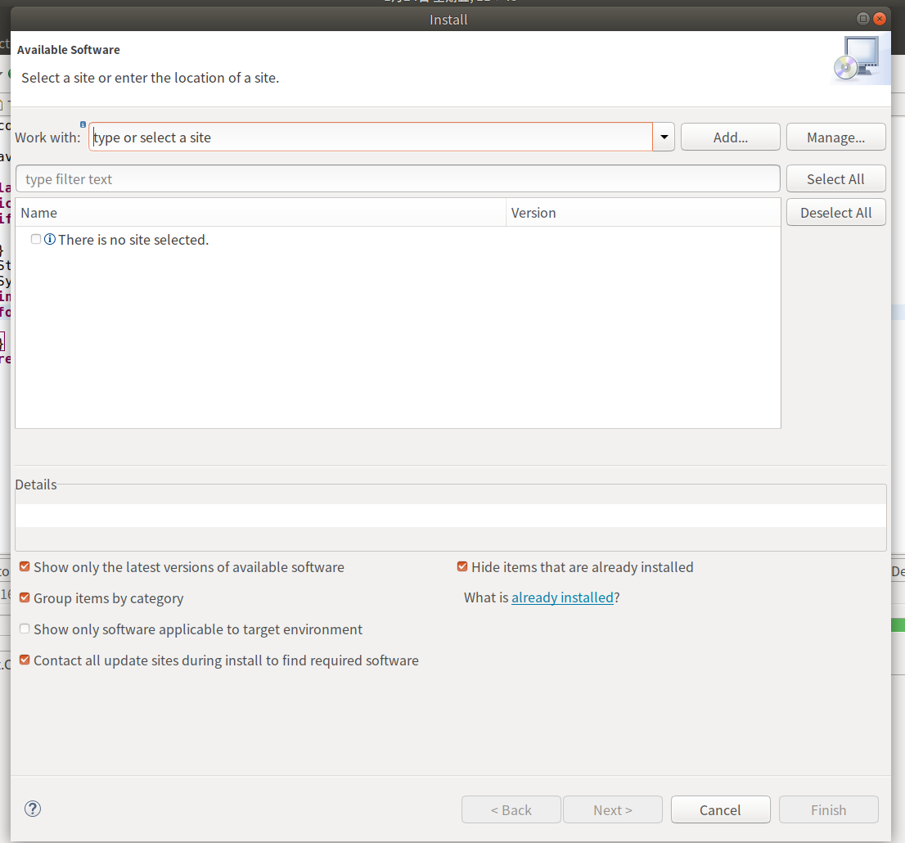
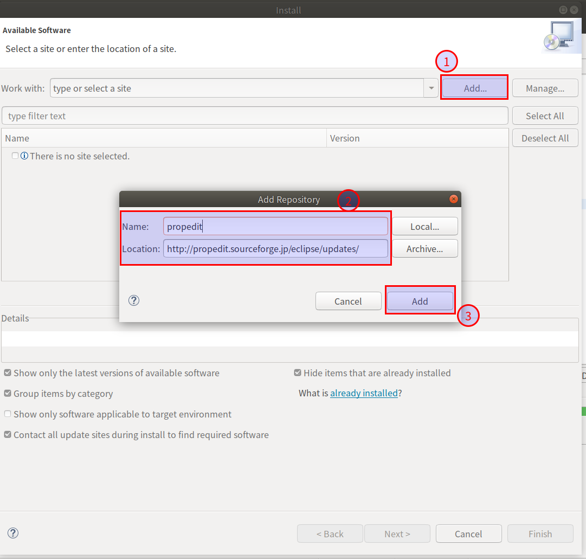
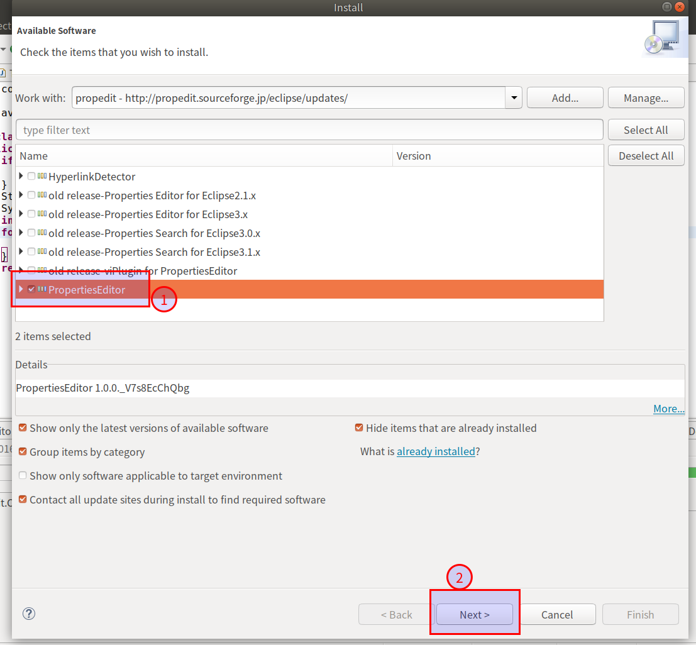
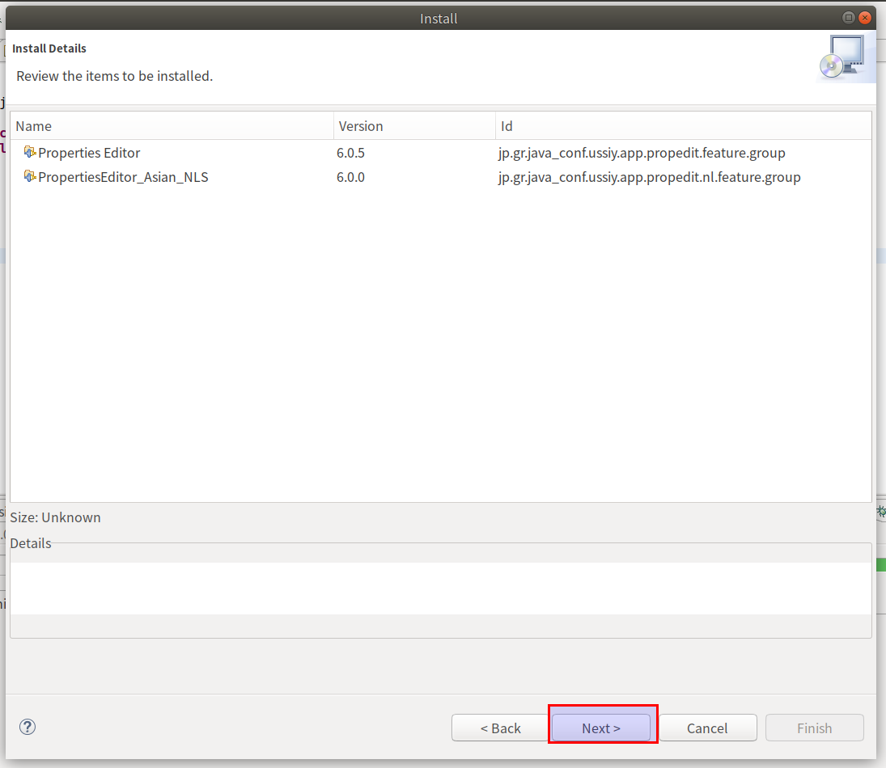
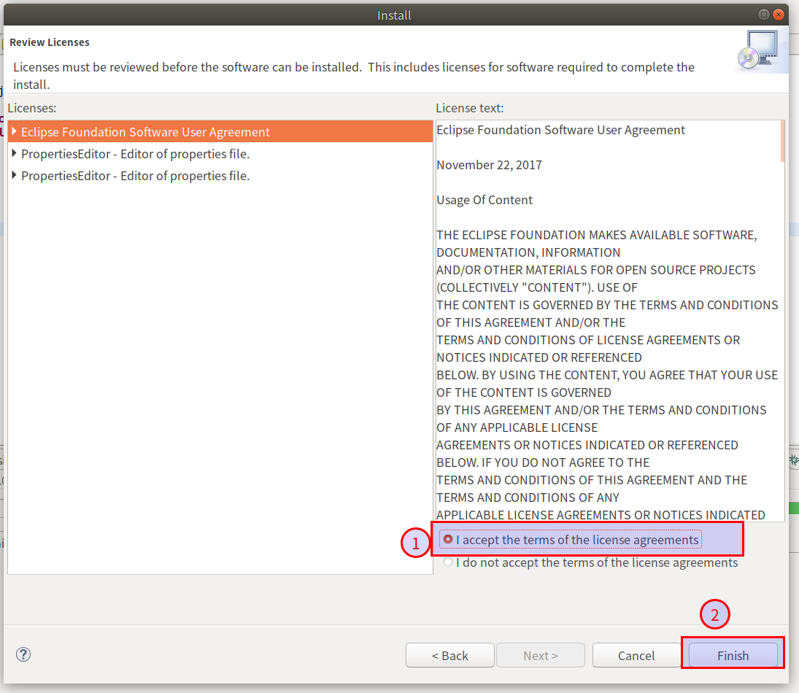

#   Eclipse的properties文件类型显示Unicoide编码不显示汉字问题
+ date: 2017-01-24 11:39:25
+ description: Eclipse的properties文件类型显示Unicoide编码不显示汉字问题
+ categories:
  - Java
+ tags:
  - Eclipse
- Eclipse插件
---
#   安装插件propedit

##  打开安装插件界面
+   Help -> Install new software..

##  输入在线更新地址
[http://propedit.sourceforge.jp/eclipse/updates/](http://propedit.sourceforge.jp/eclipse/updates/)

##  安装

