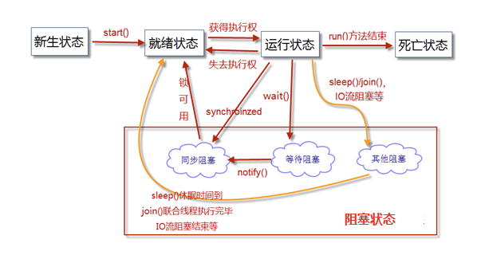
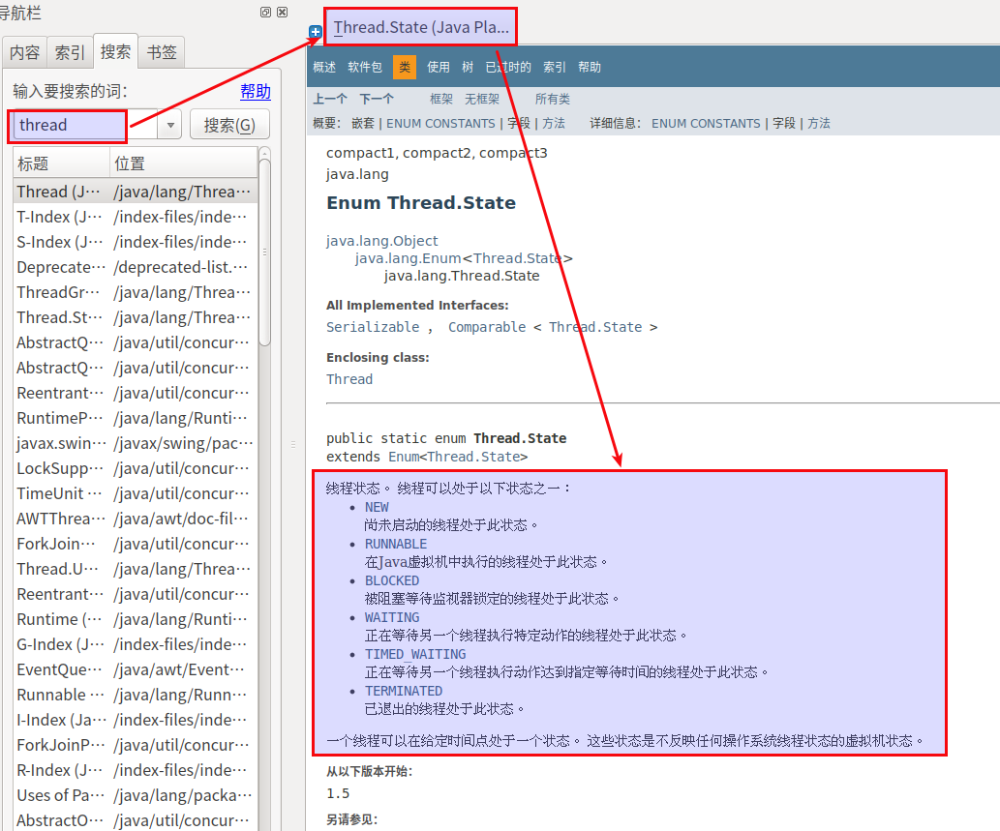
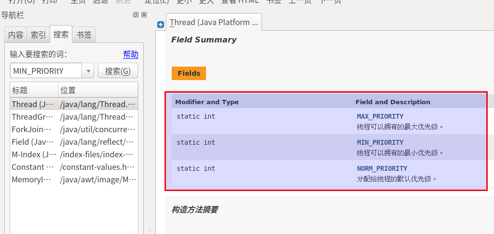

#   进程和线程(Process与Thread)

|区别|进程|线程|
|----|----|----|
|根本区别|作为资源分贝的单位|调度和执行的单位|
|开销|每个进程都有独立的代码和数据空间(进程的上下文),进程间的切换会有较大的开销|线程可以看成轻量级的进程,同一类线程共享代码和数据空间,每个线程有独立的运行栈和程序计数器(PC),线程切换的开销小|
|所处环境|在操作系统中能同时运行多个任务(程序)|在同一应用程序中有多个顺序流同时执行|
|分配内存|系统在运行的时候会为每个进程分配不同的内存区域|除了CPU之外,不会为线程分配内存(线程所使用的资源是它所属进程的资源),线程组只能共享资源|
|包含关系|没有线程的进程可以被看作是单线程的,如果一个进程内拥有多个线程,则执行过程不是一条线的,而是多条线(线程)共同完成的|线程是进程的一部分,所以线程有的时候被称为是轻权进程或者轻量级进程|

注意:**很多多线程是模拟出来的,真正的多线程是指有多个CPU**,即多核,如服务器.如果是模拟出来的多线程,即一个CPU的情况下,那么,在同一个时间点,CPU只能执行一个代码,因为切换的很快,所以就有同时执行的错觉

对于Java来说
+   线程就是独立的执行路径
+   在程序运行时,即使没有自己创建线程,后台也会存在多个线程,如gc线程,主线程
+   main()称之为主线程,为系统的入口点,用于执行整个程序
+   在一个进程中,如果开辟了多个线程,线程的运行由调度器安排调度,调度器是与操作系统紧密相关,先后顺序是不能人为的干预的
+   对同一份资源操作时,会存在资源抢夺的问题,需要加入并发控制
+   线程会带来额外的开销,如CPU调度时间,并发控制开销
+   每个线程在自己的工作内存交互,加载和存储主内存不当会造成数据不一致

#   创建线程
三种方法
+   继承Thread类(只能单继承)
+   实现Runnable接口(多用这个)
+   实现Callable接口(用的少,属于juc并发变成的一部分)

##  通过继承Thread类实现多线程
继承Thread类实现多线程的步骤：
1.  在Java中负责实现线程功能的类是java.lang.Thread 类。
2.  可以通过创建 Thread的实例来创建新的线程。
3.  每个线程都是通过某个特定的Thread对象所对应的方法run( )来完成其操作的，方法run( )称为线程体。
4.  通过调用Thread类的start()方法来启动一个线程。
```JAVA
public class TestThread extends Thread {//自定义类继承Thread类
    //run()方法里是线程体
    public void run() {
        for (int i = 0; i < 10; i++) {
            System.out.println(this.getName() + ":" + i);//getName()方法是返回线程名称
        }
    }

    public static void main(String[] args) {
        TestThread thread1 = new TestThread();//创建线程对象
        thread1.start();//启动线程
        TestThread thread2 = new TestThread();
        thread2.start();
    }
}
```

##  通过实现Runnable接口实现多线程
我们应用更多的是通过Runnable接口实现多线程。这种方式克服了继承Thread类实现线程的缺点，即在实现Runnable接口的同时还可以继承某个类。所以实现Runnable接口的方式要通用一些。
```JAVA
public class TestThread2 implements Runnable {//自定义类实现Runnable接口；
    //run()方法里是线程体；
    public void run() {
        for (int i = 0; i < 10; i++) {
            System.out.println(Thread.currentThread().getName() + ":" + i);
        }
    }
    public static void main(String[] args) {
        //创建线程对象，把实现了Runnable接口的对象作为参数传入；
        Thread thread1 = new Thread(new TestThread2());
        thread1.start();//启动线程；

        Thread thread2 = new Thread(new TestThread2());
        thread2.start();
    }
}
```

##  通过实现Callable接口实现多线程
1.  实现Callable接口
```JAVA
package com.zjinc36.multithread;

import java.util.concurrent.Callable;

public class CalculateStringLength implements Callable<Integer> {
	private String word;

	public CalculateStringLength(String word) {
		super();
		this.word = word;
	}

	@Override
	public Integer call() throws Exception {
		Thread currentThread = Thread.currentThread();
		System.out.println(currentThread.getName() + ":开始执行");

		// 假设处理需要2秒
		try {
			currentThread.sleep(2000);
		} catch (Exception e) {
			e.printStackTrace();
		}

		System.out.println(currentThread.getName() + ":正在处理");
		System.out.println(Thread.currentThread().getName() + ": " + word + "长度为：" + word.length());

		return Integer.valueOf(word.length());
	}
}

```

2.  创建执行服务,并提交执行
```JAVA
package com.zjinc36.multithread;

import java.util.HashSet;
import java.util.Set;
import java.util.concurrent.ExecutionException;
import java.util.concurrent.ExecutorService;
import java.util.concurrent.Executors;
import java.util.concurrent.Future;

public class RunMultiThread {

	private String[] words;

	public RunMultiThread(String[] words) {
		super();
		this.words = words;
	}

	public int runThread() throws InterruptedException, ExecutionException {
		// 创建一个线程池(创建执行服务)
		ExecutorService pool = Executors.newCachedThreadPool();
		Set<Future<Integer>> set = new HashSet<Future<Integer>>();
		for (String word : words) {
			CalculateStringLength testCallable = new CalculateStringLength(word);

			// 提交执行
			Future<Integer> future = pool.submit(testCallable);

			set.add(future);
		}

		int sum = 0;
		for (Future<Integer> future : set) {
				sum += future.get();
		}
		return sum;
	}

}

```

3.  测试
```JAVA
package com.zjinc36.multithread;

import static org.junit.Assert.*;

public class CalculateStringLengthTest {

	@Test
	public void test() {
		String[] words = {"first", "second", "thread"};
		RunMultiThread runMultiThread = new RunMultiThread(words);
		try {
			int sumLength = runMultiThread.runThread();
			System.out.println("数组中所有单词的总长度为：" + sumLength);
		} catch (InterruptedException | ExecutionException e) {
			e.printStackTrace();
		}
	}

}
```

#   线程状态


##  新生状态(New)
用new关键字建立一个线程对象后，该线程对象就处于新生状态。处于新生状态的线程有自己的内存空间，通过调用start方法进入就绪状态

##  就绪状态
+   什么是就绪状态
    -   处于就绪状态的线程已经具备了运行条件，但是还没有被分配到CPU，处于“线程就绪队列”，等待系统为其分配CPU。
    -   就绪状态并不是执行状态，当系统选定一个等待执行的Thread对象后，它就会进入执行状态。一旦获得CPU，线程就进入运行状态并自动调用自己的run方法。

+   有4中原因会导致线程进入就绪状态：
    -   新建线程：调用start()方法，进入就绪状态;
    -   阻塞线程：阻塞解除，进入就绪状态;
    -   运行线程：调用yield()方法，直接进入就绪状态;
    -   运行线程：JVM将CPU资源从本线程切换到其他线程。

##  运行状态(Running)
+   在运行状态的线程执行自己run方法中的代码，直到调用其他方法而终止或等待某资源而阻塞或完成任务而死亡。
+   如果在给定的时间片内没有执行结束，就会被系统给换下来回到就绪状态。
+   也可能由于某些“导致阻塞的事件”而进入阻塞状态。

##  阻塞状态(Blocked)
+   阻塞指的是暂停一个线程的执行以等待某个条件发生(如某资源就绪)
+   有4种原因会导致阻塞
    -   执行sleep(int millsecond)方法，使当前线程休眠，进入阻塞状态。当指定的时间到了后，线程进入就绪状态。(这种是抱着资源睡觉)
    -   执行wait()方法，使当前线程进入阻塞状态。当使用nofity()方法唤醒这个线程后，它进入就绪状态。(这种是等在一边,资源是会让出来的)
    -   线程运行时，某个操作进入阻塞状态
        -   比如执行IO流操作(read()/write()方法本身就是阻塞的方法)。只有当引起该操作阻塞的原因消失后，线程进入就绪状态。
    -   join()线程联合: 当某个线程等待另一个线程执行结束后，才能继续执行时，使用join()方法。
        -   “爸爸线程”要抽烟，于是联合了“儿子线程”去买烟，必须等待“儿子线程”买烟完毕，“爸爸线程”才能继续抽烟

##  死亡状态(Terminated)
+   死亡状态是线程生命周期中的最后一个阶段
+   线程死亡的原因有两个
    -   一个是正常运行的线程完成了它run()方法内的全部工作;
    -   另一个是线程被强制终止，如通过执行stop()或destroy()方法来终止一个线程(注：stop()/destroy()方法已经被JDK废弃，不推荐使用)。
+   当一个线程进入死亡状态以后，就不能再回到其它状态了。


#   线程终止的典型方法
由于stop()/destroy()方法已将被JDK废弃了,而我们通常的做法是提供一个boolean型的终止变量，当这个变量置为false，则终止线程的运行。
```JAVA
public class TestThreadCiycle implements Runnable {
    String name;
    boolean live = true;// 标记变量，表示线程是否可中止；
    public TestThreadCiycle(String name) {
        super();
        this.name = name;
    }
    public void run() {
        int i = 0;
        //当live的值是true时，继续线程体；false则结束循环，继而终止线程体；
        while (live) {
            System.out.println(name + (i++));
        }
    }
    public void terminate() {
        live = false;
    }

    public static void main(String[] args) {
        TestThreadCiycle ttc = new TestThreadCiycle("线程A:");
        Thread t1 = new Thread(ttc);// 新生状态
        t1.start();// 就绪状态
        for (int i = 0; i < 100; i++) {
            System.out.println("主线程" + i);
        }
        ttc.terminate();
        System.out.println("ttc stop!");
    }
}
```

#   暂停线程执行

##  暂停sleep
+   sleep(时间)指定当前线程阻塞的毫秒数
+   sleep存在异常`InterruptedException`
+   sleep时间达到后线程进入就绪状态
+   sleep可以模拟网络延时,倒计时等
+   每一个对象都有一个锁,sleep不会释放锁

```JAVA
public class TestThreadState {
    public static void main(String[] args) {
        StateThread thread1 = new StateThread();
        thread1.start();
        StateThread thread2 = new StateThread();
        thread2.start();
    }
}
//使用继承方式实现多线程
class StateThread extends Thread {
    public void run() {
        for (int i = 0; i < 100; i++) {
            System.out.println(this.getName() + ":" + i);
            try {
                Thread.sleep(2000);//调用线程的sleep()方法；
            } catch (InterruptedException e) {
                e.printStackTrace();
            }
        }
    }
}
```
运行时可以感受到每条结果输出之前的延迟，是Thread.sleep(2000)语句在起作用

##  礼让yield
+   礼让线程,让当前正在执行线程暂停
+   不是阻塞线程,而是将线程从运行状态转入就绪状态
+   让CPU调度器重新调度

```JAVA
public class TestThreadState {
    public static void main(String[] args) {
        StateThread thread1 = new StateThread();
        thread1.start();
        StateThread thread2 = new StateThread();
        thread2.start();
    }
}
//使用继承方式实现多线程
class StateThread extends Thread {
    public void run() {
        for (int i = 0; i < 100; i++) {
            System.out.println(this.getName() + ":" + i);
            Thread.yield();//调用线程的yield()方法；
        }
    }
}
```
可以引起线程切换，但运行时没有明显延迟

##  插队join
线程A在运行期间，可以调用线程B的join()方法，让线程B和线程A联合。这样，线程A就必须等待线程B执行完毕后，才能继续执行
```JAVA
public class TestThreadState {
    public static void main(String[] args) {
        System.out.println("爸爸和儿子买烟故事");
        Thread father = new Thread(new FatherThread());
        father.start();
    }
}

class FatherThread implements Runnable {
    public void run() {
        System.out.println("爸爸想抽烟，发现烟抽完了");
        System.out.println("爸爸让儿子去买包红塔山");
        Thread son = new Thread(new SonThread());
        son.start();
        System.out.println("爸爸等儿子买烟回来");
        try {
            son.join();
        } catch (InterruptedException e) {
            e.printStackTrace();
            System.out.println("爸爸出门去找儿子跑哪去了");
            // 结束JVM。如果是0则表示正常结束；如果是非0则表示非正常结束
            System.exit(1);
        }
        System.out.println("爸爸高兴的接过烟开始抽，并把零钱给了儿子");
    }
}

class SonThread implements Runnable {
    public void run() {
        System.out.println("儿子出门去买烟");
        System.out.println("儿子买烟需要10分钟");
        try {
            for (int i = 1; i <= 10; i++) {
                System.out.println("第" + i + "分钟");
                Thread.sleep(1000);
            }
        } catch (InterruptedException e) {
            e.printStackTrace();
        }
        System.out.println("儿子买烟回来了");
    }
}
```

#   获取线程的基本信息

##  手册中里对线程状态的规定
可以在手册中查看


线程可以处于以下状态之一：

|线程状态|状态说明|对应的方法|
|----|----|----|
|NEW            |尚未启动的线程处于此状态。                                     |                                               |
|RUNNABLE       |在Java虚拟机中执行的线程处于此状态。                           |                                               |
|BLOCKED        |被阻塞等待监视器锁定的线程处于此状态。                         | wait() 或 read/write IO操作 或 JUC里面的锁定  |
|WAITING        |正在等待另一个线程执行特定动作的线程处于此状态。               | sleep()                                       |
|TIMED\_WAITING |正在等待另一个线程执行动作达到指定等待时间的线程处于此状态。   | join()                                        |
|TERMINATED     |已退出的线程处于此状态。                                       |                                               |


##  获取线程基本信息的方法
1.  方法说明
|方法|功能|
|----|----|
|isAlive()              |判断线程是否还"活"着,即线程是否还未终止|
|getPriority()          |获取线程的优先级数值|
|setPriority()          |设置线程的优先级数值|
|setName()              |给线程一个名字|
|getName()              |取得线程的名字|
|currentThread()        |取得当前正在运行的线程对象,也就是取得自己本身|

2.  测试代码
```JAVA
public class TestThread {
    public static void main(String[] argc) throws Exception {
        Runnable r = new MyThread();
        Thread t = new Thread(r, "Name test");//定义线程对象，并传入参数；
        t.start();//启动线程；
        System.out.println("name is: " + t.getName());//输出线程名称；
        Thread.currentThread().sleep(5000);//线程暂停5分钟；
        System.out.println(t.isAlive());//判断线程还在运行吗？
        System.out.println("over!");
    }
}

class MyThread implements Runnable {
    //线程体；
    public void run() {
        for (int i = 0; i < 10; i++)
            System.out.println(i);
    }
}
```

#   线程的优先级
##  优先级的细节
+   Java提供一个线程调度器来监控程序启动后进入就绪状态的所有线程,线程调度器按照线程的优先级决定应调度哪个线程来执行
    -   处于就绪状态的线程，会进入“就绪队列”等待JVM来挑选
+   也就是说,优先级低只是意味着获得调度的概率低,并不是绝对先调用优先级高的线程后调用优先级低的线程
+   线程的优先级用数字表示,范围从1到10,一个线程缺省优先级为5

```
Thread.MIN_PRIORITY = 1
Thread.MAX_PRIORITY = 10
Thread.NORM_PRIORITY = 5
```
+   使用下述方法获得或设置线程对象的优先级
```JAVA
int getPriority();
void setPriority();
```
+   优先级的设定建议在start()调用前

##  测试代码
```JAVA
public class TestThread {
    public static void main(String[] args) {
        Thread t1 = new Thread(new MyThread(), "t1");
        Thread t2 = new Thread(new MyThread(), "t2");
        t1.setPriority(1);
        t2.setPriority(10);
        t1.start();
        t2.start();
    }
}
class MyThread extends Thread {
    public void run() {
        for (int i = 0; i < 10; i++) {
            System.out.println(Thread.currentThread().getName() + ": " + i);
        }
    }
}
```

#   用户线程和守护线程
##  守护线程细节
1.  线程分为用户线程和守护线程
2.  虚拟机不看守护线程的脸色,只看用户线程的脸色,也就是说
    -   虚拟机必须确保用户线程执行完毕
    -   守护线程是为用户线程服务的,jvm停止不用等守护线程执行完毕
3.  守护线程(daemon)举例
    -   后台记录操作日志
    -   监控内存使用
    -   等等...
4.  使用`xxxThread.setDaemon(true)`改用户线程为守护线程

##  说明用代码
1.  上帝线程(守护线程)
```JAVA
package com.zjinc36.multithread;

public class God implements Runnable{

	@Override
	public void run() {
		for (int i = 0; i < 365 * 100000000; i++) {
			System.out.println("God bless you ...");
		}
		System.out.println("ooooo.....");
	}
}
```
2.  "你自己人生"线程(用户线程)
```JAVA
package com.zjinc36.multithread;

public class YouLife implements Runnable {

	@Override
	public void run() {
		for (int i = 0; i < 365*100; i++) {
			System.out.println("happy life...");
		}
		System.out.println("ooooooooooo.......");
	}
}
```

3.  上帝保佑你的人生
    -   守护线程守护用户线程
    -   虚拟机确保"你的人生"执行完毕,即确保守护线程执行完毕
    -   虚拟机不用等"上帝"程执行完毕,即不用等守护线程执行完毕

```JAVA
package com.zjinc36.multithread;

public class DeamonDemo {

	public void run() {
		God god = new God();
		YouLife youLife = new YouLife();

		Thread godThread = new Thread(god);
		godThread.setDaemon(true);  // 将上帝线程设置为守护线程
		godThread.start();

		Thread youLifeThread = new Thread(god);
		youLifeThread.start();

	}
}
```


#   线程同步
##  同步问题的提出
### 现实生活中的问题
现实生活中，我们会遇到“同一个资源，多个人都想使用”的问题。
+   比如：教室里，只有一台电脑，多个人都想使用。天然的解决办法就是，在电脑旁边，大家排队。前一人使用完后，后一人再使用。
+   又或者:取钱,你和你老婆同时取同一个账户的钱

### 取钱会出问题的代码模拟
1.  代码模拟
```JAVA
public class TestSync {
    public static void main(String[] args) {
        Account a1 = new Account(100, "高");
        Drawing draw1 = new Drawing(80, a1);// 定义取钱线程对象；
        Drawing draw2 = new Drawing(80, a1);// 定义取钱线程对象；
        draw1.start(); // 你取钱
        draw2.start(); // 你老婆取钱
    }
}
/*
 * 简单表示银行账户
 */
class Account {
    int money;
    String aname;

    public Account(int money, String aname) {
        super();
        this.money = money;
        this.aname = aname;
    }
}
/**
 * 模拟提款操作
 */
class Drawing extends Thread {
    int drawingNum; // 取多少钱
    Account account; // 要取钱的账户
    int expenseTotal; // 总共取的钱数

    public Drawing(int drawingNum, Account account) {
        super();
        this.drawingNum = drawingNum;
        this.account = account;
    }

    @Override
    public void run() {
        if (account.money - drawingNum < 0) {
            return;
        }
        try {
            Thread.sleep(1000); // 判断完后阻塞。其他线程开始运行。
        } catch (InterruptedException e) {
            e.printStackTrace();
        }
        account.money -= drawingNum;
        expenseTotal += drawingNum;
        System.out.println(this.getName() + "--账户余额：" + account.money);
        System.out.println(this.getName() + "--总共取了：" + expenseTotal);
    }
}
```

2.  运行结果

没有线程同步机制，两个线程同时操作同一个账户对象，竟然从只有100元的账户，轻松取出`80*2=160`元，账户余额竟然成为了`-60`。这么大的问题，显然银行不会答应的

##  线程同步的概念
+   处理多线程问题时，多个线程访问同一个对象，并且某些线程还想修改这个对象。 这时候，我们就需要用到“线程同步”。
+   线程同步其实就是一种等待机制，多个需要同时访问此对象的线程进入这个对象的**等待池形成队列**，等待前面的线程使用完毕后，下一个线程再使用。
    -   为了保证数据在方法中被访问时的正确性,在访问时加入锁机制(synchronized),当一个线程获得对象的排他锁,独占资源,其他线程必须等待

##  线程同步带来的问题
由于同一进程的多个线程共享统一块存储空间,在带来方便的同时,也带来了访问冲突的问题,具体如下
+   一个线程持有锁会导致其他所有需要此锁的线程被挂起
+   在多线程竞争下,加锁,释放锁会导致比较多上下文切换和调度延时,引起性能问题
+   如果一个优先级高的线程等待一个优先级低的线程释放锁会导致线程优先级倒置,引起性能问题

##  synchronized关键字
1.  synchronized关键字的提出
    -   由于我们可以通过private关键字来保证数据对象只能被方法访问,所以我们**只需要针对方法提出一套机制**,这套机制就是`synchronized`关键字
    -   它包括两种方法,`synchronized方法`和`synchronized块`

##  synchronized方法和synchronized块

### synchronized方法
1.  通过在方法声明中加入 synchronized关键字来声明，语法如下
```JAVA
public synchronized void method (int args) {
    // do something ...
}
```
2.  synchronized关键字的机制
    -   synchronized方法控制对"成员变量|类变量"对象的访问
    -   每个对象对应一把锁
    -   每个synchronized方法都必须获得调用该方法的对象的锁方能执行,否则所属线程阻塞
    -   方法一旦执行,就独占该锁,直到从该方法返回时才将锁释放
    -   此后被阻塞的线程方能获得该锁,重新进入可执行状态

3.  缺陷:若将一个大的声明为synchronized将大大影响效率

### synchronized块
1.  为了解决`若将一个大的声明为synchronized将大大影响效率`的缺陷,Java 为我们提供了更好的解决办法，那就是 synchronized 块。
2.  块可以让我们精确地控制到具体的“成员变量”，缩小同步的范围，提高效率
3.  synchronized 块：通过 synchronized关键字来声明synchronized 块，语法如下：
```JAVA
synchronized(syncObject)
{
    //允许访问控制的代码
}
```

##  题外话
### Java中的块
java中的块有4种,分别如下
1.  局部块(普通块) -> 写在方法里面,作用是控制变量的作用范围
2.  构造块 -> 写在和类属性一个位置,方法之外,和构造方法作用一致,对象加载时加载
3.  静态构造块 -> 构造块加static关键字,类加载的时候加载
4.  同步块 -> 前面所述

### CopyOnWrite容器

####    参考
+   [CopyOnWriteArrayList原理，优缺点，使用场景](https://blog.csdn.net/u010002184/article/details/90452918)
+   [聊聊并发-Java中的Copy-On-Write容器](http://ifeve.com/java-copy-on-write/)

####    什么是CopyOnWrite容器
+   CopyOnWrite容器即写时复制的容器。
+   通俗的理解是当我们往一个容器添加元素的时候，不直接往当前容器添加，而是先将当前容器进行Copy，复制出一个新的容器
+   然后新的容器里添加元素，添加完元素之后，再将原容器的引用指向新的容器

####    有什么好处
+   我们可以对CopyOnWrite容器进行并发的读，而不需要加锁,因为当前容器不会添加任何元素。
+   所以CopyOnWrite容器也是一种读写分离的思想，读和写不同的容器。

####    CopyOnWrite在多线程场景中的使用
+   具体代码中的区别如下(CopyOnWriteArrayList)
```JAVA
/**
 * 多线程
 * 使用普通的ArrayList,不使用CopyOnWriteArrayList的情况
 */
public void syncContainer1() {
	ArrayList<String> list = new ArrayList<String>();
	for (int i = 0; i < 10000; i++) {
		new Thread(() ->  {
			// 需要写同步块
			synchronized (list) {
				list.add(Thread.currentThread().getName());
			}
		}).start();
	}
}

/**
 * 多线程
 * 使用CopyOnWriteArrayList的情况
 */
public void syncContainer2() {
	CopyOnWriteArrayList<String> list = new CopyOnWriteArrayList<String>();
	for (int i = 0; i < 10000; i++) {
		new Thread(() ->  {
			// 不需要写同步块
			list.add(Thread.currentThread().getName());
		}).start();
	}
}
```

####    CopyOnWriteArrayList的实现原理
+   上述代码使用了CopyOnWriteArrayList，接下去我们看看其源码是如何实现的。以下代码是向CopyOnWriteArrayList中add方法的实现（向CopyOnWriteArrayList里添加元素），可以发现在添加的时候是需要加锁的，否则多线程写的时候会Copy出N个副本出来。
+   以下源码基于jdk1.8
    -   更新版本其实可以在搜索`synchronized`,是使用这个关键字实现的
```JAVA
    /**
     * Appends the specified element to the end of this list.
     *
     * @param e element to be appended to this list
     * @return {@code true} (as specified by {@link Collection#add})
     */
    public boolean add(E e) {
        // 当前线程进行写前要加锁
        final ReentrantLock lock = this.lock;
        lock.lock();
        try {
            // 获取旧数组
            Object[] elements = getArray();
            // 获取旧数组长度
            int len = elements.length;
            // 创建一个新的数组,长度比旧数组多1,并将旧数组拷贝进新的数组
            Object[] newElements = Arrays.copyOf(elements, len + 1);
            // 将要添加的元素添加进新的数组
            newElements[len] = e;
            // 将原来指向旧数组的指针指向新的数组 
            setArray(newElements);
            // 返回true表示成功
            return true;
        } finally {
            // 写结束,解锁
            lock.unlock();
        }
    }

    /**
     * Removes the element at the specified position in this list.
     * Shifts any subsequent elements to the left (subtracts one from their
     * indices).  Returns the element that was removed from the list.
     *
     * @throws IndexOutOfBoundsException {@inheritDoc}
     */
    public E remove(int index) {
        final ReentrantLock lock = this.lock;
        lock.lock();
        try {
            Object[] elements = getArray();
            int len = elements.length;
            E oldValue = get(elements, index);
            int numMoved = len - index - 1;
            if (numMoved == 0)
                setArray(Arrays.copyOf(elements, len - 1));
            else {
                Object[] newElements = new Object[len - 1];
                System.arraycopy(elements, 0, newElements, 0, index);
                System.arraycopy(elements, index + 1, newElements, index,
                                 numMoved);
                setArray(newElements);
            }
            return oldValue;
        } finally {
            lock.unlock();
        }
    }

    /**
     * Replaces the element at the specified position in this list with the
     * specified element.
     *
     * @throws IndexOutOfBoundsException {@inheritDoc}
     */
    public E set(int index, E element) {
        final ReentrantLock lock = this.lock;
        lock.lock();
        try {
            Object[] elements = getArray();
            E oldValue = get(elements, index);

            if (oldValue != element) {
                int len = elements.length;
                Object[] newElements = Arrays.copyOf(elements, len);
                newElements[index] = element;
                setArray(newElements);
            } else {
                // Not quite a no-op; ensures volatile write semantics
                setArray(elements);
            }
            return oldValue;
        } finally {
            lock.unlock();
        }
    }
```


####    应用场景
+   读的时候不需要加锁，如果读的时候有多个线程正在向CopyOnWriteArrayList添加数据，读还是会读到旧的数据，因为开始读的那一刻已经确定了读的对象是旧对象。
+   CopyOnWrite并发容器**用于读多写少的并发场景**
    -   比如白名单，黑名单等场景

####    CopyOnWrite的缺点
CopyOnWrite容器有很多优点，但是同时也存在两个问题，即内存占用问题和数据一致性问题。所以在开发的时候需要注意一下。
1.  **内存占用问题**
    -   因为CopyOnWrite的写时复制机制，所以在进行写操作的时候，内存里会同时驻扎两个对象的内存，旧的对象和新写入的对象（注意:在复制的时候只是复制容器里的引用，只是在写的时候会创建新对象添加到新容器里，而旧容器的对象还在使用，所以有两份对象内存）。如果这些对象占用的内存比较大，比如说200M左右，那么再写入100M数据进去，内存就会占用300M，那么这个时候很有可能造成频繁的Yong GC和Full GC。之前我们系统中使用了一个服务由于每晚使用CopyOnWrite机制更新大对象，造成了每晚15秒的Full GC，应用响应时间也随之变长。
    -   针对内存占用问题，可以通过压缩容器中的元素的方法来减少大对象的内存消耗，比如，如果元素全是10进制的数字，可以考虑把它压缩成36进制或64进制。或者不使用CopyOnWrite容器，而使用其他的并发容器，如ConcurrentHashMap。

2.  **数据一致性问题**
    -   CopyOnWrite容器只能保证数据的最终一致性，不能保证数据的实时一致性。所以如果你希望写入的的数据，马上能读到，请不要使用CopyOnWrite容器。

##  使用synchronized块解决前面取钱出问题的代码
1.  代码
```JAVA
public class TestSync {
    public static void main(String[] args) {
        Account a1 = new Account(100, "高");
        Drawing draw1 = new Drawing(80, a1);
        Drawing draw2 = new Drawing(80, a1);
        draw1.start(); // 你取钱
        draw2.start(); // 你老婆取钱
    }
}
/*
 * 简单表示银行账户
 */
class Account {
    int money;
    String aname;
    public Account(int money, String aname) {
        super();
        this.money = money;
        this.aname = aname;
    }
}
/**
 * 模拟提款操作
 *
 * @author Administrator
 *
 */
class Drawing extends Thread {
    int drawingNum; // 取多少钱
    Account account; // 要取钱的账户
    int expenseTotal; // 总共取的钱数

    public Drawing(int drawingNum, Account account) {
        super();
        this.drawingNum = drawingNum;
        this.account = account;
    }

    @Override
    public void run() {
        draw();
    }

    void draw() {
        synchronized (account) {
            if (account.money - drawingNum < 0) {
                System.out.println(this.getName() + "取款，余额不足！");
                return;
            }
            try {
                Thread.sleep(1000); // 判断完后阻塞。其他线程开始运行。
            } catch (InterruptedException e) {
                e.printStackTrace();
            }
            account.money -= drawingNum;
            expenseTotal += drawingNum;
        }
        System.out.println(this.getName() + "--账户余额：" + account.money);
        System.out.println(this.getName() + "--总共取了：" + expenseTotal);
    }
}
```
+   `synchronized (account)`意味着线程需要获得account对象的“锁”才有资格运行同步块中的代码
+   Account对象的“锁”也称为“互斥锁”，在同一时刻只能被一个线程使用
    -   A线程拥有锁，则可以调用“同步块”中的代码;
    -   B线程没有锁，则进入account对象的“锁池队列”等待，直到A线程使用完毕释放了account对象的锁，B线程得到锁才可以开始调用“同步块”中的代码。

2.  结果


#   死锁
##  死锁的概念
+   “死锁”指的是:多个线程各自占有一些共享资源，并且互相等待其他线程占有的资源才能进行，而导致两个或者多个线程都在等待对方释放资源，都停止执行的情形。
+   也就是说,**某一个同步块需要同时拥有“两个以上对象的锁”时，就可能会发生“死锁”的问题**

##  死锁问题演示
### 说明
下面案例中，
1.  “化妆线程”需要同时拥有“镜子对象”、“口红对象”才能运行同步块。
2.  而在实际运行时
    -   “小丫的化妆线程”拥有了“镜子对象”
    -   “大丫的化妆线程”拥有了“口红对象”
    -   都在互相等待对方释放资源，才能化妆
3.  这样，两个线程就形成了互相等待，无法继续运行的“死锁状态”

### 代码
```JAVA
class Lipstick {//口红类

}

class Mirror {//镜子类

}

//化妆类继承了Thread类
class Makeup extends Thread {
    int flag;
    String girl;
    static Lipstick lipstick = new Lipstick();
    static Mirror mirror = new Mirror();

    @Override
    public void run() {
        // TODO Auto-generated method stub
        doMakeup();
    }

    void doMakeup() {
        if (flag == 0) {
            // 同步块同时拥有"两个以上对象的锁"
            synchronized (lipstick) {//需要得到口红的“锁”；
                System.out.println(girl + "拿着口红！");
                try {
                    Thread.sleep(1000);
                } catch (InterruptedException e) {
                    e.printStackTrace();
                }

                synchronized (mirror) {//需要得到镜子的“锁”；
                    System.out.println(girl + "拿着镜子！");
                }

            }
        } else {
            // 同步块同时拥有"两个以上对象的锁"
            synchronized (mirror) {
                System.out.println(girl + "拿着镜子！");
                try {
                    Thread.sleep(2000);
                } catch (InterruptedException e) {
                    e.printStackTrace();
                }
                synchronized (lipstick) {
                    System.out.println(girl + "拿着口红！");
                }
            }
        }
    }

}

public class TestDeadLock {
    public static void main(String[] args) {
        Makeup m1 = new Makeup();//大丫的化妆线程；
        m1.girl = "大丫";
        m1.flag = 0;
        Makeup m2 = new Makeup();//小丫的化妆线程；
        m2.girl = "小丫";
        m2.flag = 1;
        m1.start();
        m2.start();
    }
}
```

### 结果


##  死锁问题解决
### 思路
死锁是由于“同步块需要同时持有多个对象锁造成”的，要解决这个问题，思路很简单，就是：**同一个代码块，不要同时持有两个对象锁**

### 代码修改
```JAVA
class Lipstick {//口红类

}
class Mirror {//镜子类

}
class Makeup extends Thread {//化妆类继承了Thread类
    int flag;
    String girl;
    static Lipstick lipstick = new Lipstick();
    static Mirror mirror = new Mirror();

    @Override
    public void run() {
        // TODO Auto-generated method stub
        doMakeup();
    }

    void doMakeup() {
        if (flag == 0) {
            synchronized (lipstick) {
                System.out.println(girl + "拿着口红！");
                try {
                    Thread.sleep(1000);
                } catch (InterruptedException e) {
                    e.printStackTrace();
                }

            }
            synchronized (mirror) {
                System.out.println(girl + "拿着镜子！");
            }
        } else {
            synchronized (mirror) {
                System.out.println(girl + "拿着镜子！");
                try {
                    Thread.sleep(2000);
                } catch (InterruptedException e) {
                    e.printStackTrace();
                }
            }
            synchronized (lipstick) {
                System.out.println(girl + "拿着口红！");
            }
        }
    }
}

public class TestDeadLock {
    public static void main(String[] args) {
        Makeup m1 = new Makeup();// 大丫的化妆线程；
        m1.girl = "大丫";
        m1.flag = 0;
        Makeup m2 = new Makeup();// 小丫的化妆线程；
        m2.girl = "小丫";
        m2.flag = 1;
        m1.start();
        m2.start();
    }
}
```

### 结果


#   线程并发协作(线程通信)

##  什么是生产者/消费者模式
1.  生产者和消费者共享同一个资源,并且生产者和消费者之间相互依赖,互为条件
2.  对于生产者
    -   没有生产产品之前,消费者要进入等待状态
    -   生产了产平之后,需要马上通知消费者消费
3.  对于消费者,在消费之后,要通知生产者已经消费结束,需要继续新产品以供消费
4.  在生产者消费者问题中,仅有synchronized是不够的

##  synchronized能做到什么
+   synchronized可阻止并发更新同一个共享资源,实现同步
+   synchronized不能用来实现不同线程之间的消息传递(通信)

##  线程之间入额进行消息传递
### 方法
|方法名|作用|
|----|----|
|final void wait()                          |表示线程一直等待,直到得到其他线程通知|
|void wait(long timeout)                    |线程等待指定毫秒参数时间|
|final void wait(long timeout, int nanos)   |线程等待指定毫秒,微妙的时间|
|final void notify()                        |唤醒一个处于等待状态的线程|
|final void notifyAll()                     |唤醒同一个对象上所有调用wait()方法的线程,优先级别高的线程优先运行|

### 使用举例
```JAVA
public class TestProduce {
    public static void main(String[] args) {
        SyncStack sStack = new SyncStack();// 定义缓冲区对象；
        Shengchan sc = new Shengchan(sStack);// 定义生产线程；
        Xiaofei xf = new Xiaofei(sStack);// 定义消费线程；
        sc.start();
        xf.start();
    }
}

class Mantou {// 馒头
    int id;

    Mantou(int id) {
        this.id = id;
    }
}

class SyncStack {// 缓冲区(相当于：馒头筐)
    int index = 0;
    Mantou[] ms = new Mantou[10];

    public synchronized void push(Mantou m) {
        while (index == ms.length) {//说明馒头筐满了
            try {
               //wait后，线程会将持有的锁释放，进入阻塞状态；
               //这样其它需要锁的线程就可以获得锁；
                this.wait();
                //这里的含义是执行此方法的线程暂停，进入阻塞状态，
                //等消费者消费了馒头后再生产。
            } catch (InterruptedException e) {
                e.printStackTrace();
            }
        }
        // 唤醒在当前对象等待池中等待的第一个线程。
        //notifyAll叫醒所有在当前对象等待池中等待的所有线程。
        this.notify();
        // 如果不唤醒的话。以后这两个线程都会进入等待线程，没有人唤醒。
        ms[index] = m;
        index++;
    }

    public synchronized Mantou pop() {
        while (index == 0) {//如果馒头筐是空的；
            try {
                //如果馒头筐是空的，就暂停此消费线程（因为没什么可消费的嘛）。
                this.wait();                //等生产线程生产完再来消费；
            } catch (InterruptedException e) {
                e.printStackTrace();
            }
        }
        this.notify();
        index--;
        return ms[index];
    }
}

class Shengchan extends Thread {// 生产者线程
    SyncStack ss = null;

    public Shengchan(SyncStack ss) {
        this.ss = ss;
    }

    @Override
    public void run() {
        for (int i = 0; i < 10; i++) {
            System.out.println("生产馒头：" + i);
            Mantou m = new Mantou(i);
            ss.push(m);
        }
    }
}

class Xiaofei extends Thread {// 消费者线程；
    SyncStack ss = null;

    public Xiaofei(SyncStack ss) {
        this.ss = ss;
    }

    @Override
    public void run() {
        for (int i = 0; i < 10; i++) {
            Mantou m = ss.pop();
            System.out.println("消费馒头：" + i);

        }
    }
}
```
