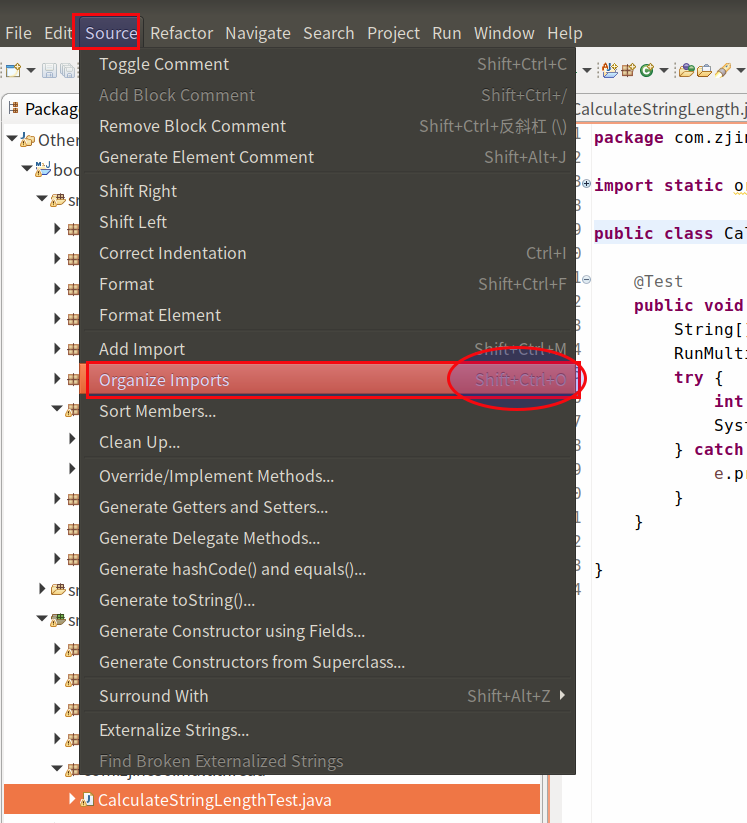

#   Eclipse中一键删除类中无用的包
description: Eclipse中一键删除类中无用(未使用)的包
date: 2017-04-09 14:59:36
categories:
- Eclipse
tags:
- Eclipse
---
#   第一种：移除某个类中的
在Java类中按键`Ctrl+Shift+O`

#   第二种：移除整个包中的
本质上和第一种是一样的

1.  在`Package Explorer`下右键点击包名
2.  依次选择Source -> Organize imports即可

#   第三种：保存时自动移除
虽然好用省事,但如果开发团队没有规定就不要乱打开
1.  `Windows -> Preferences -> Java -> Editor -> Save Actions`
2.  然后选择`Perform the selected action on save`
3.  再勾选`Organize imports即可
