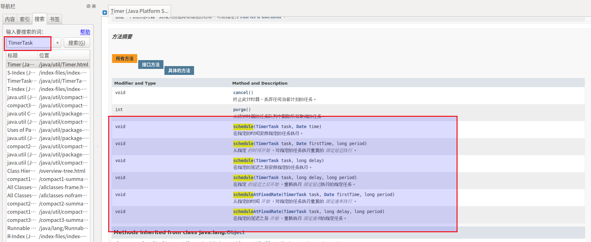

#   任务定时调度
通过Timer和Timetask，我们可以实现定时启动某个线程。

##	java.util.Timer
在这种实现方式中，Timer类作用是类似闹钟的功能，也就是定时或者每隔一定时间触发一次线程。其实，Timer类本身实现的就是一个线程，只是这个线程是用来实现调用其它线程的。

##	java.util.TimerTask
+	TimerTask类是一个抽象类，该类实现了Runnable接口，所以该类具备多线程的能力。
+	在这种实现方式中，通过继承TimerTask使该类获得多线程的能力，将需要多线程执行的代码书写在run方法内部，然后通过Timer类启动线程的执行。
+   

```JAVA
public class TestTimer {
    public static void main(String[] args) {
        Timer t1 = new Timer();//定义计时器；
        MyTask task1 = new MyTask();//定义任务；
        t1.schedule(task1,3000);  //3秒后执行；
        //t1.schedule(task1,5000,1000);//5秒以后每隔1秒执行一次！
        //GregorianCalendar calendar1 = new GregorianCalendar(2010,0,5,14,36,57);
        //t1.schedule(task1,calendar1.getTime()); //指定时间定时执行；
    }
}

class MyTask extends TimerTask {//自定义线程类继承TimerTask类；
    public void run() {
        for(int i=0;i<10;i++){
            System.out.println("任务1:"+i);
        }
    }
}
```

注意:
+   在实际使用时，一个Timer可以启动任意多个TimerTask实现的线程，但是多个线程之间会存在阻塞。所以如果多个线程之间需要完全独立的话，最好还是一个Timer启动一个TimerTask实现

#   Quartz定时任务框架
+   实际开发中，我们可以使用开源框架quanz，更加方便的实现任务定时调度。
+   实际上，quanz底层原理就是我们这里介绍的内容
+   [SpringBoot2.0集成Quartz](https://www.jianshu.com/p/dc814e8014b0)
