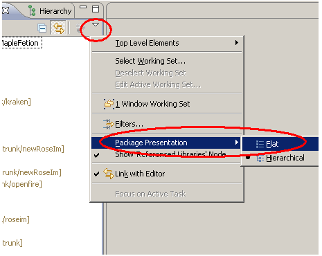

#   调整eclipse左边包的显示方式
+ date: 2017-08-10 11:06:22
+ description: 调整eclipse左边包的显示方式
+ categories:
  - Eclipse
+ tags:
  - Eclipse
---
#   Eclipse 中包结构展开有两种方式
1.  平坦方式（flat）

2.  分层方式（hierarchical）

#   包结构显示方式设置 

