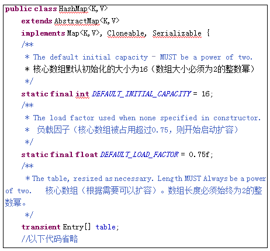

#   Java中的容器
+ date: 2017-08-11 15:42:39
+ description: Java中的容器
+ categories:
  - Java
+ tags:
  - Java
---
#   Java集合层次图


#   Collection接口
Collection 表示一组对象，它是集中、收集的意思。Collection接口的两个子接口是List、Set接口。

由于List、Set是Collection的子接口，意味着所有List、Set的实现类都有上面的方法。

#   List系列
##  List特点和常用方法
###     List基本说明
List是有序、可重复的容器。
+   有序：List中每个元素都有索引标记。可以根据元素的索引标记(在List中的位置)访问元素，从而精确控制这些元素。
+   可重复：List允许加入重复的元素。更确切地讲，List通常允许满足 e1.equals(e2) 的元素重复加入容器。
+   除了Collection接口中的方法，List多了一些跟顺序(索引)有关的方法，参见下表：

List接口常用的实现类有3个：ArrayList、LinkedList和Vector。

###     List的常用方法
1.  代码
```JAVA
public class TestList {
    /**
     * 测试add/remove/size/isEmpty/contains/clear/toArrays等方法
     */
    public static void test01() {
        List<String> list = new ArrayList<String>();
        System.out.println(list.isEmpty()); // true,容器里面没有元素
        list.add("刘备");
        System.out.println(list.isEmpty()); // false,容器里面有元素
        list.add("关羽");
        list.add("张飞");
        System.out.println(list);
        System.out.println("list的大小：" + list.size());
        System.out.println("是否包含指定元素：" + list.contains("关羽"));
        list.remove("刘备");
        System.out.println(list);
        Object[] objs = list.toArray();
        System.out.println("转化成Object数组：" + Arrays.toString(objs));
        list.clear();
        System.out.println("清空所有元素：" + list);
    }
    public static void main(String[] args) {
        test01();
    }
}
```

###     两个List之间的元素处理
```JAVA
public class TestList {
    public static void main(String[] args) {
        test02();
    }
    /**
     * 测试两个容器之间元素处理
     */
    public static void test02() {
        List<String> list = new ArrayList<String>();
        list.add("刘备");
        list.add("关羽");
        list.add("张飞");

        List<String> list2 = new ArrayList<String>();
        list2.add("刘备");
        list2.add("张三");
        list2.add("李四");
        System.out.println(list.containsAll(list2)); //false list是否包含list2中所有元素
        System.out.println(list);
        list.addAll(list2); //将list2中所有元素都添加到list中
        System.out.println(list);
        list.removeAll(list2); //从list中删除同时在list和list2中存在的元素
        System.out.println(list);
        list.retainAll(list2); //取list和list2的交集
        System.out.println(list);
    }
}
```

##   ArrayList特点和底层实现
###     特点
+   查询效率高，增删效率低，线程不安全。

###     底层实现
1.  ArrayList底层使用Object数组来存储元素数据。所有的方法，都围绕这个核心的Object数组来开展。源码如下:


2.  数组新建与扩容
```
1. 新建 => 新建一个长度为10的object数组(确切来说,是一个空引用,当第一次add,才新建一个长度为10的数组)
2. 第一次扩容 => 增加原先值的一半,即扩容到 (10 * 3) / 2 + 1 = 16
3. 第二次扩容 => 增加原先值的一半,即扩容 (16 * 3) / 2 + 1 = 25
```
源码如下


##  LinkedList特点和底层实现
###     特点
+   查询效率低，增删效率高，线程不安全。

###     底层实现
+   LinkedList底层用双向链表实现的存储

+    每个节点都应该有3部分内容
```JAVA
class  Node {
    Node  previous;     //前一个节点
    Object  element;    //本节点保存的数据
    Node  next;         //后一个节点
}
```
+   LinkedList的源码，可以看到里面包含了双向链表的相关代码


##  Vector向量
+   Vector底层是用数组实现的List，相关的方法都加了同步检查，因此“线程安全,效率低”。
+   比如，indexOf方法就增加了synchronized同步标记。


##  如何选用ArrayList、LinkedList、Vector?
1.  需要线程安全时，用Vector。
2.  不存在线程安全问题时，并且查找较多用ArrayList(一般使用它)。
3.  不存在线程安全问题时，增加或删除元素较多用LinkedList。


#   Map系列
+   Map就是用来存储“键(key)-值(value) 对”的
+   Map类中存储的“键值对”通过键来标识，所以“键对象”不能重复
+   Map 接口的实现类有HashMap、TreeMap、HashTable、Properties等
+   Map接口中常用的方法


##  HashMap
###     HashMap基本说明
+   HashMap采用哈希算法实现，是Map接口最常用的实现类。
+   由于底层采用了哈希表存储数据，我们要求键不能重复，如果发生重复，新的键值对会替换旧的键值对。
+   HashMap在查找、删除、修改方面都有非常高的效率

###     HashMap中的常用方法
```JAVA
public class TestMap {
    public static void main(String[] args) {
        Map<Integer, String> m1 = new HashMap<Integer, String>();
        Map<Integer, String> m2 = new HashMap<Integer, String>();
        m1.put(1, "one");
        m1.put(2, "two");
        m1.put(3, "three");
        m2.put(1, "一");
        m2.put(2, "二");
        System.out.println(m1.size());
        System.out.println(m1.containsKey(1));
        System.out.println(m2.containsValue("two"));
        m1.put(3, "third"); //键重复了，则会替换旧的键值对
        Map<Integer, String> m3 = new HashMap<Integer, String>();
        m3.putAll(m1);
        m3.putAll(m2);
        System.out.println("m1:" + m1);
        System.out.println("m2:" + m2);
        System.out.println("m3:" + m3);
    }
}
```

##  HashMap底层实现
###     基本结构
+   数据结构中由数组和链表来实现对数据的存储，他们各有特点
    *   数组：占用空间连续。 寻址容易，查询速度快。但是，增加和删除效率非常低
    *   链表：占用空间不连续。 寻址困难，查询速度慢。但是，增加和删除效率非常高
+   那么，我们能不能结合数组和链表的优点(即查询快，增删效率也高)呢? 答案就是“哈希表”
+   哈希表的本质就是“数组+链表”,**HashMap底层实现采用了哈希表**
+   打开HashMap源码，发现有如下两个核心内容

+     其中的`Entry[] table`就是HashMap的核心数组结构，我们也称之为“位桶数组”。我们再继续看Entry是什么，源码如下：

+   一个Entry对象存储了
    *   key：键对象
    *   value：值对象
    *   next:下一个节点
    *   hash: 键对象的hash值
+   显然每一个Entry对象就是一个单向链表结构，而Engtry本身是一个数组,所以我们可以画出一个Entry对象的典型示意

+   然后，我们画出`Entry[]`数组的结构(这也是HashMap的结构)：


###     插入数据过程put(key,value)

我们的目的是将”key-value两个对象”成对存放到HashMap的Entry[]数组中。参见以下步骤：

####    (1) 获得key对象的hashcode
首先调用key对象的hashcode()方法，获得hashcode。

####    (2) 根据hashcode计算出hash值(要求在[0, 数组长度-1]区间)
+   hashcode是一个整数，我们需要将它转化成[0, 数组长度-1]的范围。我们要求转化后的hash值尽量均匀地分布在[0,数组长度-1]这个区间，减少“hash冲突”
+   i.一种极端简单和低下的算法是：
    *   hash值 = hashcode/hashcode;
    *   也就是说，hash值总是1。意味着，键值对对象都会存储到数组索引1位置，这样就形成一个非常长的链表。相当于每存储一个对象都会发生“hash冲突”，HashMap也退化成了一个“链表”。
+   ii. 一种简单和常用的算法是(相除取余算法)：
    *   `hash值 = hashcode%数组长度`
    *   这种算法可以让hash值均匀的分布在[0,数组长度-1]的区间。 早期的HashTable就是采用这种算法。但是，这种算法由于使用了“除法”，效率低下。
    *   JDK后来改进了算法。首先约定数组长度必须为2的整数幂，这样采用位运算即可实现取余的效果：`hash值 = hashcode&(数组长度-1)`
+   如下为我们自己测试简单的hash算法：
```JAVA
public class Test {
    public static void main(String[] args) {
        int h = 25860399;
        int length = 16;//length为2的整数次幂,则h&(length-1)相当于对length取模
        myHash(h, length);
    }
    /**
     * @param h  任意整数
     * @param length 长度必须为2的整数幂
     * @return
     */
    public static  int myHash(int h,int length){
        System.out.println(h&(length-1));
        //length为2的整数幂情况下，和取余的值一样
        System.out.println(h%length);//取余数
        return h&(length-1);
    }
}
```
+   运行如上程序，我们就能发现直接取余(h%length)和位运算(h&(length-1))结果是一致的。事实上，为了获得更好的散列效果，JDK对hashcode进行了两次散列处理(核心目标就是为了分布更散更均匀)，源码如下


####    (3) 生成Entry对象
如上所述，一个Entry对象包含4部分：key对象、value对象、hash值、指向下一个Entry对象的引用。我们现在算出了hash值。下一个Entry对象的引用为null。

####    (4) 将Entry对象放到table数组中
如果本Entry对象对应的数组索引位置还没有放Entry对象，则直接将Entry对象存储进数组;如果对应索引位置已经有Entry对象，则将已有Entry对象的next指向本Entry对象，形成链表。

####    总结如上过程
+   当添加一个元素(key-value)时，首先计算key的hash值，以此确定插入数组中的位置，但是可能存在同一hash值的元素已经被放在数组同一位置了，这时就添加到同一hash值的元素的后面，他们在数组的同一位置，就形成了链表，同一个链表上的Hash值是相同的，所以说数组存放的是链表。 
+   **JDK8中，当链表长度大于8时，链表就转换为红黑树**，这样又大大提高了查找的效率。

###     取数据过程get(key)
+   1) 获得key的hashcode，通过hash()散列算法得到hash值，进而定位到数组的位置。
+   2) 在链表上挨个比较key对象。调用equals()方法，将key对象和链表上所有节点的key对象进行比较，直到碰到返回true的节点对象为止。
+   3) 返回equals()为true的节点对象的value对象。
+   注意:hashcode()和equals方法的关系
    *   Java中规定，两个内容相同(equals()为true)的对象必须具有相等的hashCode。
    *   因为如果equals()为true而两个对象的hashcode不同,那在整个存储过程中就发生了悖论。

###     扩容问题
+   HashMap的位桶数组，初始大小为16
+   实际使用时，显然大小是可变的
+   如果位桶数组中的元素达到(0.75*数组 length)， 就重新调整数组大小变为原来2倍大小
+   扩容很耗时
+   扩容的本质是定义新的更大的数组，并将旧数组内容挨个拷贝到新数组中。

###     JDK8将链表在大于8情况下变为红黑二叉树
+   JDK8中，HashMap在存储一个元素时，当对应链表长度大于8时，链表就转换为红黑树，这样又大大提高了查找的效率。

##  HashTable
HashTable类和HashMap用法几乎一样，底层实现几乎一样，只不过HashTable的方法添加了synchronized关键字确保线程同步检查，效率较低。

##  TreeMap
###     TreeMap基本介绍
TreeMap和HashMap实现了同样的接口Map，因此，用法对于调用者来说没有区别。

###     TreeMap底层实现
+   TreeMap是红黑二叉树的典型实现。我们打开TreeMap的源码，发现里面有一行核心代码：
```JAVA
private transient Entry<K,V> root = null;
```
+   root用来存储整个树的根节点。我们继续跟踪Entry(是TreeMap的内部类)的代码：

+   可以看到里面存储了本身数据、左节点、右节点、父节点、以及节点颜色。
+   TreeMap的put()/remove()方法大量使用了红黑树的理论。限于篇幅，不再展开

      


##  如何选用HashMap,HashTable和TreeMap
1.  HashMap: 线程不安全，效率高。允许key或value为null。
2.  HashTable: 线程安全，效率低。不允许key或value为null。
3.  HashMap效率高于TreeMap;在需要排序的Map时才选用TreeMap。

#   Set系列
+   Set接口继承自Collection，Set接口中没有新增方法，方法和Collection保持完全一致。
+   Set容器特点：无序、不可重复。
    *   无序指Set中的元素没有索引，我们只能遍历查找;
    *   不可重复指不允许加入重复的元素。更确切地讲，新元素如果和Set中某个元素通过equals()方法对比为true，则不能加入;甚至，Set中也只能放入一个null元素，不能多个。
+   Set常用的实现类有：HashSet、TreeSet等，我们一般使用HashSet。

##  HashSet
###     HashSet基本使用
```JAVA
public class Test {
    public static void main(String[] args) {
        Set<String> s = new HashSet<String>();
        s.add("hello");
        s.add("world");
        System.out.println(s);
        s.add("hello"); //相同的元素不会被加入
        System.out.println(s);
        s.add(null);
        System.out.println(s);
        s.add(null);
        System.out.println(s);
    }
}
```

###     HashSet底层实现
+   HashSet是采用哈希算法实现，底层实际是用HashMap实现的(HashSet本质就是一个简化版的HashMap)，因此，查询效率和增删效率都比较高。我们来看一下HashSet的源码：

+   我们发现里面有个map属性，这就是HashSet的核心秘密。我们再看add()方法，发现增加一个元素说白了就是在map中增加一个键值对，键对象就是这个元素，值对象是名为`PRESENT`的Object对象。说白了，就是`“往set中加入元素，本质就是把这个元素作为key加入到了内部的map中”`。

+   由于map中key都是不可重复的，因此，Set天然具有“不可重复”的特性。

##  TreeSet
###     TreeSet基本使用
+   TreeSet底层实际是用TreeMap实现的，内部维持了一个简化版的TreeMap，通过key来存储Set的元素。
+   TreeSet内部需要对存储的元素进行排序，因此，我们对应的类需要实现Comparable接口。这样，才能根据compareTo()方法比较对象之间的大小，才能进行内部排序。

###     TreeSet底层实现
```JAVA
public class Test {
    public static void main(String[] args) {
        User u1 = new User(1001, "高淇", 18);
        User u2 = new User(2001, "高希希", 5);
        Set<User> set = new TreeSet<User>();
        set.add(u1);
        set.add(u2);
    }
}
 
class User implements Comparable<User> {
    int id;
    String uname;
    int age;
 
    public User(int id, String uname, int age) {
        this.id = id;
        this.uname = uname;
        this.age = age;
    }
    /**
     * 返回0 表示 this == obj 返回正数表示 this > obj 返回负数表示 this < obj
     */
    @Override
    public int compareTo(User o) {
        if (this.id > o.id) {
            return 1;
        } else if (this.id < o.id) {
            return -1;
        } else {
            return 0;
        }
    }
}
```
###     使用TreeSet要点
1.  由于是二叉树，需要对元素做内部排序。 如果要放入TreeSet中的类没有实现Comparable接口，则会抛出异常：java.lang.ClassCastException。
2.  TreeSet中不能放入null元素

#   使用Iterator迭代器遍历容器
迭代器为我们提供了统一的遍历容器的方式，参见以下示例代码

##  迭代器遍历List
```JAVA
public class Test {
    public static void main(String[] args) {
        List<String> aList = new ArrayList<String>();
        for (int i = 0; i < 5; i++) {
            aList.add("a" + i);
        }
        System.out.println(aList);
        for (Iterator<String> iter = aList.iterator(); iter.hasNext();) {
            String temp = iter.next();
            System.out.print(temp + "\t");
            if (temp.endsWith("3")) {// 删除3结尾的字符串
                iter.remove();
            }
        }
        System.out.println();
        System.out.println(aList);
    }
}
```
+   建议:如果遇到遍历容器时，判断删除元素的情况，使用迭代器遍历

##  迭代器遍历Set
```JAVA
public class Test {
    public static void main(String[] args) {
        Set<String> set = new HashSet<String>();
        for (int i = 0; i < 5; i++) {
            set.add("a" + i);
        }
        System.out.println(set);
        for (Iterator<String> iter = set.iterator(); iter.hasNext();) {
            String temp = iter.next();
            System.out.print(temp + "\t");
        }
        System.out.println();
        System.out.println(set);
    }
}
```

##  迭代器遍历Map
###     方式一
```JAVA
public class Test {
    public static void main(String[] args) {
        Map<String, String> map = new HashMap<String, String>();
        map.put("A", "高淇");
        map.put("B", "高小七");
        Set<Entry<String, String>> ss = map.entrySet();
        for (Iterator<Entry<String, String>> iterator = ss.iterator(); iterator.hasNext();) {
            Entry<String, String> e = iterator.next();
            System.out.println(e.getKey() + "--" + e.getValue());
        }
    }
}
```

###     方式二
```JAVA
public class Test {
    public static void main(String[] args) {
        Map<String, String> map = new HashMap<String, String>();
        map.put("A", "高淇");
        map.put("B", "高小七");
        Set<String> ss = map.keySet();
        for (Iterator<String> iterator = ss.iterator(); iterator.hasNext();) {
            String key = iterator.next();
            System.out.println(key + "--" + map.get(key));
        }
    }
}
```

#   遍历集合的方法总结

##  遍历List
###     方法一：普通for循环
```JAVA
for(int i=0;i<list.size();i++){//list为集合的对象名
    String temp = (String)list.get(i);
    System.out.println(temp);
}
```

###     方法二：增强for循环(使用泛型!)
```JAVA
for (String temp : list) {
    System.out.println(temp);
}
```

###     方法三：使用Iterator迭代器(1)
```JAVA
for(Iterator iter= list.iterator();iter.hasNext();){
    String temp = (String)iter.next();
    System.out.println(temp);
}
```

###     方法四：使用Iterator迭代器(2)
```JAVA
Iterator  iter =list.iterator();
while(iter.hasNext()){
    Object  obj =  iter.next();
    iter.remove();//如果要遍历时，删除集合中的元素，建议使用这种方式！
    System.out.println(obj);
}
```


##  遍历Set
###     方法一：增强for循环
```JAVA
for(String temp:set){
    System.out.println(temp);
}
```

###     方法二：使用Iterator迭代器
```JAVA
for(Iterator iter = set.iterator();iter.hasNext();){
    String temp = (String)iter.next();
    System.out.println(temp);
}
```


##  遍历Map
###     方法一：根据key获取value
```JAVA
Map<Integer, Man> maps = new HashMap<Integer, Man>();
Set<Integer>  keySet =  maps.keySet();
for(Integer id : keySet){
    System.out.println(maps.get(id).name);
}
```

###     方法二：使用entrySet
```JAVA
Set<Entry<Integer, Man>>  ss = maps.entrySet();
for (Iterator iterator = ss.iterator(); iterator.hasNext();) {
    Entry e = (Entry) iterator.next(); 
    System.out.println(e.getKey()+"--"+e.getValue());
```


#   Collections工具类
##  Collections工具类基本说明
类 java.util.Collections 提供了对Set、List、Map进行排序、填充、查找元素的辅助方法。

1.  void sort(List) //对List容器内的元素排序，排序的规则是按照升序进行排序。
2.  void shuffle(List) //对List容器内的元素进行随机排列。
3.  void reverse(List) //对List容器内的元素进行逆续排列 。
4.  void fill(List, Object) //用一个特定的对象重写整个List容器。
5.  int binarySearch(List, Object)//对于顺序的List容器，采用折半查找的方法查找特定对象。

##  Collections工具类的常用方法
```JAVA
public class Test {
    public static void main(String[] args) {
        List<String> aList = new ArrayList<String>();
        for (int i = 0; i < 5; i++){
            aList.add("a" + i);
        }
        System.out.println(aList);
        Collections.shuffle(aList); // 随机排列
        System.out.println(aList);
        Collections.reverse(aList); // 逆续
        System.out.println(aList);
        Collections.sort(aList); // 排序
        System.out.println(aList);
        System.out.println(Collections.binarySearch(aList, "a2")); 
        Collections.fill(aList, "hello");
        System.out.println(aList);
    }
}
```
