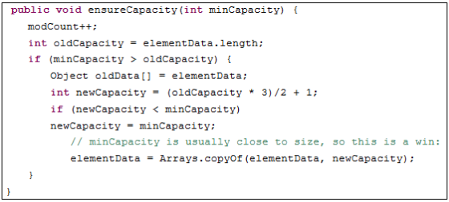
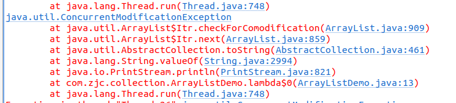
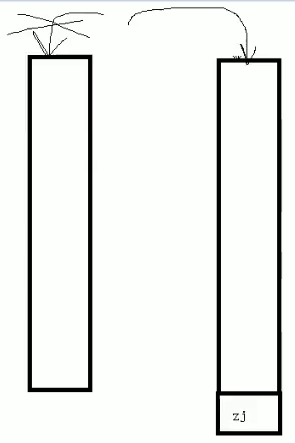
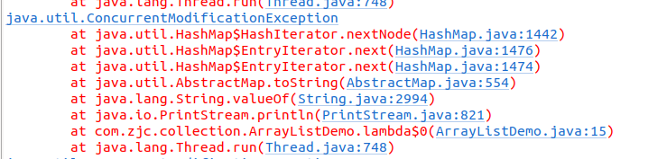
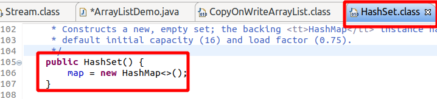
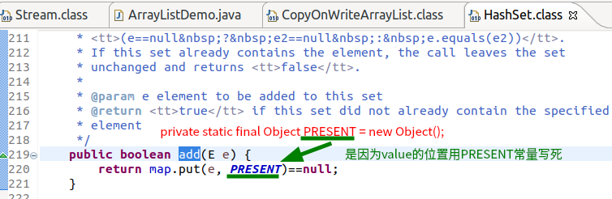

#   Java容器线程不安全该如何处理

---
#   ArrayList
##  新建与扩容
1.  新建 => 新建一个长度为10的object数组(确切来说,是一个空引用,当第一次add,才新建一个长度为10的数组)
2.  第一次扩容 => 增加原先值的一半,即扩容到`(10 * 3) / 2 + 1 = 16`
3.  第二次扩容 => 增加原先值的一半,即扩容 `(16 * 3) / 2 + 1 = 25`
4.  源码如下




##  线程不安全 => 如何证明与解决方案
###     故障现象

```java
package com.zjc.collection;

import java.util.ArrayList;
import java.util.UUID;

public class ArrayListDemo {
    public static void main(String[] args) {
        ArrayList<String> list = new ArrayList<>();
        
        for (int i = 0; i < 30; i++) {
            new Thread(() ->  {
                list.add(UUID.randomUUID().toString().substring(0, 8));
                System.out.println(list);
            }).start();
        }
    }
}
```

会出现并发修改异常




+   ConcurrentModificationException:当方法检测到对象的并发修改，但不允许这种修改时，抛出此异常。
    *   迭代器是依赖于集合而存在的，在判断成功后，集合的中新添加了元素，而迭代器却不知道，所以就报错了，这个错叫并发修改异常。
    *   简单描述就是：迭代器遍历元素的时候，通过集合是不能修改元素的。

###     导致原因
多线程并发争抢同一个类,且没有加锁

###     解决方法
1.  使用Vector,线程安全,但是降低并发

```java
package com.zjc.collection;

import java.util.ArrayList;
import java.util.UUID;

public class ArrayListDemo {
    public static void main(String[] args) {
        ArrayList<String> list = new Vector<>();
        
        for (int i = 0; i < 30; i++) {
            new Thread(() ->  {
                list.add(UUID.randomUUID().toString().substring(0, 8));
                System.out.println(list);
            }).start();
        }
    }
}
```

2.  使用Collections集合接口的工具类(Collection => 集合的接口)

```java
package com.zjc.collection;

import java.util.ArrayList;
import java.util.Collections;
import java.util.List;
import java.util.UUID;

public class ArrayListDemo {
    public static void main(String[] args) {
        List<String> list = Collections.synchronizedList(new ArrayList<>());
        
        for (int i = 0; i < 30; i++) {
            new Thread(() ->  {
                list.add(UUID.randomUUID().toString().substring(0, 8));
                System.out.println(list);
            }).start();
        }
    }
}
```

3.  写时复制

```java
package com.zjc.collection;

import java.util.List;
import java.util.UUID;
import java.util.concurrent.CopyOnWriteArrayList;

public class ArrayListDemo {
    public static void main(String[] args) {
        List<String> list = new CopyOnWriteArrayList<>();
        
        for (int i = 0; i < 30; i++) {
            new Thread(() ->  {
                list.add(UUID.randomUUID().toString().substring(0, 8));
                System.out.println(list);
            }).start();
        }
    }
}
```

### CopyOnWrite容器说明

####    参考
+   [CopyOnWriteArrayList原理，优缺点，使用场景](https://blog.csdn.net/u010002184/article/details/90452918)
+   [聊聊并发-Java中的Copy-On-Write容器](http://ifeve.com/java-copy-on-write/)

####    什么是CopyOnWrite容器
+   CopyOnWrite容器即写时复制的容器。
+   通俗的理解是当我们往一个容器添加元素的时候，不直接往当前容器添加，而是先将当前容器进行Copy，复制出一个新的容器
+   然后新的容器里添加元素，添加完元素之后，再将原容器的引用指向新的容器

####    有什么好处
+   我们可以对CopyOnWrite容器进行并发的读，而不需要加锁,因为当前容器不会添加任何元素。
+   所以CopyOnWrite容器也是一种读写分离的思想，读和写不同的容器。

####    CopyOnWrite在多线程场景中的使用
+   具体代码中的区别如下(CopyOnWriteArrayList)

```java
/**
 * 多线程
 * 使用普通的ArrayList,不使用CopyOnWriteArrayList的情况
 */
public void syncContainer1() {
    ArrayList<String> list = new ArrayList<String>();
    for (int i = 0; i < 10000; i++) {
        new Thread(() ->  {
            // 需要写同步块
            synchronized (list) {
                list.add(Thread.currentThread().getName());
            }
        }).start();
    }
}

/**
 * 多线程
 * 使用CopyOnWriteArrayList的情况
 */
public void syncContainer2() {
    CopyOnWriteArrayList<String> list = new CopyOnWriteArrayList<String>();
    for (int i = 0; i < 10000; i++) {
        new Thread(() ->  {
            // 不需要写同步块
            list.add(Thread.currentThread().getName());
        }).start();
    }
}
```

####    CopyOnWriteArrayList的实现原理
+   上述代码使用了CopyOnWriteArrayList，接下去我们看看其源码是如何实现的。以下代码是向CopyOnWriteArrayList中add方法的实现（向CopyOnWriteArrayList里添加元素），可以发现在添加的时候是需要加锁的，否则多线程写的时候会Copy出N个副本出来。
+   以下源码基于jdk1.8
    -   更新版本其实可以在搜索`synchronized`,是使用这个关键字实现的

```java
    /**
     * Appends the specified element to the end of this list.
     *
     * @param e element to be appended to this list
     * @return {@code true} (as specified by {@link Collection#add})
     */
    public boolean add(E e) {
        // 当前线程进行写前要加锁
        final ReentrantLock lock = this.lock;
        lock.lock();
        try {
            // 获取旧数组
            Object[] elements = getArray();
            // 获取旧数组长度
            int len = elements.length;
            // 创建一个新的数组,长度比旧数组多1,并将旧数组拷贝进新的数组
            Object[] newElements = Arrays.copyOf(elements, len + 1);
            // 将要添加的元素添加进新的数组
            newElements[len] = e;
            // 将原来指向旧数组的指针指向新的数组 
            setArray(newElements);
            // 返回true表示成功
            return true;
        } finally {
            // 写结束,解锁
            lock.unlock();
        }
    }

    /**
     * Removes the element at the specified position in this list.
     * Shifts any subsequent elements to the left (subtracts one from their
     * indices).  Returns the element that was removed from the list.
     *
     * @throws IndexOutOfBoundsException {@inheritDoc}
     */
    public E remove(int index) {
        final ReentrantLock lock = this.lock;
        lock.lock();
        try {
            Object[] elements = getArray();
            int len = elements.length;
            E oldValue = get(elements, index);
            int numMoved = len - index - 1;
            if (numMoved == 0)
                setArray(Arrays.copyOf(elements, len - 1));
            else {
                Object[] newElements = new Object[len - 1];
                System.arraycopy(elements, 0, newElements, 0, index);
                System.arraycopy(elements, index + 1, newElements, index,
                                 numMoved);
                setArray(newElements);
            }
            return oldValue;
        } finally {
            lock.unlock();
        }
    }

    /**
     * Replaces the element at the specified position in this list with the
     * specified element.
     *
     * @throws IndexOutOfBoundsException {@inheritDoc}
     */
    public E set(int index, E element) {
        final ReentrantLock lock = this.lock;
        lock.lock();
        try {
            Object[] elements = getArray();
            E oldValue = get(elements, index);

            if (oldValue != element) {
                int len = elements.length;
                Object[] newElements = Arrays.copyOf(elements, len);
                newElements[index] = element;
                setArray(newElements);
            } else {
                // Not quite a no-op; ensures volatile write semantics
                setArray(elements);
            }
            return oldValue;
        } finally {
            lock.unlock();
        }
    }
```




####    应用场景
+   读的时候不需要加锁，如果读的时候有多个线程正在向CopyOnWriteArrayList添加数据，读还是会读到旧的数据，因为开始读的那一刻已经确定了读的对象是旧对象。
+   CopyOnWrite并发容器**用于读多写少的并发场景**
    -   比如白名单，黑名单等场景

####    CopyOnWrite的缺点
CopyOnWrite容器有很多优点，但是同时也存在两个问题，即内存占用问题和数据一致性问题。所以在开发的时候需要注意一下。
1.  **内存占用问题**
    -   因为CopyOnWrite的写时复制机制，所以在进行写操作的时候，内存里会同时驻扎两个对象的内存，旧的对象和新写入的对象（注意:在复制的时候只是复制容器里的引用，只是在写的时候会创建新对象添加到新容器里，而旧容器的对象还在使用，所以有两份对象内存）。如果这些对象占用的内存比较大，比如说200M左右，那么再写入100M数据进去，内存就会占用300M，那么这个时候很有可能造成频繁的Yong GC和Full GC。之前我们系统中使用了一个服务由于每晚使用CopyOnWrite机制更新大对象，造成了每晚15秒的Full GC，应用响应时间也随之变长。
    -   针对内存占用问题，可以通过压缩容器中的元素的方法来减少大对象的内存消耗，比如，如果元素全是10进制的数字，可以考虑把它压缩成36进制或64进制。或者不使用CopyOnWrite容器，而使用其他的并发容器，如ConcurrentHashMap。

2.  **数据一致性问题**
    -   CopyOnWrite容器只能保证数据的最终一致性，不能保证数据的实时一致性。所以如果你希望写入的的数据，马上能读到，请不要使用CopyOnWrite容器。

###     优化建议
+   高并发情况下,可以使用JUC里的CopyOnWriteArrayList
+   java出现20年,不是极端情况下,大部分问题前人已经遇到过了,不建议重复造轮子


#   HashMap
##  新建与扩容
+   HashMap的位桶数组，初始大小为16
+   实际使用时，显然大小是可变的
+   如果位桶数组中的元素达到(0.75*数组 length)，就重新调整数组大小变为原来2倍大小
+   扩容很耗时
+   扩容的本质是定义新的更大的数组，并将旧数组内容挨个拷贝到新数组中

```
1.  新建 => 长度为16
2.  第一次扩容 => 原先值的一倍,即扩容到32
3.  第二次扩容 => 原先值的一倍,即扩容到64
```

##  线程不安全 => 如何证明与解决方案
###     故障现象

```java
package com.zjc.collection;

import java.util.HashMap;
import java.util.Map;
import java.util.UUID;

public class ArrayListDemo {
    public static void main(String[] args) {
        Map<String, String> map = new HashMap<>();
        for (int i = 0; i < 30; i++) {
            new Thread(() -> {
                map.put(Thread.currentThread().getName(), UUID.randomUUID().toString().substring(0, 8));
                System.out.println(map);
            }).start();
        }
    }
}
```





###     解决方法
1.  使用HashTable

```
+   HashMap: 线程不安全，效率高。允许key或value为null。
+   HashTable: 线程安全，效率低。不允许key或value为null。
```

2.  使用JUC里的ConcurrentHashMap

```java
package com.zjc.collection;

import java.util.Map;
import java.util.UUID;
import java.util.concurrent.ConcurrentHashMap;

public class ArrayListDemo {
    public static void main(String[] args) {
        // 使用ConcurrentHashMap替代HashMap
        Map<String, String> map = new ConcurrentHashMap<>();
        for (int i = 0; i < 30; i++) {
            new Thread(() -> {
                map.put(Thread.currentThread().getName(), UUID.randomUUID().toString().substring(0, 8));
                System.out.println(map);
            }).start();
        }
    }
}
```

#   HashSet
##  HashSet是否安全
+   HashSet底层是HashMap




+   为什么HashSet的add方法只需要一个元素 => 是因为




所以HashSet是不安全的

##  解决方法

```java
CopyOnWriteArraySet<Object> copyOnWriteArraySet = new CopyOnWriteArraySet<>();
```


