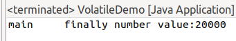
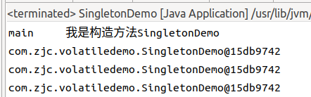

#   理解Java中的volatile关键字

---

#   JMM
##  什么是JMM
JMM(Java内仔模型JavaMemoryModel,简称JMM)本身是一种抽象的概念并不真实存在,它描述的是一组规则或规范,通过这组规范定义了程序中各个变量(包括实例字段,静态字段和构成数组对象的元素)的访问方式

##  三个特性
1.  可见性 => 修改完变量之后,让其他线程第一时间可以看到
2.  原子性
3.  有序性

##  JMM关于同步规定
1.  线程解锁前,必须把共享变量的值刷新回主内存
2.  线程加锁前,必须读取主内存的最新值到自己的工作内存
3.  加锁解锁是同一把锁

由于 JVM 运行程序的实体是线程,而每个线程创建时 JVM 都会为其创建一个工作内存(有些地方成为栈空间),工作内存是每个线程的私有数据区域,而 Java 内存模型中规定所有变量都存储在主内存,主内存是共享内存区域,所有线程都可访问,但线程对变量的操作(读取赋值等)必须在工作内存中进行,首先要将变量从主内存拷贝到自己的工作空间,然后对变量进行操作,操作完成再将变量写回主内存,不能直接操作主内存中的变量,各个线程中的工作内存储存着主内存中的变量副本拷贝,因此不同的线程无法访问对方的工作内存,此案成间的通讯(传值)必须通过主内存来完成,其简要访问过程如下图:


##  可见性
通过前面对 JMM 的介绍,我们知道各个线程对主内存中共享变量的操作都是各个线程各自拷贝到自己的工作内存操作后再写回主内存中的.这就可能存在一个线程 AAA 修改了共享变量 X 的值还未写回主内存中时 ,另外一个线程BBB 又对内存中的一个共享变量 X 进行操作,但此时 A 线程工作内存中的共享比那里 X 对线程 B 来说并不不可见.这种工作内存与主内存同步延迟现象就造成了可见性问题

#   volatile
是Java虚拟机提供的轻量级的同步机制,是JMM的一个子集实现

##  三个特性
1.  保证可见性 => 对应JMM的可见性
2.  不保证原子性 => 对应JMM的原子性 => volatile不满足
3.  禁止指令重排 => 对应JMM的有序性

##  volatile的保证可见性
###     `int number = 0`没有`volatile`关键字

```java
package com.zjc.collection;

import java.util.concurrent.TimeUnit;

/**
 * 验证volate的可见性
 */
public class VolatileDemo {
    public static void main(String[] args)  {
        MyData myData = new MyData();   // 资源类
        
        // 第一个线程
        new Thread(() -> {
            System.out.println(Thread.currentThread().getName() + "\t 线程进入");
            try {
                TimeUnit.SECONDS.sleep(2);
            } catch (InterruptedException e) {
                e.printStackTrace();
            }
            myData.setNumber(60);
            System.out.println(Thread.currentThread().getName() + "\t 更新number值" + myData.getNumber());
        }, "AAA").start();
        
        // 第二个线程
        new Thread(()->{
            // 此处，如果循环判断的时number,没有加volatile修饰，就会一直死循环下去，
            // 但是如果没有这个循环，等待2s之后直接获取，则能获取到线程A改变后的值，因为，主线程，是在线程A修改之后才拿到的数据；
            while (myData.getNumber() == 0) {
                // 如果数字一直没变就死循环
                // 这里面写点代码会触发可见性,所以死循环里面代码为空
            }
            System.out.println(Thread.currentThread().getName() + "\t 任务完成,读取的number为" + myData.getNumber());
        }, "BBB").start();
        
        
    }
}

class MyData {
    int number = 0;
    public int getNumber() {
        return number;
    }
    public void setNumber(int number) {
        this.number = number;
    }
}

```
运行结果:


###     `int number = 0`添加`volatile`关键字

```java
package com.zjc.collection;

import java.util.concurrent.TimeUnit;

/**
 * 验证volate的可见性
 */
public class VolatileDemo {
    public static void main(String[] args)  {
        MyData myData = new MyData();   // 资源类
        
        // 第一个线程
        new Thread(() -> {
            System.out.println(Thread.currentThread().getName() + "\t 线程进入");
            try {
                TimeUnit.SECONDS.sleep(2);
            } catch (InterruptedException e) {
                e.printStackTrace();
            }
            myData.setNumber(60);
            System.out.println(Thread.currentThread().getName() + "\t 更新number值" + myData.getNumber());
        }, "AAA").start();
        
        // 第二个线程
        new Thread(()->{
            // 此处，如果循环判断的时number,没有加volatile修饰，就会一直死循环下去，
            // 但是如果没有这个循环，等待2s之后直接获取，则能获取到线程A改变后的值，因为，主线程，是在线程A修改之后才拿到的数据；
            while (myData.getNumber() == 0) {
                // 如果数字一直没变就死循环
                // 这里面写点代码会触发可见性,所以死循环里面代码为空
            }
            System.out.println(Thread.currentThread().getName() + "\t 任务完成,读取的number为" + myData.getNumber());
        }, "BBB").start();
        
        
    }
}

class MyData {
    // 添加volatile关键字
    volatile int number = 0;
    public int getNumber() {
        return number;
    }
    public void setNumber(int number) {
        this.number = number;
    }
}
```
运行结果


##  volatile不保证原子性

###     验证volatile不保证原子性
1.  `number++`在多线程下是非线程安全的,即使number用volatile进行修饰,也不保证原子性

```java
package com.zjc.collection;

import java.util.concurrent.TimeUnit;

/**
 * 
 * 2. 验证volatile不保证原子性
 * => 2.1 原子性指的是什么意思?
 * => => => 不可分割,完整性,即在某个线程正在做某个具体业务时,中间不可以被加塞.
 * => => => 需要整体完整,要么同时成功,要么同时失败
 * => 2.2 验证是否保证原子性
 */
public class VolatileDemo {
    public static void main(String[] args)  {
        MyData myData = new MyData();
        for (int i = 0; i < 20; i++) {
            new Thread(() -> {
                for (int j = 0; j < 1000; j++) {
                    myData.addPlusPlus();
                }
            }, String.valueOf(i)).start();
        }
        
        // 需要等待上面20个线程全部计算完成后,在用main线程取得最终的结果值看是多少?
        // 运行时,默认有两个线程,一个是main线程,一个是gc线程
        while (Thread.activeCount() > 2) {
            // 礼让线程,即让当前main线程不执行,将线程从运行状态转入就绪状态
            Thread.yield();
        }
        System.out.println(Thread.currentThread().getName() + "\t finally number value:" + myData.number);
    }

}

class MyData {
    volatile int number = 0;
    public int getNumber() {
        return number;
    }
    public void setNumber(int number) {
        this.number = number;
    }
    
    public void addPlusPlus() {
        number++;
    }
}
```
如果volatile保证原子性,那么运行结果应该是20000,但上述代码运行结果如下


###     为什么volatile不保证原子性
为了方便查看字节码,新起一个文件,写一段相同的代码,并查看字节码,如图


让我们从程序执行的步骤开始分析，查看源码的字节码文件,我们可以发现，底层指令中可以分成4个指令

```
getfield
iconst_1
iadd
putfield
```

+   A线程和B线程都进入了add方法中，也就是A线程和B线程都从主内存获取n的值;
+   假设此时n=1，此时A线程执行完指令iadd，n的数值变为2，并执行putfield指令将数据写回主内存;
+   此时B线程执行到了iadd执行，由于同一时间只能有一个线程往主内存中更新n的数值，所以B线程在iadd指令这里挂起了;
+   当A线程将n更新为2后，来不及通知其他线程n的数值已经更新为2的,所以此时B内存接着执行putfield的指令将n数值再次更新为了2，即出现了重复写的情况;
+   因为n++不同于n = 30之类的指令，它是由4个指令组成的操作，会出现线程加塞的情况。

###     如何解决number++在多线程下的线程安全问题

1.  增加`synchronized`的关键字

```java
class MyData {
    volatile int number = 0;
    public int getNumber() {
        return number;
    }
    public void setNumber(int number) {
        this.number = number;
    }
    
    public synchronized void addPlusPlus() {
        number++;
    }
}
```

2.  使用JUC下的原子变量`atomic`


```java
package com.zjc.collection;

import java.util.concurrent.atomic.AtomicInteger;

public class VolatileDemo {
    public static void main(String[] args)  {
        MyData02 myData02 = new MyData02();
        for (int i = 0; i < 20; i++) {
            new Thread(() -> {
                for (int j = 0; j < 1000; j++) {
                    myData02.addAtomic();
                }
            }, String.valueOf(i)).start();
        }
        
        // 需要等待上面20个线程全部计算完成后,在用main线程取得最终的结果值看是多少?
        // 运行时,默认有两个线程,一个是main线程,一个是gc线程
        while (Thread.activeCount() > 2) {
            // 礼让线程,即让当前main线程不执行,将线程从运行状态转入就绪状态
            Thread.yield();
        }
        System.out.println(Thread.currentThread().getName() + "\t finally number value:" + myData02.number);
    }
}

class MyData02 {
    AtomicInteger number = new AtomicInteger();
    public void addAtomic() {
        number.getAndIncrement();
    }
}
```

运行结果如下




##  指令重排
###     打比方
参加高考,老师会交待:同学们,先做会做的题目,再做不会做的,争取考高分
也就是说,计算机为了性能(争取考高分),会重派指令(先做会做的题目,再做不会做的),而不会按照原先的顺序(高考试卷题目的顺序)进行操作

###     指令重排
计算机在执行程序时,为了提高性能,编译器和处理器常常会做`指令重排`,一把分为以下3种


+   单线程环境里面确保程序最终执行结果和代码顺序执行的结果一致。
+   处理器在进行重新排序是必须要考虑指令之间的`数据依赖性`。
+   多线程环境中线程交替执行,由于编译器优化重排的存在,两个线程使用的变量能否保持一致性是无法确定的,结果无法预测


#   内存屏障(Memory Barrier)
又称内存栅栏,是一个CPU指令,它的作用有两个:

1.  保证特定操作的执行顺序
2.  保证某些变量的内存可见性(利用该特性实现volatile的内存可见性质)

+   由于编译器和处理器都能执行指令重排优化。如果在指令间插入一条Memory Barrier则会告诉编译器和CPU，不管什么指令都不能和这条Memory Barrier指令重排序，也就是说通过插入内存屏障禁止在内存屏障前后的指令执行重排序优化。
+   内存屏障的另外一个作用是强制刷出各种CPU的缓存数据，因此任何CPU上的线程都能读到这些数据的最新版本

对Volatile变量进行写操作时，会在写操作后加入一条store屏障指令，将内存中的共享变量值刷新回到主内存


对Volatile进行读操作时候，会在读操作前加入一条load屏障指令，从内存中读取共享变量


#   volatile的应用
##  JUC包里面大规模使用volatile
比如atomic => `package java.util.concurrent.atomic;`


##  单例模式
###     单例模式在多线程环境下可能存在安全问题

1.  普通写法的单例模式在单线程环境下的运行情况

```java
package com.zjc.volatiledemo;

public class SingletonDemo {
    private static SingletonDemo instance = null;

    private SingletonDemo() {
        System.out.println(Thread.currentThread().getName() + "\t 我是构造方法SingletonDemo");
    }
    
    public static SingletonDemo getInstance() {
        if (instance == null) {
            instance = new SingletonDemo();
        }
        return instance;
    }
    
    public static void main(String[] args) {
        System.out.println(SingletonDemo.getInstance());
        System.out.println(SingletonDemo.getInstance());
        System.out.println(SingletonDemo.getInstance());
    }
}
```

单线程情况下,`我是构造方法SingletonDemo`执行一次,完全没有问题,运行如下



但我们用多线程调用会出问题

2.  普通写法的单例模式在多线程环境下的运行情况

```java
package com.zjc.volatiledemo;

public class SingletonDemo {
    private static SingletonDemo instance = null;

    private SingletonDemo() {
        System.out.println(Thread.currentThread().getName() + "\t 我是构造方法SingletonDemo");
    }
    
    public static SingletonDemo getInstance() {
        if (instance == null) {
            instance = new SingletonDemo();
        }
        return instance;
    }
    
    public static void main(String[] args) {
        // 并发多线程后,情况发生了很大变化
        for (int i = 0; i < 10; i++) {
            new Thread(() -> {
                SingletonDemo.getInstance();
            }, String.valueOf(i)).start();
        }
    }
}
```

理论上,对于单例模式,构造方法里的内容只能执行一次,但我们运行代码之后,如下


构造方法里的内容不止执行一次

###     如何解决
####    使用DCL(Double Check Lock)双重检查锁定机制
底下代码关注`getInstance()`方法的变化

```java
package com.zjc.volatiledemo;

public class SingletonDemo {
    private static SingletonDemo instance = null;

    private SingletonDemo() {
        System.out.println(Thread.currentThread().getName() + "\t 我是构造方法SingletonDemo");
    }
    
    // DCL(Double Check Lock)双端检查锁定机制
    public static SingletonDemo getInstance() {
        if (instance == null) {
            synchronized (SingletonDemo.class) {
                if (instance == null) {
                    instance = new SingletonDemo();
                }
            }
        }
        return instance;
    }
    
    public static void main(String[] args) {
        // 并发多线程后,情况发生了很大变化
        for (int i = 0; i < 10; i++) {
            new Thread(() -> {
                SingletonDemo.getInstance();
            }, String.valueOf(i)).start();
        }
    }
}
```

运行结果如下


构造方法里的内容只执行一次,貌似万事大吉了,但其实并不是(只是99%大吉),因为双端检查锁定机制不一定是线程安全的

####    为什么双端检查锁定机制不一定是线程安全的
#####   原因
因为有指令重排的存在

#####   说明
针对上述代码,当某一个线程执行到第一次检测,读取到的instance部位null时,instance的引用对象可能没有完成初始化
instance = new SingletonDemo();可以分为一下3步完成(伪代码)

```
1. 分配对象内存空间
memory = allocate();
2. 初始化对象
instance(memory);
3. 设置instance指向刚分配的内存地址,此时instance != null
instance = memory;
```

步骤2和步骤3不存在数据依赖关系,而昆无论重排前还是重排后程序的执行结果在单线程中并没有改变,因此这种重排优化是允许的

```
1. 分配对象内存空间
memory = allocate();
3. 设置instance指向刚分配的内存地址,此时instance != null,但是对象还没有初始化完成
instance = memory;
2. 初始化对象
instance(memory);
```

由于指令重排只会保证串行语义的执行的一致性(单线程),并不会关心多线程间的语义一致性,所以当一条线程访问instance不为null时,由于instance实力未必已初始化完成,也就造成了线程安全问题

#####   写出伪代码再一次说明
根据上面的分析,我们得到如下伪代码

```java
    // DCL(Double Check Lock)双端检查锁定机制
    public static SingletonDemo getInstance() {
        if (instance == null) {
            synchronized (SingletonDemo.class) {
                if (instance == null) {
                    //instance = new SingletonDemo();
                    // 伪代码
                    // 1. 分配对象内存空间
                    memory = allocate();
                    // 3. 设置instance指向刚分配的内存地址,此时instance != null,但是对象还没有初始化完成
                    instance = memory;
                    // 2. 初始化对象
                    instance(memory);
                }
            }
        }
        return instance;
    }
```

+   对于重排后的代码,A线程设置instance指向刚分配的内存地址,即`instance != null`,但还未初始化对象
+   此时B线程调用getInstance()方法,由于instance != null,所以直接`return instance`,继续执行,但拿到的instance其实是null,会报错

###     多线程环境中单例模式代码
增加了volatile用以禁止重排

```java
package com.zjc.volatiledemo;

public class SingletonDemo {
    // 增加volatile关键字禁止重排
    private static volatile SingletonDemo instance = null;

    private SingletonDemo() {
        System.out.println(Thread.currentThread().getName() + "\t 我是构造方法SingletonDemo");
    }
    
    // DCL(Double Check Lock)双重检查锁定机制
    public static SingletonDemo getInstance() {
        if (instance == null) {
            synchronized (SingletonDemo.class) {
                if (instance == null) {
                    instance = new SingletonDemo();
                }
            }
        }
        return instance;
    }
    
    public static void main(String[] args) {
        // 并发多线程后,情况发生了很大变化
        for (int i = 0; i < 10; i++) {
            new Thread(() -> {
                SingletonDemo.getInstance();
            }, String.valueOf(i)).start();
        }
    }
}

```

#   总结
+   工作内存与主内存同步延迟现象导致的可见性问题可以使用synchronized或volatile关键字解决,它们都可以使一个线程修改后的变量立即对其他线程可见。
+   于指令重排导致的可见性问题和有序性问题可以利用volatile关键字解决,因为volatile的另外一个作用就是禁止重排序优化

