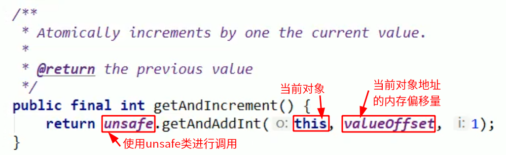
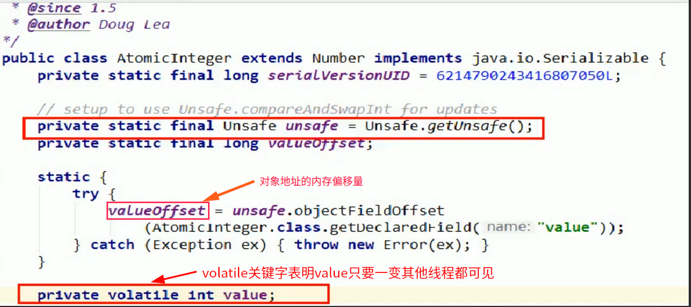
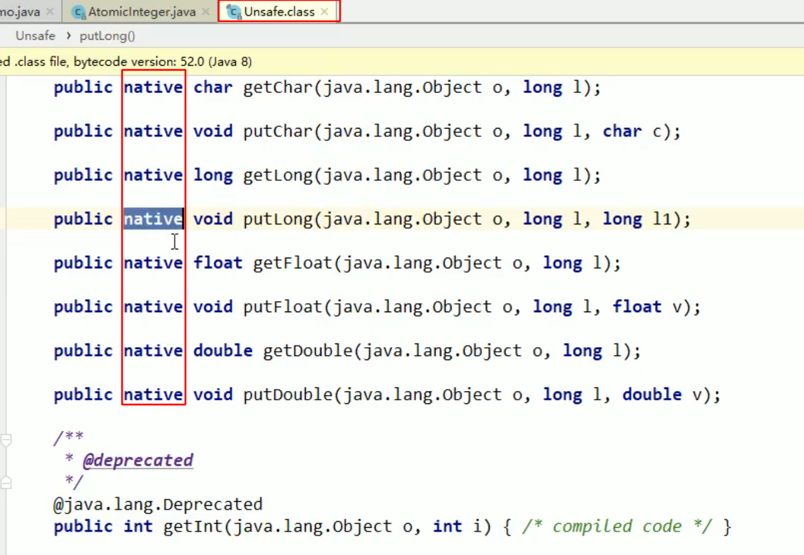
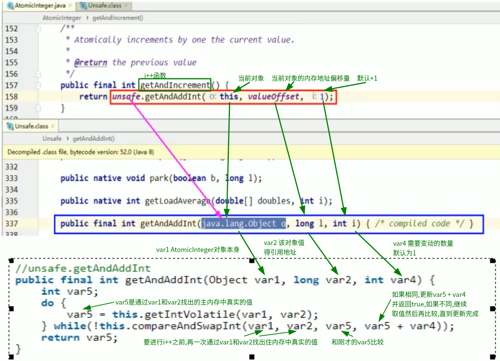
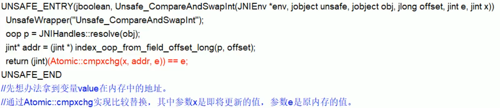

#   CAS(Compare-And-Swap)基本说明
+   什么是CAS:比较当前工作内存中的值和主内存中的值,如果相同则执行规定操作,否则继续比较直到主内存和工作内存中的值一致为止
+   CAS保证数据的原子性,是硬件对于并发操作共享数据的支持
+   凭什么不加synchronized也能保证原子性 => 原子整型不用加synchronized也能保证原子性,是因为底层用的是Unsafe类
+   自旋锁 unsafe

#   先明白Unsafe类是什么?
##  追`atomiclInteger.getAndlncrement()`方法的源代码
atomiclInteger.getAndlncrement()方法的源代码

unsafe变量对应Unsafe类,如下图源码

继续追源码,可以看见Unsafe.class文件里有用`native`关键字进行修饰的语句

##  说明Unsafe类是什么
1.  Unsafe类来自`rt.jar/sun/misc`包里面,rt.jar及runtime需要的jar包,所以Unsafe.class是从娘胎开始就带着的类

2.  Unsafe是CAS的核心类,由于Java方法无法直接访问底层系统,需要通过`本地(native)方法`来访问,**Unsafe相当于一个后门,基于该类可以直接操作特定内存的数据**。Unsafe类存在于sun.misc包中,其内部方法操作可以像C的指针一样直接操作内存,因为Java中CAS操作的执行依赖于Unsafe类的方法。
3.  注意Unsafe类中的所有方法都是native修饰的,也就是说**Unsafe类中的方法都直接调用操作系统底层资源执行相应任务**
4.  变量`valueOffset`,表示该变量值在内存中的偏移地址,因为Unsafe就是根据内存偏移地址获取数据的
5.  变量`value`用volatile修饰,保证了多线程之间的内存可见性

#   再弄懂CAS是什么
##  CAS是什么
+   CAS的全称为Compare-And-Swap,**它是一条CPU并发原语**,它的功能是判断内存某个位置的值是否为预期值,如果是则更改为新的值,这个过程是原子的。
+   CAS并发原语体现在JAVA语言中就是sun.misc.Unsafe类中的各个方法。调用UnSafe类中的CAS方法,JVM会帮我们实现出CAS汇编指令。这是一种完全依赖于硬件的功能,通过它实现了原子操作。再次强调,由于CAS是一种系统原语,原语属于操作系统用语范畴,是由若干条指令组成的,用于完成某个功能的一个过程,并且**原语的执行必须是连续的,在执行过程中不允许被中断,也就是说CAS是一条CPU的原子指令,不会造成所谓的数据不一致问题**。

##  通过`getAndAddInt`源码进行说明
###     源码说明

说明:
var5就是我们从主内存中拷贝到工作内存中的值,那么操作的时候，需要比较工作内存中的值，和主内存中的值进行比较,假设执行 compareAndSwapInt返回false，那么就一直执行 while方法，直到期望的值和真实值一样

+   var1：AtomicInteger对象本身
+   var2：该对象值得引用地址
+   var4：需要变动的数量
+   var5：用var1和var2找到的内存中的真实值
    *   用该对象当前的值与var5比较
    *   如果相同，更新var5 + var4 并返回true
    *   如果不同，继续取值然后再比较，直到更新完成

###     模拟运行
假设线程A和线程B同时执行getAndInt操作（分别跑在不同的CPU上）

+   AtomicInteger里面的value原始值为3，即主内存中AtomicInteger的 value 为3，根据JMM模型，线程A和线程B各自持有一份价值为3的副本，分别存储在各自的工作内存
+   线程A通过getIntVolatile(var1 , var2) 拿到value值3，这时因为各种情况线程A被挂起（该线程失去CPU执行权）
+   线程B也通过getIntVolatile(var1, var2)方法获取到value值也是3，此时刚好线程B没有被挂起，并执行了compareAndSwapInt方法，比较内存的值也是3，成功修改内存值为4，线程B打完收工，一切OK
+   这是线程A恢复，执行CAS方法，比较发现自己手里的数字3和主内存中的数字4不一致，说明该值已经被其它线程抢先一步修改过了，那么A线程本次修改失败，只能够重新读取后在来一遍了，也就是在执行do while
+   线程A重新获取value值，因为变量value被volatile修饰，所以其它线程对它的修改，线程A总能够看到，线程A继续执行compareAndSwapInt进行比较替换，直到成功。

##  Unsafe类中的compareAndSwapInt为什么能保证原子性
+   Unsafe类中的compareAndSwapInt是一个本地方法,该方法的实现位于`unsafe.cpp`中,需要汇编的知识

#   CAS缺点
CAS不加锁，保证原子性，但是需要多次比较

+   循环时间长，开销大（因为执行的是do while，如果比较不成功一直在循环，最差的情况，就是某个线程一直取到的值和预期值都不一样，这样就会无限循环）
+   只能保证一个共享变量的原子操作
    *   当对一个共享变量执行操作时，我们可以通过循环CAS的方式来保证原子操作
    *   但是对于多个共享变量操作时，循环CAS就无法保证操作的原子性，这个时候只能用锁来保证原子性
+   引出来ABA问题？

#   总结
1.  什么是CAS:比较当前工作内存中的值和主内存中的值,如果相同则执行规定操作,否则继续比较直到主内存和工作内存中的值一致为止
2.  CAS有3个操作数,内存值V,旧的预期值A,要修改的更新值B。当且仅当预期值A和内存值V相同时,将内存值V修改为B,否则什么都不做.
