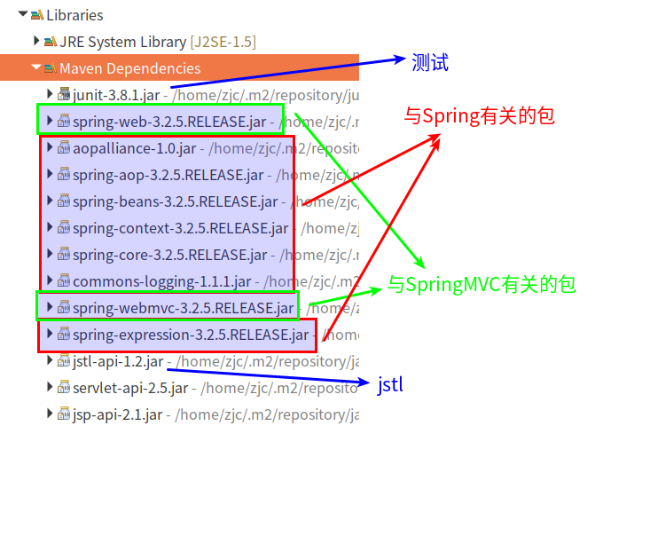

#   SpringMVC的快速入门
+ date: 2017-10-03 21:49:39
+ description: SpringMVC的入门
+ categories:
  -   Java
+ tags:
  -   Spring
-   SpringMVC
---

#   快速入门案例
##  创建一个maven工程
### 修改pom.xml文件
```xml
<project xmlns="http://maven.apache.org/POM/4.0.0"
	xmlns:xsi="http://www.w3.org/2001/XMLSchema-instance"
	xsi:schemaLocation="http://maven.apache.org/POM/4.0.0 http://maven.apache.org/xsd/maven-4.0.0.xsd">
	<modelVersion>4.0.0</modelVersion>
	<groupId>com.zjc</groupId>
	<artifactId>springhello</artifactId>
	<version>0.0.1-SNAPSHOT</version>
	<packaging>war</packaging>
	<properties>
		<springVersion>3.2.5.RELEASE</springVersion>
	</properties>
	<dependencies>
		<!-- 测试用 -->
		<dependency>
			<groupId>junit</groupId>
			<artifactId>junit</artifactId>
			<version>3.8.1</version>
			<scope>test</scope>
		</dependency>
		<!-- 添加springmvc依赖包 -->
		<dependency>
			<groupId>org.springframework</groupId>
			<artifactId>spring-web</artifactId>
			<version>${springVersion}</version>
		</dependency>
		<dependency>
			<groupId>org.springframework</groupId>
			<artifactId>spring-webmvc</artifactId>
			<version>${springVersion}</version>
		</dependency>
		<!-- jstl标签 -->
		<dependency>
			<groupId>javax.servlet.jsp.jstl</groupId>
			<artifactId>jstl-api</artifactId>
			<version>1.2</version>
		</dependency>
	</dependencies>
</project>
```

### 本质上载入如下包



*稍微解释一下*
1.  与spring有关的包
>   aop -> aop
>   beans -> bean工厂
>   context -> 上下文
>   core -> 核心
>   expression -> 表达式
>   commons-logging -> spring的依赖
2.  与springMVC有关的包
>   spring-web
>   spring-webmvc


#   配置web.xml
web.xml从来都是与Servlet相关
```xml
<?xml version="1.0" encoding="UTF-8"?>
<web-app xmlns:xsi="http://www.w3.org/2001/XMLSchema-instance"
	xmlns="http://java.sun.com/xml/ns/javaee"
	xsi:schemaLocation="http://java.sun.com/xml/ns/javaee http://java.sun.com/xml/ns/javaee/web-app_2_5.xsd"
	version="2.5">
	<display-name>springhello</display-name>
	<welcome-file-list>
		<welcome-file>index.html</welcome-file>
		<welcome-file>index.htm</welcome-file>
		<welcome-file>index.jsp</welcome-file>
		<welcome-file>default.html</welcome-file>
		<welcome-file>default.htm</welcome-file>
		<welcome-file>default.jsp</welcome-file>
	</welcome-file-list>

	<!-- The front controller of this Spring Web application, responsible for 
		handling all application requests -->
	<!-- 核心控制器 -->
	<servlet>
		<servlet-name>springDispatcherServlet</servlet-name>
		<servlet-class>org.springframework.web.servlet.DispatcherServlet</servlet-class>
 		<init-param>
            <!-- 这里要配置springmvc.xml文件 -->
            <!-- xml文件,文件名随意 -->
            <!-- 因为底层是spring,所以这里要配置spinrg要扫描哪些包 -->
			<param-name>contextConfigLocation</param-name>
			<param-value>lasspath:springmvc.xml</param-value>
		</init-param>
	</servlet>

	<!-- Map all requests to the DispatcherServlet for handling -->
	<servlet-mapping>
		<servlet-name>springDispatcherServlet</servlet-name>
		<url-pattern>*.action</url-pattern>
	</servlet-mapping>
</web-app>
```

#   入门代码
```java
package com.zjc.springmvc.controller;

import org.springframework.stereotype.Controller;
import org.springframework.web.bind.annotation.RequestMapping;
import org.springframework.web.servlet.ModelAndView;

@Controller	//标识控制器
public class HelloController {

	@RequestMapping("/hello")	//用以绑定请求地址
	public  ModelAndView hello() {
		System.out.println("Hello SpringMVC...");
		ModelAndView mav = new ModelAndView();
		// 设置模型数据,用于传递到jsp
		mav.addObject("msg", "hellomvc....");
		// 设定视图名字,用于响应用户
		mav.setViewName("/WEB-INF/jsp/hello.jsp");

		return mav;
	}
}

```

#   配置包扫描
```xml
<?xml version="1.0" encoding="UTF-8"?>
<beans xmlns="http://www.springframework.org/schema/beans"
	xmlns:xsi="http://www.w3.org/2001/XMLSchema-instance"
	xmlns:context="http://www.springframework.org/schema/context"
	xsi:schemaLocation="http://www.springframework.org/schema/beans http://www.springframework.org/schema/beans/spring-beans.xsd http://www.springframework.org/schema/context 
http://www.springframework.org/schema/context/spring-context-4.3.xsd http://www.springframework.org/schema/mvc http://www.springframework.org/schema/mvc/spring-mvc-4.3.xsd">

	<!-- 配置controller扫描包 -->
	<context:component-scan base-package="com" />
</beans>
```

#   将项目加入tomcat,浏览器访问


