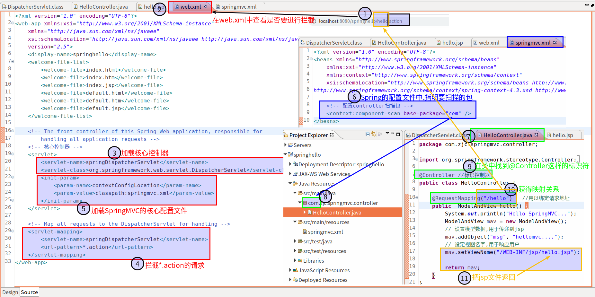
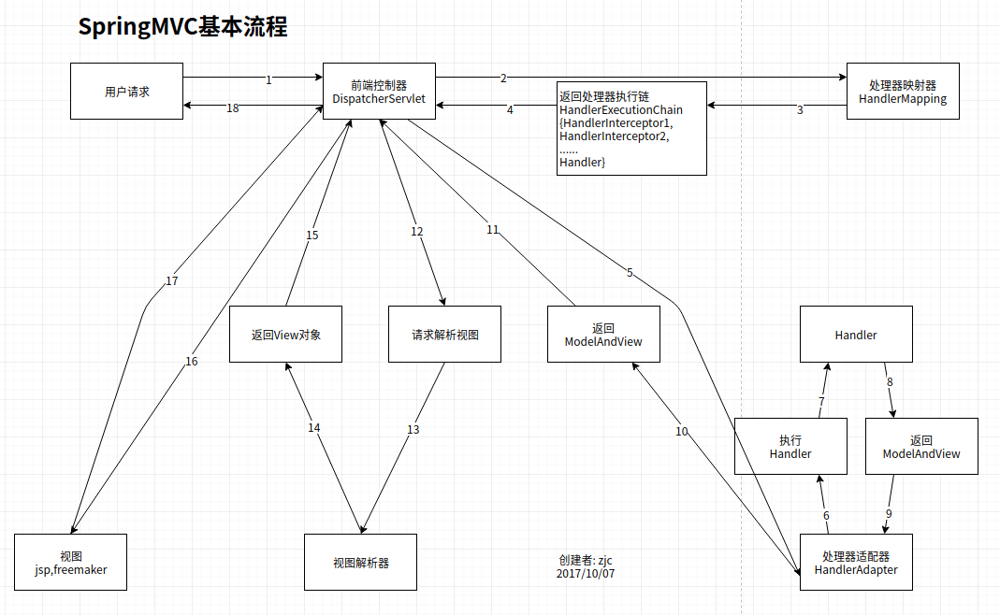

#   SpringMVC的基本流程
+ date: 2017-10-05 21:10:09
+ description: SpringMVC的基本流程
+ categories:
  - Java
+ tags:
  - Spring
- SpringMVC
---
#   从请求到响应

1.  访问http://localhost:8080/springhello/hello.action
2.  web.xml文件配置了拦截规则
3.  web.xml文件中规定要加载的核心控制器
4.  web.xml文件中规定了要对`*.action`的请求进行拦截
5.  web.xml文件中规定了要加载的SpingMVC的核心配置文件(其实就是底层的Spring)
6.  springmvc.xml文件中规定了要扫描的包是`com`
7.  这里用`HelloController.java`进行说明
8.  由于我们需要扫描的包是`com`,所有`com`底下的所有类都需要扫
9.  扫描包下所有的文件,找出所有有`@Controller`标记的类
10.  找到所有`@RequestMapping`标记,此时可以知道,我们存在映射`hello`
11. 由于我们访问的url是`hello.action`,所以需要执行被`@RequestMapping("/hello")`标记的函数(也就是控制器内的函数),最后返回hello.jsp文件

#   画图说明

组件说明在这里
[SpringMVC的默认组件加载](/2017/10/07/SpringMVC的默认组件加载/)

