#   SpringMVC的默认组件加载
+ date: 2017-10-06 15:59:06
+ description: SpringMVC的默认组件加载
+ categories:
  - Java
+ tags:
  - Spring
- SpringMVC
---
#   默认组件加载选择
##  配置处理器映射器和处理器适配器
从Spring3.1版本开始,废除了DefaultAnnotationHandlerMapping的使用,推荐使用RequestMappingHanddlerMapping完成注解处理器映射
而处理器映射器和处理器适配器是成对出现的,所以要跟着改(事实上只该处理器映射器,没改处理器适配器的情况下,运行是会直接报500错误的)
### 方法一
1.  处理器映射器

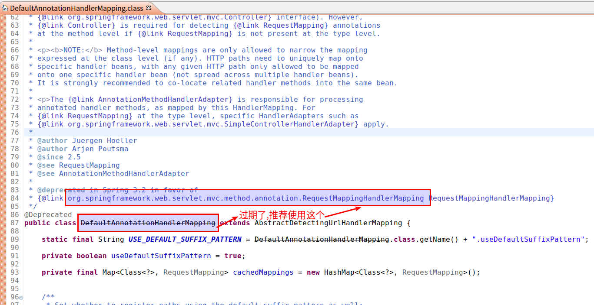

在Spring的核心配置文件进行配置
```xml
    <bean class="org.springframework.web.servlet.mvc.method.annotation.RequestMappingHandlerMapping" />
```
2.  处理器适配器
在Spring的核心配置文件进行配置
```xml
    <!-- 配置处理器适配器 -->
    <bean class="org.springframework.web.servlet.mvc.method.annotation.RequestMappingHandlerAdapter" />
```
3.  完整的springmvc.xml文件如下
```xml
<?xml version="1.0" encoding="UTF-8"?>
<beans xmlns="http://www.springframework.org/schema/beans"
	xmlns:xsi="http://www.w3.org/2001/XMLSchema-instance"
	xmlns:context="http://www.springframework.org/schema/context"
	xsi:schemaLocation="http://www.springframework.org/schema/beans http://www.springframework.org/schema/beans/spring-beans.xsd http://www.springframework.org/schema/context 
http://www.springframework.org/schema/context/spring-context-4.3.xsd http://www.springframework.org/schema/mvc http://www.springframework.org/schema/mvc/spring-mvc-4.3.xsd">

	<!-- 配置controller扫描包 -->
	<context:component-scan base-package="com" />

	<!-- 配置处理器映射 -->
	<bean class="org.springframework.web.servlet.mvc.method.annotation.RequestMappingHandlerMapping" />
	<!-- 配置处理器适配器 -->
	<bean class="org.springframework.web.servlet.mvc.method.annotation.RequestMappingHandlerAdapter" />
</beans>
```
### 方法二
配置注解驱动,相当于同时使用最新的处理器映射器和处理器适配器,同时提供对json数据响应的支持

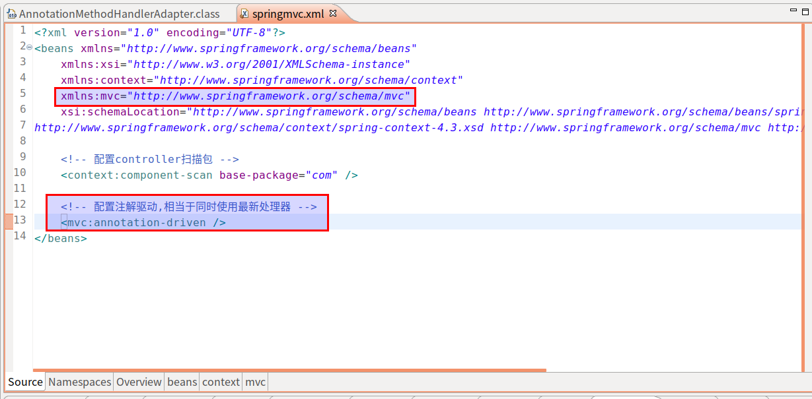

具体代码
```xml
<?xml version="1.0" encoding="UTF-8"?>
<beans xmlns="http://www.springframework.org/schema/beans"
	xmlns:xsi="http://www.w3.org/2001/XMLSchema-instance"
	xmlns:context="http://www.springframework.org/schema/context"
	xmlns:mvc="http://www.springframework.org/schema/mvc"
	xsi:schemaLocation="http://www.springframework.org/schema/beans http://www.springframework.org/schema/beans/spring-beans.xsd http://www.springframework.org/schema/context 
http://www.springframework.org/schema/context/spring-context-4.3.xsd http://www.springframework.org/schema/mvc http://www.springframework.org/schema/mvc/spring-mvc-4.3.xsd">

	<!-- 配置controller扫描包 -->
	<context:component-scan base-package="com" />

	<!-- 配置注解驱动,相当于同时使用最新处理器 -->
	<mvc:annotation-driven />
</beans>
```

##  配置视图解析器
1.  作用

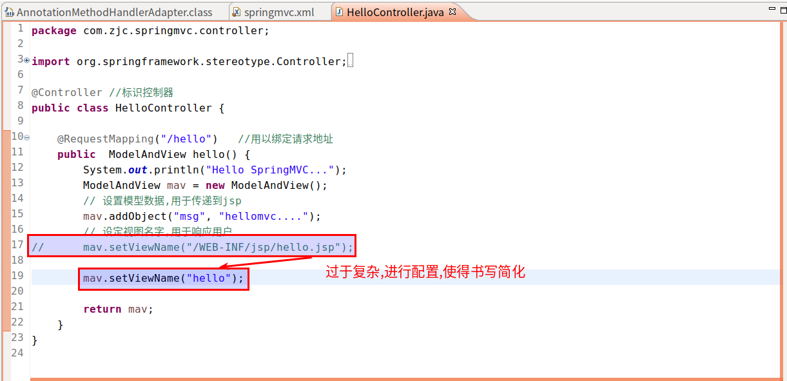

2.  要实现上述效果,需要如下配置视图解析器

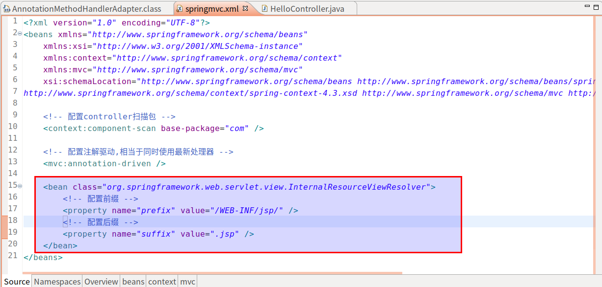

3.  具体代码
```xml
	<bean class="org.springframework.web.servlet.view.InternalResourceViewResolver">
		<!-- 配置前缀 -->
		<property name="prefix" value="/WEB-INF/jsp/" />
		<!-- 配置后缀 -->
		<property name="suffix" value=".jsp" />
	</bean>
```

#  核心类与接口
[参考:https://www.iteye.com/blog/elf8848-875830](https://www.iteye.com/blog/elf8848-875830)

先来了解一下，几个重要的接口与类。现在不知道他们是干什么的没关系，先混个脸熟，为以后认识他们打个基础。

### DispatcherServlet   -- 前置控制器

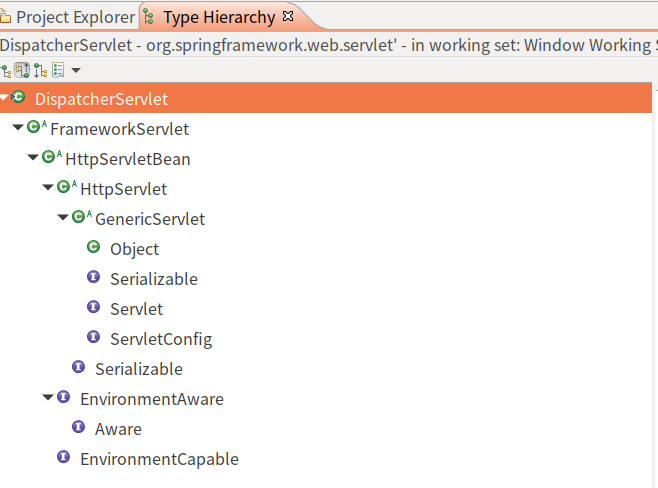


### HandlerMapping接口 -- 处理请求的映射
+   HandlerMapping接口的实现类
    -   SimpleUrlHandlerMapping  通过配置文件，把一个URL映射到Controller
    -   DefaultAnnotationHandlerMapping  通过注解，把一个URL映射到Controller类上


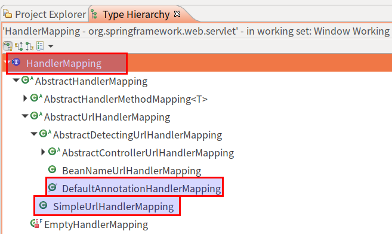


### HandlerAdapter接口 -- 处理请求的映射
+   AnnotationMethodHandlerAdapter类，通过注解，把一个URL映射到Controller类的方法上


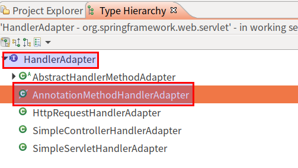


### Controller接口 -- 控制器
由于我们使用了@Controller注解，添加了@Controller注解注解的类就可以担任控制器（Action）的职责,
所以我们并没有用到这个接口。

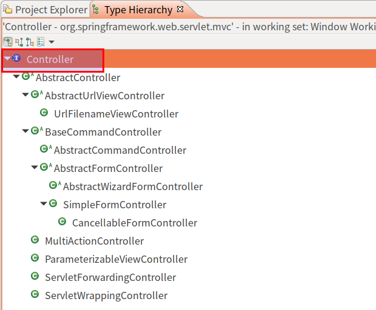


### HandlerInterceptor 接口--拦截器
无图，我们自己实现这个接口，来完成拦截的器的工作


### ViewResolver接口的实现类
+   UrlBasedViewResolver类 通过配置文件，把一个视图名交给到一个View来处理
+   InternalResourceViewResolver类，比上面的类，加入了JSTL的支持


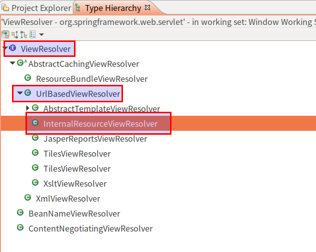


### View接口
+   JstlView类


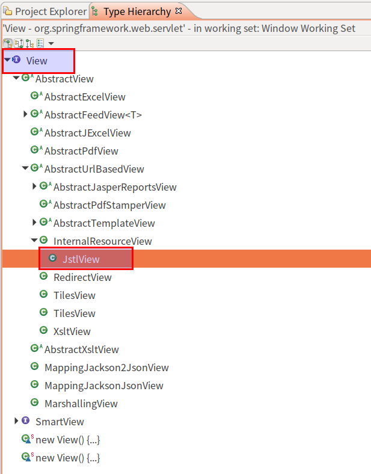


### LocaleResolver接口

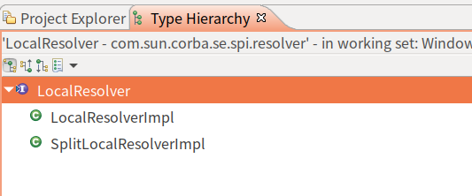

+   HandlerExceptionResolver接口 --异常处理
    -   SimpleMappingExceptionResolver实现类


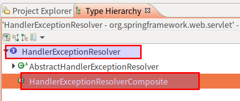


### ModelAndView类
无图

