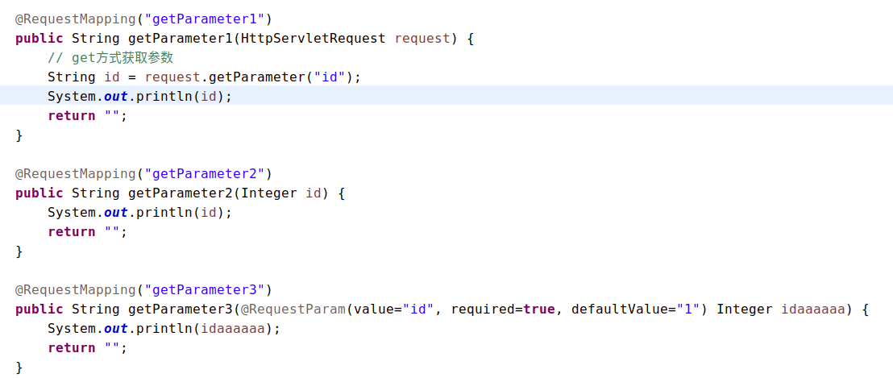

#   SpringMVC的简单的参数绑定
+ date: 2017-10-07 21:18:53
+ description: SpringMVC的简单的参数绑定
+ categories:
  - Java
+ tags:
  - Spring
- SpringMVC
---
#   参数绑定的三种方式
这是截图,具体代码在底下


##  方式一:使用`HttpServletRequest`
使用`HttpServletRequest`获取参数
```java
	@RequestMapping("getParameter1")
	public String getParameter1(HttpServletRequest request) {
		// get方式获取参数
		String id = request.getParameter("id");
		System.out.println(id);
		return "";
	}
```

##  方式二:保持变量名一致
浏览器中使用如下url进行访问,浏览器中的参数名要和方法中的参数保持一致
http://localhost:8080/springhello/hello.action?id=1

代码如下
```java
	@RequestMapping("getParameter2")
	public String getParameter2(Integer id) {
		System.out.println(id);
		return "";
	}
```
支持的数据类型为__包装类数据类型__

##  方式三:使用`@RequestParam`
浏览器中使用如下url进行访问
http://localhost:8080/springhello/hello.action?id=1

代码如下
```java
	@RequestMapping("getParameter3")
	public String getParameter3(@RequestParam(value="id", required=true, defaultValue="1") Integer idaaaaaa) {
		System.out.println(idaaaaaa);
		return "";
	}
```
其中@RequestParam的参数
+   value="id",这里要和url中的id保持一致
+   required=true,该参数必须要有(如果没有默认值会报错)
+   defaultValue="1",当请求中没有传入id的时候,id的默认值为1
