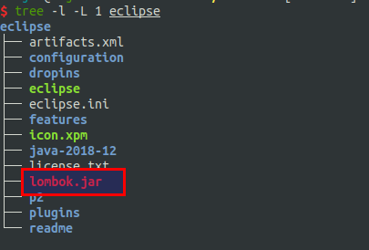

#   Lombok简化你的代码
+ date: 2017-10-22 16:38:00
+ description: Lombok简化你的代码
+ categories:
  - Java
+ tags:
  - Lombok
---
#   原文地址
[使用Lombok简化你的代码:http://kriszhang.com/lombok/](http://kriszhang.com/lombok/)

#   什么是Lokmob
+   Lombok意味龙目岛，该岛是巴厘岛的一座附属岛屿，风景优美
+   本文要介绍的Lombok，是java的一个强大工具，能极大的减少代码量，并使代码更加整洁清晰。
总结 -> 减少java代码量的工具

#   添加Lombok支持
##  eclipse添加Lombok支持
1.  下载Lombok的jar包,放在eclipse的根目录下





2.  安装
在根目录下使用


弹出如下页面,进行安装


3.  安装完毕可以在eclipse.ini文件看到新增了如下内容


##  IDEA添加Lombok支持
原文里面有


#   项目添加maven依赖
```xml
<dependency>
    <groupId>org.projectlombok</groupId>
    <artifactId>lombok</artifactId>
    <version>1.14.4</version>
</dependency>
```

#   基本用法
##  生成Getter/Setter方法
考虑实体对象Community，有四个属性，一般情况下我们会使用idea生成工具，生成Getter和Setter方法。如下代码：
```java
public class Community {
    private String communityId;
    private String name;
    private String title;
    private int type;
    /**
     * Getter method for property communityId.
     *
     * @return property value of communityId
     */
    public String getCommunityId() {
        return communityId;
    }
    /**
     * Setter method for property communityId.
     *
     * @param communityId value to be assigned to property communityId
     */
    public void setCommunityId(String communityId) {
        this.communityId = communityId;
    }
    /**
     * Getter method for property name.
     *
     * @return property value of name
     */
    public String getName() {
        return name;
    }
    /**
     * Setter method for property name.
     *
     * @param name value to be assigned to property name
     */
    public void setName(String name) {
        this.name = name;
    }
    /**
     * Getter method for property title.
     *
     * @return property value of title
     */
    public String getTitle() {
        return title;
    }
    /**
     * Setter method for property title.
     *
     * @param title value to be assigned to property title
     */
    public void setTitle(String title) {
        this.title = title;
    }
    /**
     * Getter method for property type.
     *
     * @return property value of type
     */
    public int getType() {
        return type;
    }
    /**
     * Setter method for property type.
     *
     * @param type value to be assigned to property type
     */
    public void setType(int type) {
        this.type = type;
    }
}
```
采用lombok则可以直接：
```java
public class Community {
    @Getter @Setter
    private String communityId;
    @Getter @Setter
    private String name;
    @Getter @Setter
    private String title;
    @Getter @Setter
    private int type;
}
```

@Getter和@Setter都可以单独定义函数的访问等级：
```java
public class Community {
    @Getter (AccessLevel.PUBLIC)
    @Setter(AccessLevel.PRIVATE)
    private String communityId;
    @Getter(AccessLevel.PUBLIC)
    @Setter(AccessLevel.PUBLIC)
    private String name;
    @Getter(AccessLevel.PUBLIC)
    @Setter(AccessLevel.PUBLIC)
    private String title;
    @Getter(AccessLevel.PUBLIC)
    @Setter(AccessLevel.PUBLIC)
    private int type;
}
```

如果都是public，则代码可以更加简洁：
```java
@Getter @Setter
class Community {
    private String communityId;
    private String name;
    private String title;
    private int type;
}
```

##	生成构造方法
如果我们要给Community实体类生成构造方法，那么可以如下代码示例：
```java
public class Community {
    private String communityId;
    private String name;
    private String title;
    private int type;
    public Community(String communityId, String name, String title, int type) {
        this.communityId = communityId;
        this.name = name;
        this.title = title;
        this.type = type;
    }
    public Community() {
    }
    public Community(String communityId, String name) {
        this.communityId = communityId;
        this.name = name;
    }
}
```

可以看到很麻烦，也很混乱，如果使用lombok则变得清晰简洁：
```java
@AllArgsConstructor
@NoArgsConstructor
@RequiredArgsConstructor(staticName="of")
class Community {
    private String communityId;
    @NonNull private String name;
    @NonNull private String title;
    private int type;
}
```
其中
1.  @AllArgsConstructor用来指定全参数构造器
2.  @NoArgsConstructor用来指定无参数构造器
3.  @RequiredArgsConstructor用来指定参数（采用静态方法of访问）


##   生成equals、hashcode、toString
我们在来看，如果需要生成equals、hashcode、toString呢？按照平常的做法：
```java
public class Community {
    private String communityId;
    private String name;
    private String title;
    private int type;
    @Override
    public boolean equals(Object o) {
        if (this == o) { return true; }
        if (o == null || getClass() != o.getClass()) { return false; }
        Community community = (Community)o;
        if (type != community.type) { return false; }
        if (communityId != null ? !communityId.equals(community.communityId) : community.communityId != null) {
            return false;
        }
        if (name != null ? !name.equals(community.name) : community.name != null) { return false; }
        return title != null ? title.equals(community.title) : community.title == null;
    }
    @Override
    public int hashCode() {
        int result = communityId != null ? communityId.hashCode() : 0;
        result = 31 * result + (name != null ? name.hashCode() : 0);
        result = 31 * result + (title != null ? title.hashCode() : 0);
        result = 31 * result + type;
        return result;
    }
    @Override
    public String toString() {
        return "Community{" +
            "communityId='" + communityId + '\'' +
            ", name='" + name + '\'' +
            ", title='" + title + '\'' +
            ", type=" + type +
            '}';
    }
}
```
可以看到，代码相当的恼人，如果使用lombok：
```java
@ToString
@EqualsAndHashCode
class Community {
    private String communityId;
    private String name;
    private String title;
    private int type;
}
```
如果我们只需要是否name作为equals和hashcode的运算字段，并且不想将title toString出来：
```java
@ToString(exclude = {"title"})
@EqualsAndHashCode(of = {"name"})
class Community {
    private String communityId;
    private String name;
    private String title;
    private int type;
}
```
结合上面所有的实例，我们可以使用如下代码就能完成平常需要上百行代码才能完成的事情：
```java
@AllArgsConstructor
@NoArgsConstructor
@RequiredArgsConstructor(staticName="of")
@Getter @Setter
@ToString(exclude = {"title"})
@EqualsAndHashCode(of = {"name"})
public class Community {
    private String communityId;
    @NonNull private String name;
    @NonNull private String title;
    private int type;
}
```

##  @Data一个等于所有
我们可以看到，上节中类上面打了好多注解，还是显得有些乱。
如果我们没有要求那么多定制化需求，则可以直接使用@Data注解，他包含了：@Getter @Setter @ToString @EqualsAndHashCode RequiredArgsConstructor注解，因此可以简化为：

```java
@NoArgsConstructor
@AllArgsConstructor
@Data(staticConstructor="of")
public class Community {
    private String communityId;
    @NonNull private String name;
    @NonNull private String title;
    private int type;
}
```

##  Builder模式
有的时候，我们喜欢采用Builder模式去构造一个对象，比如如下代码：
```java
class Community {
    private String communityId;
    private String name;
    private String title;
    private int type;
    @java.beans.ConstructorProperties({"communityId", "name", "title", "type"})
    Community(String communityId, String name, String title, int type) {
        this.communityId = communityId;
        this.name = name;
        this.title = title;
        this.type = type;
    }
    public static CommunityBuilder builder() {return new CommunityBuilder();}
    public static class CommunityBuilder {
        private String communityId;
        private String name;
        private String title;
        private int type;
        CommunityBuilder() {}
        public Community.CommunityBuilder communityId(String communityId) {
            this.communityId = communityId;
            return this;
        }
        public Community.CommunityBuilder name(String name) {
            this.name = name;
            return this;
        }
        public Community.CommunityBuilder title(String title) {
            this.title = title;
            return this;
        }
        public Community.CommunityBuilder type(int type) {
            this.type = type;
            return this;
        }
        public Community build() {
            return new Community(communityId, name, title, type);
        }
        public String toString() {
            return "com.qunar.kris.share.misc.lombok.Community.CommunityBuilder(communityId=" + this.communityId
                + ", name="
                + this.name + ", title=" + this.title + ", type=" + this.type + ")";
        }
    }
}
```
然后我们可以这么使用：
```java
public static void main(String[] args) {
       Community community = Community.builder()
           .communityId("zzz")
           .name("xxx")
           .title("yyy")
           .type(1).build();
}
```
上述创建builder的方式是在是太麻烦了，这只是4个参数，如果更多的参数，可想而知代码量啊！使用Lombok则很简单：
```java
@Builder
class Community {
    private String communityId;
    private String name;
    private String title;
    private int type;
}
```
以上均是在日常项目中非常常用的特性，我们再来看一些使用频率较低的特性

#	其他特性
##	异常处理
捕获全局异常，我们经常使用如下代码：
```java
public void doMethod() {
    try {
        invokeMethodMayThrowExeption();
    } catch(Exception e) {
        if (e instanceof MyException) {
            throw e;
        } else {
            //swallow it
        }
    }
}
```
使用lombok可以简化为：
```java
@SneakyThrows(MyException.class)
public void doMethod() {
    invokeMethodMayThrowExeption();
}
```

##	logger
如果我们要打日志，经常创建如下日志静态对象：
```java
public class Community {
    private static final Logger logger = LoggerFactory.getLogger("MY-LOGGER");
}
```
我们采用lombok简化一下：
```java
@Slf4j(topic = "MY-LOGGER")
public class Community {

}
```
没有用slf4j?没有关系，除了slf4j还支持如下Logger:
+	@XSlf4j
+	@Log4j
+	@Log4j2
+	@Log
+	@CommonsLog

##	空指针异常的快速失败
```java
public void doMethod(@NonNull String name, @NonNull String title) {

}
```
以上代码，当name或者title为空的时候，则会直接抛出NPE，快速失败。

##	简化烦人的类型
有的时候，我们可能会有非常长的泛型，很恼人：
```java
Map<String, Map<String, List<Community>>> map = new HashMap<String, Map<String, List<Community>>();
       for (Entry<String, Map<String, List<Community>>> entry : map.entrySet()) {
           //.....
       }
```
采用lombok可以简化为：

```java
val map = Maps.<String, Map<String, List<Community>>>newHashMap();
for (val entry : map.entrySet()) {
    //.....
}
```
当然，在jdk8下，一般使用foreach进行遍历。

#	基本实现原理
lombok魔法并不神秘，他采用JSR269所提出的插入式注解处理(Pluggable Annotation Processing)，并结合动态代码生成技术所开发的。如下图所示：


上图展示了一个一般javac的编译过程，java文件首先通过进行解析构建出一个AST，然后执行注解处理，最后经过分析优化生成二进制的.class文件。

我们能做到的是，在注解处理阶段进行一些相应处理。首先我们在META-INF.services下创建如下文件：

文件中指定我们的注解处理器：com.alipay.kris.other.lombok.MyAnnotaionProcessor


然后我们接可以编写自己的注解处理器，一个简单的实例代码如下：
```java
@SupportedSourceVersion(SourceVersion.RELEASE_8)
@SupportedAnnotationTypes("com.alipay.kris.other.lombok.*")
public class MyAnnotaionProcessor extends AbstractProcessor {
    public MyAnnotaionProcessor() {
        super();
    }
    @Override
    public boolean process(Set<? extends TypeElement> annotations,RoundEnvironment roundEnv) {
        for (Element elem : roundEnv.getElementsAnnotatedWith(MyAnnotation.class)) {
            MyAnnotation annotation = elem.getAnnotation(MyAnnotation.class);
            String message = "annotation found in " + elem.getSimpleName()
                + " with  " + annotation.value();
            addToString(elem);
            processingEnv.getMessager().printMessage(Diagnostic.Kind.NOTE, message);
        }
        return true; // no further processing of this annotation type
    }
}
```
我们能做到的也就是这么多，但lombok在此基础之上，对AST进行修改，将Setter/Getter等上文提到过的方法’挂载’到AST中
