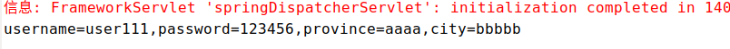

#   SpringMVC的pojo参数绑定
+ date: 2017-10-22 16:16:49
+ description: SpringMVC的pojo参数绑定
+ categories:
  - Java
+ tags:
  - Spring
- SpringMVC
---
#  基本代码
##  项目基础代码
[SpringMVC的快速入门](/2017/10/04/SpringMVC的快速入门/)

##  本文中的文件结构


##  页面
+   index.jsp
```html
<%@ page language="java" contentType="text/html; charset=UTF-8"
	pageEncoding="UTF-8"%>
<!DOCTYPE html>
<html>
<head>
	<meta charset="UTF-8">
	<title>spring MVC POJO</title>
</head>
<body>
	<form action="testPojo.action" method="post">
		username:<input name="username" /><br>
		password:<input	type="password" name="password" /><br>
		province:<input	name="address.province" /><br>
		city:<input name="address.city" /><br>
		<input type="submit" value="testPojoSubmit">
	</form>
</body>
</html>
```

+   success.jsp
```html
<%@ page language="java" contentType="text/html; charset=UTF-8"
	pageEncoding="UTF-8"%>
<!DOCTYPE html>
<html>
<head>
	<meta charset="UTF-8">
	<title>spring MVC POJO</title>
</head>
<body>
	<form action="testPojo.action" method="post">
		username:<input name="username" /><br>
		password:<input	type="password" name="password" /><br>
		province:<input	name="address.province" /><br>
		city:<input name="address.city" /><br>
		<input type="submit" value="testPojoSubmit">
	</form>
</body>
</html>
```
##  pojo
+   下方pojo代码使用了Lombok的注解语法
    -   可以看这里:[Lombok简化你的代码](/2017/10/23/Lombok简化你的代码/)
    -   添加依赖
```xml
<dependency>
    <groupId>org.projectlombok</groupId>
    <artifactId>lombok</artifactId>
    <version>1.14.4</version>
</dependency>
```

+	User.java
```java
package com.zjc.springmvc.pojo;

import lombok.Getter;
import lombok.Setter;

@Getter
@Setter
public class User {
	private String username;
	private String password;
	private Address address;
}

```

+ Address.java
```java
package com.zjc.springmvc.pojo;

import lombok.Getter;
import lombok.Setter;

@Getter
@Setter
public class Address {
	private String province;
	private String city;
}

```

##  控制器
```java

package com.zjc.springmvc.controller;

import org.springframework.stereotype.Controller;
import org.springframework.web.bind.annotation.RequestMapping;
import org.springframework.web.servlet.ModelAndView;

import com.zjc.springmvc.pojo.User;

@Controller
public class TestPojoController {
	private static final String SUCCESS = "success";

	@RequestMapping(value="/index")
	public ModelAndView testPojoIndex() {
		ModelAndView mav = new ModelAndView();
		mav.setViewName("index");
		return mav;
	}

	@RequestMapping(value="/testPojo")
	public String testPojo(User user) {
		System.out.println(
				"username=" + user.getUsername() +
				",password=" + user.getPassword() +
				",province=" + user.getAddress().getProvince() +
				",city=" + user.getAddress().getCity()
		);

		return SUCCESS;
	}
}
```


#   解决post乱码问题
在web.xml中加入:
```xml
	<filter>
		<filter-name>characterEncodingFilter</filter-name>
		<filter-class>org.springframework.web.filter.CharacterEncodingFilter</filter-class>
		<init-param>
			<param-name>encoding</param-name>
			<param-value>UTF-8</param-value>
		</init-param>
		<init-param>
			<param-name>forceEncoding</param-name>
			<param-value>true</param-value>
		</init-param>
	</filter>
	<filter-mapping>
    	<filter-name>characterEncodingFilter</filter-name>
    	<url-pattern>/*</url-pattern>
  	</filter-mapping>
```


#   跑项目
访问`http://localhost:8080/springhello/index.action`,可以看到如下页面,输入数据提交


在eclipse控制台中打出如下数据



