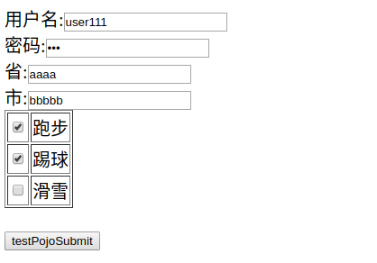
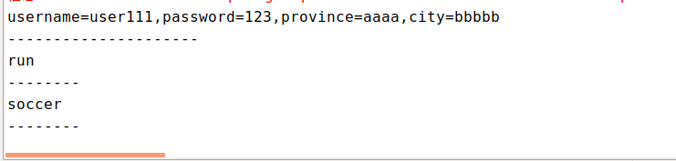
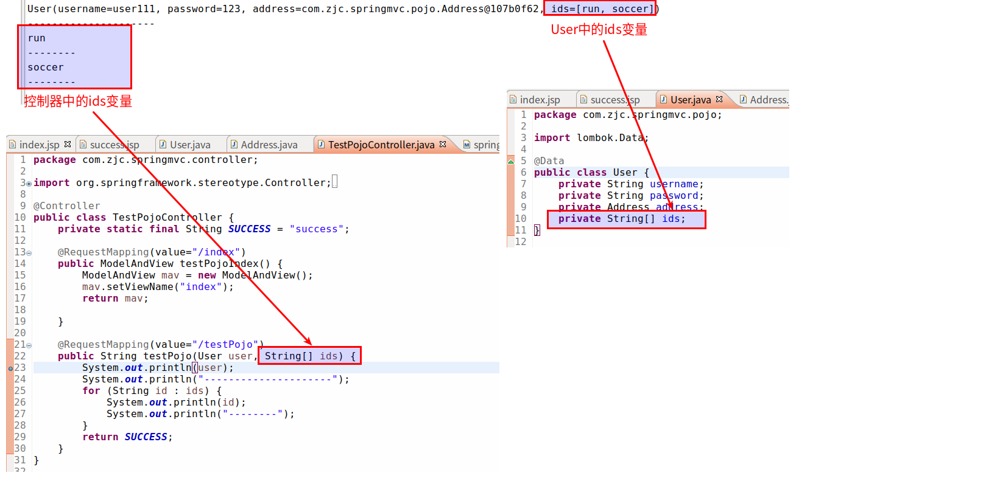

#   SpringMVC的数组参数绑定
+ date: 2017-10-23 23:15:27
+ description: SpringMVC的数组参数绑定
+ categories:
  - Java
+ tags:
  - Spring
- SpringMVC
---
#  基本代码
##  项目基础代码
[SpringMVC的pojo参数绑定/](/2017/10/23/SpringMVC的pojo参数绑定/)
底下代码基本相同

##  本文中的文件结构


##  页面
这个页面有改动,增加checkbox,用以传到服务器的变量的内容是一个参数
+   index.jsp
```html
<%@ page language="java" contentType="text/html; charset=UTF-8"
	pageEncoding="UTF-8"%>
<!DOCTYPE html>
<html>
<head>
<meta charset="UTF-8">
<title>spring MVC POJO</title>
</head>
<body>
	<form action="testPojo.action" method="post">
		用户名:<input name="username" /><br>
		密码:<input type="password" name="password" /><br>
		省:<input name="address.province" /><br>
		市:<input name="address.city" /><br>
		<table border="1">
			<tr>
				<td><input name="ids" type="checkbox" value="run" /></td>
				<td>跑步</td>
			</tr>
			<tr>
				<td><input name="ids" type="checkbox" value="soccer"/></td>
				<td>踢球</td>
			</tr>
			<tr>
				<td><input name="ids" type="checkbox" value="ski"/></td>
				<td>滑雪</td>
			</tr>
		</table>
		<br> <input type="submit" value="testPojoSubmit">
	</form>
</body>
</html>
```

+   success.jsp
```html
<%@ page language="java" contentType="text/html; charset=UTF-8"
	pageEncoding="UTF-8"%>
<!DOCTYPE html>
<html>
<head>
	<meta charset="UTF-8">
	<title>spring MVC POJO</title>
</head>
<body>
	<form action="testPojo.action" method="post">
		username:<input name="username" /><br>
		password:<input	type="password" name="password" /><br>
		province:<input	name="address.province" /><br>
		city:<input name="address.city" /><br>
		<input type="submit" value="testPojoSubmit">
	</form>
</body>
</html>
```
##  pojo
+   下方pojo代码使用了Lombok的注解语法
    -   可以看这里:[Lombok简化你的代码](/2017/10/23/Lombok简化你的代码/)
    -   添加依赖
```xml
<dependency>
    <groupId>org.projectlombok</groupId>
    <artifactId>lombok</artifactId>
    <version>1.14.4</version>
</dependency>
```

+	User.java
```java
package com.zjc.springmvc.pojo;

import lombok.Getter;
import lombok.Setter;

@Getter
@Setter
public class User {
	private String username;
	private String password;
	private Address address;
}

```

+ Address.java
```java
package com.zjc.springmvc.pojo;

import lombok.Getter;
import lombok.Setter;

@Getter
@Setter
public class Address {
	private String province;
	private String city;
}

```

##  控制器
这个代码有改动,新增了`String[] ids`用以接受页面传进来的数值
```java
package com.zjc.springmvc.controller;

import org.springframework.stereotype.Controller;
import org.springframework.web.bind.annotation.RequestMapping;
import org.springframework.web.servlet.ModelAndView;

import com.zjc.springmvc.pojo.User;

@Controller
public class TestPojoController {
	private static final String SUCCESS = "success";

	@RequestMapping(value="/index")
	public ModelAndView testPojoIndex() {
		ModelAndView mav = new ModelAndView();
		mav.setViewName("index");
		return mav;
	}

	@RequestMapping(value="/testPojo")
	public String testPojo(User user, String[] ids) {
		System.out.println(
				"username=" + user.getUsername() +
				",password=" + user.getPassword() +
				",province=" + user.getAddress().getProvince() +
				",city=" + user.getAddress().getCity()
		);
		System.out.println("---------------------");
		for (String id : ids) {
			System.out.println(id);
			System.out.println("--------");
		}
		return SUCCESS;
	}
}

```

##   跑项目
访问`http://localhost:8080/springhello/index.action`,可以看到如下页面,输入数据提交





在eclipse控制台中打出如下数据




#   问题:如果后台中有两个相同的变量用以接收前台传进来的变量,此时会怎样?
##  做一点改造
1.  在User.java中增加ids变量
```java
package com.zjc.springmvc.pojo;

import lombok.Data;

@Data
public class User {
	private String username;
	private String password;
	private Address address;
	private String[] ids;
}

```

2.	控制器中打印user变量和ids变量
```java
package com.zjc.springmvc.controller;

import org.springframework.stereotype.Controller;
import org.springframework.web.bind.annotation.RequestMapping;
import org.springframework.web.servlet.ModelAndView;

import com.zjc.springmvc.pojo.User;

@Controller
public class TestPojoController {
	private static final String SUCCESS = "success";

	@RequestMapping(value="/index")
	public ModelAndView testPojoIndex() {
		ModelAndView mav = new ModelAndView();
		mav.setViewName("index");
		return mav;
	}

	@RequestMapping(value="/testPojo")
	public String testPojo(User user, String[] ids) {
		System.out.println(user);
		System.out.println("---------------------");
		for (String id : ids) {
			System.out.println(id);
			System.out.println("--------");
		}
		return SUCCESS;
	}
}

```

##  跑项目
访问`http://localhost:8080/springhello/index.action`,输入数据提交
在eclipse控制台中打出如下数据




##  结论
只要名字相同,会将前台传进来的变量赋值给每个名字相同的变量
