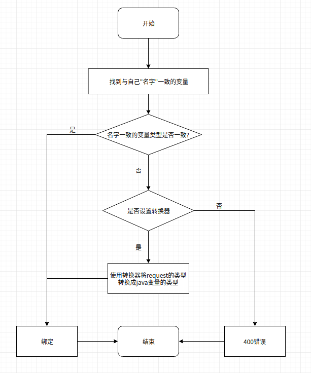
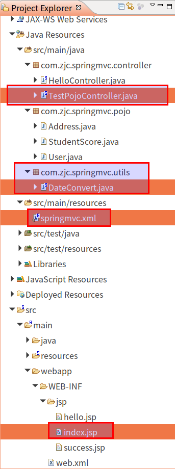

#   SpringMVC的自定义参数绑定
+ date: 2017-10-30 22:26:51
+ description: SpringMVC的自定义参数绑定
+ categories:
  - Java
+ tags:
  - Spring
- SpringMVC
---
#   为什么需要自动绑定
##  理解自动绑定
1.  springmvc能将request的参数自动绑定
2.  自动绑定 -> request参数与变量形成一一映射 -> 即:request的参数名与java的变量名要一致,同时参数名的类型和变量名的类型要一致

##  参数名和变量名不一致会发生什么?
400错误

##  参数名和变量名名称一致,但类型不一致时,spring如何处理
能够进行自定义参数绑定,可以按照如下进行理解
1.  request参数要自动绑定到变量,首先找到与自己"名字"一致的变量
2.  找到之后,判断是否类型一致
3.  一致 -> 绑定就行
4.  不一致 -> 看是否设定转换器
5.  未设置转换器 -> 400错误
6.  设置转换器 -> 使用转换器,将request参数的类型转换成java变量的类型后,进行绑定




#	代码
##	代码结构




##	页面
index.jsp
```html
<%@ page language="java" contentType="text/html; charset=UTF-8"
	pageEncoding="UTF-8"%>
<%@ taglib prefix="c" uri="http://java.sun.com/jsp/jstl/core" %>
<%@ taglib prefix="fmt" uri="http://java.sun.com/jsp/jstl/fmt" %>
<c:set var="now" value="<%=new java.util.Date()%>" />
<!DOCTYPE html>
<html>
<head>
<meta charset="UTF-8">
<title>spring MVC POJO</title>
</head>
<body>
	<form action="testPojo.action" method="post">
		时间:<input name="times" value="2019-10-31 09:32:13" />
		<br/> <input type="submit" value="testPojoSubmit" />
	</form>
</body>
</html>
```

##	控制器
```java
package com.zjc.springmvc.controller;

import java.util.Date;

import org.springframework.stereotype.Controller;
import org.springframework.web.bind.annotation.RequestMapping;
import org.springframework.web.servlet.ModelAndView;

import com.zjc.springmvc.pojo.User;

@Controller
public class TestPojoController {
	private static final String SUCCESS = "success";

	@RequestMapping(value="/index")
	public ModelAndView testPojoIndex() {
		ModelAndView mav = new ModelAndView();
		mav.setViewName("index");
		return mav;
	}

	@RequestMapping(value="/testPojo")
	public String testPojo(User user, String[] ids, Date times) {
		System.out.println(times);
		return SUCCESS;
	}
}

```

##	转换器
```java
package com.zjc.springmvc.utils;
import java.text.ParseException;
import java.text.SimpleDateFormat;
import java.util.Date;

// 要注意继承的是哪个接口
import org.springframework.core.convert.converter.Converter;

/**
 * 日期转换器
 * S:source要转换的源类型
 * T:target要转换成的数据
 * @author zjc
 *
 */
//public class DateConvert implements Converter<S, T> {
//}
public class DateConvert implements Converter<String, Date> {
	private SimpleDateFormat simpleDateFormat = new SimpleDateFormat("yyyy-MM-dd HH:mm:ss");

	public Date convert(String source) {
		try {
			return simpleDateFormat.parse(source);
		} catch (ParseException e) {
			e.printStackTrace();
		}
		return null;
	}

}

```

##	让spring识别转换器(配置springmvc.xml)
```xml
<?xml version="1.0" encoding="UTF-8"?>
<beans xmlns="http://www.springframework.org/schema/beans"
	xmlns:xsi="http://www.w3.org/2001/XMLSchema-instance"
	xmlns:context="http://www.springframework.org/schema/context"
	xmlns:mvc="http://www.springframework.org/schema/mvc"
	xsi:schemaLocation="http://www.springframework.org/schema/beans http://www.springframework.org/schema/beans/spring-beans.xsd http://www.springframework.org/schema/context 
http://www.springframework.org/schema/context/spring-context-4.3.xsd http://www.springframework.org/schema/mvc http://www.springframework.org/schema/mvc/spring-mvc-4.3.xsd">

	<!-- 配置controller扫描包 -->
	<context:component-scan base-package="com" />

	<!-- 配置注解驱动,相当于同时使用最新处理器 -->
	<bean class="org.springframework.web.servlet.view.InternalResourceViewResolver">
		<!-- 配置前缀 -->
		<property name="prefix" value="/WEB-INF/jsp/" />
		<!-- 配置后缀 -->
		<property name="suffix" value=".jsp" />
	</bean>

	<!-- 自定义转化器 -->
	<!-- 
		使用 mvc:annotation-driven 代替上边注解映射器和注解适配器配置
	    mvc:annotation-driven 默认加载很多的参数绑定方法，
	    比如json转换解析器就默认加载了，如果使用 mvc:annotation-driven不用配置上边的RequestMappingHandlerMapping和RequestMappingHandlerAdapter
	    实际开发时使用 mvc:annotation-driven
	-->
	<mvc:annotation-driven conversion-service="myConversionService" />
	<!-- 自定义参数绑定 -->
	<bean id="myConversionService" class="org.springframework.format.support.FormattingConversionServiceFactoryBean">
		<!-- 转换器 -->
		<property name="converters">
			<set>
				<!-- 日期类型转换 -->
				 <bean class="com.zjc.springmvc.utils.DateConvert"></bean>
			</set>
		</property>
    </bean>
</beans>
```
