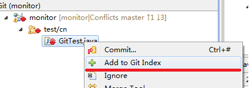

#   eclipse中解决git冲突
+ date: 2017-12-23 22:13:42
+ description: eclipse中git解决冲突
+ categories:
  - Java
+ tags:
  - Eclipse
---
#   0、来源
[eclipse 中git解决冲突](https://blog.csdn.net/rosten/article/details/17068285)
#   1、工程->Team->同步：

#   2、从远程pull至本地，就会出现如下内容：

#   3、使用Merge Tool，执行第二项

使用HEAD合并后的效果：

#   4、再手动修改

#   5、修改后的文件需要添加到git index中去：

#   6、冲突文件变为修改图标样式，再提交至本地，此时的提交便是merge合并：

#   7、此时需要pull的向下箭头和数量没了，注意图标的变化：

#   8、现在可以直接push到远程了：

此时`configure -> save and push`一步步执行冲突就搞定了。
