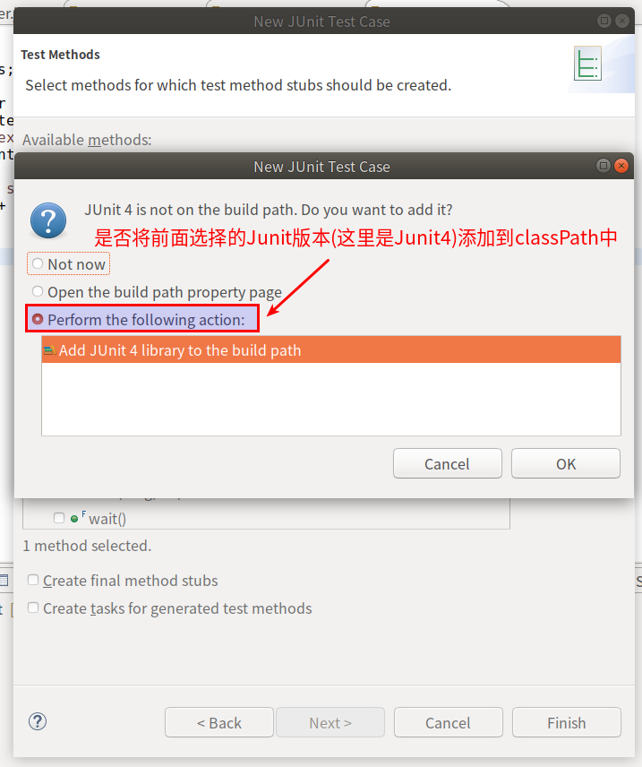
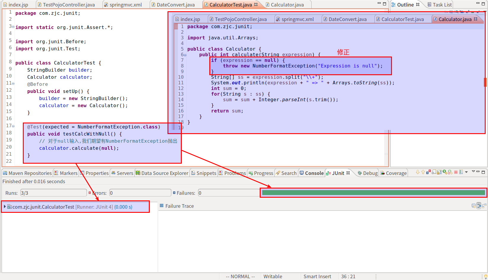

#   参考
+   [https://www.liaoxuefeng.com/wiki/1252599548343744/1255945269146912](https://www.liaoxuefeng.com/wiki/1252599548343744/1255945269146912)
+   [https://blog.csdn.net/Dream\_Weave/article/details/83860190](https://blog.csdn.net/Dream_Weave/article/details/83860190)
+   [https://juejin.im/post/5c6ac82ee51d451b240a878a#heading-8](https://juejin.im/post/5c6ac82ee51d451b240a878a#heading-8)
+   [https://blog.csdn.net/10km/article/details/50282179](https://blog.csdn.net/10km/article/details/50282179)

#   测试的分类
+   黑盒测试
+   白盒测试
+   压力测试
+   覆盖率测试
+   性能测试

#   单元测试
##   什么是单元测试
1.  单元测试就是针对最小的功能单元编写测试代码
2.  而java程序的最小测试单元就是"方法"
3.  单元测试就是针对单个java方法的测试

##   单元测试与测试驱动开发(TDD)
基本流程如下


##   使用main方法测试的缺点
+   只能有一个main()方法,不能把测试代码分离
+   没有打印出测试结果和期望结果
=>  需要一种测试框架,帮我们编写测试

##   单元测试的好处
+   确保单个方法运行正常
+   如果修改了方法代码,只需确保其对应的单元测试通过
+   测试代码本身就可以作为示例代码
+   可以自动化运行所有测试并获得报告,报告不仅可以报告成功的测试和失败的测试,还能报告单元测试的覆盖率(即:有多少代码被测试了)

#   Junit介绍
##   Junit是一个开源的Java语言的单元测试框架
+   专门针对Java语言设计,使用最广泛
+   Junit是事实上的标准单元测试框架

##   Junit特点
+   使用断言(Assertion)测试期望结果
+   可以方便地组织和运行测试
+   可以方便地查看测试结果
+   常用IDE都继承了Junit
+   可以方便地集成到Maven

##   Juint的设计
+   TestCase:一个TestCase表示一个测试
+   TestSuite:一个TestSuite包含一组TestCase,表示一组测试
+   TestFixture:一个TestFixture表示一个测试环境
+   TestResult:用于收集测试结果
+   TestRunner:用于运行测试
+   TestListener:用于监听测试结果,收集测试数据
+   Assert:用于断言测试结果是否正确

##  Juint版本说明
|版本|Junit3.x|Junit4|Junit5|
|----|----|----|----|
|JDK|JDK < 1.5|JDK >= 1.5|JDK >= 1.8|
|class|class MyTest extends TestCase{}|class MyTest{}| class MyTest{}|
|method|public testAbc(){}|@Test public abc(){}|@Test public abc() {}|

#  使用
##  使用eclipse如何创建测试类
使用eclipse创建测试类
在需要创建Junit的类上 -> 右键 -> new -> Other -> 找到Junit Test Case




在刚才选择的source folder下创建了测试类


##  入门案例
代码结构如上

被测试代码

```java
package com.zjc.junit;

import java.util.Arrays;

public class Calculator {
	public int calculate(String expression) {
		String[] ss = expression.split("\\+");
		System.out.println(expression + " => " + Arrays.toString(ss));
		int sum = 0;
		for(String s : ss) {
			sum = sum + Integer.parseInt(s);
		}
		return sum;
	}
}

```

测试代码
```java
package com.zjc.junit;

import static org.junit.Assert.*;

import org.junit.Test;

public class CalculatorTest {

	@Test
	public void testCalculate() {
		assertEquals(3, new Calculator().calculate("1+2"));
		assertEquals(6, new Calculator().calculate("1+2+3"));
	}

	/**
	 * 测试用户输入不规范时,是否能通过测试
	 */
	@Test
	public void testCalculateWithSpace() {
		assertEquals(3, new Calculator().calculate(" 1 + 2"));  // 这里输入不规范,被测试代码会报错
	}
}
```

对测试结果进行处理


###   小结
+   一个TestCase包含一组相关的测试方法
+   使用Assert断言测试结果(注意浮点数assertEquals要指定delta)
+   每个测试方法必须完全独立,也就是说不能预测测试方法的运行顺序
+   测试代码必须非常简单
+   不能为测试代码再编写测试
+   测试需要覆盖各种输入条件,特别是边界条件

##  使用Asser断言
`import static org.junit.Assert.*`
+   断言相等:assertEquals(100, x)
+   断言数组相等:assertArrayEquals({1, 2, 3}, x)
+   浮点数断言相等:assertEquals(3.1416, x, 0.0001)  // 其中0.0001是误差值
+   断言为null:assertNull(x)
+   断言为true/false:assertTrue(x > 0)  assertFalse(x < 0)
+   其他:assertNotEquals/assertNotNull

##  Junit Fixture(Before和After)
初始化测试资源称为Fixture
+   @Before:初始化测试对象,例如:input = new FileInputStream();
+   @After:销毁@Before创建的测试对象,例如:input.close();
+   @BeforeClass:初始化非常耗时的资源,例如数据库
+   @AfterClass:清理@BeforeClass创建的资源,例如:删除数据库

###  使用@Before和@After
+   在@Before方法中初始化测试资源(**Before方法初始化的对象要全部放在实例字段中**,底下有示例代码)
+   在@After方法中释放测试资源

**使用@Before和@After可以保证**
+   单个@Test方法执行前会创建新的XxxTest实例,实例变量的状态`不会`传递给下一个@Test方法
+   单个@Test方法执行前后会执行@Before和@After方法


```java
package com.zjc.junit;

import static org.junit.Assert.*;

import org.junit.Before;
import org.junit.Test;

public class CalculatorTest {
	StringBuilder builder;  // Before方法初始化的对象要全部放在实例字段中
	Calculator calculator;  // Before方法初始化的对象要全部放在实例字段中
	@Before
	public void setUp() {
		builder = new StringBuilder();
		calculator = new Calculator();
	}

	@Test
	public void testCalculate() {
//		assertEquals(3, new Calculator().calculate("1+2"));
//		assertEquals(6, new Calculator().calculate("1+2+3"));
		assertEquals(6, calculator.calculate("1+2+3"));
	}

	/**
	 * 测试用户输入不规范时,是否能通过测试
	 */
	@Test
	public void testCalculateWithSpace() {
//		assertEquals(3, new Calculator().calculate(" 1 + 2"));	// 这里输入不规范,被测试代码会报错
		assertEquals(3, calculator.calculate(" 1 + 2"));	// 这里输入不规范,被测试代码会报错
	}
}
```

###  使用@BeforeClass和@AfterClass
+   @BeforeClass静态方法初始化的对象只能存放在静态字段中
+   静态字段的状态`会`影响到所有的@Test

```java
package com.zjc.junit;

import static org.junit.Assert.*;

import org.junit.Before;
import org.junit.Test;

public class CalculatorTest {
	static StringBuilder builder;
	@BeforeClass
	public void setUp() {
		builder = new StringBuilder();
	}
	......
}

```

###  小结
####  Junit执行逻辑
```java
invokeBeforeClass(CalculatorTest.class);    //@Before
for (Method testMethod : findTestMethods(CalculatorTest.class)) {
    CalculatorTest test = new CalculatorTest(); // 创建Test实例
    test.setUp();   //@Before
    testMethod.invoke(test);    //@Test
    test.setDown(); //@After
}
invokeAfterClass(CalculatorTest.class); //@AfterClass
```

#### Junit执行测试的生命周期
+   @Before用于初始化测试对象,测试对象以实例变量存放
+   @After用于清理@Before对象创建的对象
+   @BeforeClass用于初始化耗时资源,以静态变量存放
+   @AfterClass用于清理@BeforeClass创建的资源


##  异常测试(使用@Test(expected = 异常))
对可能抛出的异常进行测试
+   异常本身是方法签名的一部分
`public static int parseInt(String s) throws NumberFormatException`
+   测试错误的输入是否导致特定的异常
```
Integer.parseInt(null)
Integer.parseInt("")
Integer.parseInt("xyz")
```

### 如何测试异常
1.  很常规,但是写出来会被鄙视的代码
```Java
@Test
public void testNumberFormatException() {
    try {
        Integer.parseInt(null);
        fail("Should throw exception");     // 没有捕获到异常,就用Junit提供的fail()函数表示测试失败
    } catch (NumberFormatException e) {
        // do somethint...
    }
}
```
这样需要写很多try...catch...代码
2.  使用expected测试异常
```Java
@Test(expected = NumberFormatException.class)
public void testNumberFormatException() {
    Integer.parseInt(null);
}
```
如果抛出了指定类型的异常,测试通过;如果没有抛出异常,或者抛出的异常类型不对,测试失败.

测试不通过例子


对代码进行修改


### 小结
+   测试异常可以使用@Test(expected = Exception.class)
+   对可能发生的每种类型的异常进行测试

##  超时测试
Junit可以为单个测试设置超时
+   超时设置为1秒:@Test(timeout=1000) 单位是毫秒
+   当代码运行时间超过我们设定的时间,报错
+   超时测试不能取代性能测试和压力测试

##  参数化测试
+   对于同一个函数,不能只测试一个输入输出就完事,要测试一组数据
+   使用`@ParameterizedTest`注解

### 只有一个参数(使用@ValueSource注解)
假设对函数Math.abs()进行测试
```Java
@ParameterizedTest
@ValueSource(ints = { 0, 1, 5, 100 })
void testAbs(int x) {
    assertEquals(x, Math.abs(x));
}
```
+   注意这里`没有@Test`,使用的是`@ParameterizedTest`注释
+   输入只有一个参数的时候使用`@ValueSource`注释

### 有多个参数
+   被测试函数
```Java
public class StringUtils {
    public static String capitalize(String s) {
        if (s.length() == 0) {
            return s;
        }
        return Character.toUpperCase(s.charAt(0)) + s.substring(1).toLowerCase();
    }
}
```
该被测的函数会把字符串的第一个字母变为大写，后续字母变为小写

####    方法一:使用@MethodSource注解
通过`@MethodSource注解`，它允许我们编写一个同名的静态方法来提供测试参数
```Java
//  使用的注解
@ParameterizedTest
@MethodSource
void testCapitalize(String input, String result) {
    assertEquals(result, StringUtils.capitalize(input));
}

//  同名的静态方法来提供测试参数
static List<Arguments> testCapitalize() {
    return List.of( // arguments:
            Arguments.arguments("abc", "Abc"), //
            Arguments.arguments("APPLE", "Apple"), //
            Arguments.arguments("gooD", "Good"));
}
```

####    方法二:使用@CsvSource注解
```Java
@ParameterizedTest
@CsvSource({ "abc, Abc", "APPLE, Apple", "gooD, Good" })
void testCapitalize(String input, String result) {
    assertEquals(result, StringUtils.capitalize(input));
}
```
写在代码中只能是少量数据,如果数据较多,可以放在csv文件中(其实从@CsvSource这个注解中略知一二),代码如下写法
```Java
@ParameterizedTest
@CsvFileSource(resources = { "/test-capitalize.csv" })
void testCapitalizeUsingCsvFile(String input, String result) {
    assertEquals(result, StringUtils.capitalize(input));
}
```

##  套件测试(使用@RunWith和@Suite)
+   测试套件意味着捆绑几个单元测试用例并且一起执行他们。在 JUnit 中，`@RunWith`和`@Suite`注释用来运行套件测试

**被测试函数**
+	Arithmetic.java
```Java
package in.co.javatutorials;

/**
 * @author javatutorials.co.in
 */
public class Arithmetic {
    public int add(int i, int j) {
        return i + j;
    }
}
```
+	Geometric.java
```Java
package in.co.javatutorials;
/**
 * @author javatutorials.co.in
 */
public class Geometry {
    public int squareArea(int length) {
        return length * length;
    }
}
```

**测试代码**
+	ArithmeticTest.java
```Java
package in.co.javatutorials;

import static org.junit.Assert.*;
import org.junit.Test;

/**
 * @author javatutorials.co.in
 */
public class ArithmeticTest {
    @Test
    public void testAdd() {
        Arithmetic arithmetic = new Arithmetic();
        int actualResult = arithmetic.add(1 , 2);
        int expectedResult = 3;
        assertEquals(expectedResult, actualResult);
    }
}
```
+	GeometricTest.java
```Java
package in.co.javatutorials;

import static org.junit.Assert.*;
import org.junit.Test;

/**
 * @author javatutorials.co.in
 */
public class GeometryTest {

    @Test
    public void testSquareArea() {
        Geometry geometry = new Geometry();
        int actualResult = geometry.squareArea(2);
        int expectedResult = 4;
        assertEquals(expectedResult, actualResult);
    }
}
```

让上面两个被测试代码一起执行
```Java
package in.co.javatutorials;

import org.junit.runner.RunWith;
import org.junit.runners.Suite;
import org.junit.runners.Suite.SuiteClasses;

/**
 * @author javatutorials.co.in
 */
@RunWith(Suite.class)
@SuiteClasses({ ArithmeticTest.class, GeometryTest.class })
public class AllTests {

}
```

##  忽略测试(使用@ignore注解)
在需要忽略或者禁止junit 测试类中的任意测试方法上，`使用@ignore`注解


##  控制执行顺序(@FixMethodOrder)
+   原则上不要控制执行顺序
+   使用@FixMethodOrder注解来控制测试方法的执行顺序
+	@FixMethodOrder注解的参数是org.junit.runners.MethodSorters对象,在枚举类org.junit.runners.MethodSorters中定义了如下三种顺序类型

三种顺序类型
+   MethodSorters.JVM
Leaves the test methods in the order returned by the JVM. Note that the order from the JVM may vary from run to run (按照JVM得到的方法顺序，也就是代码中定义的方法顺序)

+   MethodSorters.DEFAULT(默认的顺序)
Sorts the test methods in a deterministic, but not predictable, order() (以确定但不可预期的顺序执行)

+   MethodSorters.NAME\_ASCENDING
Sorts the test methods by the method name, in lexicographic order, with Method.toString() used as a tiebreaker (按方法名字母顺序执行)

示例代码
```Java
package test;

import org.junit.Assert;
import org.junit.FixMethodOrder;
import org.junit.runners.MethodSorters;
import org.junit.Test;
import org.slf4j.Logger;
import org.slf4j.LoggerFactory;
@FixMethodOrder(MethodSorters.JVM)//指定测试方法按定义的顺序执行
public class TestJNI {
	private static final Logger logger = LoggerFactory.getLogger(TestJNI.class);
	@Test
	public void testAddAndGet(){
		logger.info("test 'addBean' and 'getBean' ");
	}

	@Test
	public final void testSearch() {
		logger.info("test search CODE from JNI memory...");
	}
	@Test
	public final void testRemove() {
		logger.info("test remove CODE from JNI memory...");
	}
}

```
