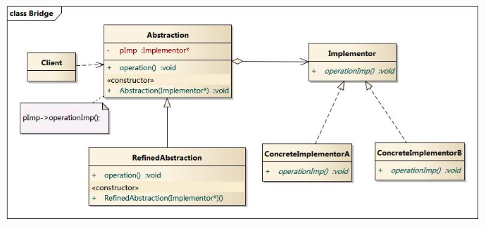

#   设计模式之桥接模式
+ date: 2018-02-25 23:11:44
+ description: 设计模式之桥接模式
+ categories:
  - 设计模式
+ tags:
  - 设计模式
---
#	桥接模式

##	参考
+	[桥接模式](https://design-patterns.readthedocs.io/zh_CN/latest/structural_patterns/bridge.html)
+	[Java设计模式之十五（桥接模式）](https://blog.csdn.net/shaopeng5211/article/details/8827507)

##	UML图

+	Client:Bridge模式的使用者
+	Abstraction:抽象类接口（接口或抽象类）,维护对行为实现（Implementor）的引用
+	Refined Abstraction:Abstraction子类,具体抽象类
+	Implementor:行为实现类接口 (Abstraction接口定义了基于Implementor接口的更高层次的操作)
+	ConcreteImplementor:Implementor子类

##	使用步骤
1.	创建抽象类Abstraction
```JAVA
// 抽象类
public abstract class Abstraction() {
	private Implementor pImp();
	public Implementor getPImp() {
		return pImp;
	}
	public void setPImp(Implementor implementor) {
		this.pImp = implementor;
	}

	// 操作
	public abstract void operation();

	// 构造方法
	public void Abstraction(Implementor implementor) {
		this.pImp = implementor;
	}
}
```
2.	创建具体抽象类
```JAVA
// 具体抽象类
public abstract class RefinedAbstraction extends Abstraction() {
	@Override
	public void operation() {
		this.getPImp().operationImp();
	}

	public RefinedAbstraction(Implementor implementor) {
		super(pImp);	// 调用父类的构造方法
	}
}
```
3.	创建实现类接口
```JAVA
// 实现类接口
public interface Implementor() {
	// 操作实施者
	public void operationImp();
}
```
4.	创建具体实现类A
```JAVA
// 具体实施者A
public class ConcreteImplementorA implement Implementor() {
	@Override
	public void operationImp() {
		// do something ...
	}
}
```
5.	创建具体实现类B
```JAVA
// 具体实施者B
public class ConcreteImplementorB implement () {
	@Override
	public void operationImp() {
		// do something ...
	}
}
```
6.	Client调用
```JAVA
public class Client {
	public static void main(String[] args) {
		Implementor concreteImplementorA = new ConcreteImplementorA();
		Implementor concreteImplementorB = new ConcreteImplementorB();

		Abstraction refinedAbstraction = new RefinedAbstraction(concreteImplementorA);
		refinedAbstraction.operation();

		Abstraction refinedAbstraction = new RefinedAbstraction(concreteImplementorB);
		refinedAbstraction.operation();
	}
}
```

##	具体实现
1.	创建抽象类Abstraction
```JAVA
// 抽象类
// Car是对车进行抽象
public abstract class Car {
	private Engine engine;
	public Engine getEngine() {
		return engine;
	}
	public void setEngine(Engine engine) {
		this.engine = engine;
	}

	// 构造方法
	public Car(Engine engine) {
		this.engine = engine;
	}
	// 操作
	public abstract void runEngine();
}
```
2.	创建具体抽象类
```JAVA
// 具体抽象类
// Bus是对巴士进行抽象,即也是抽象,但同时是Car的一部分,比Car具体一点
public class Bus extends Car {

	public Bus(Engine engine) {
		super(engine);	// 调用父类的构造方法
	}

	@Override
	public void runEngine() {
		System.out.print("Bus");
		this.getEngine().installEngine();
	}
}
```
3.	创建实现类接口
```JAVA
// 实现类接口
public interface Engine {
	// 操作实施者
	// 安装发动引擎
	public void installEngine();
}
```
4.	创建具体实现类A
```JAVA
// 具体实施者A
// 引擎2200
public class Engine2200 implements Engine {
	@Override
	public void installEngine() {
		System.out.println("安装2200CC发动引擎");
	}
}
```
5.	创建具体实现类B
```JAVA
// 具体实施者B
// 引擎2000
public class Engine2000 implements Engine {
	@Override
	public void installEngine() {
		System.out.println("安装2000CC发动引擎");
	}
}
```
6.	Client调用
```JAVA
public class MainClass {
	public static void main(String[] args) {
		Engine engine2000 = new Engine2000();
		Engine engine2200 = new Engine2200();

		Car bus = new Bus(engine2000);
		bus.installEngine();

		Car jeep = new Jeep(engine2200);
		jeep.installEngine();
	}
}
```

##	优点和缺点

###	优点
+	分离抽象接口及其实现部分。
+	**桥接模式有时类似于多继承方案，但是多继承方案违背了类的单一职责原则**（即一个类只有一个变化的原因），复用性比较差，而且多继承结构中类的个数非常庞大，桥接模式是比多继承方案更好的解决方法。
+	桥接模式提高了系统的可扩充性，在两个变化维度中任意扩展一个维度，都不需要修改原有系统。
+	实现细节对客户透明，可以对用户隐藏实现细节。

###	缺点
+	桥接模式的引入会增加系统的理解与设计难度，由于聚合关联关系建立在抽象层，要求开发者针对抽象进行设计与编程。
+	桥接模式要求正确识别出系统中两个独立变化的维度，因此其使用范围具有一定的局限性。

##	应用场景
+	如果一个系统需要在构件的抽象化角色和具体化角色之间增加更多的灵活性，避免在两个层次之间建立静态的继承联系，通过桥接模式可以使它们在抽象层建立一个关联关系。
+	抽象化角色和实现化角色可以以继承的方式独立扩展而互不影响，在程序运行时可以动态将一个抽象化子类的对象和一个实现化子类的对象进行组合，即系统需要对抽象化角色和实现化角色进行动态耦合。
+	一个类存在两个独立变化的维度，且这两个维度都需要进行扩展。
+	虽然在系统中使用继承是没有问题的，但是由于抽象化角色和具体化角色需要独立变化，设计要求需要独立管理这两者。
+	对于那些不希望使用继承或因为多层次继承导致系统类的个数急剧增加的系统，桥接模式尤为适用。
