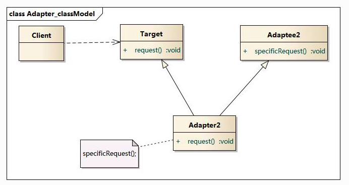
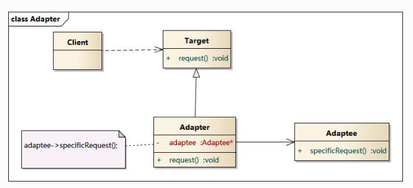

# 设计模式之适配器模式

---

# 适配器模式

## 参考
+	[适配器模式（Adapter Pattern）- 最易懂的设计模式解析](https://blog.csdn.net/carson_ho/article/details/54910430)
+	[适配器模式](https://design-patterns.readthedocs.io/zh_CN/latest/structural_patterns/adapter.html)
+   [适配器模式](https://www.runoob.com/design-pattern/bridge-pattern.html)

## 介绍

### 意图

把一个类的接口变换成客户端所期待的另一种接口，从而使原本接口不匹配而无法一起工作的两个类能够在一起工作

### 主要解决

主要解决在软件系统中，常常要将一些"现存的对象"放到新的环境中，而新环境要求的接口是现对象不能满足的。

### 何时使用

1.  系统需要使用现有的类，而此类的接口不符合系统的需要。
2.  想要建立一个可以重复使用的类，用于与一些彼此之间没有太大关联的一些类，包括一些可能在将来引进的类一起工作，这些源类不一定有一致的接口。
3.  通过接口转换，将一个类插入另一个类系中。（比如老虎和飞禽，现在多了一个飞虎，在不增加实体的需求下，增加一个适配器，在里面包容一个虎对象，实现飞的接口。）

### 如何解决

继承或依赖（推荐）。

### 关键代码

适配器继承或依赖已有的对象，实现想要的目标接口。

### 应用实例

1.  美国电器 110V，中国 220V，就要有一个适配器将 110V 转化为 220V。
2.  JAVA JDK 1.1 提供了 Enumeration 接口，而在 1.2 中提供了 Iterator 接口，想要使用 1.2 的 JDK，则要将以前系统的 Enumeration 接口转化为 Iterator 接口，这时就需要适配器模式。
3.  在 LINUX 上运行 WINDOWS 程序。
4.  JAVA 中的 jdbc。

### 优点

1.  可以让任何两个没有关联的类一起运行。
2.  提高了类的复用。
3.  增加了类的透明度。
4.  灵活性好。

### 缺点

 1.  过多地使用适配器，会让系统非常零乱，不易整体进行把握。比如，明明看到调用的是 A 接口，其实内部被适配成了 B 接口的实现，一个系统如果太多出现这种情况，无异于一场灾难。因此如果不是很有必要，可以不使用适配器，而是直接对系统进行重构。
 2.  由于 JAVA 至多继承一个类，所以至多只能适配一个适配者类，而且目标类必须是抽象类。

### 使用场景

有动机地修改一个正常运行的系统的接口，这时应该考虑使用适配器模式。

### 注意事项

适配器不是在详细设计时添加的，而是解决正在服役的项目的问题。


## 模式动机
+	通常情况下，客户端可以通过目标类的接口访问它所提供的服务。有时，现有的类可以满足客户类的功能需要，但是它所提供的接口不一定是客户类所期望的，这可能是因为现有类中方法名与目标类中定义的方法名不一致等原因所导致的。
+	在这种情况下，现有的接口需要转化为客户类期望的接口，这样保证了对现有类的重用。如果不进行这样的转化，客户类就不能利用现有类所提供的功能，适配器模式可以完成这样的转化。
+	在适配器模式中可以定义一个包装类，包装不兼容接口的对象，这个包装类指的就是适配器(Adapter)，它所包装的对象就是适配者(Adaptee)，即被适配的类。
+	适配器提供客户类需要的接口，适配器的实现就是把客户类的请求转化为对适配者的相应接口的调用。###  也就是说

当客户类调用适配器的方法时，在适配器类的内部将调用适配者类的方法，而这个过程对客户类是透明的，客户类并不直接访问适配者类。因此，适配器可以使由于接口不兼容而不能交互的类可以一起工作。这就是适配器模式的模式动机。

## 分类

### 适配器模式的形式分为

s+	类的适配器模式
+	对象的适配器模式

类的适配器模式是使用继承关系连接到Adaptee类,对象的适配器模式是使用委派关系连接到Adaptee类。

## 类的适配器模式

### UML图



+	Client:客户
+	Target:目标
+	Adapter:适配器
+	adaptee:适应者

### UML图说明
+	冲突:Target期待调用Request方法,而这个方法在Adaptee并没有(这就是所谓不兼容)
+	解决方案:为使Target能够使用Adaptee类里的SpecificRequest方法,需要添加一个中间环节Adapter类,Adapter类继承Adaptee,同时实现Target接口,把Adaptee的API与Target的API衔接起来(适配)

### 使用步骤
###  步骤1

 创建Target接口
```JAVA

public interface Target {

    //这是源类Adapteee没有的方法
    public void Request();
}

```

### 步骤2

 创建源类（Adaptee）
```JAVA
public class Adaptee {
    public void SpecificRequest(){

    }
}

```
### 步骤3

 创建适配器类（Adapter）
```JAVA
//适配器Adapter继承自Adaptee，同时又实现了目标(Target)接口。
public class Adapter extends Adaptee implements Target {
    //目标接口要求调用Request()这个方法名，但源类Adaptee没有方法Request()
    //因此适配器补充上这个方法名
    //但实际上Request()只是调用源类Adaptee的SpecificRequest()方法的内容
    //所以适配器只是将SpecificRequest()方法作了一层封装，封装成Target可以调用的Request()而已
    @Override
    public void Request() {
        this.SpecificRequest();
    }
}
```
### 步骤4

定义具体使用目标类，并通过Adapter类调用所需要的方法从而实现目标
```JAVA
// Client访问适配器
public class AdapterPattern {
    public static void main(String[] args){
        Target mAdapter = new Adapter()；
        mAdapter.Request();
    }
}
```

### 实例讲解

#### 背景
+	### 背景

小成买了一个进口的电视机
+	### 冲突

进口电视机要求电压（110V）与国内插头标准输出电压（220V）不兼容
+	### 解决方案

设置一个适配器将插头输出的220V转变成110V

#### 具体实现
###  步骤1

 创建Target接口
```JAVA
public interface Target {
	// 进口电视需要一个110v的插座口
	public void socket_110v();
}
```

### 步骤2

 创建源类（Adaptee） -> 原来就具有的类
```JAVA
public class Adaptee {
    public void socket_220v(){

    }
}
```

### 步骤3

 创建适配器类（Adapter）
```JAVA
//适配器Adapter继承自Adaptee，同时又实现了目标(Target)接口。
public class Adapter extends Adaptee implements Target {

	// 1. 由于实现了接口,所以这个适配器会有一个110v的插座口
    @Override
    public void socket_110v() {
		// 2. 这个插座口的目的是复用原有的220v插座口
		// 3. 由于继承了Adaptee,所以适配器类拥有220v插座口
        this.socket_220v();
    }
}
```
### 步骤4

定义具体使用目标类，并通过Adapter类调用所需要的方法从而实现目标
```JAVA
// Client访问适配器
public class AdapterPattern {
    public static void main(String[] args){
        Target mAdapter = new Adapter()；
        mAdapter.socket_110v();
    }
}
```
## 对象的适配器模式

### UML图




### UML图说明
###  在上图中可以看出


+	### 冲突

Target期待调用Request方法，而Adaptee并没有（这就是所谓的不兼容了）。
+	### 解决方案

为使Target能够使用Adaptee类里的SpecificRequest方法，故提供一个中间环节Adapter**（包装了一个Adaptee的实例）**，把Adaptee的API与Target的API衔接起来（适配）。
+	Adapter与Adaptee是委派关系，这决定了适配器模式是对象的。

### 使用步骤（代码解析）
###  步骤1

 创建Target接口；
```JAVA
public interface Target {
    //这是源类Adapteee没有的方法
    public void Request();
}
```
### 步骤2

 创建源类（Adaptee） ；
```JAVA
public class Adaptee {
    public void SpecificRequest(){

    }
}
```
### 步骤3

 创建适配器类（Adapter）（**不适用继承而是委派**）
```JAVA
class Adapter implements Target{

    // 直接关联被适配类
    private Adaptee adaptee;
    // 可以通过构造函数传入具体需要适配的被适配类对象
    public Adapter (Adaptee adaptee) {
        this.adaptee = adaptee;
    }

    @Override
    public void Request() {
        // 这里是使用委托的方式完成特殊功能
        this.adaptee.SpecificRequest();
    }
}
```

### 步骤4

定义具体使用目标类，并通过Adapter类调用所需要的方法从而实现目标
```JAVA
public class AdapterPattern {
    public static void main(String[] args){
        //需要先创建一个被适配类的对象作为参数
        Target mAdapter = new Adapter(new Adaptee())；
        mAdapter.Request();
    }
}

```

##	适配器优缺点
###	优点
+	将目标类和适配者类解耦，通过引入一个适配器类来重用现有的适配者类，而无须修改原有代码。
+	增加了类的透明性和复用性，将具体的实现封装在适配者类中，对于客户端类来说是透明的，而且提高了适配者的复用性。
+	灵活性和扩展性都非常好，通过使用配置文件，可以很方便地更换适配器，也可以在不修改原有代码的基础上增加新的适配器类，完全符合“开闭原则”。

### 类适配器模式还具有如下优点


+	由于适配器类是适配者类的子类，因此可以在适配器类中置换一些适配者的方法，使得适配器的灵活性更强。

### 对象适配器模式还具有如下优点


+	一个对象适配器可以把多个不同的适配者适配到同一个目标，也就是说，同一个适配器可以把适配者类和它的子类都适配到目标接口。

### 缺点
###  类适配器模式的缺点如下


+	对于Java、C#等不支持多重继承的语言，一次最多只能适配一个适配者类，而且目标抽象类只能为抽象类，不能为具体类，其使用有一定的局限性，不能将一个适配者类和它的子类都适配到目标接口。

### 对象适配器模式的缺点如下


+	与类适配器模式相比，要想置换适配者类的方法就不容易。如果一定要置换掉适配者类的一个或多个方法，就只好先做一个适配者类的子类，将适配者类的方法置换掉，然后再把适配者类的子类当做真正的适配者进行适配，实现过程较为复杂。

## 应用场景

### 适配器的使用场景
+	系统需要复用现有类，而该类的接口不符合系统的需求，可以使用适配器模式使得原本由于接口不兼容而不能一起工作的那些类可以一起工作
+	多个组件功能类似，但接口不统一且可能会经常切换时，可使用适配器模式，使得客户端可以以统一的接口使用它们

### 类和对象适配器模式的使用场景

#### 灵活使用时

选择对象的适配器模式
+	类适配器使用对象继承的方式，是静态的定义方式；
+	而对象适配器使用对象组合的方式，是动态组合的方式。

#### 需要同时配源类和其子类

选择对象的适配器
+	对于类适配器，由于适配器直接继承了Adaptee，使得适配器不能和Adaptee的子类一起工作，因为继承是静态的关系，当适配器继承了Adaptee后，就不可能再去处理 Adaptee的子类了；
+	对于对象适配器，一个适配器可以把多种不同的源适配到同一个目标。换言之，同一个适配器可以把源类和它的子类都适配到目标接口。因为对象适配器采用的是对象组合的关系，只要对象类型正确，是不是子类都无所谓。

#### 需要重新定义Adaptee的部分行为

选择类适配器
+	对于类适配器，适配器可以重定义Adaptee的部分行为，相当于子类覆盖父类的部分实现方法。
+	对于对象适配器，要重定义Adaptee的行为比较困难，这种情况下，需要定义Adaptee的子类来实现重定义，然后让适配器组合子类。虽然重定义Adaptee的行为比较困难，但是想要增加一些新的行为则方便的很，而且新增加的行为可同时适用于所有的源。

#### 仅仅希望使用方便时

选择类适配器
+	对于类适配器，仅仅引入了一个对象，并不需要额外的引用来间接得到Adaptee。
+	对于对象适配器，需要额外的引用来间接得到Adaptee。

## 总结
建议尽量使用对象的适配器模式，多用合成/聚合、少用继承。
