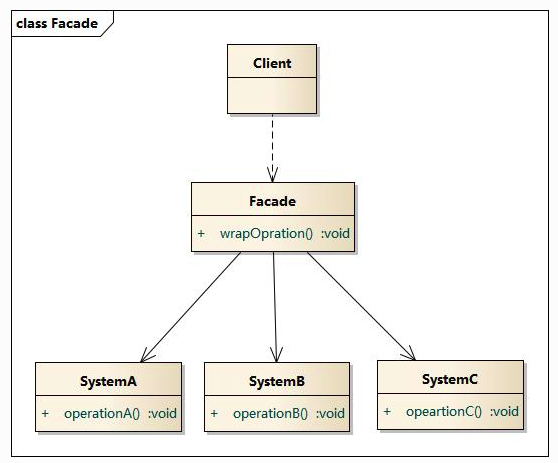

#	外观模式

##	参考
+	[外观模式](https://design-patterns.readthedocs.io/zh_CN/latest/structural_patterns/facade.html#)
+	[外观模式（Facade Pattern） - 最易懂的设计模式解析](https://www.jianshu.com/p/1b027d9fc005)

##	作用
>	1.	通过创建一个统一的外观类，用来包装子系统中一个 / 多个复杂的类，客户端可通过调用外观类的方法来调用内部子系统中所有方法
>	2.	引入外观角色之后，用户只需要与外观角色交互
>	3.	用户与子系统之间的复杂逻辑关系由外观角色来实现

+	定义了一个高层、统一的接口，外部与通过这个统一的接口对子系统中的一群接口进行访问,提高了客户端使用的便捷性，使得客户端无须关心子系统的工作细节，通过外观角色即可调用相关功能。
+	避免了系统与系统之间的高耦合度,实现客户类与子系统类的松耦合
+	使得复杂的子系统用法变得简单,降低原有系统的复杂度

##	UML图

+	Facade: 外观角色
+	SubSystem:子系统角色

##	使用步骤
1.	创建子系统角色A
```JAVA
// 子系统角色A
public class SystemA () {
	public void operationA();
}
```
2.	创建子系统角色B
```JAVA
// 子系统角色B
public class SystemB () {
	public void operationB();
}
```
3.	创建子系统角色C
```JAVA
// 子系统角色C
public class SystemC () {
	public void operationC();
}
```
4.	创建外观角色
```JAVA
// 外观角色
public class Facade() {
	// 这一部分代码是调用子系统的代码,不一定这样写,像Spring里可以用自动载入"@Autowried"等注释进行注入,辨证的看就好
	private SystemA systemA;
	private SystemB systemB;
	private SystemC systemC;
	public Facade (SystemA systemA, SystemB systemB, SystemC systemC) {
		this.systemA = systemA;
		this.systemB = systemB;
		this.systemC = systemC;
	}
	// 包裹操作
	public void wrapOpration() {
		systemA.operationA();
		systemB.operationB();
		systemC.operationC();
	}
}
```
5.	调用
```JAVA
public static void main(String[] args) {
	// 1.	实例化子系统(方法不唯一)
	SystemA systemA = new SystemA();
	SystemB systemB = new SystemB();
	SystemC systemC = new SystemC();
	// 2.	创建外观角色
	Facade facade = new Facade(systemA, systemB, systemC);
	// 3.	调用操作
	facade.wrapOpration();
}
```

##	优点和缺点

###	优点
+	对客户屏蔽子系统组件，减少了客户处理的对象数目并使得子系统使用起来更加容易。通过引入外观模式，客户代码将变得很简单，与之关联的对象也很少。
+	实现了子系统与客户之间的松耦合关系，这使得子系统的组件变化不会影响到调用它的客户类，只需要调整外观类即可。
+	降低了大型软件系统中的编译依赖性，并简化了系统在不同平台之间的移植过程，因为编译一个子系统一般不需要编译所有其他的子系统。一个子系统的修改对其他子系统没有任何影响，而且子系统内部变化也不会影响到外观对象。
+	只是提供了一个访问子系统的统一入口，并不影响用户直接使用子系统类。

###	缺点
+	不能很好地限制客户使用子系统类，如果对客户访问子系统类做太多的限制则减少了可变性和灵活性。
+	在不引入抽象外观类的情况下，增加新的子系统可能需要修改外观类或客户端的源代码，违背了“开闭原则”。

##	适用环境
+	当要为一个复杂子系统提供一个简单接口时可以使用外观模式。该接口可以满足大多数用户的需求，而且用户也可以越过外观类直接访问子系统。
+	客户程序与多个子系统之间存在很大的依赖性。引入外观类将子系统与客户以及其他子系统解耦，可以提高子系统的独立性和可移植性。
+	在层次化结构中，可以使用外观模式定义系统中每一层的入口，层与层之间不直接产生联系，而通过外观类建立联系，降低层之间的耦合度。
