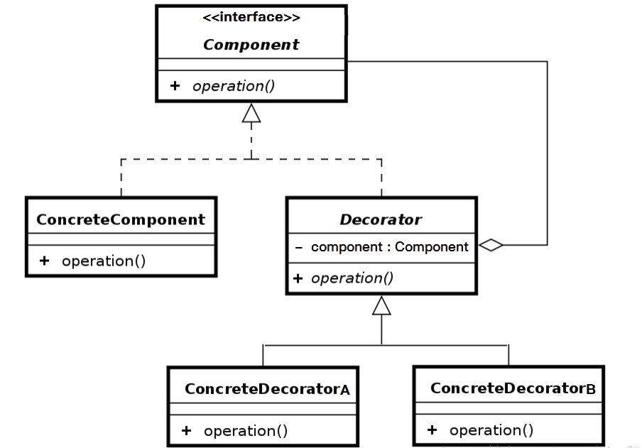

#   设计模式之装饰者模式
+ date: 2018-02-26 22:58:29
+ description: 设计模式之装饰者模式
+ categories:
  - 设计模式
+ tags:
  - 设计模式
---
#	装饰者模式

##	参考
+	[装饰模式](https://design-patterns.readthedocs.io/zh_CN/latest/structural_patterns/decorator.html)
+	[学习、探究Java设计模式——装饰者模式](https://blog.csdn.net/a553181867/article/details/52108423)
+	[Java设计模式之装饰者模式(Decorator pattern)](https://www.jianshu.com/p/c26b9b4a9d9e)
+   [装饰者模式（decorator）完全解析](https://blog.csdn.net/u013309870/article/details/53066694)

##	作用
给一个类或对象增加行为

##	模式动机
一般有两种方式可以实现给一个类或对象增加行为：
+	继承机制，使用继承机制是给现有类添加功能的一种有效途径，通过继承一个现有类可以使得子类在拥有自身方法的同时还拥有父类的方法。但是这种方法是静态的，用户不能控制增加行为的方式和时机。
+	关联机制，即将一个类的对象嵌入另一个对象中，由另一个对象来决定是否调用嵌入对象的行为以便扩展自己的行为，我们称这个嵌入的对象为装饰器(Decorator)
装饰模式以对客户透明的方式动态地给一个对象附加上更多的责任，换言之，客户端并不会觉得对象在装饰前和装饰后有什么不同。装饰模式可以在不需要创造更多子类的情况下，将对象的功能加以扩展。这就是装饰模式的模式动机。

##	定义
+	在不改变原类文件以及不使用继承的情况下，动态地将额外的职责(Responsibility)附加到对象上，从而实现动态拓展一个对象的功能。
+	它是通过创建一个包装对象，也就是装饰来包裹真实的对象。
+	其别名也可以称为包装器(Wrapper)，与适配器模式的别名相同，但它们适用于不同的场合。
+	根据翻译的不同，装饰模式也有人称之为“油漆工模式”，它是一种对象结构型模式。

##	UML图



+	Component: 抽象构件
+	ConcreteComponent: 具体构件
+	Decorator: 抽象装饰类
+	ConcreteDecorator: 具体装饰类

##	使用步骤
1.	创建抽象构件
用以保证装饰类和被装饰类都有一个相同的方法
```JAVA
public abstract class Component () {
	public void operation();
}
```
2.	创建具体构建(被装饰类)
```JAVA
public class ConcreteComponent extends Component() {
	public void operation() {
		// do something ...
	}
}
```
3.	创建抽象装饰类
```JAVA
public abstract class Decorator extends Component() {
	private Component component;
	public Decorator (Component component) {
		this.component = component;
	}

	public void operation();
}
```
4.	创建具体装饰类A
```JAVA
public class ConcreteDecoratorA extends Decorator() {
	public ConcreteDecoratorA (Component component) {
		super(component);
	}

	public void operation() {
		// do something ...
	}
}
```
5.	创建具体装饰类B
```JAVA
public class ConcreteDecoratorB extends Decorator() {
	public ConcreteComponentB (Component component) {
		super(component);
	}

	public void operation() {
		// do something ...
	}
}
```
6.	调用
```JAVA
public static void main(String[] args) {
	// 1. 被装饰类
	ConcreteComponent concreteComponent = new ConcreteComponent();

	// 具体进行装饰写法
	// 2. 具体装饰类A
	Decorator decorator = new ConcreteDecoratorA(concreteComponent);
	decorator.operation();

	// 3. 具体装饰类A + B
	decorator = new ConcreteDecoratorB(new ConcreteDecoratorA(concreteComponent));
	decorator.operation();
}
```

##	实例讲解

###	背景
+	你有一家服装店，卖各式各样的衣服，现在需要用一个系统来记录客户所要购买的衣服的总价，以便方便地结算。那么在这个例子里面，我们可以用装饰者模式，把客户当做被装饰者，衣服是装饰者，这很直观形象，接着我们来一步步实现需求。
+	也就是说"用衣服装饰人"或者"将衣服穿在人身上"

###	实现
1.	创建抽象构件
用以保证装饰类和被装饰类都有一个相同的方法
```JAVA
// 这里我们可以将"人"抽象出来,这个"人"是对裸体的人,有穿衣服的人,戴首饰的人等的抽象
public abstract class Person () {
	public void show();
}
```
2.	创建具体构建(被装饰类)
```JAVA
// 被装饰类表示的是一个全裸的人
public class NakedPerson extends Person() {
	public void show() {
		return "一丝不挂";
	}
}
```
3.	创建抽象装饰类
```JAVA
// 抽象装饰类表示的是人身上的衣物
public abstract class DressedPerson extends Person() {
	private Person person;
	public Decorator (Person person) {
		this.person = person;
	}

	public void show();
}
```
4.	创建具体装饰类A
```JAVA
public class DressedCoatPerson extends DressedPerson() {
	public DressedCoatPerson (Person person) {
		super(person);
	}

	public void show() {
		return person.show + "穿上衣";
	}
}
```
5.	创建具体装饰类B
```JAVA
public class DressedPantsPerson extends DressedPerson() {
	public DressedPantsPerson (Person person) {
		super(person);
	}

	public void show() {
		return person.show + "穿裤子";
	}
}
```
6.	调用
```JAVA
public static void main(String[] args) {
	// 1. 被装饰类
	//	-> 一丝不挂的人
	NakedPerson nakedPerson = new NakedPerson();

	// 具体进行装饰写法
	// 2. 具体装饰类A
	// -> 穿上衣
	DressedPerson dressedPerson = new DressedCoatPerson(nakedPerson);
	system.out.println(decorator.show());

	// 2. 具体装饰类A + B
	// -> 穿上衣 + 穿裤子
	decorator = new DressedPantsPerson(new DressedCoatPerson(nakedPerson));
	system.out.println(decorator.show());
}
```

##	适用环境
在以下情况下可以使用装饰模式：
+	在不影响其他对象的情况下，以动态、透明的方式给单个对象添加职责
+	需要动态地给一个对象增加功能，这些功能也可以动态地被撤销
当不能采用继承的方式对系统进行扩充或者采用继承不利于系统扩展和维护时。不能采用继承的情况主要有两类
+	第一类是系统中存在大量独立的扩展，为支持每一种组合将产生大量的子类，使得子类数目呈爆炸性增长
+	第二类是因为类定义不能继承（如final类）.

##	要注意的问题
装饰模式的简化-需要注意的问题:
+	一个装饰类的接口必须与被装饰类的接口保持相同，对于客户端来说无论是装饰之前的对象还是装饰之后的对象都可以一致对待
+	尽量保持具体构件类Component作为一个“轻”类，也就是说不要把太多的逻辑和状态放在具体构件类中
+	如果只有一个具体构件类而没有抽象构件类，那么抽象装饰类可以作为具体构件类的直接子类
