#   Ubuntu的gnome的使用与常用扩展
+ date: 2018-05-06 10:26:32
+ description: Ubuntu的gnome的使用与常用扩展
+ categories:
  - Ubuntu
+ tags:
  - Ubuntu装机日志
---
#   gnome中的一些快捷键
+   Alt+F2 快速使用命令(r命令重启shell，rt命令重载shell主题）
+   Alt+Space 可以弹出标题栏右键菜单
+   按住Alt键时关机按钮会变成暂停（suspend）按钮
+   鼠标滚轮/鼠标中键点击dock上的图标会打开一个程序的新窗口
+   按住Ctrl时鼠标左键点击dock上的图标会打开一个程序的新窗口
+   拖动窗口到屏幕左/右边缘（或按下win+左右箭头）会平铺该窗口到屏幕左/右
+   gnome3.24自带夜光功能，无需使用redshift或xflux

#   常用扩展
##   A
###  Applications Menu
+   提供的外观效果对于每位曾使用过GNOME 2的朋友来说都显得相当熟悉。它采用的默认应用启动器常见于以往几年中的各类主流Linux发行版。对我来说，调整启动器并不仅仅是为了找到以往的熟悉感觉，而是希望更快更轻松地找到自己需要的应用程序。这款方案能够对应用程序列表进行类别分组，并按应用名称排序而不仅显示对应图标。如此一来，我将能够更快地找到使用频繁较低的工具

+   开启application menu扩展可以在右上角添加分类程序菜单（默认alt+f1)

+   
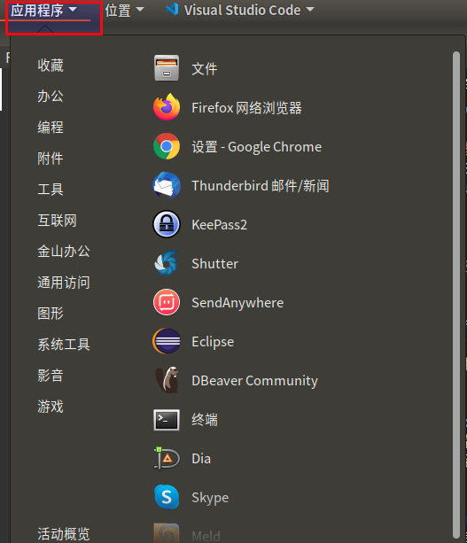

##   C
###  Clipboard Indicato
如果大家需要经常使用剪贴板，那么这项扩展绝对不可错过。在安装之后，Clipboard Indicator会出现在顶部面板当中，用以提供曾经复制至剪贴板的全部历史记录。只需要点击该标识而后选择要使用的文本内容，再配合Ctrl+V即可完成历史文本复制。

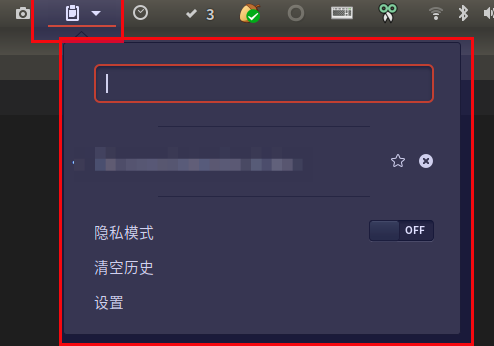

### Calculator Button
快速打开`gnome-calculator`计算器

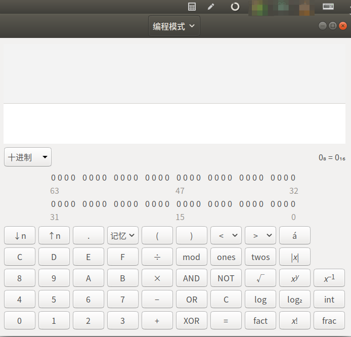

##   D
###  Drop down terminal
能从屏幕边缘快捷唤出终端，不用时再按快捷键缩回去

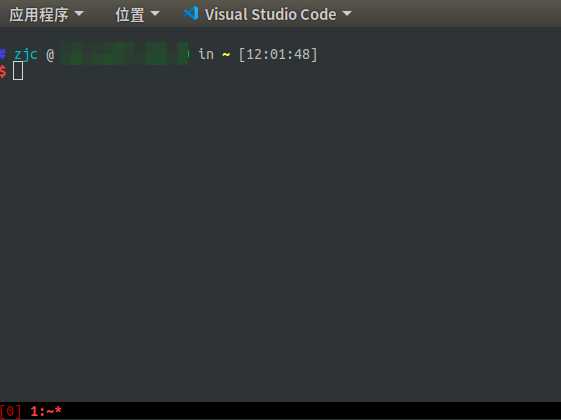

###  dash-to-dock
dock设置

##   E
###  EasyScreenCast
屏幕录像，做演示时比较方便

##  F
###     gTile
可以将窗口按不同的大小组合显示在屏幕上，当你有很多窗口需要一起显示的时候很有用

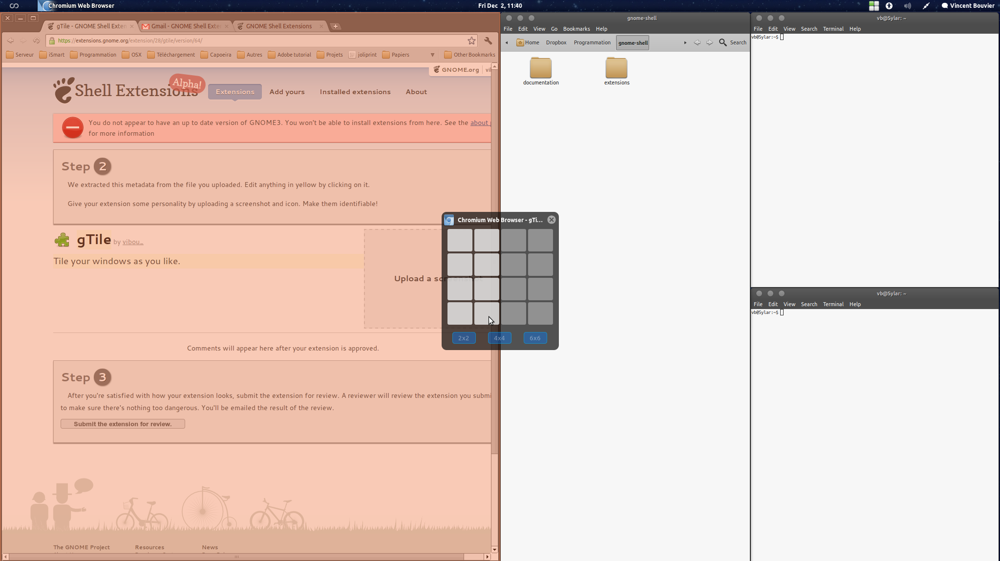

##  L
###     Lunar Calendar 农历 
显示农历

##   M
###  Multi Monitors Add-On
默认情况下，GNOME并不能充分利用额外的显示器——或者说效果并不能令人满意。默认的第二显示器缺少顶部面板，这意味着我们仍然需要通过第一显示器进行各类设置。这个扩展能够帮助我们添加此面板，设置缩略图、活动按钮以及对应的应用程序菜单

###  modern-calc
右侧滑入滑出的计算器，装逼必备

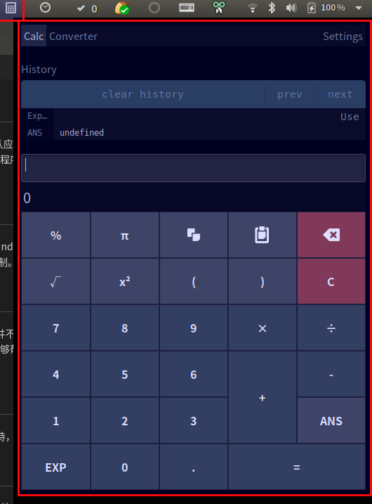

##  N
### Notes
>   Sticky notes for the GNOME Shell desktop

gnome shell桌面的便签笔记

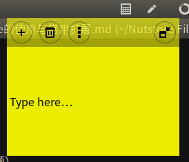

##   P
###  Places Status Indicator
添加菜单以快速导航系统中的位置

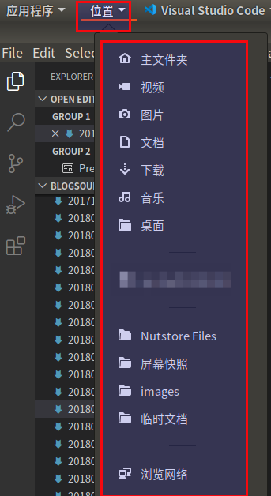

##   R
###  Recent items
在顶部面板中为最近使用的项添加一个图标; 点击清除列表; 左键单击：打开文件，右键单击：打开包含文件夹; 设置：项目数，“更多”项下的项目数和黑名单选项在extension.js的顶部定义.

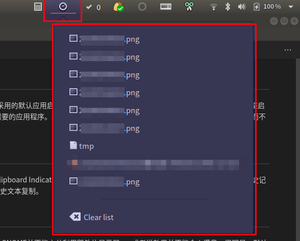

##   S
###  Screenshot Tool
屏幕截图工具，但是没有好用的编辑工具

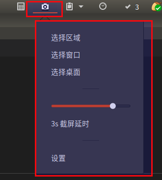

##   T
###  Top Panel Workspace Scroll
自从开始使用 Linux 以来，我发现这套桌面的最佳特性就是能够提供高效的工作区。过去我们能够快速在不同工作区间往来切换，但如今的新版本却放弃了这一重要特性。好在 Top Panel Workspace Scroll 能够帮助我们重拾这一功能，通过鼠标滚轮或者触摸板双指操作完成工作区切换。

###  Todo.txt
GTD应用，顶栏显示比较醒目

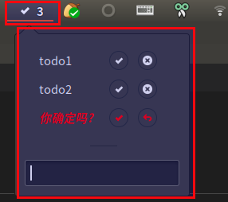

