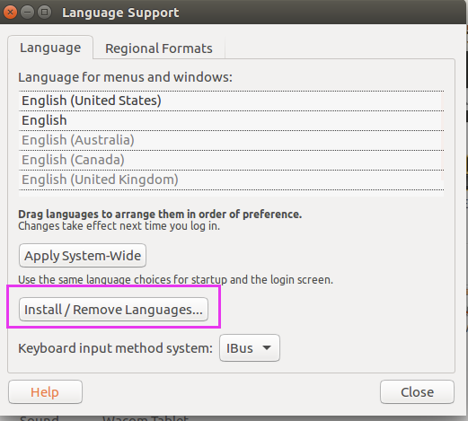
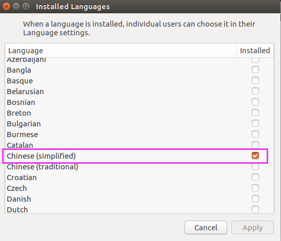
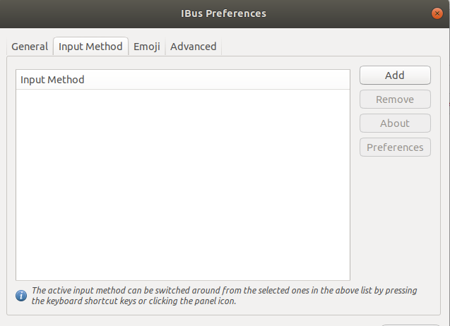
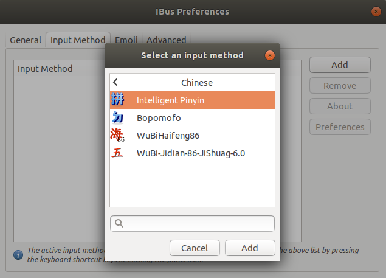
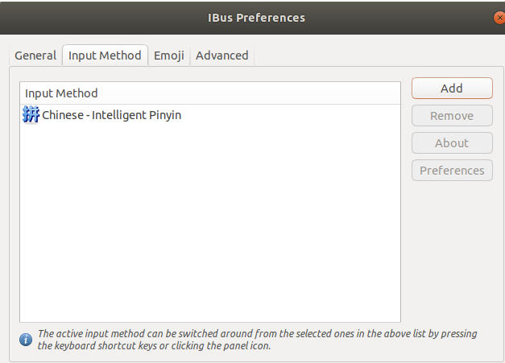
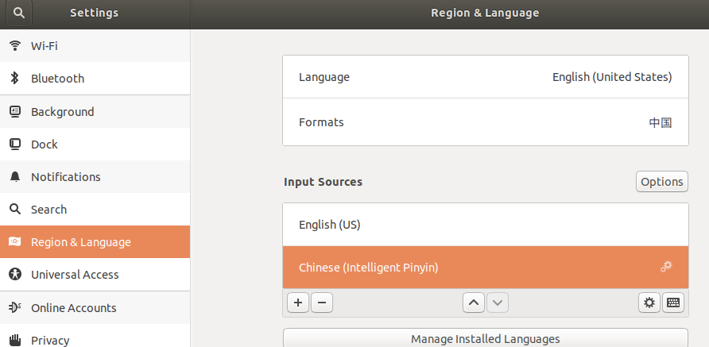

#   安装ibus
0.  打开install/remove languages里面，勾选上chinese



1.  安装iBus框架
```
$ sudo apt-get install ibus ibus-clutter ibus-gtk ibus-gtk3 ibus-qt4
```

2.  启动iBus框架
```
$ im-config -s ibus
```

3.  安装ibus拼音输入引擎
```
$ sudo apt-get install ibus-pinyin
```

4.  启用ibus-pinyin
```
$ ibus-setup
```





5.  在系统设置的区域与语言中添加iBus的智能拼音输入法如下图


#   输入法不生效怎么办
[Cannot input Chinese if only "Chinese (Intelligent Pinyin)" is set ](https://bugs.launchpad.net/ubuntu/+source/ibus-libpinyin/+bug/1847021)
>   Try to clear the cache:
>   rm ~/.cache/ibus/pinyin/* ~/.cache/ibus/libpinyin/*
>   and then relogin.


