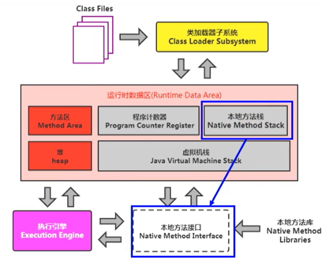

#   JVM从入门到精通_07_本地方法栈
+ date: 2018-08-25 11:21:34
+ description: 本地方法栈
+ categories:
  - Java
+ tags:
  - JVM
---
#   写在前面
1.  系列文章是"尚硅谷宋红康老师的JVM教程"的读书笔记
2.  是基于这个[学习笔记](http://moxi159753.gitee.io/learningnotes/#/README?id=jvm)进行修订

#   本地方法栈
Java虚拟机栈于管理Java方法的调用，而本地方法栈用于管理本地方法的调用。

本地方法栈，也是线程私有的。

允许被实现成固定或者是可动态扩展的内存大小。（在内存溢出方面是相同的）

+   如果线程请求分配的栈容量超过本地方法栈允许的最大容量，Java虚拟机将会抛出一个stackoverflowError 异常。
+   如果本地方法栈可以动态扩展，并且在尝试扩展的时候无法申请到足够的内存，或者在创建新的线程时没有足够的内存去创建对应的本地方法栈，那么Java虚拟机将会抛出一个outofMemoryError异常。

本地方法是使用C语言实现的。

它的具体做法是Native Method Stack中登记native方法，在Execution Engine 执行时加载本地方法库。

当某个线程调用一个本地方法时，它就进入了一个全新的并且不再受虚拟机限制的世界。它和虚拟机拥有同样的权限。

+   本地方法可以通过本地方法接口来访问虚拟机内部的运行时数据区。
+   它甚至可以直接使用本地处理器中的寄存器
+   直接从本地内存的堆中分配任意数量的内存。

并不是所有的JVM都支持本地方法。因为Java虚拟机规范并没有明确要求本地方法栈的使用语言、具体实现方式、数据结构等。如果JVM产品不打算支持native方法，也可以无需实现本地方法栈。

在Hotspot JVM中，直接将本地方法栈和虚拟机栈合二为一。
