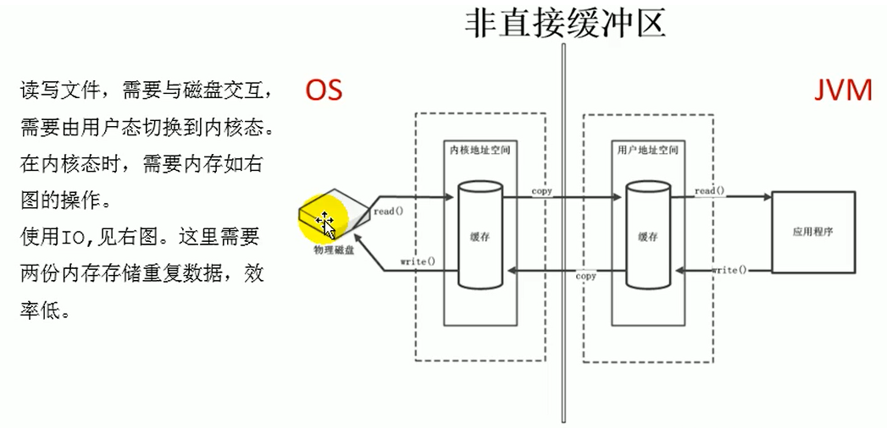
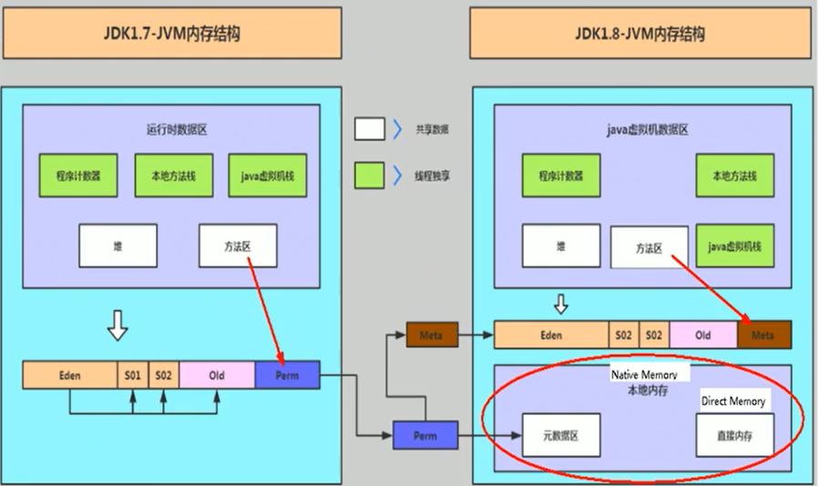

#   写在前面
1.  系列文章是"尚硅谷宋红康老师的JVM教程"的读书笔记
2.  是基于这个[学习笔记](http://moxi159753.gitee.io/learningnotes/#/README?id=jvm)进行修订

#   直接内存 Direct Memory
##  直接内存基本说明
不是虚拟机运行时数据区的一部分，也不是《Java虚拟机规范》中定义的内存区域。

直接内存是在Java堆外的、直接向系统申请的内存区间。

来源于NIO，通过存在堆中的DirectByteBuffer操作Native内存

通常，访问直接内存的速度会优于Java堆。即读写性能高。

+   因此`出于性能考虑，读写频繁的场合可能会考虑使用直接内存`。
+   Java的NIO库允许Java程序使用直接内存，用于数据缓冲区

使用下列代码，直接分配本地内存空间

```
int BUFFER = 1024*1024*1024; // 1GB
ByteBuffer byteBuffer = ByteBuffer.allocateDirect(BUFFER);
```

##  查看直接内存的占用与释放
运行如下代码,在系统中查看程序的内存占用
```JAVA
import java.nio.ByteBuffer;
import java.util.Scanner;

/**
 *  IO                  NIO (New IO / Non-Blocking IO)
 *  byte[] / char[]     Buffer
 *  Stream              Channel
 *
 * 查看直接内存的占用与释放
 * @author shkstart  shkstart@126.com
 * @create 2020  0:22
 */
public class BufferTest {
    private static final int BUFFER = 1024 * 1024 * 1024;//1GB

    public static void main(String[] args){
        //直接分配本地内存空间
        ByteBuffer byteBuffer = ByteBuffer.allocateDirect(BUFFER);
        System.out.println("直接内存分配完毕，请求指示！");

        Scanner scanner = new Scanner(System.in);
        scanner.next();

        System.out.println("直接内存开始释放！");
        byteBuffer = null;
        System.gc();
        scanner.next();
    }
}
```

#   非直接缓存区和缓存区
##  非直接缓存区和缓存区架构上的区别
原来采用BIO的架构，我们需要从用户态切换成内核态

NIO的方式使用了缓存区的概念

##  测试复制速度
IO和NIO速度的差别,即使用非直接缓冲区和缓冲区速度的差别
```JAVA
package com.atguigu.java;

import java.io.FileInputStream;
import java.io.FileOutputStream;
import java.io.IOException;
import java.nio.ByteBuffer;
import java.nio.channels.FileChannel;

/**
 * @author shkstart  shkstart@126.com
 * @create 2020  0:04
 */
public class BufferTest1 {

    private static final String TO = "F:\\test\\异界BD中字.mp4";
    private static final int _100Mb = 1024 * 1024 * 100;

    public static void main(String[] args) {
        long sum = 0;
        String src = "F:\\test\\异界BD中字.mp4";
        for (int i = 0; i < 3; i++) {
            String dest = "F:\\test\\异界BD中字_" + i + ".mp4";
            // 使用非直接缓冲区
//            sum += io(src,dest);//54606
            // 使用直接缓冲区
            sum += directBuffer(src,dest);//50244
        }

        System.out.println("总花费的时间为：" + sum );
    }

    private static long directBuffer(String src,String dest) {
        long start = System.currentTimeMillis();

        FileChannel inChannel = null;
        FileChannel outChannel = null;
        try {
            inChannel = new FileInputStream(src).getChannel();
            outChannel = new FileOutputStream(dest).getChannel();

            ByteBuffer byteBuffer = ByteBuffer.allocateDirect(_100Mb);
            while (inChannel.read(byteBuffer) != -1) {
                byteBuffer.flip();//修改为读数据模式
                outChannel.write(byteBuffer);
                byteBuffer.clear();//清空
            }
        } catch (IOException e) {
            e.printStackTrace();
        } finally {
            if (inChannel != null) {
                try {
                    inChannel.close();
                } catch (IOException e) {
                    e.printStackTrace();
                }

            }
            if (outChannel != null) {
                try {
                    outChannel.close();
                } catch (IOException e) {
                    e.printStackTrace();
                }

            }
        }

        long end = System.currentTimeMillis();
        return end - start;

    }

    private static long io(String src,String dest) {
        long start = System.currentTimeMillis();

        FileInputStream fis = null;
        FileOutputStream fos = null;
        try {
            fis = new FileInputStream(src);
            fos = new FileOutputStream(dest);
            byte[] buffer = new byte[_100Mb];
            while (true) {
                int len = fis.read(buffer);
                if (len == -1) {
                    break;
                }
                fos.write(buffer, 0, len);
            }
        } catch (IOException e) {
            e.printStackTrace();
        } finally {
            if (fis != null) {
                try {
                    fis.close();
                } catch (IOException e) {
                    e.printStackTrace();
                }

            }
            if (fos != null) {
                try {
                    fos.close();
                } catch (IOException e) {
                    e.printStackTrace();
                }

            }
        }

        long end = System.currentTimeMillis();

        return end - start;
    }
}
```

#   存在的问题
也可能导致outofMemoryError异常,如下代码,会出现OOM异常
```JAVA
import java.nio.ByteBuffer;
import java.util.ArrayList;

/**
 * 本地内存的OOM:  OutOfMemoryError: Direct buffer memory
 */
public class BufferTest2 {
    private static final int BUFFER = 1024 * 1024 * 20;//20MB

    public static void main(String[] args) {
        ArrayList<ByteBuffer> list = new ArrayList<>();

        int count = 0;
        try {
            while(true){
                ByteBuffer byteBuffer = ByteBuffer.allocateDirect(BUFFER);
                list.add(byteBuffer);
                count++;
                try {
                    Thread.sleep(100);
                } catch (InterruptedException e) {
                    e.printStackTrace();
                }
            }
        } finally {
            System.out.println(count);
        }
    }
}
```

由于直接内存在Java堆外，因此它的大小不会直接受限于-Xmx指定的最大堆大小，但是系统内存是有限的，Java堆和直接内存的总和依然受限于操作系统能给出的最大内存。 

缺点

+   分配回收成本较高
+   不受JVM内存回收管理

直接内存大小可以通过`MaxDirectMemorySize`设置,如果不指定，`默认与堆的最大值-Xmx参数值一致`


如下代码,使用参数`-XX:MaxDirectMemorySize=10m`设置直接内存大小后运行,发现超过10m就OOM了
```JAVA
import sun.misc.Unsafe;

import java.lang.reflect.Field;

/**
 * -Xmx20m -XX:MaxDirectMemorySize=10m
 */
public class MaxDirectMemorySizeTest {
    private static final long _1MB = 1024 * 1024;

    public static void main(String[] args) throws IllegalAccessException {
        // 这里使用Unsafe类的反射,其实就是前面NIO的allocateDirect底层实现机制
        Field unsafeField = Unsafe.class.getDeclaredFields()[0];
        unsafeField.setAccessible(true);
        Unsafe unsafe = (Unsafe)unsafeField.get(null);
        while(true){
            unsafe.allocateMemory(_1MB);
        }

    }
}
```



简单理解: java process memory = java heap + native memory
