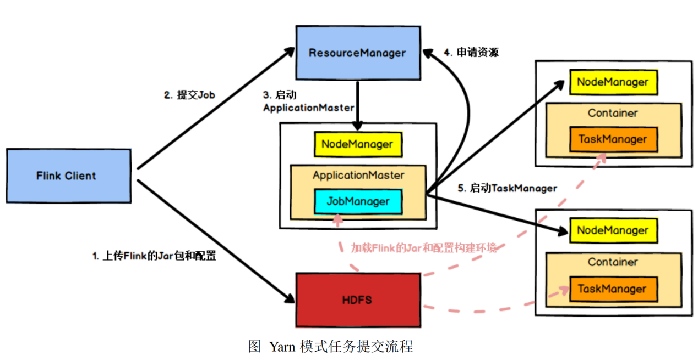
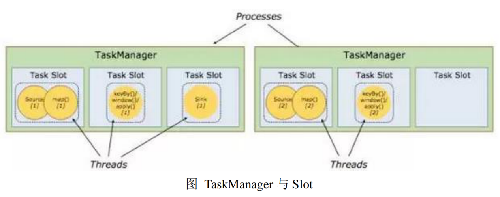
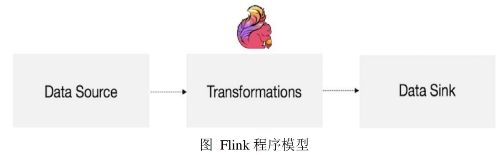
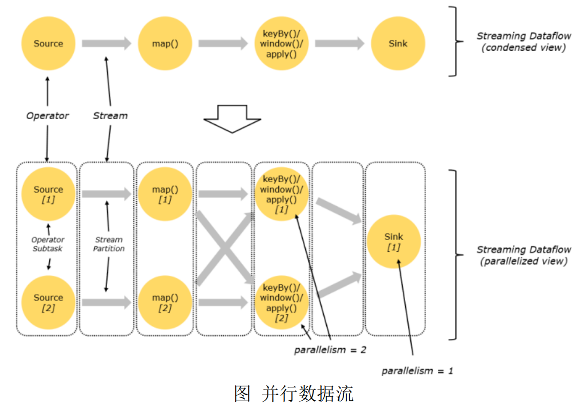
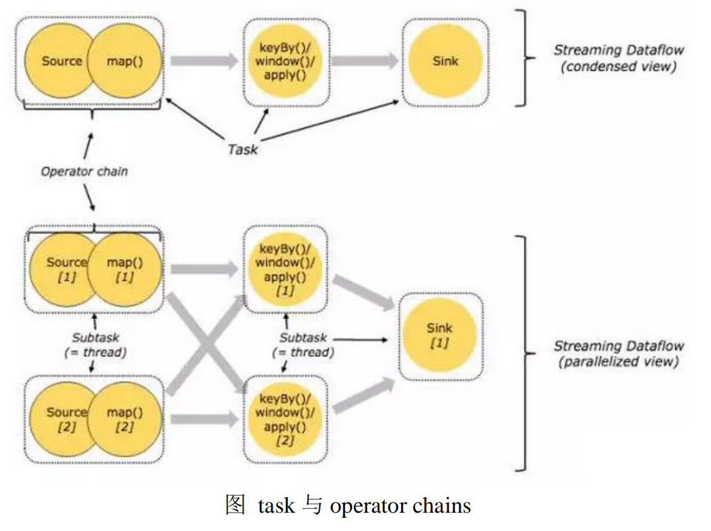
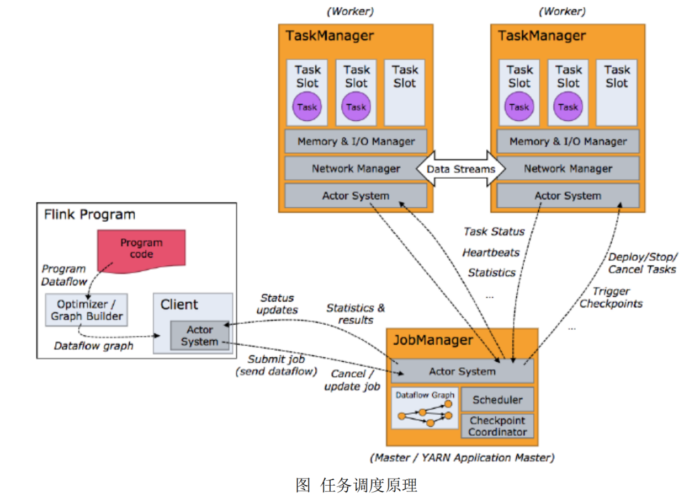

# Flink运行架构总结
+ date: 2019-09-14 07:59:10
+ description: Flink运行架构总结
+ categories:
  - BigData
+ tags:
  - BigData
---
# 任务提交流程

#   TaskManager 与 Slots
##  task slot是什么
+   task slot表示内存资源且这个内存资源是TaskManager 拥有的内存资源的子集

## TaskManager划分出task slot的目的
+   不需要跟来自其他 job 的 subtask 竞争被管理的内存(防止线程竞争内存资源,这里不会涉及到 CPU 的隔离)

## 一个 TaskManager 多个 slot 意味着

+   一个TaskManager 能接收多少个task
    *   <=> task slot的数量
    *   <=> TaskManager 将内存资源平均分成几份
+   subtask 可以共享同一个 JVM
    *   ==> 将共享 TCP 连接（基于多路复用）和心跳消息
    *   ==> 共享数据集和数据结构
    *   ==> 减少了每个task 的负载
+   防止线程竞争内存资源(这里不会涉及到 CPU 的隔离)
+   **最大并行度**(并发执行能力)( ==> 注意和并行度进行区分)
    -   最大并行度:即Task Slot的数量,是静态概念,指 TaskManager 具有的并发执行能力,用taskmanager.numberOfTaskSlots参数设置
    -   并行度(parallelism): 是动态概念，即 TaskManager 运行程序时实际使用的并发能力,用parallelism.default参数设置
    -   举例:假设一共有 3 个 TaskManager，每一个 TaskManager 中的分配 3 个TaskSlot，也就是每个 TaskManager 可以接收 3 个 task，一共 9 个 TaskSlot，如果我们设置 parallelism.default=1，即运行程序默认的并行度为 1，9 个 TaskSlot 只用了 1个，有 8 个空闲，因此，设置合适的并行度才能提高效率

#  Dataflow
##  核心组件
+   由 Source、Transformation、Sink 这三个核心组件组成
    *   <=> 输入(source operator) --stream--> 转换(transformations operators) --stream--> 输出(sink operator)

+   一个 stream 包含一个或多个 stream partition
+   一个 operator 包含一个或多个 operator subtask (**operator subtasks 在不同的线程、不同的物理机或不同的容器中彼此互不依赖得执行**)

## 并行度
+   一个特定 operator 的 subtask 的个数被称之为其 parallelism(并行度)
+   注意与最大并行度进行区分

## 如何执行
*   `one-to-one`的operator形成链条(operator chains),即形成subTask链,一条链相当于一个完整的task,只在一个线程中运行
    -   类似Spark中的窄依赖
    -   目的是减少线程之间的切换和基于缓存区的数据交换，在减少时延的同时提升吞吐量
*   `Redistributing`的operator运行一个线程
    -   类似Spark中的宽依赖
*   一个操作链(设并行度是2) ==> 将一个操作链划分成两部分 ==> 对于每一个部分使用一个独立的task去运行(即一个独立的线程) ==> 一个task处理的数据就是一个分区的数据

# 任务调度流程

