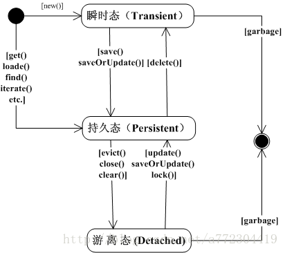
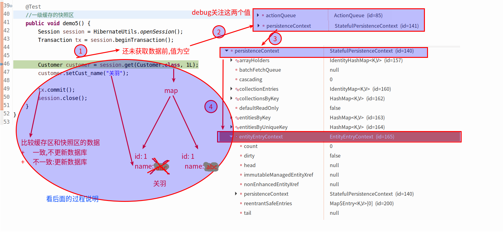
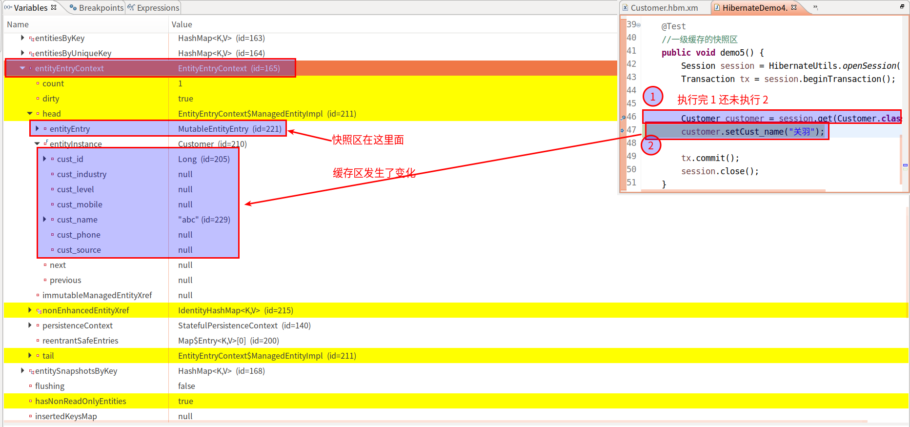
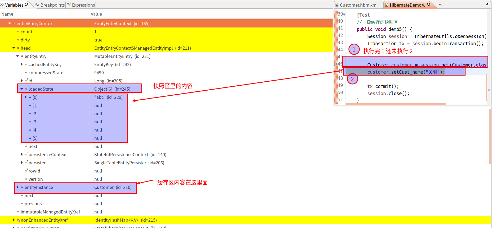
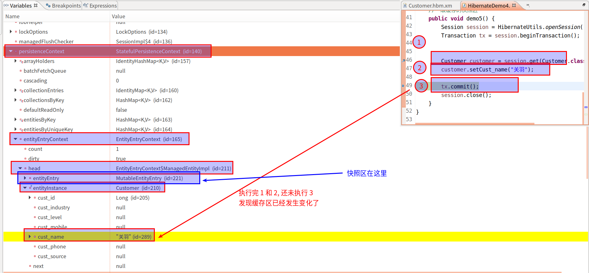
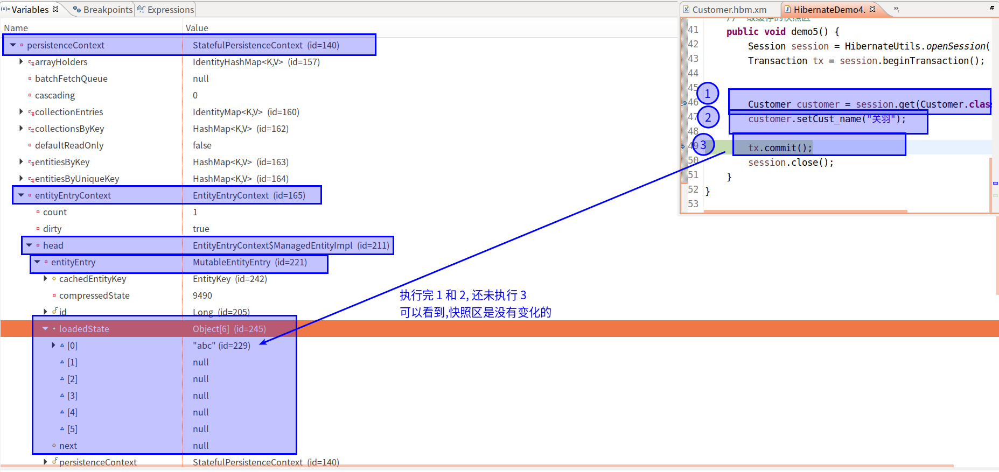

#  什么是持久化类
+   持久化:将内存中的一个对象持久化到数据库中的过程,Hibernate就是用来进行持久化的框架
+   持久化类:一个java对象与数据库的表建立了映射关系,那么这个类在Hibernate中称为持久化类,即`持久化类=Java类+映射文件`

#   持久化类的编写规则
+   对持久化类`提供一个无参数的构造方法`:Hibernate底层需要使用反射生成实例
+   `属性需要私有,对私有属性提供public的get和set方法`:Hibernta中获取,设置对象的值
+   对持久化类`提供一个唯一标识OID与数据库主键对应`:java通过对象的地址区分是否是同一个对象,数据库中通过主键确定是否是同一个记录,在Hibernate中通过持久化类的OID的属性区分是否是同一个对象
+   持久化类中`属性尽量使用包装类类型`:因为基本数据类型默认是0,那么插入0的时候就会出现歧义.而包装类类型默认值是null
+   持久化类`不要使用final修饰`:延迟加载本身是hibernate一个优化的手段,返回的是一个代理对象(javassist可以对没有实现接口的类产生代理 ---- 使用了非常底层字节码增强技术,继承这个类进行代理),如果不能被继承,就不能产生代理对象,延迟加载也就失效,load方法就和get方法一致

#   主键生成策略
##  主键的分类
+   自然主键
主键的本身就是表中的一个字段(实体中一个具体的属性)
+   代理主键
主键本身不是表中必须的一个字段(不是实体中的某个具体属性)

**在实际开发中,尽量使用代理主键**
>   因为一旦自然主键参与到业务逻辑中,后期有可能需要修改源代码
>   设计原则:好的程序设计满足OCP原则,对程序的扩展是open,对修改源码是close的

##   Hibernate的主键生成策略
在实际开发中一般不允许用户手动设置主键,一般将主键交给数据库,手动编写程序进行设置.在Hibernate中为了减少程序编写,提供了很多的主键生成策略
+   increment:hibernate中提供的自动增长机制,适用short,int,long类型的主键
>   **在单线程程序中使用,不准用在多线程程序**
>   运行机制:首先发送一条语句: select max(id) from 表, 然后让 id+1 作为下一条记录的主键
+   identity:适用short,int,long类型的主键,使用的是数据库底层的自动增长机制
>   **没有自动增长机制的数据库不能用**
>   适用于自动增长机制数据库(MySQL,MSSQL),Oracle没有自动增长机制
+   sequence:适用short,int,long类型的主键,采用的是序列的方式
>   Oracle支持序列,MySQL不能使用sequence
+   uuid:使用hibernate中的随机方式生成字符串主键
>   适用于字符串类型的主键
+   native:本地策略,可以在identity和sequence之间进行自动切换
>   也就是说,如果底层使用MySQL,则使用identity机制,而如果使用oracle则使用sequence机制
+   asigned:hibernat放弃外键的管理
>   也就是说:需要通过手动编写程序或者用户自己设置
+   foreign:外部的(了解居多)
>   在一对一的一种关联映射的情况下使用

##  主键生成策略写在xml中
```xml
<!-- Customer.hbm.xml文件 -->
<!-- 在项目中的位置可以看"Hibernate入门与配置"一文中,下述代码对应位置 -->
<!-- 关注generator节点 -->

<hibernate-mapping>
	<!-- 建立类与表的映射 -->
	<!-- name对应类名,table对应表名 -->
	<class name="com.zjinc36.hibernate.Customer" table="cst_customer">
		<!-- 建立类中的属性和表中的主键对应 -->
		<!-- name对应类中的属性,column对应表中的字段 -->
		<id name="cust_id" column="cust_id">
			<generator class="native" />
		</id>

		<!-- 建立类中的普通的属性和表的字段的对应 -->
		<property name="cust_name" column="cust_name" />
		<property name="cust_source" column="cust_source" />
		<property name="cust_industry" column="cust_industry" />
		<property name="cust_level" column="cust_level" />
		<property name="cust_phone" column="cust_phone" />
		<property name="cust_mobile" column="cust_mobile" />
	</class>
</hibernate-mapping>
```

#   持久化类的三种状态
Hibernate是持久层框架,通过持久化类完成ORM操作,Hibernate为了更好的管理持久化类,将持久化类分成三种状态
##  瞬时态
这种对象没有唯一的标识OID,被session管理,称之为瞬时态对象
+   在Session的缓存中，与Session实例相关联
+   在数据库中没有与之相对应的记录
##  持久态
这种对象有唯一标识OID,被session管理,称为持久态对象
+   在Session的缓存中，与Session实例相关联
+   在数据库中存在与之相对应的记录
##  脱管态(游离态)
这种对象有唯一标识OID,没有被session管理,称为脱管态对象
+   不在Session的缓存中，不与任何的Session实例相关联
+   在数据库中存在与之相对应的记录(前提条件是没有其他Session实例删除该条记录)

#   区分三种状态对象
```java
public class HibernateDemo3 {
	public void demo1() {
		Session session = HibernateUtils.openSession();
		Transaction transaction = session.beginTransaction();

        //这种对象没有唯一的标识OID,被session管理,称之为瞬时态对象
		Customer customer = new Customer();
		customer.setCust_name("wangwu");

		//这种对象有唯一标识OID,被session管理,称为持久态对象
		Serializable id = session.save(customer);

		transaction.commit();
		session.close();

		//这种对象有唯一标识OID,没有被session管理,称为脱管态对象
		System.out.println("客户名称:" + customer.getCust_name());
	}
}
```

#   三种状态的转换
*参考这篇文章[https://blog.csdn.net/a772304419/article/details/79319988](https://blog.csdn.net/a772304419/article/details/79319988)*


##  瞬时态对象
### 获得
Customer customer = new Customer();
### 状态转换
+   瞬时->持久:save();
+   瞬时->脱管:customer.setCust_id(1);

##  持久态对象
### 获得
+   get() -> Customer customer = session.get(Customer.class, 1L);
+   load()
+   find()
+   iterate()
### 状态转换
+   持久->瞬时:delete()
+   持久->脱管:close(),clear(),evict()
##  脱管态对象
### 获得
+   先变成瞬时:Customer customer = new Customer()
+   然后变成脱管:customer.setCust_id(1L)
### 状态转化
+   脱管->持久:update(),saveOrUpdate()
+   脱管->瞬时:customer.setCust_id(null)

#  什么是缓存
缓存:是一种优化的方式,将数据存入到内存中,使用的时候直接从缓存中获取,不通过存储源

#  Hibernate的缓存
Hibernate框架中提供了优化手段:缓存,抓取策略.
Hibernate中提供了两种缓存机制:一级缓存和二级缓存
# Hibernate的一级缓存
Hibernate的一级缓存:称为是Session级别的缓存,一级缓存生命周期与Session一致(一级缓存是由Session中的一系列的Java集合构成)
**一级缓存是自带的不可卸载的**
##    证明一级缓存存在
```java
	@Test
	/**
	 * 证明一级缓存的存在
	 */
	public void demo4() {
		Session session = HibernateUtils.openSession();
		Transaction tx = session.beginTransaction();

		// customer1和customer2是否执行了两次SQL语句
		Customer customer1 = session.get(Customer.class, 6L);//发送SQL语句
		System.out.println(customer1);
		Customer customer2 = session.get(Customer.class, 6L);//不发送SQL语句
		System.out.println(customer2);

		// 两次是否是同一个对象
		System.out.println(customer1 == customer2);//是指向同一个地址

		Customer customer3 = new Customer();
		customer3.setCust_name("关羽");
		Serializable id = session.save(customer3);
		session.get(Customer.class, id);//不发送SQL语句,因为是直接从缓存中获取

		tx.commit();
		session.close();
	}
```
## 什么快照区
Hibernate一级缓存中的特殊区域

## 快照区和缓冲区的作用
比较缓冲区和快照区的数据,一致则不更新数据库,不一致则更新数据库
###   代码运行过程


####   eclipse观察缓存区和快照区的变化
+   取出数据后,快照区和缓冲区的变化


+   修改数据后,快照区和缓冲区的变化


###   过程说明
再来解剖一下
```java
	@Test
	//一级缓存的快照区
	public void demo5() {
		Session session = HibernateUtils.openSession();
		Transaction tx = session.beginTransaction();

		Customer customer = session.get(Customer.class, 6L);
		customer.setCust_name("关羽");

		tx.commit();
		session.close();
	}
```
1）将数据从DB中取出来
2）将数据转变成对象，并存入堆内存中
3）将对象的id放入session缓存map的key中，将对象的引用放入session缓存map的 value中，这就纳入session管理了
4）将对象的详情放入到“快照”中
5) 当执行了`tx.commit();`时，Hibernate为了保证数据的一致性，Hibernate会清理session的一级缓存（flush），此时会将堆内存中的数据（已经纳入session管理的数据）与快照中的数据进行对比
6) 如果不一致，则会执行同步（update）操作，若相同，则不执行update

# Hibernate的二级缓存
Hibernate的二级缓存是SessionFactory级别的缓存,需要配置的,但是企业级中一般不开启,更多的是通过redis来替代二级缓存


