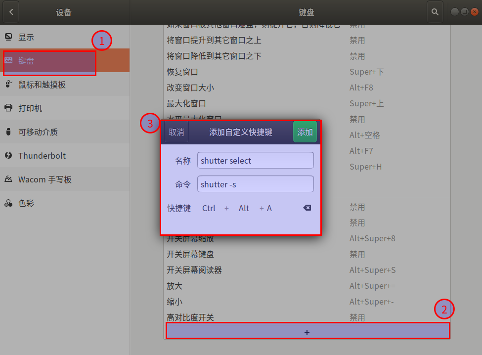

#   Ubuntu安装截屏工具Shutter
+ date: 2019-07-07 21:24:30
+ description: Shutter是Ubuntu中的屏幕快照工具,并设置快捷键
+ categories:
  - Ubuntu
+ tags:
  - Ubuntu装机日志
---
#  安装截图工具Shutter
##  安装
###     Ubuntu18.04
```bash
#   添加安装包软件源
sudo add-apt-repository ppa:shutter/ppa

#   更新源并安装 shutter
sudo apt-get update
sudo apt-get install shutter
```

###     Ubuntu20.04
0.  [参考Ubuntu 20.04 截图软件的使用 (gnome-screenshot、flameshot、shutter 截图编辑三叉戟)](https://www.sinocalife.com/ubuntu-20-04-screenshot-trident-tools-gnome-screenshot-flameshot-shutter)
1.  虽然软件中心提供了，但是不要使用软件中心安装shutter
安装：Ubuntu 20.04 官方源提供的 snap 版本可以安装，但运行时存在缺陷，发现如下问题：
```
Error while opening directory /home/username/Pictures
There was an error determining the filename ...
截取窗口时程序崩溃却未退出，因此再次启动程序导致部分功能依然不能使用，需先杀死进程
解决办法：不要使用官方snap包（软件中心）进行安装，添加下面的PPA源安装（定制修正版）即可（此版本暂不能截取网页，但其他功能稳定）
```

2.  安装
```bash
#   删除已安装有缺陷的版本
sudo snap remove shutter

#   添加安装包软件源
sudo add-apt-repository ppa:linuxuprising/shutter

#   更新源并安装 shutter
sudo apt-get update -y
sudo apt-get install shutter -y
```


##  问题:shutter编辑按钮灰色
###     Ubuntu18.04
+	[参考:https://itsfoss.com/shutter-edit-button-disabled/](https://itsfoss.com/shutter-edit-button-disabled/)
+	总结起来就是如下操作
```bash
#   下载必要的依赖
wget https://launchpad.net/ubuntu/+archive/primary/+files/libgoocanvas-common_1.0.0-1_all.deb
wget https://launchpad.net/ubuntu/+archive/primary/+files/libgoocanvas3_1.0.0-1_amd64.deb
wget https://launchpad.net/ubuntu/+archive/primary/+files/libgoo-canvas-perl_0.06-2ubuntu3_amd64.deb

#   安装依赖
sudo dpkg -i libgoocanvas-common_1.0.0-1_all.deb
sudo dpkg -i libgoocanvas3_1.0.0-1_amd64.deb
sudo dpkg -i libgoo-canvas-perl_0.06-2ubuntu3_amd64.deb
sudo apt -f install

#   重启shutter(或者重新安装shutter)
sudo killall shutter
重新启动shutter
```

###     Ubuntu20.04
+   截至20200802为止,暂时没有找到好的解决方法
+   按照18.04的解决方法操作,`libgoo-canvas-perl_0.06-2ubuntu3_amd64.deb`需要依赖`perlapi-5.26.0`,但无法安装


#   设置快捷键
[_参考:ubuntu 安装截图工具 Shutter，并设置快捷键 Ctrl+Alt+A_](https://blog.csdn.net/hanshileiai/article/details/46843713)



