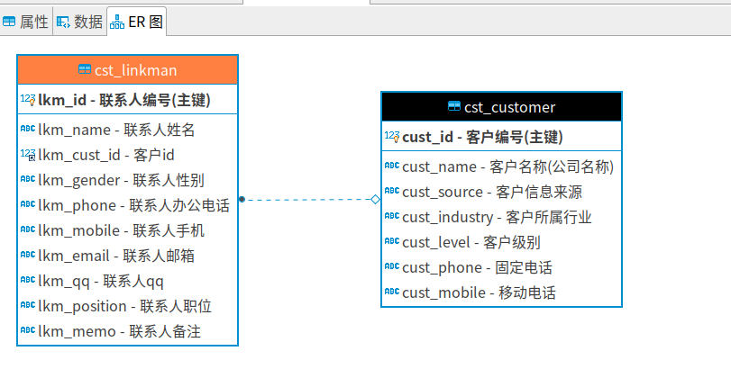
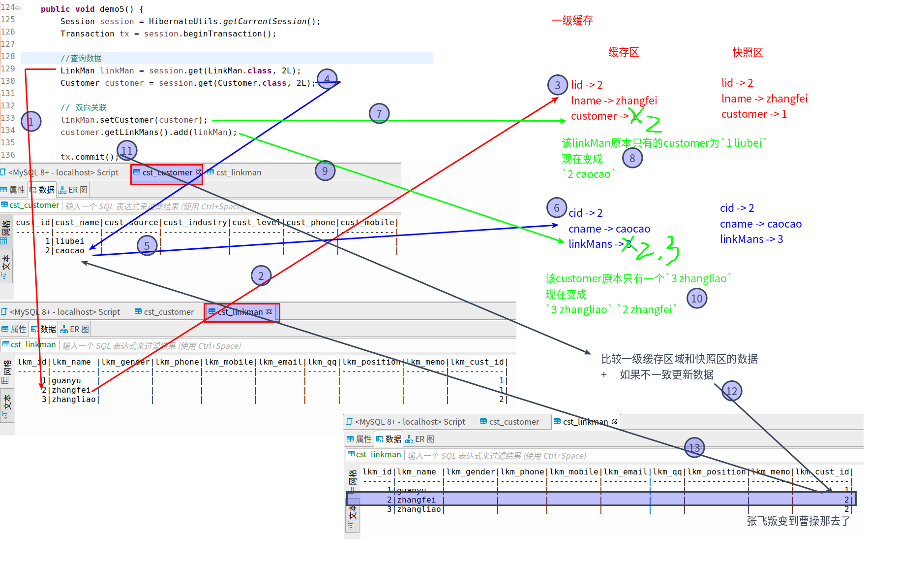
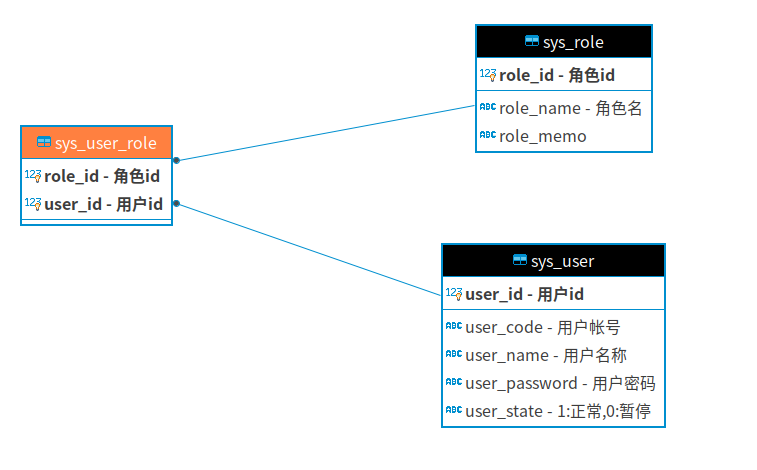

#   Hibernate的关系映射
+ date: 2019-07-08 11:43:06
+ description: 一对多/多对多关系
+ categories:
  - Java
+ tags:
  - Hibernate
---
#   一对多关系
##  什么样关系属于一对多
+   一个部门对应多个员工,一个员工只能属于某一个部门
+   一个客户对应多个联系人,一个联系人只能属于某一个客户

##  一对多建表原则
在多的一方创建外键指向一的一方的主键

##	一对多具体创建过程
###	SQL语句
####	一的一方
```SQL
--	一的一方
create table `cst_customer` (
	`cust_id` BIGINT(32) NOT NULL AUTO_INCREMENT COMMENT '客户编号(主键)',
	`cust_name` VARCHAR(32) NOT NULL COMMENT '客户名称(公司名称)',
	`cust_source` VARCHAR(32) DEFAULT NULL COMMENT '客户信息来源',
	`cust_industry` VARCHAR(32) DEFAULT NULL COMMENT '客户所属行业',
	`cust_level` VARCHAR(32) DEFAULT NULL COMMENT '客户级别',
	`cust_phone` VARCHAR(64) DEFAULT NULL COMMENT '固定电话',
	`cust_mobile` VARCHAR(16) DEFAULT NULL COMMENT '移动电话',
	PRIMARY KEY(`cust_id`)
) ENGINE=INNODB AUTO_INCREMENT=1 DEFAULT CHARSET=utf8
```

####	多的一方
```SQL
--	多的一方
create table cst_linkman (
	lkm_id bigint(32) not null auto_increment comment '联系人编号(主键)',
	lkm_name varchar(16) default null comment '联系人姓名',
	lkm_cust_id bigint(32) default null comment '客户id',
	lkm_gender char(1) default null comment '联系人性别',
	lkm_phone varchar(16) default null comment '联系人办公电话',
	lkm_mobile varchar(16) default null comment '联系人手机',
	lkm_email varchar(16) default null comment '联系人邮箱',
	lkm_qq varchar(64) default null comment '联系人qq',
	lkm_position varchar(16) default null comment '联系人职位',
	lkm_memo varchar(512) default null comment '联系人备注',
	primary key (lkm_id),
-- 	在lkm_cust_id上建立普通索引FK_cst_linkman_lkm_cust_id
	key FK_cst_linkman_lkm_cust_id(lkm_cust_id),
-- 	这里的FK_cst_linkman_lkm_cust_id和上面的没有任何关系
-- 	只是用相同名字表示这里的外键和上面的内键是同一个字段,只是一个命名
--	多的一方创建外键指向一的一方的主键
	CONSTRAINT FK_cst_linkman_lkm_cust_id FOREIGN key (lkm_cust_id) REFERENCES cst_customer(cust_id) ON DELETE NO ACTION ON UPDATE NO ACTION
) engine=InnoDB auto_increment=1 default charset=utf8;
```

####	对应的ER图




###	java对象
####	一的一方
```java
package com.zjinc36.hibernate;

import java.util.HashSet;
import java.util.Set;

public class Customer {
	private Long cust_id;
	private String cust_name;
	private String cust_source;
	private String cust_industry;
	private String cust_level;
	private String cust_phone;
	private String cust_mobile;

	//通过ORM方式表示:一个客户对应多个联系人
	//放置的是多的一方的集合,Hibernate默认使用的是Set集合
	private Set<LinkMan> linkMans = new HashSet<LinkMan>();

	public Long getCust_id() {
		return cust_id;
	}
	public void setCust_id(Long cust_id) {
		this.cust_id = cust_id;
	}
	public String getCust_name() {
		return cust_name;
	}
	public void setCust_name(String cust_name) {
		this.cust_name = cust_name;
	}
	public String getCust_source() {
		return cust_source;
	}
	public void setCust_source(String cust_source) {
		this.cust_source = cust_source;
	}
	public String getCust_industry() {
		return cust_industry;
	}
	public void setCust_industry(String cust_industry) {
		this.cust_industry = cust_industry;
	}
	public String getCust_level() {
		return cust_level;
	}
	public void setCust_level(String cust_level) {
		this.cust_level = cust_level;
	}
	public String getCust_phone() {
		return cust_phone;
	}
	public void setCust_phone(String cust_phone) {
		this.cust_phone = cust_phone;
	}
	public String getCust_mobile() {
		return cust_mobile;
	}
	public void setCust_mobile(String cust_mobile) {
		this.cust_mobile = cust_mobile;
	}

	public Set<LinkMan> getLinkMans() {
		return linkMans;
	}
	public void setLinkMans(Set<LinkMan> linkMans) {
		this.linkMans = linkMans;
	}
}

```

####	多的一方
```java
package com.zjinc36.hibernate;

public class LinkMan {
	private Long lkm_id;
	private String lkm_name;
	private String lkm_gender;
	private String lkm_phone;
	private String lkm_mobile;
	private String lkm_email;
	private String lkm_qq;
	private String lkm_position;
	private String lkm_memo;

	//通过ORM方式表示:一个联系人只能属于某一个客户
	//放置的是一的一方
	//把外键改成一的一方的对象
	private Customer customer;

	public Long getLkm_id() {
		return lkm_id;
	}
	public void setLkm_id(Long lkm_id) {
		this.lkm_id = lkm_id;
	}
	public String getLkm_name() {
		return lkm_name;
	}
	public void setLkm_name(String lkm_name) {
		this.lkm_name = lkm_name;
	}
	public String getLkm_gender() {
		return lkm_gender;
	}
	public void setLkm_gender(String lkm_gender) {
		this.lkm_gender = lkm_gender;
	}
	public String getLkm_phone() {
		return lkm_phone;
	}
	public void setLkm_phone(String lkm_phone) {
		this.lkm_phone = lkm_phone;
	}
	public String getLkm_mobile() {
		return lkm_mobile;
	}
	public void setLkm_mobile(String lkm_mobile) {
		this.lkm_mobile = lkm_mobile;
	}
	public String getLkm_email() {
		return lkm_email;
	}
	public void setLkm_email(String lkm_email) {
		this.lkm_email = lkm_email;
	}
	public String getLkm_qq() {
		return lkm_qq;
	}
	public void setLkm_qq(String lkm_qq) {
		this.lkm_qq = lkm_qq;
	}
	public String getLkm_position() {
		return lkm_position;
	}
	public void setLkm_position(String lkm_position) {
		this.lkm_position = lkm_position;
	}
	public String getLkm_memo() {
		return lkm_memo;
	}
	public void setLkm_memo(String lkm_memo) {
		this.lkm_memo = lkm_memo;
	}
	public Customer getCustomer() {
		return customer;
	}
	public void setCustomer(Customer customer) {
		this.customer = customer;
	}
}
```

###  映射创建
####	多的一方
```xml
<?xml version="1.0" encoding="UTF-8"?>
<!DOCTYPE hibernate-mapping PUBLIC
    "-//Hibernate/Hibernate Mapping DTD 3.0//EN"
    "http://www.hibernate.org/dtd/hibernate-mapping-3.0.dtd">
<hibernate-mapping>
	<class name="com.zjinc36.hibernate.LinkMan" table="cst_linkman">
		<!-- 建立类中的属性和表中的主键对应 -->
		<!-- name对应类中的属性,column对应表中的字段 -->
		<id name="lkm_id" column="lkm_id">
			<generator class="native" />
		</id>

		<!-- 建立类中的普通的属性和表的字段的对应 -->
		<property name="lkm_name" column="lkm_name" />
		<property name="lkm_gender" column="lkm_gender" />
		<property name="lkm_phone" column="lkm_phone" />
		<property name="lkm_mobile" column="lkm_mobile" />
		<property name="lkm_email" column="lkm_email" />
		<property name="lkm_qq" column="lkm_qq" />
		<property name="lkm_position" column="lkm_position" />
		<property name="lkm_memo" column="lkm_memo" />

		<!-- 配置一对多的关系 -->
		<!-- 自己是多的一方,则这里要放一的一方 -->
		<!--
                    many-to-one标签
                    +	name:name表示自己类中用哪个变量表示对方
                    +   class表示对方类的全路径
                    +   column表示自己用哪个字段来与对方联系(参与构成外键的字段)
		 -->
		<many-to-one name="customer" class="com.zjinc36.hibernate.Customer" column="lkm_cust_id"></many-to-one>
	</class>
</hibernate-mapping>
```

####	一的一方
```xml
<?xml version="1.0" encoding="UTF-8"?>
<!DOCTYPE hibernate-mapping PUBLIC
    "-//Hibernate/Hibernate Mapping DTD 3.0//EN"
    "http://www.hibernate.org/dtd/hibernate-mapping-3.0.dtd">
<!-- 根标签 -->
<hibernate-mapping>
	<!-- 建立类与表的映射 -->
	<!-- name对应类名,table对应表名 -->
	<class name="com.zjinc36.hibernate.Customer" table="cst_customer">
		<!-- 建立类中的属性和表中的主键对应 -->
		<!-- name对应类中的属性,column对应表中的字段 -->
		<id name="cust_id" column="cust_id">
			<generator class="native" />
		</id>

		<!-- 建立类中的普通的属性和表的字段的对应 -->
		<property name="cust_name" column="cust_name" />
		<property name="cust_source" column="cust_source" />
		<property name="cust_industry" column="cust_industry" />
		<property name="cust_level" column="cust_level" />
		<property name="cust_phone" column="cust_phone" />
		<property name="cust_mobile" column="cust_mobile" />

		<!-- 配置一对多的映射 -->
		<!-- set标签:name表示自己类中用哪个变量表示对方 -->
		<set name="linkMans">
			<!-- key标签:column表示自己用哪个字段来与对方联系(参与构成外键的字段) -->
			<key column="lkm_cust_id" />
			<!-- one-to-many标签:class表示对方类的全路径 -->
			<one-to-many class="com.zjinc36.hibernate.LinkMan" />
		</set>
	</class>
</hibernate-mapping>
```

### 配置核心文件
```xml
<?xml version="1.0" encoding="UTF-8"?>
<!DOCTYPE hibernate-configuration PUBLIC
	"-//Hibernate/Hibernate Configuration DTD 3.0//EN"
	"http://www.hibernate.org/dtd/hibernate-configuration-3.0.dtd">

<hibernate-configuration>
	<session-factory>
		<!-- 连接数据库的基本参数 -->
		<property name="hibernate.connection.driver_class">com.mysql.jdbc.Driver</property>
		<property name="hibernate.connection.url">jdbc:mysql://localhost:3306/hibernate?useSSL=false</property>
		<property name="hibernate.connection.username">root</property>
		<property name="hibernate.connection.password">root</property>

		<property name="hibernate.hbm2ddl.auto">update</property>
		<!-- 配置Hibernate的方言 -->
		<property name="hibernate.dialect">org.hibernate.dialect.MySQL5Dialect</property>
		<!-- 是否显示sql   -->
		<property name="hibernate.show_sql">true</property>
		<!-- 是否格式化sql -->
		<property name="hibernate.format_sql">true</property>
		<!-- 是否使用注释  -->
		<property name="hibernate.use_sql_comments">true</property>

		<!-- 设置事务隔离级别 -->
		<property name="hibernate.connection.isolation">4</property>

		<!-- 配置当前线程绑定Session -->
		<property name="hibernate.current_session_context_class">thread</property>

		<!-- 映射规则文件 -->
		<!-- 这里有进行修改 -->
		<mapping resource="com/zjinc36/hibernate/Customer.hbm.xml" />
		<mapping resource="com/zjinc36/hibernate/LinkMan.hbm.xml" />
	</session-factory>
</hibernate-configuration>
```
##  一对多的级联操作
### 什么叫做级联
操作一个对象的时候,是否会同时操作其关联的对象

### 级联是有方向性
+   操作一的一方的时候,是否操作多的一方
+   操作多的一方的时候,是否操作一的一方

### 级联保存或更新
####    操作一的一方
```xml
<!-- 要配置set -->
<?xml version="1.0" encoding="UTF-8"?>
<!DOCTYPE hibernate-mapping PUBLIC
    "-//Hibernate/Hibernate Mapping DTD 3.0//EN"
    "http://www.hibernate.org/dtd/hibernate-mapping-3.0.dtd">
<!-- 根标签 -->
<hibernate-mapping>
	<!-- 建立类与表的映射 -->
	<!-- name对应类名,table对应表名 -->
	<class name="com.zjinc36.hibernate.Customer" table="cst_customer">
		<!-- 建立类中的属性和表中的主键对应 -->
		<!-- name对应类中的属性,column对应表中的字段 -->
		<id name="cust_id" column="cust_id">
			<generator class="native" />
		</id>

		<!-- 建立类中的普通的属性和表的字段的对应 -->
		<property name="cust_name" column="cust_name" />
		<property name="cust_source" column="cust_source" />
		<property name="cust_industry" column="cust_industry" />
		<property name="cust_level" column="cust_level" />
		<property name="cust_phone" column="cust_phone" />
		<property name="cust_mobile" column="cust_mobile" />

		<!-- 配置一对多的映射 -->
		<!-- set标签:name表示自己类中用哪个变量表示对方 -->
		<set name="linkMans" cascade="save-update">
			<!-- key标签:column表示自己用哪个字段来与对方联系(参与构成外键的字段) -->
			<key column="lkm_cust_id" />
			<!-- one-to-many标签:class表示对方类的全路径 -->
			<one-to-many class="com.zjinc36.hibernate.LinkMan" />
		</set>
	</class>
</hibernate-mapping>
```
```java
	@Test
	/**
	 * 级联保存或更新操作
	 * 保存客户级联联系人,操作的主题是客户对象,需要在Customer.hbm.xml中进行配置
	 * <set name="linkMans" cascade="save-update">
	 */
	public void demo2() {
		Session session = HibernateUtils.getCurrentSession();
		Transaction tx = session.beginTransaction();

		//1.创建客户
		Customer customer = new Customer();
		customer.setCust_name("liubei");
		//2.创建联系人
		LinkMan linkMan = new LinkMan();
		linkMan.setLkm_name("zhaoyun");
		//3.设置关系
		customer.getLinkMans().add(linkMan);
		linkMan.setCustomer(customer);
		//4.保存数据
		//前三步没有区别,就最后一步有区别
		//由于对一的一方进行设置(<set name="linkMans" cascade="save-update">)
		//所以保存的时候只需要保存一的一方
		session.save(customer);

		tx.commit();
	}
```

####    操作多的一方
```xml
<!-- 需要配置LinkMan.hbm.xml文件 -->
<!-- 其他省略 -->
<many-to-one name="customer" cascade="save-update" class="com.zjinc36.hibernate.Customer" column="lkm_cust_id"></many-to-one>
```

### 测试对象导航
```java
	@Test
	/**
	 * 测试对象导航
	 * 一对多双方都设置cascade="save-update"
	 */
	public void demo3() {
		Session session = HibernateUtils.getCurrentSession();
		Transaction tx = session.beginTransaction();

		//1.创建客户
		Customer customer = new Customer();
		customer.setCust_name("liubei");
		//2.创建联系人
		LinkMan linkMan1 = new LinkMan();
		linkMan1.setLkm_name("zhaoyun");
		LinkMan linkMan2 = new LinkMan();
		linkMan2.setLkm_name("huangzhong");
		LinkMan linkMan3 = new LinkMan();
		linkMan3.setLkm_name("machao");
		//3.设置关系
		linkMan1.setCustomer(customer);
		customer.getLinkMans().add(linkMan2);
		customer.getLinkMans().add(linkMan3);
		//4.保存数据
//		session.save(linkMan1);	//发送4条insert语句
//		session.save(customer);	//发送3条insert语句
		session.save(linkMan2);	//发送1条insert语句

		tx.commit();
	}
```

### 级联删除
####    未设置级联删除
>   //实际会产生如下动作
>   1.  将外键设置为空
>   2.  在删除对应的值

####    设置级联删除
***删除客户级联删除联系人***
```xml
<!-- 需要配置 -->
<set name="linkMans" cascade="save-update, delete">
```

```java
	@Test
	/**
	 * 级联删除
	 */
	public void demo4() {
		Session session = HibernateUtils.getCurrentSession();
		Transaction tx = session.beginTransaction();

		Customer customer = session.get(Customer.class, 1L);
		session.delete(customer);

		tx.commit();
	}
```
***注:删除联系人级联删除客户(基本不用)***

## 一对多设置了双向关联产生多余的SQL语句
###    原因



###    解决
+   单向维护
+   使一的一方放弃维护权 -> 在set上配置 inverse="true"
>   在一对多关联查询的修改的时候,必须设置

## 区分cascade和inverse的区别
```java
	@Test
	/**
	 * 区分cascade和inverse的区别
	 */
	public void demo6() {
		Session session = HibernateUtils.getCurrentSession();
		Transaction tx = session.beginTransaction();
		Customer customer = new Customer();
		customer.setCust_name("liubei");
		LinkMan linkMan = new LinkMan();
		linkMan.setLkm_name("zhugeliang");
		customer.getLinkMans().add(linkMan);
		// 条件Customer.hbm.xml上的set中配置了cascade="save-update" inverse="true"
		session.save(customer);	//客户会插入到数据,联系人也会插入到数据,但是外键为null
		tx.commit();
	}
```


#   多对多关系
##  什么样关系属于多对多
+   一个学生可以选择多门课程,一门课程也可以被多个学生选择
+   一个用户可以选择多个角色,一个角色也可以被多个用户选择

##  多对多建表原则
创建一个中间表,中间表至少有两个字段,分别作为外键指向多对多双方的主键

##  配置
###	SQL语句
```SQL
-- 用户表
create table sys_user (
	user_id bigint(32) not null auto_increment comment '用户id',
	user_code varchar(32) not null comment '用户帐号',
	user_name varchar(64) not null comment '用户名称',
	user_password varchar(32) not null comment '用户密码',
	user_state char(1) not null comment '1:正常,0:暂停',
	primary key(user_id)
) engine=innodb auto_increment=1 default charset=utf8

-- 角色表
create table sys_role (
	role_id bigint(32) not null auto_increment comment '角色id',
	role_name varchar(32) not null comment '角色名',
	role_memo varchar(64) not null comment '',
	primary key(role_id)
) engine=innodb auto_increment=1 default charset=utf8

-- 中间表
CREATE TABLE sys_user_role (
	role_id bigint(32) NOT NULL comment '角色id',
	user_id bigint(32) NOT NULL comment '用户id',
	PRIMARY KEY (role_id, user_id),
	KEY FK_user_role_user_id(user_id),
	CONSTRAINT FK_user_role_role_id FOREIGN KEY (role_id) REFERENCES sys_role(role_id) ON DELETE NO ACTION ON UPDATE NO ACTION,
	CONSTRAINT FK_user_role_user_id FOREIGN KEY (user_id) REFERENCES sys_user(user_id) ON DELETE NO ACTION ON UPDATE NO ACTION
)engine=innodb default charset=utf8
```

###	ER图



### java代码
```java
public class Role {
    private Long role_id;
    private String role_name;
    private String role_memo;
    //一个角色被多个用户选择
    //放置的是用户的集合
    private Set<User> users = new HashSet<User>();
    // getters and setters...
}

public class User {
    private Long user_id;
    private String user_code;
    private String user_name;
    private String user_password;
    private String user_state;
    //一个用户有多个角色
    //放置的是角色的集合
    private Set<Role> roles = new HashSet<Role>();
    // getters and setters...
}
```

### xml文件配置
```xml
<?xml version="1.0" encoding="UTF-8"?>
<!DOCTYPE hibernate-mapping PUBLIC
    "-//Hibernate/Hibernate Mapping DTD 3.0//EN"
    "http://www.hibernate.org/dtd/hibernate-mapping-3.0.dtd">
<!-- 根标签 -->
<hibernate-mapping>
	<!-- 建立类与表的映射 -->
	<!-- name对应类名,table对应表名 -->
	<class name="com.zjinc36.hibernate.Role" table="sys_role">
		<!-- 建立类中的属性和表中的主键对应 -->
		<!-- name对应类中的属性,column对应表中的字段 -->
		<id name="role_id" column="role_id">
			<generator class="native" />
		</id>

		<!-- 建立类中的普通的属性和表的字段的对应 -->
		<property name="role_name" column="role_name" />
		<property name="role_memo" column="role_memo" />

		<!-- 配置多对多的映射 -->
		<!-- 自己对对方的映射 -->
		<!-- set标签:
				name表示自己类中的private中是用哪个变量名作为对方对象集合的属性
				table:多对多关系需要使用中间表,放的是中间表的名称
		-->
		<set name="users" table="sys_user_role">
			<!-- key标签:column表示自己哪个字段名用来参与与对方联系(外键字段) -->
			<key column="role_id" />
			<!-- many-to-many标签:
					class表示对方的类的全路径
					column表示对方哪个字段名用来参与与对方联系((外键字段))
			 -->
			<many-to-many class="com.zjinc36.hibernate.User" column="user_id" />
		</set>
	</class>
</hibernate-mapping>
```

```xml
<?xml version="1.0" encoding="UTF-8"?>
<!DOCTYPE hibernate-mapping PUBLIC
    "-//Hibernate/Hibernate Mapping DTD 3.0//EN"
    "http://www.hibernate.org/dtd/hibernate-mapping-3.0.dtd">
<!-- 根标签 -->
<hibernate-mapping>
	<!-- 建立类与表的映射 -->
	<!-- name对应类名,table对应表名 -->
	<class name="com.zjinc36.hibernate.User" table="sys_user">
		<!-- 建立类中的属性和表中的主键对应 -->
		<!-- name对应类中的属性,column对应表中的字段 -->
		<id name="user_id" column="user_id">
			<generator class="native" />
		</id>

		<!-- 建立类中的普通的属性和表的字段的对应 -->
		<property name="user_code" column="user_code" />
		<property name="user_name" column="user_name" />
		<property name="user_password" column="user_password" />
		<property name="user_state" column="user_state" />

		<!-- 配置多对多的映射 -->
		<!-- 自己对对方的映射 -->
		<!-- set标签:
				name表示自己类中的private中是用哪个变量名作为对方对象集合的属性
				table:多对多关系需要使用中间表,放的是中间表的名称
		-->
		<set name="roles" table="sys_user_role">
			<!-- key标签:column表示自己哪个字段名用来参与与对方联系(外键字段) -->
			<key column="role_id" />
			<!-- many-to-many标签:
					class表示对方的类的全路径
					column表示对方哪个字段名用来参与与对方联系(外键字段)
			 -->
			<many-to-many class="com.zjinc36.hibernate.Role" column="role_id" />
		</set>
	</class>
</hibernate-mapping>
```

###	配置核心文件
```xml
<mapping resource="com/zjinc36/hibernate/Role.hbm.xml" />
<mapping resource="com/zjinc36/hibernate/User.hbm.xml" />
```

###	Hibernate的多对多操作
####	级联操作
+	级联保存和更新
+	级联删除(了解)

####	其他的操作
+	给用户选择角色
+	给用户该选角色
+	给用户删除角色

#   一对一关系
##  什么样的关系属于一对一
+   一个公司只能有一个注册地址,一个地址只能被一个公司注册

##  一对一建表原则
+   方式一:主键对应
+   方式二:唯一外键对应(就是在其中一张表加一个字段,该字段的内容和另一张表的主键一致)
