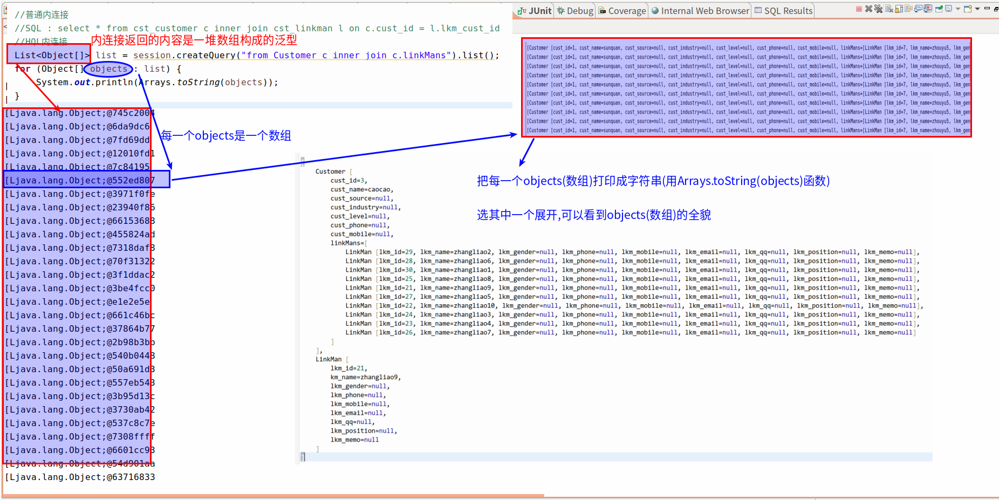
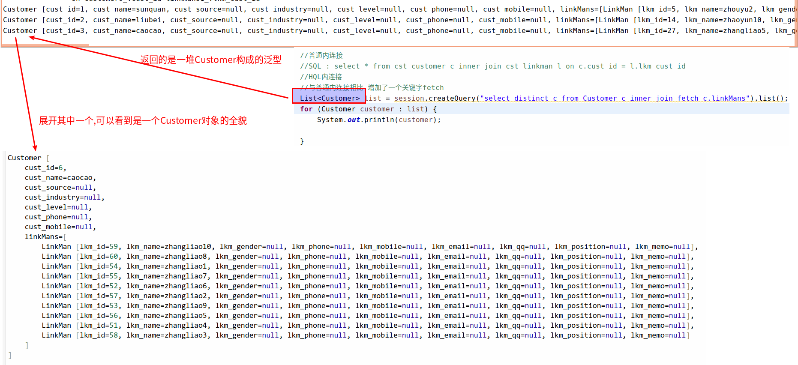

#   OID查询
Hibernate根据对象的OID(主键)进行检索
##  使用get方法
```java
Customer customer = session.get(Customer.class, 1L);
```
##  使用load方法
```java
Customer customer = session.load(Customer.class, 6L);
```
#   对象导航检索
Hibernate根据一个已经查询到的对象,获得其关联的对象的一种查询方式
```java
LinkMan linkMan = session.get(LinkMan.class, 2L);
Custoner customer = LinkMan.getCustomer();
```

#   HQL检索
Hibernate Query Language,Hibernate查询语言,这种语言和SQL极其类似,面向对象的查询语句
不支持`select *`这种写法
##  简单查询
```java
	@Test
	/**
	 * 简单的查询
	 */
	public void demo2() {
		Session session = HibernateUtils.getCurrentSession();
		Transaction tx = session.beginTransaction();

		// from Customer -> Customer是类名字
		// 理论上要写全称createQuery("from com.zjinc36.hibernate.Customer")
		// 但是我们配置了映射,就不需要了
		Query query = session.createQuery("from Customer");
		List<Customer> list = query.list();
		for (Customer customer : list) {
			System.out.println(customer);
		}

		tx.commit();
	}
```

##  别名查询
```java
	@Test
	/**
	 * 别名查询
	 */
	public void demo3() {
		Session session = HibernateUtils.getCurrentSession();
		Transaction tx = session.beginTransaction();

		// from Customer -> Customer是类名字
		// 理论上要写全称createQuery("from com.zjinc36.hibernate.Customer")
		// 但是我们配置了映射,就不需要
//		Query query = session.createQuery("from Customer c");
		Query query = session.createQuery("select c from Customer c");
		List<Customer> list = query.list();
		for (Customer customer : list) {
			System.out.println(customer);
		}

		tx.commit();
	}
```

##  排序查询
```java
	@Test
	/**
	 * 排序查询
	 */
	public void demo4() {
		Session session = HibernateUtils.getCurrentSession();
		Transaction tx = session.beginTransaction();
		// from Customer -> Customer是类名字
		// 理论上要写全称createQuery("from com.zjinc36.hibernate.Customer")
		// 但是我们配置了映射,就不需要
		// 升序查询
//		Query query = session.createQuery("from Customer order by cust_id");
		// 降序查询
		Query query = session.createQuery("from Customer order by cust_id desc");
		List<Customer> list = query.list();
		for (Customer customer : list) {
			System.out.println(customer);
		}
		tx.commit();
	}
```

##	条件查询
###	按位置绑定
```java
	@Test
	/**
	 * 条件查询
	 * 按位置绑定
	 */
	public void demo5() {
		Session session = HibernateUtils.getCurrentSession();
		Transaction tx = session.beginTransaction();
		// from Customer -> Customer是类名字
		// 理论上要写全称createQuery("from com.zjinc36.hibernate.Customer")
		// 但是我们配置了映射,就不需要
		Query query = session.createQuery("from Customer where cust_name like ?0");
		query.setParameter(0, "sun%");
		List<Customer> list = query.list();
		for (Customer customer : list) {
			System.out.println(customer);
		}
		tx.commit();
	}
```

###	按名称绑定
```java
	@Test
	/**
	 * 条件查询
	 * 按名称绑定
	 */
	public void demo6() {
		Session session = HibernateUtils.getCurrentSession();
		Transaction tx = session.beginTransaction();
		// from Customer -> Customer是类名字
		// 理论上要写全称createQuery("from com.zjinc36.hibernate.Customer")
		// 但是我们配置了映射,就不需要
		Query query = session.createQuery("from Customer where cust_name like :name");
		query.setParameter("name", "sun%");
		List<Customer> list = query.list();
		for (Customer customer : list) {
			System.out.println(customer);
		}
		tx.commit();
	}
```

##	投影查询
###	查询单个属性
```java
	@Test
	/**
	 * 投影查询
	 * 查询单个属性
	 */
	public void demo7() {
		Session session = HibernateUtils.getCurrentSession();
		Transaction tx = session.beginTransaction();
		// from Customer -> Customer是类名字
		// 理论上要写全称createQuery("from com.zjinc36.hibernate.Customer")
		// 但是我们配置了映射,就不需要
		// 查询单个属性
		Query query = session.createQuery("select c.cust_name from Customer c");
		List<Object> list = query.list();
		for (Object object : list) {
			System.out.println(object);
		}
		tx.commit();
	}
```

###	查询多个属性
####	返回的是数组
```java
	@Test
	/**
	 * 投影查询
	 * 查询多个属性
	 */
	public void demo8() {
		Session session = HibernateUtils.getCurrentSession();
		Transaction tx = session.beginTransaction();
		// from Customer -> Customer是类名字
		// 理论上要写全称createQuery("from com.zjinc36.hibernate.Customer")
		// 但是我们配置了映射,就不需要

		// 查询多个属性
		Query query = session.createQuery("select c.cust_id,c.cust_name from Customer c");
		// 注意这里和单个属性的区别
		// 返回的是数组
		List<Object[]> list = query.list();
		for (Object[] object : list) {
			System.out.println(Arrays.toString(object));
		}
		tx.commit();
	}
```

####	返回的是对象
1.	修改要查询的类
```java
public class Customer {
	private Long cust_id;
	private String cust_name;
	private String cust_source;
	private String cust_industry;
	private String cust_level;
	private String cust_phone;
	private String cust_mobile;

	//通过ORM方式表示:一个客户对应多个联系人
	//放置的是多的一方的集合,Hibernate默认使用的是Set集合
	private Set<LinkMan> linkMans = new HashSet<LinkMan>();

	public Customer() {
		super();
	}

	public Customer(Long cust_id, String cust_name) {
		super();
		this.cust_id = cust_id;
		this.cust_name = cust_name;
	}

	//code...
}
```
2.	进行查询
```java
	@Test
	/**
	 * 投影查询
	 * 查询多个属性,但是我想封装到对象中
	 */
	public void demo9() {
		Session session = HibernateUtils.getCurrentSession();
		Transaction tx = session.beginTransaction();
		// from Customer -> Customer是类名字
		// 理论上要写全称createQuery("from com.zjinc36.hibernate.Customer")
		// 但是我们配置了映射,就不需要

		// 查询多个属性
		Query query = session.createQuery("select new Customer(cust_id, cust_name) from Customer");
		// 返回的是数组
		List<Customer> list = query.list();
		for (Customer customer : list) {
			System.out.println(customer);
		}
		tx.commit();
	}
```

##  分页查询
```java
@Test
/**
 * 分页查询
 */
public void demo2() {
	Session session = HibernateUtils.getCurrentSession();
	Transaction tx = session.beginTransaction();

	// 通过session获得Query接口
	// 注意这里的Customer指的是类
	// 查询语句
	String hql = "from Customer";
	Query query = session.createQuery(hql);
	// 设置分页
	query.setFirstResult(0);
	query.setMaxResults(3);
	List<Customer> list = query.getResultList();
	for (Customer customer : list) {
		System.out.println(customer);
	}
	tx.commit();
}
```

##	聚合查询
```java
	@Test
	/**
	 * 聚合查询
	 */
	public void demo10() {
		Session session = HibernateUtils.getCurrentSession();
		Transaction tx = session.beginTransaction();
		// from Customer -> Customer是类名字
		// 理论上要写全称createQuery("from com.zjinc36.hibernate.Customer")
		// 但是我们配置了映射,就不需要

		// count(), max(), min(), avg(), sum()
		Query query = session.createQuery("select count(*) from Customer");
		Object count = query.uniqueResult();
		System.out.println(count);
		tx.commit();
	}
```

##	分组查询
```java
	@Test
	/**
	 * 分组统计查询
	 */
	public void demo11() {
		Session session = HibernateUtils.getCurrentSession();
		Transaction tx = session.beginTransaction();
		// from Customer -> Customer是类名字
		// 理论上要写全称createQuery("from com.zjinc36.hibernate.Customer")
		// 但是我们配置了映射,就不需要

		// 分组统计
		Query query = session.createQuery("select cust_source, count(*) from Customer group by cust_source");
		List<Object[]> list = query.list();
		for (Object[] objects : list) {
			System.out.println(Arrays.toString(objects));
		}
		tx.commit();
	}
```

##  HQL的多表查询
[*参考:SQL多表查询*](/2019/07/09/Hibernate的查询方式/#SQL的多表查询)
### 连接查询
####    交叉链接(笛卡尔积)
####    内连接
#####   显式内连接/隐式内连接
```java
	@Test
	/**
	 * HQL的多表查询
	 * HQL:普通内连接
	 */
	public void demo12() {
		Session session = HibernateUtils.getCurrentSession();
		Transaction tx = session.beginTransaction();

		//普通内连接
		//SQL : select * from cst_customer c inner join cst_linkman l on c.cust_id = l.lkm_cust_id
		//HQL内连接
		List<Object[]> list = session.createQuery("from Customer c inner join c.linkMans").list();
		for (Object[] objects : list) {
			System.out.println(Arrays.toString(objects));
		}

		tx.commit();
	}
```
#####   迫切内连接
```java
	@Test
	/**
	 * HQL的多表查询
	 * HOL:迫切内连接
	 */
	public void demo13() {
		Session session = HibernateUtils.getCurrentSession();
		Transaction tx = session.beginTransaction();

		//普通内连接
		//SQL : select * from cst_customer c inner join cst_linkman l on c.cust_id = l.lkm_cust_id
		//HQL内连接
		//与普通内连接相比,增加了一个关键字fetch
		List<Customer> list = session.createQuery("select distinct c from Customer c inner join fetch c.linkMans").list();
		for (Customer customer : list) {
			System.out.println(customer);
		}
		tx.commit();
	}
```
#####	普通内连接和迫切内连接的区别
普通内连接 -> 返回的是数组


迫切内连接 -> 返回的是对象


####    外连接
+   左外连接
+   右外连接
+   迫切左外连接

#   QBC检索
##	简单查询
```java
	@Test
	/**
	 * Criteria
	 */
	public void demo3() {
		Session session = HibernateUtils.getCurrentSession();
		Transaction tx = session.beginTransaction();

		// 写具体逻辑crud(增删改查)操作

		// 1创建Criteria对象 createCriteria()在hibernate5.2之后过时了
//		Criteria criteria = session.createCriteria(Customer.class);
//		List<Customer> list = criteria.list();
//		for (Student customer : list) {
//			System.out.println(customer);
//		}

		// 新的查询方式
		// 1.创建CriteriaBuilder对象
		// 注意导入的包是import javax.persistence.criteria.CriteriaQuery;
		CriteriaBuilder criteriaBuilder = session.getCriteriaBuilder();
		// 2.获取CriteriaQuery对象
		CriteriaQuery<Customer> createQuery = criteriaBuilder.createQuery(Customer.class);
		// 3.指定根条件
		createQuery.from(Customer.class);
		// 4执行查询
		List<Customer> List = session.createQuery(createQuery).getResultList();

		for (Customer customer : List) {
			System.err.println(customer);
		}

		tx.commit();
	}
```

##	模糊查询
```java
	/**
	 *	模糊查询
	 */
	@Test
	public void demo4() {
		//获取session对象
		Session session = HibernateUtils.getCurrentSession();
		//开启事务
		Transaction tx = session.beginTransaction();

		//写具体逻辑crud(增删改查)操作

//		//创建Criteria对象 createCriteria()在hibernate5.2之后过时了
//		Criteria criteria = session.createCriteria(Customer.class);
//		criteria.add(Restrictions.like("cust_name", "zhang%"));
//		List<Customer> list = criteria.list();
//		for (Student customer : list) {
//			System.out.println(customer);
//		}

		//新的查询方式
		//1.创建CriteriaBuilder对象
		//注意导入的包是import javax.persistence.criteria.CriteriaQuery;
		CriteriaBuilder criteriaBuilder = session.getCriteriaBuilder();
		//2.获取CriteriaQuery对象
		CriteriaQuery<Customer> createQuery = criteriaBuilder.createQuery(Customer.class);
		//3.指定根条件
		Root<Customer> root = createQuery.from(Customer.class);
		//root.get("name") "name"是实体类的属性名称
		createQuery.where(criteriaBuilder.like(root.get("cust_name"), "%zhang%"));
		//4.执行查询
		List<Customer> List = session.createQuery(createQuery).getResultList();

		for (Customer customer : List) {
			System.err.println(customer);
		}

		//提交事务
		tx.commit();
	}
```

##  离线条件查询
### 什么是离线条件查询
[_参考:https://zhidao.baidu.com/question/542663097.html_](https://zhidao.baidu.com/question/542663097.html)
离线查询其实就是动态查询DetachedCriteria
###	为什么需要离线条件查询
[*参考:https://zhidao.baidu.com/question/542663097.html*](https://zhidao.baidu.com/question/542663097.html)
+	场景:一般我们进行web开发都会碰到多条件查询.例如根据条件搜索.条件的多少 逻辑关系 是or 还是and等等
+	我们要根据这些条件来拼写查询语句,这样就需要频繁改动查询语句
+	有了离线查询可以解决这个痛点,我们可以使用DetachedCriteria来构造查询条件,然后将这个DetachedCriteria作为方法调用参数传递给Service层对象.而业务层对象获得DetachedCriteria之后,可以在session范围内直接构造Criteria,进行查询.就此,查询语句的构造完全被搬离到web层实现,而service层则只负责完成持久化和查询的封装即可.
+	换句话说,service层代码是不变化的.我们不必为了查询条件的变化而去频繁改动查询语句了

### 代码怎么写
[*参考:https://elf8848.iteye.com/blog/342688*](https://elf8848.iteye.com/blog/342688)
```java
	@Test
	/**
	 * web层
	 */
	public void webDemo() {
		DetachedCriteria dc = DetachedCriteria.forClass(Customer.class);
		// String name = request.getParameter("name");
		String cust_name = "liu%";
		// 拼查询条件
		if (cust_name != null) {
			dc.add(Restrictions.like("cust_name", cust_name));
		}
		List customers = query(dc);
		for (Object object : customers) {
			System.out.println(object);
		}
	}

	/**
	 * service层
	 */
	public static List query(DetachedCriteria detachedCriteria) {
		Session session = HibernateUtils.getCurrentSession();
		Transaction transaction = session.beginTransaction();
		Criteria criteria = detachedCriteria.getExecutableCriteria(session);
		List<Customer> list = criteria.list();
		return list;
	}
```

### 有可能遇到`failed to lazily initialize a collection of role`问题
[*参考http://www.itzhai.com/hibernate-load-data-failed-failed-to-lazily-initialize-a-collection-of-role.html*](http://www.itzhai.com/hibernate-load-data-failed-failed-to-lazily-initialize-a-collection-of-role.html)
里面有一段话如下
>	该映射并没有设置lazy,所以这里是使用了默认的lazy=”true”,所以导致在页面获取时,因为session已经关闭,所以获取不到questionAnswer的数据.
>	所以为了解决这个问题,可以在set的lazy设置为false：
>	为set设置lazy=”false”

**问题本质**
其实问题的本质就是代码中session已经被关闭了,但是代码中还有使用到,就是要确保使用session时候,session没有被关闭就行

#   SQL检索
##  简单的查询
```java
	@Test
	public void demo1() {
		Session session = HibernateUtils.getCurrentSession();
		Transaction tx = session.beginTransaction();

		NativeQuery sqlQuery = session.createSQLQuery("select * from cst_customer");
		List<Object[]> list = sqlQuery.list();
		for (Object[] objects : list) {
			System.out.println(Arrays.toString(objects));
		}
	}
```

##	查询结果指定列
[*参考:SQL查询 addScalar()或addEntity()*](https://blog.csdn.net/vacblog/article/details/7769976)
```java
	@Test
	public void demo3() {
		Session session = HibernateUtils.getCurrentSession();
		Transaction tx = session.beginTransaction();

		NativeQuery sqlQuery = session.createSQLQuery("select * from cst_customer");
		sqlQuery.addScalar("cust_id", StandardBasicTypes.BIG_INTEGER);
		sqlQuery.addScalar("cust_name", StandardBasicTypes.STRING);
		List<Object[]> list = sqlQuery.list();
		for (Object[] objects : list) {
			System.out.println(Arrays.toString(objects));
		}
	}
```

##	查询结果封装到对象
[*参考:SQL查询 addScalar()或addEntity()*](https://blog.csdn.net/vacblog/article/details/7769976)
```java
	@Test
	public void demo2() {
		Session session = HibernateUtils.getCurrentSession();
		Transaction tx = session.beginTransaction();

		NativeQuery sqlQuery = session.createSQLQuery("select * from cst_customer");
		sqlQuery.addEntity(Customer.class);
		List<Customer> list = sqlQuery.list();
		for (Customer customer : list) {
			System.out.println(customer);
		}
	}
```

##	SQL的多表查询
+   交叉链接(笛卡尔积)
>   select * from A,B;
+   内连接(inner join -> inner可以省略)
>   显式内连接:select * from A,B where A.id=B.id;
>   隐式内连接:select * from A inner join B on A.id=B.id;
+   外连接(outer可以省略)
>   左外连接:select * from A left outer join B on A.id=B.aid;
>   右外连接:select * from A right outer join B on A.id=B.aid;
