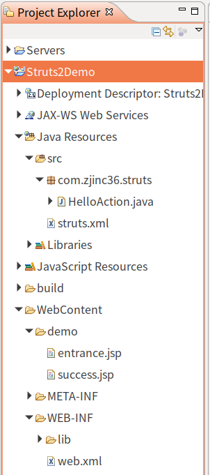

#   Struts2是什么
>   [*参考:官网:https://struts.apache.org/*](https://struts.apache.org/)

>   Apache Struts is a free, open-source, MVC framework for creating elegant, modern Java web applications. It favors convention over configuration, is extensible using a plugin architecture, and ships with plugins to support REST, AJAX and JSON.(翻译:apache Struts是一个免费的，开源的MVC框架，用于创建优雅，现代的Java Web应用程序。 它支持约定优于配置，可使用插件体系结构进行扩展，并附带插件以支持REST，AJAX和JSON)
>   [*参考:维基百科:Struts*](https://zh.wikipedia.org/wiki/Struts)
>   Struts是Apache软件基金会（ASF）赞助的一个开源项目。它最初是Jakarta项目中的一个子项目，并在2004年3月成为ASF的顶级项目。它通过采用Java Servlet／JSP技术，实现了基于Java EE Web应用的Model-View-Controller（MVC）设计模式的应用框架，是MVC经典设计模式中的一个经典产品
>   [*参考:维基百科:Struts2*](https://zh.wikipedia.org/wiki/Struts)
>   Struts2缘起于Apache Struts的WebWork框架，旨在提供相对于Struts框架的增强和改进，同时保留与Struts框架类似的结构

>   [*参考:百度百科*](https://baike.baidu.com/item/Struts%202/2187934?fromtitle=Struts2&fromid=10711345&fr=aladdin)
>   Struts2是一个基于MVC设计模式的Web应用框架，它本质上相当于一个servlet，在MVC设计模式中，Struts2作为控制器(Controller)来建立模型与视图的数据交互

#   常见的Web层框架
+   Struts2
+   Webwork
+   SpringMVC

#   Struts2的开发环境
1.  下载

2.  包说明


#   创建Web项目(引入jar包)
1.  如何知道要引入什么jar包

2.  引入如下jar包


#   Struts2的示例项目
1.  项目文件导航

2.  创建入口文件entrance.jsp
在项目下的创建入口文件WebContent/demo/entrance.jsp
```html
<%@ page language="java" contentType="text/html; charset=UTF-8"
    pageEncoding="UTF-8"%>
<!DOCTYPE html>
<html>
<head>
<meta charset="UTF-8">
<title>Struts2的入门</title>
</head>
<body>
	<h1>Struts2的入门</h1>
	<h3><a href="${ pageContext.request.contextPath }/hello.action">Struts2的入门</a></h3>
</body>
</html>
```
3.  配置核心过滤器web.xml
```xml
<?xml version="1.0" encoding="UTF-8"?>
<web-app xmlns:xsi="http://www.w3.org/2001/XMLSchema-instance" xmlns="http://java.sun.com/xml/ns/javaee" xsi:schemaLocation="http://java.sun.com/xml/ns/javaee http://java.sun.com/xml/ns/javaee/web-app_2_5.xsd" id="WebApp_ID" version="2.5">
  <display-name>Struts2Demo</display-name>
  <welcome-file-list>
    <welcome-file>index.html</welcome-file>
    <welcome-file>index.htm</welcome-file>
    <welcome-file>index.jsp</welcome-file>
    <welcome-file>default.html</welcome-file>
    <welcome-file>default.htm</welcome-file>
    <welcome-file>default.jsp</welcome-file>
  </welcome-file-list>
  <!-- 配置Struts2的核心过滤器 -->
  <filter>
  	<filter-name>struts2</filter-name>
  	<filter-class>org.apache.struts2.dispatcher.ng.filter.StrutsPrepareAndExecuteFilter</filter-class>
  </filter>
  <filter-mapping>
  	<filter-name>struts2</filter-name>
  	<url-pattern>/*</url-pattern>
  </filter-mapping>
</web-app>
```
4.  创建Action文件HelloAction.java
```java
package com.zjinc36.struts;
/**
 * Struts2的入门的Action类
 * @author zjc
 *
 */
public class HelloAction {
	/**
	 * 提供一个方法
	 * 方法的写法是固定的
	 * 		返回值是String类型
	 * 		方法名是execute
	 * 		这个方法中不能传递参数
	 */
	public String execute() {
		System.out.println("HelloAction...执行了");
		return "success";
	}
}
```
5.  创建Action的映射struts.xml
```xml
<?xml version="1.0" encoding="UTF-8" ?>
<!DOCTYPE struts PUBLIC
	"-//Apache Software Foundation//DTD Struts Configuration 2.3//EN"
	"http://struts.apache.org/dtds/struts-2.3.dtd">

<struts>
	<!-- Struts2为了管理Action的配置,通过包进行管理 -->
	<!-- 配置Struts2的包 -->
	<!-- name:包名,可以随便写,但是要唯一 -->
	<package name="demo" extends="struts-default" namespace="/">
		<!-- 配置Action -->
		<!-- name和访问的路径要一致 -->
		<!-- class是包名 -->
		<action name="hello" class="com.zjinc36.struts.HelloAction">
			<!-- 配置页面的跳转 -->
			<result name="success">/demo/success.jsp</result>
		</action>
	</package>
</struts>

```
6.  创建出口文件success.jsp
```html
<%@ page language="java" contentType="text/html; charset=UTF-8"
    pageEncoding="UTF-8"%>
<!DOCTYPE html>
<html>
<head>
<meta charset="UTF-8">
<title>Insert title here</title>
</head>
<body>
	<h1>跳转成功页面</h1>
</body>
</html>
```

#	执行流程


1.  当用户访问某一个Action的时候,先经过核心过滤器
2.  在核心过滤器中执行一组拦截器(这组拦截器实现部分功能),执行目标Action
3.  根据Action的返回值,执行跳转

#  加载顺序
1.  default.properties
2.  struts-default.xml
3.  struts-plugin.xml
4.  struts.xml
5.  struts.properties
6.  web.xml

**注意:后配置的常量的值会覆盖先配置的常量的值**

#   Structs的常见配置
##  package的配置
1.  package写在哪
>   对于上述项目,package标签写在struts.xml文件中.
2.  package是什么标签
>   package标签称为包,这个包与java中的包的概念不一致,包为了更好管理action.
3.  package标签的属性
>   +   name:包的名称,在一个项目中不可重复
>   +   extends:继承哪个包,通常值为struts-default
>   +   abstract:抽象的,允许其他包继承
>   +   namespace:名称空间,与<action>标签中的name属性共同决定访问路径
>   名称空间有三种写法
>   1.  带名称的空间 -> /aaa /aaa/bbb
>   2.  根名称空间 -> namespace="/"
>   3.  默认名称空间 -> namespace=""
>   区别在于访问顺序不同,先找带名称的空间,然后去根名称空间,然后才是默认名称空间

##  action映射的配置
1.  action映射写在哪
>   对于上述项目,action映射标签写在struts.xml文件中.
2.  action映射是什么标签
>   action映射标签配置Action类
3.  action映射标签的属性
>   +   name:与namespace共同决定访问路径
>   +   class:Action类的全路径
>   +   method:执行Action中的哪个方法的方法名,默认值execute,可以显式写成其他方法
>   +   converter:用于设置类型转换器

##  结果页面的配置
1.  全局结果页面配置
>   +   global-results
>   +   在包中配置一次,其他的在这个包中的所有的action只要返回了这个值,都可以跳转到这个页面,即这对这个包下的所有的action的配置都有效
2.  局部结果页面配置
>   [_参考:result标签的配置_](/2019/07/10/Struts2入门和配置/#result标签的配置)
>   +   resutl标签
>   +   针对当前的action有效
```java
<?xml version="1.0" encoding="UTF-8" ?>
<!DOCTYPE struts PUBLIC
	"-//Apache Software Foundation//DTD Struts Configuration 2.3//EN"
	"http://struts.apache.org/dtds/struts-2.3.dtd">
<struts>
	<package name="demo3" extends="struts-default" namespace="/">
		<global-results>
			<result name="success">success.jsp</result>
		</global-results>
		<action name="requestDemo1" class="com.zjinc36.demo3.requestDemo1">
			<result name="success">success.jsp</result>
		</action>
		<action name="requestDemo2" class="com.zjinc36.demo3.requestDemo2">
			<result name="success">success.jsp</result>
		</action>
		<action name="requestDemo3" class="com.zjinc36.demo3.requestDemo3">
			<result name="success">success.jsp</result>
		</action>
	</package>
</struts>
```

##  result标签的配置
[_参考:结果页面的配置_](/2019/07/10/Struts2入门和配置/#结果页面的配置)
1.  result标签的属性
>   +   name:逻辑视图名称,默认值为success
>   +   type:有很多值
>       1.   dispatcher:默认值,请求转发
>       2.   redirect:重定向(Action重定向jsp)
>       3.   chain:转发(Action转发Action)
>       4.   redirectAction:重定向(Action重定向Action)
>       5.   stream:文件下载的功能
2.  type的属性去哪里找


##  Struts常量配置
1.  去哪里找
[_常见的常量_](https://blog.csdn.net/hao2244/article/details/50429917)
在Struts2框架中,提供了非常多的常量,去Libraries下的`/org/apache/struts2/default.properties`找

>   struts.i18n.encoding=UTF-8:Struts2中所有post请求的中文乱码不用处理了
>   struts.action.extension=action,,:请求的默认扩展名,默认扩展名是`.action`或什么都不写
>   ...

2.  要修改常量怎么改
修改常量的值,可以有三个位置进行修正
    1.  struts.xml -> constant标签
```xml
<!-- 注意constant标签 -->
<?xml version="1.0" encoding="UTF-8" ?>
<!DOCTYPE struts PUBLIC
	"-//Apache Software Foundation//DTD Struts Configuration 2.3//EN"
	"http://struts.apache.org/dtds/struts-2.3.dtd">
<struts>
	<!-- 配置structs2的常量 -->
	<constant name="struts.action.extension" value="abc" />

	<!-- Struts2为了管理Action的配置,通过包进行管理 -->
	<!-- 配置Struts2的包 -->
	<!-- name:包名,可以随便写,但是要唯一 -->
	<package name="demo" extends="struts-default" namespace="/">
		<!-- 配置Action -->
		<!-- name和访问的路径要一致 -->
		<!-- class是包名 -->
		<action name="hello" class="com.zjinc36.struts.HelloAction">
			<!-- 配置页面的跳转 -->
			<result name="success">/demo/success.jsp</result>
		</action>
	</package>
</struts>
```
    2.  struts.properties -> 用户自定义的
    3.  web.xml -> init-param标签
```xml
<?xml version="1.0" encoding="UTF-8"?>
<web-app xmlns:xsi="http://www.w3.org/2001/XMLSchema-instance" xmlns="http://java.sun.com/xml/ns/javaee" xsi:schemaLocation="http://java.sun.com/xml/ns/javaee http://java.sun.com/xml/ns/javaee/web-app_2_5.xsd" id="WebApp_ID" version="2.5">
  <display-name>Struts2Demo</display-name>
  <welcome-file-list>
    <welcome-file>index.html</welcome-file>
    <welcome-file>index.htm</welcome-file>
    <welcome-file>index.jsp</welcome-file>
    <welcome-file>default.html</welcome-file>
    <welcome-file>default.htm</welcome-file>
    <welcome-file>default.jsp</welcome-file>
  </welcome-file-list>
  <!-- 配置Struts2的核心过滤器 -->
  <filter>
  	<filter-name>struts2</filter-name>
  	<filter-class>org.apache.struts2.dispatcher.ng.filter.StrutsPrepareAndExecuteFilter</filter-class>
  	<!-- 修改常量 -->
  	<init-param>
  		<param-name>struts.action.extension</param-name>
  		<param-value>xyz</param-value>
  	</init-param>
  </filter>
  <filter-mapping>
  	<filter-name>struts2</filter-name>
  	<url-pattern>/*</url-pattern>
  </filter-mapping>
</web-app>
```

#   分模块开发配置
主要用于团队开发
1.  文件位置

2.  文件内容
>   +   struts_personal.xml,个人自定义配置
>   +   struts.xml团队配置
```xml
<!-- struts.xml -->
<?xml version="1.0" encoding="UTF-8" ?>
<!DOCTYPE struts PUBLIC
	"-//Apache Software Foundation//DTD Struts Configuration 2.3//EN"
	"http://struts.apache.org/dtds/struts-2.3.dtd">
<struts>
	<include file="com/zjinc36/struts/struts_personal.xml" />
</struts>
```

#   Action的编写方式
1.  Action编写方式一
纯粹写个Action文件
```java
package com.zjinc36.struts;
public class HelloAction {
	/**
	 * 提供一个方法
	 * 方法的写法是固定的
	 * 		返回值是String类型
	 * 		方法名是execute
	 * 		这个方法中不能传递参数
	 */
	public String execute() {
		System.out.println("HelloAction...执行了");
		return "success";
	}
}
```
2.  Action编写方式二
实现Action接口
```java
package com.zjinc36.struts;

import com.opensymphony.xwork2.Action;

/**
 * Action编写方式二:实现Action接口
 * 这种方式,提供了五个常量(五个逻辑视图名称)
 * +	SUCCESS:成功
 * +	ERROR:失败
 * +	LOGIN:登录出错的信息页面
 * +	INPUT:表单校验的时候出错
 * +	NONE:不调转
 * @author zjc
 *
 */
public class Struts2Demo01Action implements Action{

	@Override
	public String execute() throws Exception {
		System.out.println("ok");
		return null;
	}
}

```

3.  Action编写方式三(推荐)
Action类继承ActionSupport类
```java
package com.zjinc36.struts;

import com.opensymphony.xwork2.ActionSupport;

/**
 * Action编写方式三:Action类继承ActionSupport类
 * 推荐使用继承ActionSupport方式
 * +	ActionSupport中提供了数据校验,国际化等一系列操作的方法
 * @author zjc
 *
 */
public class Struts2Demo02Action extends ActionSupport{
	@Override
	public String execute() throws Exception {
		System.out.println("ok");
		return null;
	}
}
```

#   Action的访问
+   通过method设置
```html
<body>
	<h3><a href="${ pageContext.request.contextPath }/userFind.action">查询用户</a></h3>
	<h3><a href="${ pageContext.request.contextPath }/userUpdate.action">修改用户</a></h3>
	<h3><a href="${ pageContext.request.contextPath }/userDelete.action">删除用户</a></h3>
	<h3><a href="${ pageContext.request.contextPath }/userSave.action">保存用户</a></h3>
</body>
```
```xml
	<package name="demo2" extends="struts-default" namespace="/demo2">
		<action name="userFind" class="com.zjinc36.Demo2.UserAction" method="find"></action>
		<action name="userUpdate" class="com.zjinc36.Demo2.UserAction" method="update"></action>
		<action name="userDelete" class="com.zjinc36.Demo2.UserAction" method="delete"></action>
		<action name="userSave" class="com.zjinc36.Demo2.UserAction" method="save"></action>
	</package>
```
```java
package com.zjinc36.Demo2;


public class UserAction{
	public String find() {
		System.out.println("find");
		return null;
	}
	//code...
}
```

+   通过通配符的方式进行配置
其他和上述method一致,就xml文件要使用通配符
```xml
<action name="user*" class="com.zjinc36.Demo2.UserAction" method="{1}"></action>
```
更加抽象
```xml
<!-- 和前文无关 -->
<action name="**" class="xxx.{1}" method="{2}"></action>
```
+   动态方法访问配置
```html
<body>
	<h3><a href="${ pageContext.request.contextPath }/user!find.action">查询用户</a></h3>
</body>
```
```xml
<!-- 开启动态访问 -->
<!-- 默认是没有开启动态访问的 -->
<constant name="struts.enable.DynamicMehtodInvocation" value="true"></constant>
<package name="demo2" extends="struts-default" namespace="/demo2">
    <action name="userFind" class="com.zjinc36.Demo2.UserAction"></action>
</package>
```

