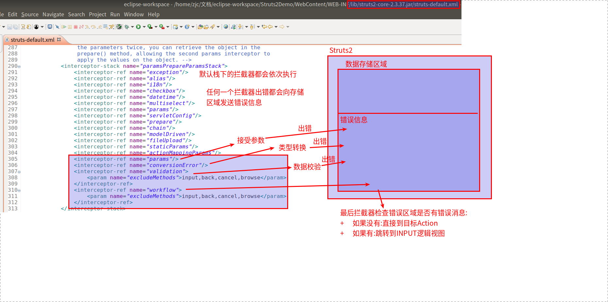
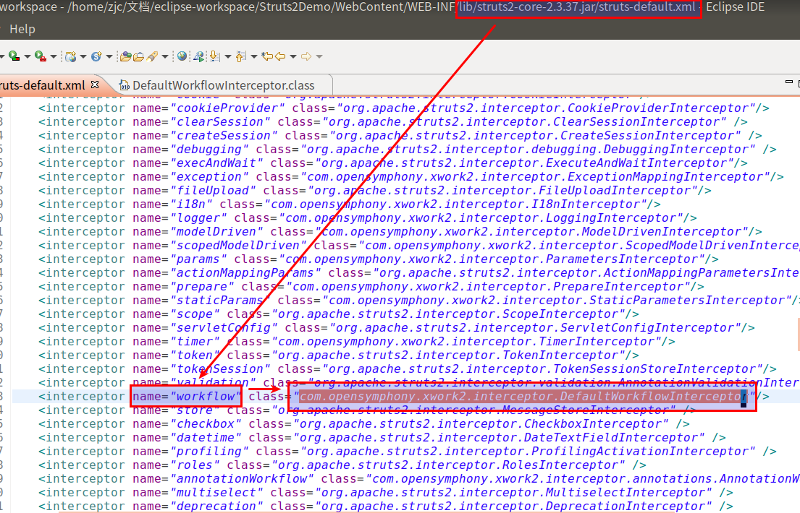
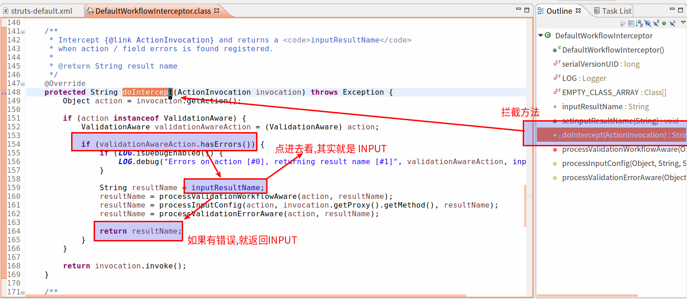

#   Struts2的数据封装
+ date: 2019-07-10 20:36:51
+ description: Struts2提供了数据封装的功能,将提交的数据封装到一个类中
+ categories:
  - Java
+ tags:
  - Struts2
---
>   Struts2提供了数据封装的功能,将提交的数据封装到一个类中
#	封装到对象中
##   属性驱动:提供属性set方法的方式
###  1.入口
```html
<%@ page language="java" contentType="text/html; charset=UTF-8"
    pageEncoding="UTF-8"%>
<!DOCTYPE html>
<html>
<head>
<meta charset="UTF-8">
<title>Insert title here</title>
</head>
<body>
	<h3>属性驱动:提供属性set方法的方式</h3>
	<form action="${ pageContext.request.contextPath }/userAction.action" method="post">
		用户名:<input type="text" name="username" /><br/>
		密码:<input type="password" name="password" /><br/>
		年龄:<input type="text" name="age" /><br/>
		生日:<input type="text" name="birthday" /><br/>
		工资:<input type="text" name="salary" /><br/>
		<input type="submit" name="提交" />
	</form>
</body>
</html>
```
###  2.用户类
```java
package com.zjinc36.demo4;

import java.sql.Date;

public class User {
	private String username;
	private String password;
	private Integer age;
	private Date birthday;
	private Double salary;

	public String getUsername() {
		return username;
	}
	public void setUsername(String username) {
		this.username = username;
	}
	public String getPassword() {
		return password;
	}
	public void setPassword(String password) {
		this.password = password;
	}
	public Integer getAge() {
		return age;
	}
	public void setAge(Integer age) {
		this.age = age;
	}
	public Date getBirthday() {
		return birthday;
	}
	public void setBirthday(Date birthday) {
		this.birthday = birthday;
	}
	public Double getSalary() {
		return salary;
	}
	public void setSalary(Double salary) {
		this.salary = salary;
	}
}

```
###  3.Action(同时将数据封装到用户类)
```java
package com.zjinc36.demo4;

import java.sql.Date;

import com.opensymphony.xwork2.ActionSupport;

/**
 * 数据封装方式一:提供属性的set方法的方式
 * @author zjc
 *
 */
public class UserAction extends ActionSupport{
	private String username;
	private String password;
	private Integer age;
	private Date birthday;
	private Double salary;
	public void setUsername(String username) {
		this.username = username;
	}
	public void setPassword(String password) {
		this.password = password;
	}
	public void setAge(Integer age) {
		this.age = age;
	}
	public void setBirthday(Date birthday) {
		System.out.println(birthday);
		this.birthday = birthday;
	}
	public void setSalary(Double salary) {
		this.salary = salary;
	}

	@Override
	public String execute() throws Exception {
		System.out.println(username);
		System.out.println(password);
		System.out.println(age);
		System.out.println(birthday);
		System.out.println(salary);
		//封装数据
		User user = new User();
		user.setUsername(username);
		user.setPassword(password);
		user.setAge(age);
		user.setBirthday(birthday);
		user.setSalary(salary);
		return NONE;
	}
}

```
###  3.Action映射
```xml
<?xml version="1.0" encoding="UTF-8" ?>
<!DOCTYPE struts PUBLIC
	"-//Apache Software Foundation//DTD Struts Configuration 2.3//EN"
	"http://struts.apache.org/dtds/struts-2.3.dtd">
<struts>
	<package name="demo4" extends="struts-default" namespace="/">
		<action name="userAction" class="com.zjinc36.demo4.UserAction">
			<result name="success">success.jsp</result>
		</action>
	</package>
</struts>

```

##   属性驱动:页面中提供表达式方式
###	1.入口(重要)
```html
<%@ page language="java" contentType="text/html; charset=UTF-8"
    pageEncoding="UTF-8"%>
<!DOCTYPE html>
<html>
<head>
<meta charset="UTF-8">
<title>Insert title here</title>
</head>
<body>
	<h3>属性驱动:提供属性set方法的方式</h3>
	<form action="${ pageContext.request.contextPath }/user2Action.action" method="post">
		用户名:<input type="text" name="user.username" /><br/>
		密码:<input type="password" name="user.password" /><br/>
		年龄:<input type="text" name="user.age" /><br/>
		生日:<input type="text" name="user.birthday" /><br/>
		工资:<input type="text" name="user.salary" /><br/>
		<input type="submit" name="提交" />
	</form>
</body>
</html>
```
###	2.用户类
```java
package com.zjinc36.demo4;

import java.sql.Date;

public class User {
	private String username;
	private String password;
	private Integer age;
	private Date birthday;
	private Double salary;

	public String getUsername() {
		return username;
	}
	public void setUsername(String username) {
		this.username = username;
	}
	public String getPassword() {
		return password;
	}
	public void setPassword(String password) {
		this.password = password;
	}
	public Integer getAge() {
		return age;
	}
	public void setAge(Integer age) {
		this.age = age;
	}
	public Date getBirthday() {
		return birthday;
	}
	public void setBirthday(Date birthday) {
		this.birthday = birthday;
	}
	public Double getSalary() {
		return salary;
	}
	public void setSalary(Double salary) {
		this.salary = salary;
	}
	@Override
	public String toString() {
		return "User [username=" + username + ", password=" + password
				+ ", age=" + age + ", birthday=" + birthday + ", salary="
				+ salary + "]";
	}
}
```

###	3.Action(同时将数据封装到用户类)
```java
package com.zjinc36.demo4;

import com.opensymphony.xwork2.ActionSupport;

public class User2Action extends ActionSupport {
	// 提供一个User对象
	private User user;
	// 提供user的set和get方法,一定要提供get方法
	public User getUser() {
		return user;
	}
	public void setUser(User user) {
		this.user = user;
	}
	@Override
	public String execute() throws Exception {
		System.out.println(user);
		return NONE;
	}
}
```

###	4.Action映射
```xml
<?xml version="1.0" encoding="UTF-8" ?>
<!DOCTYPE struts PUBLIC
	"-//Apache Software Foundation//DTD Struts Configuration 2.3//EN"
	"http://struts.apache.org/dtds/struts-2.3.dtd">
<struts>
	<package name="demo4" extends="struts-default" namespace="/">
		<action name="user2Action" class="com.zjinc36.demo4.User2Action">
			<result name="success">success.jsp</result>
		</action>
	</package>
</struts>
```

##   模型驱动:采用模型驱动方式
###  1.入口
```html
<%@ page language="java" contentType="text/html; charset=UTF-8"
    pageEncoding="UTF-8"%>
<!DOCTYPE html>
<html>
<head>
<meta charset="UTF-8">
<title>Insert title here</title>
</head>
<body>
	<h3>属性驱动:提供属性set方法的方式</h3>
	<form action="${ pageContext.request.contextPath }/user3Action.action" method="post">
		用户名:<input type="text" name="username" /><br/>
		密码:<input type="password" name="password" /><br/>
		年龄:<input type="text" name="age" /><br/>
		生日:<input type="text" name="birthday" /><br/>
		工资:<input type="text" name="salary" /><br/>
		<input type="submit" name="提交" />
	</form>
</body>
</html>
```
###	2.用户类
```java
package com.zjinc36.demo4;

import java.sql.Date;

public class User {
	private String username;
	private String password;
	private Integer age;
	private Date birthday;
	private Double salary;

	public String getUsername() {
		return username;
	}
	public void setUsername(String username) {
		this.username = username;
	}
	public String getPassword() {
		return password;
	}
	public void setPassword(String password) {
		this.password = password;
	}
	public Integer getAge() {
		return age;
	}
	public void setAge(Integer age) {
		this.age = age;
	}
	public Date getBirthday() {
		return birthday;
	}
	public void setBirthday(Date birthday) {
		this.birthday = birthday;
	}
	public Double getSalary() {
		return salary;
	}
	public void setSalary(Double salary) {
		this.salary = salary;
	}
	@Override
	public String toString() {
		return "User [username=" + username + ", password=" + password
				+ ", age=" + age + ", birthday=" + birthday + ", salary="
				+ salary + "]";
	}
}
```

###	3.Action(同时封装数据)
**注意:如果有非常多的set要写,可以实现ModelDriven接口**
具体可以看[_ModelDriven接口_](https://blog.csdn.net/chentiefeng521/article/details/58594350)

```java
package com.zjinc36.demo4;

import java.sql.Date;

import com.opensymphony.xwork2.ActionSupport;

/**
 * 数据封装方式一:提供属性的set方法的方式
 * @author zjc
 *
 */
public class UserAction extends ActionSupport{
	private String username;
	private String password;
	private Integer age;
	private Date birthday;
	private Double salary;
	public void setUsername(String username) {
		this.username = username;
	}
	public void setPassword(String password) {
		this.password = password;
	}
	public void setAge(Integer age) {
		this.age = age;
	}
	public void setBirthday(Date birthday) {
		System.out.println(birthday);
		this.birthday = birthday;
	}
	public void setSalary(Double salary) {
		this.salary = salary;
	}

	@Override
	public String execute() throws Exception {
		System.out.println(username);
		System.out.println(password);
		System.out.println(age);
		System.out.println(birthday);
		System.out.println(salary);
		//封装数据
		User user = new User();
		user.setUsername(username);
		user.setPassword(password);
		user.setAge(age);
		user.setBirthday(birthday);
		user.setSalary(salary);
		return NONE;
	}
}
```

###	4.Action的映射
```xml
<?xml version="1.0" encoding="UTF-8" ?>
<!DOCTYPE struts PUBLIC
	"-//Apache Software Foundation//DTD Struts Configuration 2.3//EN"
	"http://struts.apache.org/dtds/struts-2.3.dtd">
<struts>
	<package name="demo4" extends="struts-default" namespace="/">
		<action name="userAction" class="com.zjinc36.demo4.UserAction">
			<result name="success">success.jsp</result>
		</action>
		<action name="user2Action" class="com.zjinc36.demo4.User2Action">
			<result name="success">success.jsp</result>
		</action>
		<action name="user3Action" class="com.zjinc36.demo4.User3Action">
			<result name="success">success.jsp</result>
		</action>
	</package>
</struts>
```

##	模型驱动方式和属性驱动的辨析
+	模型驱动方式是最常用的方式,但缺点是只能同时向一个对象中封装数据
+   使用属性驱动(页面提供表达式方式)也是较常用的方式,可以向多个对象中封装数据,就是比较麻烦


##   INPUT逻辑视图配置
###  出现的问题
传入的参数类型和Action中定义的类型不一致时,会出现404错误
##  问题根源说明










1.  默认栈下的拦截器会依次执行
2.  任何一个栈出错都会向Struts2的错误信息存储区域发送数据
3.  如果没有任何错误,会直接转到Action
4.  如果有错误(本问题中是有`params`拦截器会发送错误),会交由`workflow`拦截器进行处理
5.  `workflow`对应类的`doIntercep`方法中可以看到,当错误出现的时候,返回的是`INPUT`这个页面
6.  当我们如下配置xml映射文件
```xml
	<package name="demo4" extends="struts-default" namespace="/">
		<action name="userAction" class="com.zjinc36.demo4.UserAction">
			<result name="success">success.jsp</result>
		</action>
	</package>
```
7.  里面只配置了`success`而没有配置`INPUT`,就会找不到页面,也就返回404错误了

##  解决
在映射文件中配置input
```xml
<?xml version="1.0" encoding="UTF-8" ?>
<!DOCTYPE struts PUBLIC
	"-//Apache Software Foundation//DTD Struts Configuration 2.3//EN"
	"http://struts.apache.org/dtds/struts-2.3.dtd">
<struts>
	<package name="demo4" extends="struts-default" namespace="/">
		<global-results>
			<result name="input">input.jsp</result>
		</global-results>
		<action name="userAction" class="com.zjinc36.demo4.UserAction">
			<result name="success">success.jsp</result>
		</action>
	</package>
</struts>

```

###	稍微扩展一下
如果在input.jsp文件做如下配置,可以打印出错误信息
+	taglib指令的使用
+	JSLT的写法 -> \<s:fielderror/\>
```html
<%@ page language="java" contentType="text/html; charset=UTF-8"
    pageEncoding="UTF-8"%>
<%@ taglib uri="/struts-tags" prefix="s" %>
<!DOCTYPE html>
<html>
<head>
<meta charset="UTF-8">
<title>Insert title here</title>
</head>
<body>
	<h1>input</h1>
	<s:fielderror/>
</body>
</html>
```

#   封装到容器中
##  封装到List中
### 1.入口
```html
<%@ page language="java" contentType="text/html; charset=UTF-8"
    pageEncoding="UTF-8"%>
<!DOCTYPE html>
<html>
<head>
<meta charset="UTF-8">
<title>Insert title here</title>
</head>
<body>
	<h3>封装到List集合中:批量插入商品</h3>
	<form action="${ pageContext.request.contextPath }/productAction.action" method="post">
		商品名称:<input type="text" name="products[0].name"><br/>
		商品价格:<input type="text" name="products[0].price"><br/>
		商品名称:<input type="text" name="products[1].name"><br/>
		商品价格:<input type="text" name="products[1].price"><br/>
		商品名称:<input type="text" name="products[2].name"><br/>
		商品价格:<input type="text" name="products[2].price"><br/>
		<input type="submit" name="提交" />
	</form>
</body>
</html>
```

###	2.Action
```java
package com.zjinc36.demo5;

import java.util.List;

import com.opensymphony.xwork2.ActionSupport;

public class ProductAction extends ActionSupport {
	private List<Product> products;
	@Override
	public String execute() throws Exception {
		System.out.println(1);
		for (Product product : products) {
			System.out.println(product);
		}
		return NONE;
	}

	public void setProducts(List<Product> products) {
		this.products = products;
	}

	public List<Product> getProducts() {
		return products;
	}
}
```

###	3.Product类
```java
package com.zjinc36.demo5;

public class Product {
	private String name;
	private Double price;
	public String getName() {
		return name;
	}
	public void setName(String name) {
		this.name = name;
	}
	public Double getPrice() {
		return price;
	}
	public void setPrice(Double price) {
		this.price = price;
	}
	@Override
	public String toString() {
		return "Product [name=" + name + ", price=" + price + "]";
	}
}

```

###	4.映射文件
```xml
<?xml version="1.0" encoding="UTF-8" ?>
<!DOCTYPE struts PUBLIC
	"-//Apache Software Foundation//DTD Struts Configuration 2.3//EN"
	"http://struts.apache.org/dtds/struts-2.3.dtd">
<struts>
	<package name="demo5" extends="struts-default" namespace="/">
		<action name="productAction" class="com.zjinc36.demo5.ProductAction">
			<result name="success">success.jsp</result>
			<result name="input">input.jsp</result>
		</action>
	</package>
</struts>
```

##  封装到Map中
### 1.入口
```html
<%@ page language="java" contentType="text/html; charset=UTF-8"
    pageEncoding="UTF-8"%>
<!DOCTYPE html>
<html>
<head>
<meta charset="UTF-8">
<title>Insert title here</title>
</head>
<body>
	<h3>封装到Map集合中</h3>
	<form action="${ pageContext.request.contextPath }/productAction2.action" method="post">
		商品名称:<input type="text" name="map['one'].name"><br/>
		商品价格:<input type="text" name="map['one'].price"><br/>
		商品名称:<input type="text" name="map['two'].name"><br/>
		商品价格:<input type="text" name="map['two'].price"><br/>
		<input type="submit" name="提交" />
	</form>
</body>
</html>
```

###	2.Action
```java
package com.zjinc36.demo5;

import java.util.Iterator;
import java.util.Map;
import java.util.Set;

import com.opensymphony.xwork2.ActionSupport;

public class ProductAction2 extends ActionSupport {
	private Map<String, Product> map;

	public Map<String, Product> getMap() {
		return map;
	}

	public void setMap(Map<String, Product> map) {
		this.map = map;
	}

	@Override
	public String execute() throws Exception {
		Set<String> keys = map.keySet();
		for (Iterator iterator = keys.iterator(); iterator.hasNext();) {
			String key = (String) iterator.next();
			Product value = map.get(key);
			System.out.println(key + "----" + value);
		}
		return NONE;
	}
}
```

###	3.Product类
```java
package com.zjinc36.demo5;

public class Product {
	private String name;
	private Double price;
	public String getName() {
		return name;
	}
	public void setName(String name) {
		this.name = name;
	}
	public Double getPrice() {
		return price;
	}
	public void setPrice(Double price) {
		this.price = price;
	}
	@Override
	public String toString() {
		return "Product [name=" + name + ", price=" + price + "]";
	}
}
```

###	4.映射
```xml
<?xml version="1.0" encoding="UTF-8" ?>
<!DOCTYPE struts PUBLIC
	"-//Apache Software Foundation//DTD Struts Configuration 2.3//EN"
	"http://struts.apache.org/dtds/struts-2.3.dtd">
<struts>
	<package name="demo5" extends="struts-default" namespace="/">
		<action name="productAction2" class="com.zjinc36.demo5.ProductAction2">
			<result name="success">success.jsp</result>
			<result name="input">input.jsp</result>
		</action>
	</package>
</struts>
```
