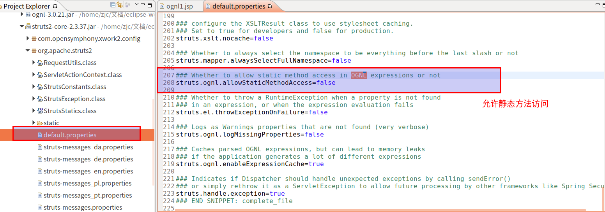

# 对象图导航语言OGNL

---

# 什么是OGNL

+	[_参考(维基百科):对象导航图语言_](https://zh.wikipedia.org/wiki/%E5%AF%B9%E8%B1%A1%E5%AF%BC%E8%88%AA%E5%9B%BE%E8%AF%AD%E8%A8%80)
+	对象导航图语言（Object Graph Navigation Language），简称OGNL，是应用于Java中的一个开源的表达式语言（Expression Language），它被集成在Struts2等框架中，作用是对数据进行访问，它拥有类型转换、访问对象方法、操作集合对象等功能

OGNL,对象导航图语言,比EL表达式强大很多倍的语言
+   EL:从域对象中获取数据,从EL的11个对象中获取([_EL表达式_](/2019/06/29/JSP和EL和JSTL/#EL表达式))
+   OGNL:调用对象的方法,获取Struts2的值栈的数据.OGNL其实是第三方的表达式语言

# OGNL的Java环境入门(了解)

## 访问对象的方法

```java
	/**
	 * OGNL调用对象方法
	 * @throws OgnlException
	 */
	public void demo1() throws OgnlException {
		// 获取context
		OgnlContext context = new OgnlContext();
		// 获得根对象
		Object root = context.getRoot();
		// 执行表达式
		Object obj = Ognl.getValue("'helloword'.length()", context, root);
		System.out.println(obj);
	}
```

## 访问静态的方法

```java
	/**
	 * 访问静态的方法
	 * @throws OgnlException
	 */
	public void demo2() throws OgnlException {
		// 获取context
		OgnlContext context = new OgnlContext();
		// 获得根对象
		Object root = context.getRoot();
		// 执行表达式
		// 静态的固定写法:@类名@方法名
		Object obj = Ognl.getValue("@java.lang.Math@random()", context, root);
		System.out.println(obj);
	}
```

## 访问Root中的数据

一般会在root中存放java对象

1.  设置一个java对象(User类)

```java
package com.zjinc36.ognl;

public class User {
	private String username;
	private String password;

	public User() {
		super();
	}

	public User(String username, String password) {
		super();
		this.username = username;
		this.password = password;
	}

	public String getUsername() {
		return username;
	}

	public void setUsername(String username) {
		this.username = username;
	}

	public String getPassword() {
		return password;
	}

	public void setPassword(String password) {
		this.password = password;
	}

	@Override
	public String toString() {
		return "User [username=" + username + ", password=" + password + "]";
	}
}

```

2.  访问Root中的数据

```java
	@Test
	/**
	 * 访问Root中的数据
	 * @throws OgnlException
	 */
	public void demo3() throws OgnlException {
		// 获取context
		OgnlContext context = new OgnlContext();
		// 设置根对象
		context.setRoot(new User("aaa", "123"));
		// 获得根对象
		Object root = context.getRoot();
		// 执行表达式
		Object username = Ognl.getValue("username", context, root);
		Object password = Ognl.getValue("password", context, root);
		System.out.println(username + "--" + password);
	}
```

## 获取OgnlContext中的数据

```java
	@Test
	/**
	 * 获取context中的数据
	 * @throws OgnlException
	 */
	public void demo4() throws OgnlException {
		// 获取context
		OgnlContext context = new OgnlContext();
		// 获得根对象
		Object root = context.getRoot();
		// 向context中存入数据
		context.put("name", "zhangsan");
		// 执行表达式
		// 访问context中的数据时,需要加#
		Object obj = Ognl.getValue("#name", context, root);
		System.out.println(obj);
	}
```

# OGNL在Struts2环境中的使用

[_参考:Struts2学习之OGNL表达式_](https://www.jellythink.com/archives/283)

## 访问ValueStack

[_查看:什么是值栈ValueStack_](/2019/07/13/OGNL的值栈ValueStack/)

由于ValueStack是Struts2中OGNL的根对象，如果用户需要访问值栈中的对象，在JSP页面可以直接通过下面的OGNL表达式访问ValueStack(值栈)中对象的属性：

```html
<s:property value="userName" />
```

在ValueStack中处于第一位的对象叫栈顶对象。通常我们在OGNL表达式里直接写上属性的名称即可访问ValueStack变量里对象的属性，搜索顺序是从栈顶对象开始寻找，如果栈顶对象不存在该属性，就会从第二个对象寻找，如果没有找到就从第三个对象寻找，依次往下访问，直到找到为止。

## 访问application对象

访问ValueStack以外其它对象时，由于他们不是根对象，所以在访问时，需要添加#前缀。application对象用于访问ServletContext的属性，例如：

```html
<s:property value="#application.userName" />
<s:property value="#application['userName']" />
```

上述代码同调用ServletContext的getAttribute("userName")方法的效果是一样的。

## 访问session对象

session对象用于访问HttpSession的属性，例如：

```html
<s:property value="#session.userName" />
<s:property value="#session['userName']" />
```

上述代码同调用HttpSession的getAttribute("userName")方法的效果是一样的。

## 访问request对象

request对象用于访问HttpServletRequest的属性，例如：

```html
<s:property value="#request.userName" />
<s:property value="#request['userName']" />
```

上述代码同调用HttpServletRequest的getAttribute("userName")方法的效果是一样的。

## 访问parameters对象

parameters对象用于访问HTTP请求参数，例如：

```html
<s:property value="#parameters.userName" />
<s:property value="#parameters['userName']" />
```

上述代码同调用HttpServletRequest的getParameter("userName")方法的效果是一样的。

## 访问attr对象

attr对象依次搜索以下对象中的属性，找到便返回：
+	PageContext
+	HttpServletRequest
+	HttpSession
+	ServletContext

## 调用对象方法

```html
<%@ page language="java" contentType="text/html; charset=UTF-8"
    pageEncoding="UTF-8"%>
<!-- 引入struts2的标签库,struts2就这一个标签 -->
<%@ taglib uri="/struts-tags" prefix="s" %>
<!DOCTYPE html>
<html>
<head>
<meta charset="UTF-8">
<title>Insert title here</title>
</head>
<body>
	<h1>OGNL在Struts2环境中的入门</h1>
	<h3>调用对象方法</h3>
	<!-- 直接调用字符串的方法 -->
	<s:property value="'struts'.length()" />
</body>
</html>
```

## 调用对象的静态方法

Struts2默认是不能访问静态方法的,需要开启一个常量

1.  如何开启常量

+	[_Struts2的常量要如何配置_](/2019/07/10/Struts2入门和配置/#Struts常量配置)
+	

在映射文件中配置

```xml
<?xml version="1.0" encoding="UTF-8" ?>
<!DOCTYPE struts PUBLIC
	"-//Apache Software Foundation//DTD Struts Configuration 2.3//EN"
	"http://struts.apache.org/dtds/struts-2.3.dtd">
<struts>
	<!-- 配置Struts2的常量 -->
	<constant name="struts.action.extension" value="action" />
	<constant name="struts.ognl.allowStaticMethodAccess" value="true" />
</struts>
```

2.  调用

```html
<%@ page language="java" contentType="text/html; charset=UTF-8"
    pageEncoding="UTF-8"%>
<!-- 引入struts2的标签库,struts2就这一个标签 -->
<%@ taglib uri="/struts-tags" prefix="s" %>
<!DOCTYPE html>
<html>
<head>
<meta charset="UTF-8">
<title>Insert title here</title>
</head>
<body>
	<h1>OGNL在Struts2环境中的入门</h1>
	<h3>调用对象的静态方法</h3>
	<!-- Struts2默认是不能访问静态方法的 -->
	<!-- 需要开启一个常量 -->
	<s:property value="@java.lang.Math@random()" />
</body>
</html>
```


# OGNL中的特殊字符

## `#`号的用法

两种用法

1.  `#`可以用于获得域对象的值
2.  可以用于定义一个map

```html
<%@ page language="java" contentType="text/html; charset=UTF-8"
	pageEncoding="UTF-8"%>
<!-- 引入struts2的标签库,struts2就这一个标签 -->
<%@ taglib uri="/struts-tags" prefix="s"%>
<!DOCTYPE html>
<html>
<head>
<meta charset="UTF-8">
<title>Insert title here</title>
</head>
<body>
	<h1>#号的用法</h1>

	<h3>存值</h3>
	<%
		request.setAttribute("name", "123");
	%>
	<s:property value="#request.name" />

	<h3>构建List集合</h3>
	<s:iterator var="i" value="{'aa', 'bb', 'cc'}">
		<s:property value="i"></s:property> ---- <s:property value="#i"></s:property>
		<br>
	</s:iterator>

	<h3>构建Map集合</h3>
	<h4>方式一</h4>
	<s:iterator value="#{ 'aa':'11', 'bb':'22'}">
		<s:property value="key"></s:property> ---- <s:property value="value"></s:property>
		<br>
	</s:iterator>
	<h4>方式二</h4>
	<s:iterator var="entry" value="#{ 'aa':'11', 'bb':'22'}">
		<s:property value="#entry.key"></s:property> ---- <s:property value="#entry.value"></s:property>
		<br>
	</s:iterator>

	<h1>利用List或Map集合创建单选框</h1>
	<h3>值相同</h3>
	<s:radio list="{'男', '女'}" name="sex" label="性别"></s:radio>
	<h3>值不同</h3>
	<s:radio list="#{'1':'男', '2':'女'}" name="sex2" label="性别"></s:radio>

	<h1>利用List或Map集合创建复选框</h1>
	<s:checkboxlist name="checkbox1" list="{'上网','看书','爬山','游泳','唱歌'}" value="{'上网','看书'}" ></s:checkboxlist>
</body>
</html>
```

## `%`的用法

两种用法(只能在OGNL标签中使用)

1.  强制解析为OGNL表达式
2.  强制不解析为OGNL表达式

```html
<%@ page language="java" contentType="text/html; charset=UTF-8"
	pageEncoding="UTF-8"%>
<!-- 引入struts2的标签库,struts2就这一个标签 -->
<%@ taglib uri="/struts-tags" prefix="s"%>
<!DOCTYPE html>
<html>
<head>
<meta charset="UTF-8">
<title>Insert title here</title>
</head>
<body>
	<h1>%号的用法</h1>

	<h3>存值</h3>
	<%
		request.setAttribute("name", "123");
	%>
	<h3>强制解析成OGNL表达式</h3>
	<s:textfield name="name" value="%{#request.name}"></s:textfield>

	<h3>强制不解系成OGNL表达式(每什么用)</h3>
	<s:textfield name="name" value="%{'#request.name'}"></s:textfield>
</body>
</html>
```

## `$`符号的用法

在配置文件中可以使用OGNL表达式(EL表达式也是使用$)

1.  属性文件(国际化地方)
2.  xml文件

```xml
<action name="download1" class="cn.itcast.demo2.DownloadAction">
     <result name="success" type="stream">
          <param name="contentType">${contentType}</param>
          <param name="contentDisposition">attachment;filename=${downFilename}</param>
     </result>
</action>
```

