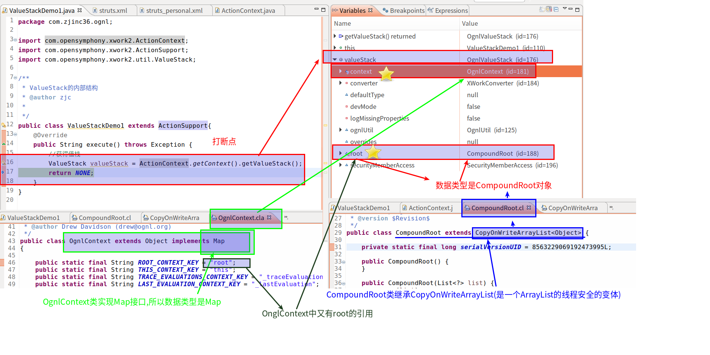
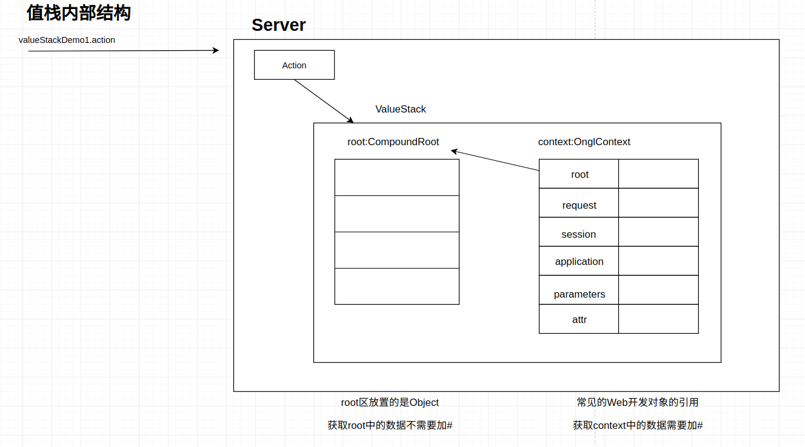
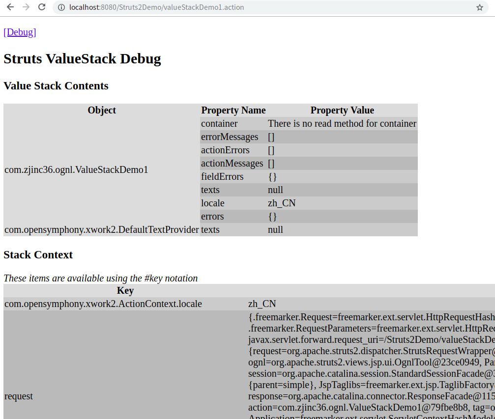
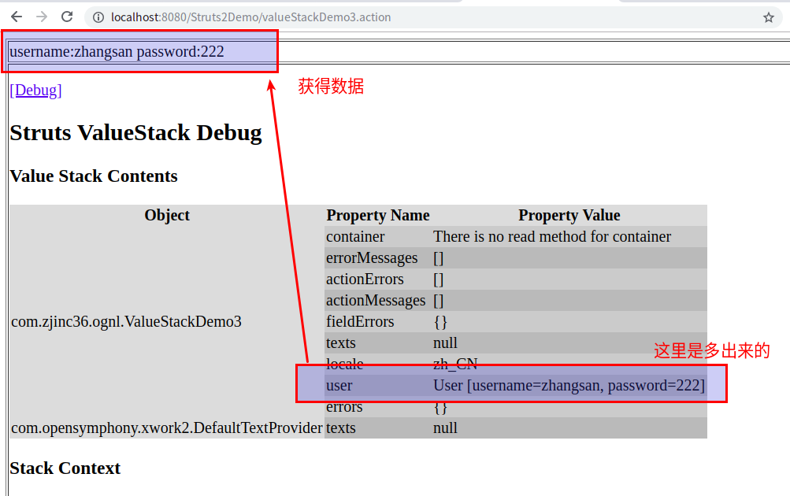
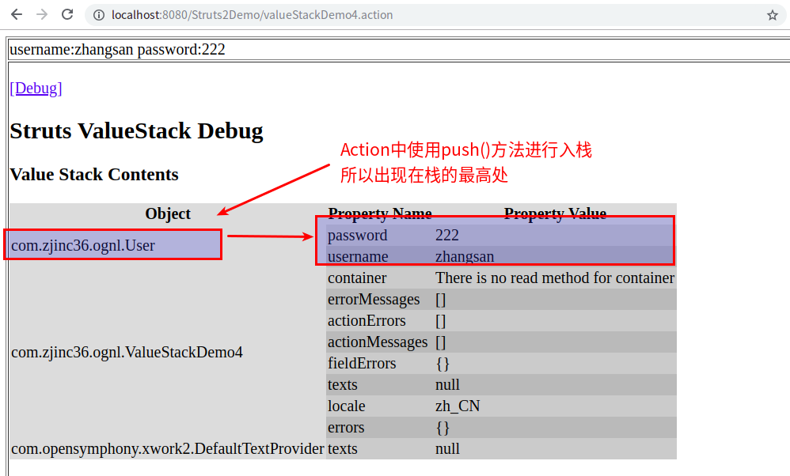
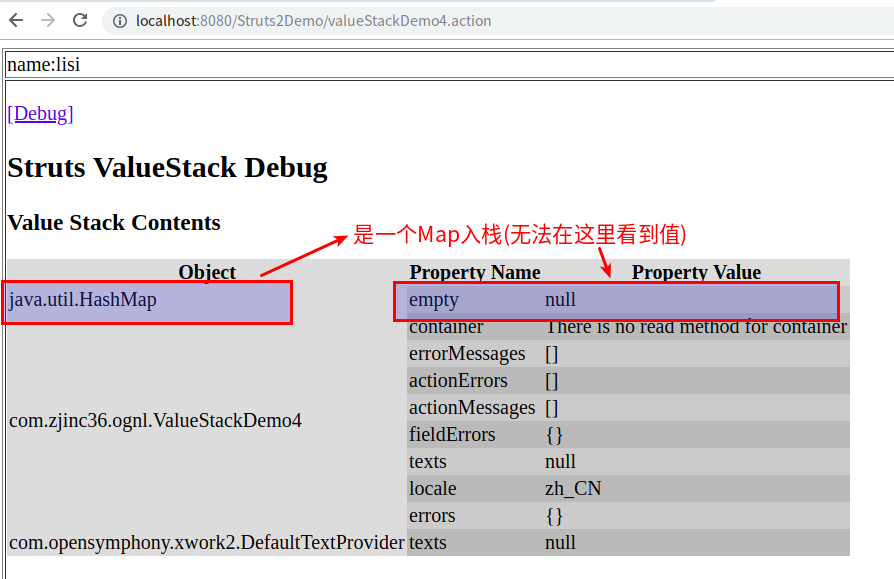
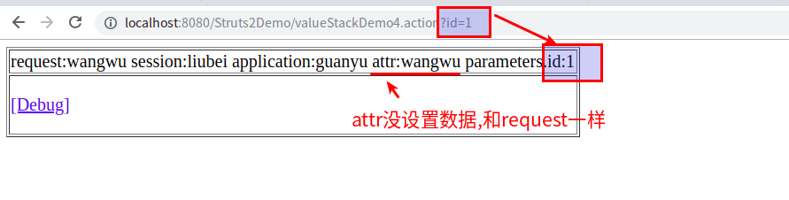
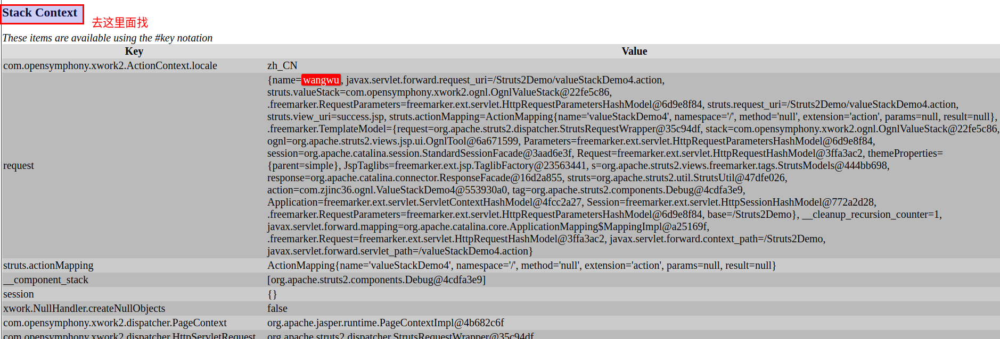

# Struts2的值栈(ValueStack)

---

# 值栈

## 什么是值栈

+	[_参考:什么是值栈_](https://blog.csdn.net/siwuxie095/article/details/77075528)
+	在 Servlet 中把数据放到域对象(_域对象的主要作用:在一定范围内,存值和取值_),再在页面中使用EL 表达式获取数据
+	Struts2 本身也提供了一种存储机制,称之为 值栈（ValueStack）,值栈类似于域对象,可以存值和取值,在 Action 中把数据放到值栈,再在页面中获取值栈数据

ValueStack其实类似一个数据中转站(Struts2的框架当中的数据就都保存到ValueStack中)
+   Valuestack接口,实现类OgnlValueStack对象
+   ValueStack贯穿整个Action的声明周期(Action一旦创建了,框架就会创建一个ValueStack对象)

## 值栈的存储位置

+	[_参考:什么是值栈_](https://blog.csdn.net/siwuxie095/article/details/77075528)
+	每次访问 Action 时,都会创建 Action 对象
+	在每个 Action 对象中都会有一个值栈对象（且只有一个）

# 分析值栈的内部结构

## 从结论说起

**值栈中有两个主要区域**

### root区域

其实就是一个ArrayList,里面一般放置对象,获取root不需要加#

### context区域

其实就是一个Map,里面放置web开发的常用的对象的数据引用,包含如下
+   request
+   session
+   application
+   parameters
+   attr

## 如何得到上述结论

### 方法一:源码分析

#### 查看源码

*ognl的源代码没有在Struts2的源码包里面*



#### 值栈结构图




### 方法二:打印debug页面

#### 1.Action代码
```java
package com.zjinc36.ognl;

import com.opensymphony.xwork2.ActionContext;
import com.opensymphony.xwork2.ActionSupport;
import com.opensymphony.xwork2.util.ValueStack;

/**
 * ValueStack的内部结构
 * @author zjc
 *
 */
public class ValueStackDemo1 extends ActionSupport{
	@Override
	public String execute() throws Exception {
		//获得值栈
		@SuppressWarnings("unused")
		ValueStack valueStack = ActionContext.getContext().getValueStack();
		return SUCCESS;
	}
}
```

#### 2.jsp页面(出口)

```html
<%@ page language="java" contentType="text/html; charset=UTF-8"
    pageEncoding="UTF-8"%>
<%@ taglib uri="/struts-tags" prefix="s" %>
<!DOCTYPE html>
<html>
<head>
<meta charset="UTF-8">
<title>Insert title here</title>
</head>
<body>
	<s:debug></s:debug>
</body>
</html>
```

#### 3.在浏览器打开



# ActionContext

## 什么是ActionContext

+   [*回顾:ServletContext*](/2019/06/26/Servlet与ServletConfig与ServletContext的使用/#ServletContext)
+   ActionContext是一个类,表示的是Action的上下文环境，它封装了一个Action运行所需要的环境，比如session、parameters、locale等,OGNL的操作都是基于ActionContext而进行的
+   对于这个ActionContext来说，每一个请求对应一个Action，这也是为什么说[每个 Action 对象中都会有一个值栈对象（且只有一个）](/2019/07/13/Struts2的值栈ValueStack/#值栈的存储位置),所以说你不用担心什么线程安全的问题了
+   对于ActionContext中的SESSION、APPLICATION、PARAMETERS和LOCALE就不用多说了，前面我们重点总结的还是VALUE_STACK就是为此

## 值栈和ActionContext的关系

1.  **创建ActionContext对象**:通过源码查看到,当请求过来的时候,执行过滤器中doFilter()方法,在这个方法中创建ActionContext
2.  **创建ValueStack对象**:创建ActionContext过程中,创建ValueStack对象,将ValueStack对象传递给ActionContext对象
3.  所以**可以通过ActionContext获取值栈对象**
4.  ActionContext对象之所以能够访问Servlet的API(访问是域对象的数据),因为在其内部有值栈的引用

# 获取值栈

+	通过ActionContext获得值栈 -> **操作的是`root`区域**
+	通过request对象获得 -> **操作的是`context`区域**

```java
package com.zjinc36.ognl;

import org.apache.struts2.ServletActionContext;

import com.opensymphony.xwork2.ActionContext;
import com.opensymphony.xwork2.ActionSupport;
import com.opensymphony.xwork2.util.ValueStack;

/**
 * 获取ValueStack
 * @author zjc
 *
 */
public class ValueStackDemo2 extends ActionSupport{
	@Override
	public String execute() throws Exception {
		// 1.通过ActionContext获得
		ValueStack valueStack1 = ActionContext.getContext().getValueStack();
		// 2.通过request对象获得
		// 以下两种写法相同
		// ServletActionContext.STRUTS_VALUESTACK_KEY的值就是"struts.valueStack"
		// ValueStack valueStack2 = (ValueStack) ServletActionContext.getRequest().getAttribute("struts.valueStack");
		ValueStack valueStack3 = (ValueStack) ServletActionContext.getRequest().getAttribute(ServletActionContext.STRUTS_VALUESTACK_KEY);
		return NONE;
	}
}
```

**注意:一个Action的实例,只会创建一个ValueStack的对象**

# 操作值栈

这里**重点放在将不同类型的数据存入值栈时,值栈的root区域和context区域发生怎么样的变化**,虽然也有OGNL如何从值栈取出数据,但不是值栈这边的重点

## 操作值栈中的root区域

### 利用Action在值栈中的特性

1.   Action

```java
//Action
package com.zjinc36.ognl;

import org.apache.struts2.ServletActionContext;

import com.opensymphony.xwork2.ActionContext;
import com.opensymphony.xwork2.ActionSupport;
import com.opensymphony.xwork2.util.ValueStack;

/**
 * 获取ValueStack
 * @author zjc
 *
 */
public class ValueStackDemo3 extends ActionSupport{
	private User user;

	@Override
	public String execute() throws Exception {
		user = new User("zhangsan", "222");
		return SUCCESS;
	}

	public User getUser() {
		return user;
	}

	public void setUser(User user) {
		this.user = user;
	}
}
```

2.  jsp文件

```html
<!-- jsp文件 -->
<%@ page language="java" contentType="text/html; charset=UTF-8"
    pageEncoding="UTF-8"%>
<%@ taglib uri="/struts-tags" prefix="s" %>
<!DOCTYPE html>
<html>
<head>
<meta charset="UTF-8">
<title>Insert title here</title>
</head>
<body>
	username:<s:property value="user.username"></s:property>
	password:<s:property value="user.password"></s:property>
	<s:debug></s:debug>
</body>
</html>
```

3.  结果页面



### 使用值栈的push方法

1.  Action

```java
package com.zjinc36.ognl;

import com.opensymphony.xwork2.ActionContext;
import com.opensymphony.xwork2.ActionSupport;
import com.opensymphony.xwork2.util.ValueStack;

public class ValueStackDemo4 extends ActionSupport{
	private User user;

	@Override
	public String execute() throws Exception {
		ValueStack vs = ActionContext.getContext().getValueStack();
		user = new User("zhangsan", "222");
		vs.push(user);
		return SUCCESS;
	}
}

```

2.  jsp页面

```html
<%@ page language="java" contentType="text/html; charset=UTF-8"
    pageEncoding="UTF-8"%>
<%@ taglib uri="/struts-tags" prefix="s" %>
<!DOCTYPE html>
<html>
<head>
<meta charset="UTF-8">
<title>Insert title here</title>
</head>
<body>
<table border="1">
	<tr>
		<td>
			username:<s:property value="username"></s:property>
			password:<s:property value="password"></s:property>
		</td>
	</tr>
	<tr>
		<td>
			<s:debug></s:debug>
		</td>
	</tr>
</table>
</body>
</html>
```

3.  结果页面




### 使用值栈的set方法

1.  Action

```java
package com.zjinc36.ognl;

import com.opensymphony.xwork2.ActionContext;
import com.opensymphony.xwork2.ActionSupport;
import com.opensymphony.xwork2.util.ValueStack;

public class ValueStackDemo4 extends ActionSupport{
	private User user;

	@Override
	public String execute() throws Exception {
		ValueStack vs = ActionContext.getContext().getValueStack();
		// 创建一个Map集合,将Map压入栈中
		vs.set("name", "lisi");
		return SUCCESS;
	}
}
```

2.  jsp页面

```html
<%@ page language="java" contentType="text/html; charset=UTF-8"
    pageEncoding="UTF-8"%>
<%@ taglib uri="/struts-tags" prefix="s" %>
<!DOCTYPE html>
<html>
<head>
<meta charset="UTF-8">
<title>Insert title here</title>
</head>
<body>
<table border="1">
	<tr>
		<td>
			name:<s:property value="name"></s:property>
		</td>
	</tr>
	<tr>
		<td>
			<s:debug></s:debug>
		</td>
	</tr>
</table>
</body>
</html>
```

3.  结果页面




### 使用值栈的set方法(设置ArrayList)

1.  Action

```java
package com.zjinc36.ognl;

import java.util.ArrayList;

import com.opensymphony.xwork2.ActionContext;
import com.opensymphony.xwork2.ActionSupport;
import com.opensymphony.xwork2.util.ValueStack;

public class ValueStackDemo4 extends ActionSupport{
	private User user;

	@Override
	public String execute() throws Exception {
		ValueStack vs = ActionContext.getContext().getValueStack();
		ArrayList<User> list = new ArrayList<User>();
		list.add(new User("aaa", "111"));
		list.add(new User("bbb", "222"));
		list.add(new User("aaa", "333"));
		ActionContext.getContext().getValueStack().set("list", list);
		return SUCCESS;
	}
}

```

2.  jsp页面

```html
<%@ page language="java" contentType="text/html; charset=UTF-8"
    pageEncoding="UTF-8"%>
<%@ taglib uri="/struts-tags" prefix="s" %>
<!DOCTYPE html>
<html>
<head>
<meta charset="UTF-8">
<title>Insert title here</title>
</head>
<body>
<table border="1">
	<tr>
		<td>
			username:<s:property value="list[0].username"></s:property>
			password:<s:property value="list[0].password"></s:property>
			username:<s:property value="list[1].username"></s:property>
			password:<s:property value="list[1].password"></s:property>
			username:<s:property value="list[2].username"></s:property>
			password:<s:property value="list[2].password"></s:property>
		</td>
	</tr>
	<tr>
		<td>
			<s:debug></s:debug>
		</td>
	</tr>
</table>
</body>
</html>
```

## 操作值栈中的context区域

1.  写入数据

```java
package com.zjinc36.ognl;

import org.apache.struts2.ServletActionContext;
import com.opensymphony.xwork2.ActionSupport;

public class ValueStackDemo4 extends ActionSupport{
	@Override
	public String execute() throws Exception {
		ServletActionContext.getRequest().setAttribute("name", "wangwu");
		ServletActionContext.getRequest().getSession().setAttribute("name", "liubei");
		ServletActionContext.getServletContext().setAttribute("name", "guanyu");
		return SUCCESS;
	}
}
```

2.	获取数据

```html
<%@ page language="java" contentType="text/html; charset=UTF-8"
    pageEncoding="UTF-8"%>
<%@ taglib uri="/struts-tags" prefix="s" %>
<!DOCTYPE html>
<html>
<head>
<meta charset="UTF-8">
<title>Insert title here</title>
</head>
<body>
<table border="1">
	<tr>
		<td>
			request:<s:property value="#request.name"></s:property>
			session:<s:property value="#session.name"></s:property>
			application:<s:property value="#application.name"></s:property>
			attr:<s:property value="#attr.name"></s:property>
			parameters.id:<s:property value="#parameters.id"></s:property>
		</td>
	</tr>
	<tr>
		<td>
			<s:debug></s:debug>
		</td>
	</tr>
</table>
</body>
</html>
```

3.	结果页面







**注意:如果request没有设置数据,而我们又有取request的数据,则能拿到的是session的数据,同理,其他也有类似规则(不需要特意记忆,在页面开debug找就行)**

# OGNL表达式获取值栈数据

[_参考:OGNL表达式获取值栈数据_](/2019/07/11/对象图导航语言OGNL/)

# EL表达式获取值栈数据

[_参考:EL表达式获取值栈数据_](https://blog.csdn.net/siwuxie095/article/details/77163897)

