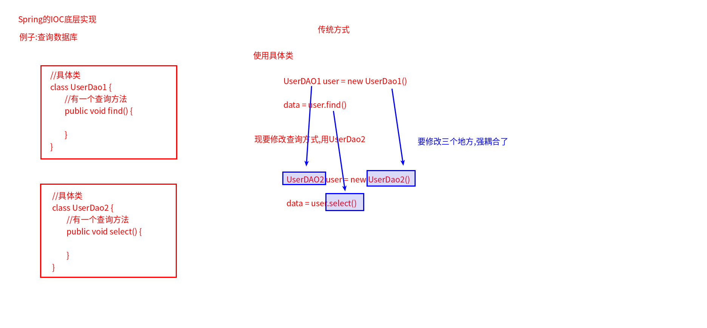
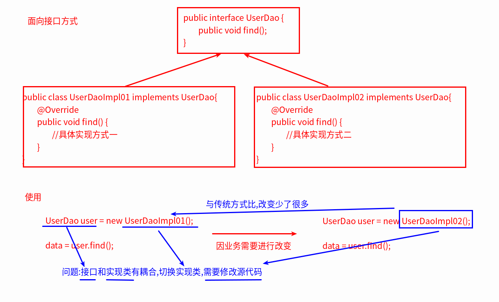
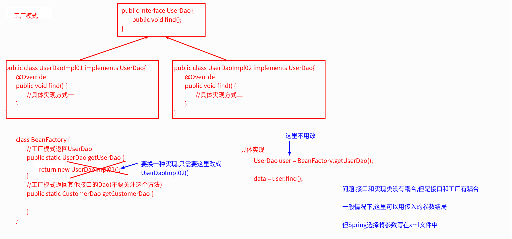
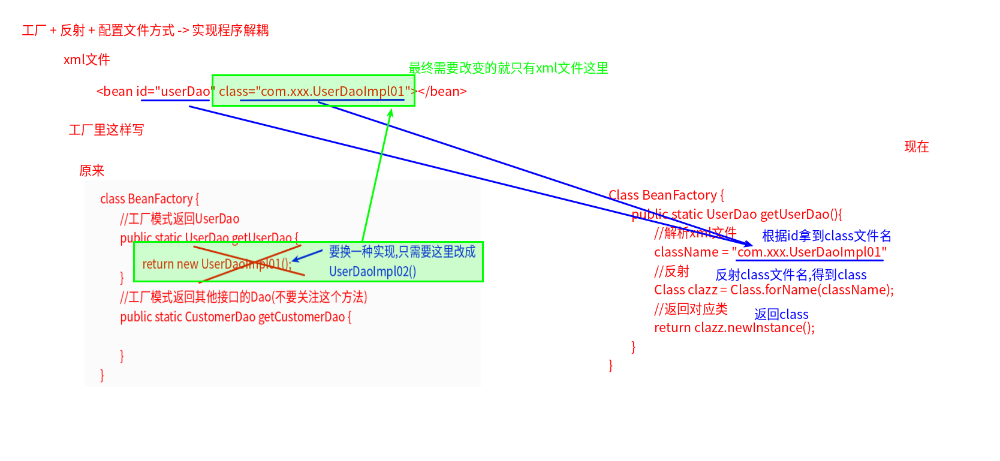
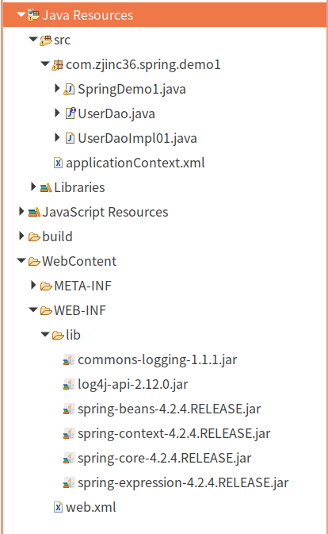

#   Spring的IOC和DI
+ date: 2019-07-13 12:52:17
+ description: Spring的控制反转(IOC)和依赖注入(DI)
+ categories:
  - Java
+ tags:
  - Spring
---
#   IOC控制反转
将对象的创建权反转给了Spring
##   Spring的IOC的底层实现
实现解偶的思维方式
1.  传统模式

2.  面向接口编程

3.  工厂模式

4.  工厂+反射+配置文件


##   IOC依赖反转代码实现
1.  文件导航

2.  java代码
```java
//UserDaoImpl01
package com.zjinc36.spring.demo1;

public class UserDaoImpl01 implements UserDao{
	@Override
	public void save() {
		System.out.println("UserDaoImpl01执行了");
	}

}


//主要看这个
package com.zjinc36.spring.demo1;

import org.junit.Test;
import org.springframework.context.support.ClassPathXmlApplicationContext;

public class SpringDemo1 {
	@Test
	public void demo1() {
		//创建Spring的工厂
		ClassPathXmlApplicationContext ac = new ClassPathXmlApplicationContext("applicationContext.xml");
		UserDao user = (UserDao) ac.getBean("userDao");
		user.save();
	}
}
```
3.  applicationContext.xml文件
```xml
<!-- applicationContext.xml -->

<?xml version="1.0" encoding="UTF-8"?>
<beans xmlns="http://www.springframework.org/schema/beans"
    xmlns:xsi="http://www.w3.org/2001/XMLSchema-instance" xmlns:context="http://www.springframework.org/schema/context"
    xsi:schemaLocation="http://www.springframework.org/schema/beans http://www.springframework.org/schema/beans/spring-beans.xsd http://www.springframework.org/schema/context 
http://www.springframework.org/schema/context/spring-context-4.3.xsd http://www.springframework.org/schema/mvc http://www.springframework.org/schema/mvc/spring-mvc-4.3.xsd">

     <bean id="userDao" class="com.zjinc36.spring.demo1.UserDaoImpl01"></bean>
</beans>
```

#   DI(依赖注入)
依赖注入,前提必须有IOC的环境,Spring管理这个类的时候将类的依赖属性注入(设置)进来
##  依赖/继承/聚合的区别
1.  依赖
```java
class A {

}

class B {
    public void test(A a) {
        return a;
    }
}
```

2.  继承: is a (是一个)
```java
class A {

}

class B extends A {

}
```

3.  聚合: has a (有一个)
有松散和紧密之分

##  Spring如何实现依赖注入
1.	java代码
```java
package com.zjinc36.spring.demo1;

public class UserDaoImpl01 implements UserDao{
	private String name;
	public void setName(String name) {
		this.name = name;
	}
	@Override
	public void save() {
		System.out.println("UserDaoImpl01执行了" + name);
	}

}
```
2.	applicationContext.xml代码
```xml
<?xml version="1.0" encoding="UTF-8"?>
<beans xmlns="http://www.springframework.org/schema/beans"
    xmlns:xsi="http://www.w3.org/2001/XMLSchema-instance" xmlns:context="http://www.springframework.org/schema/context"
    xsi:schemaLocation="http://www.springframework.org/schema/beans http://www.springframework.org/schema/beans/spring-beans.xsd http://www.springframework.org/schema/context 
http://www.springframework.org/schema/context/spring-context-4.3.xsd http://www.springframework.org/schema/mvc http://www.springframework.org/schema/mvc/spring-mvc-4.3.xsd">

     <bean id="userDao" class="com.zjinc36.spring.demo1.UserDaoImpl01">
     	<property name="name" value="zhangsan" />
     </bean>
</beans>
```
