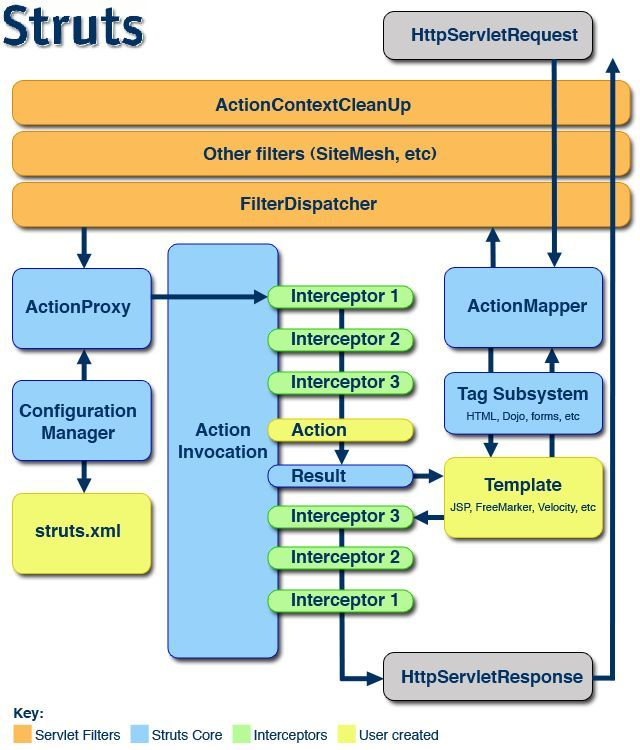

#   Struts2的拦截器
+ date: 2019-07-13 00:48:00
+ description: Struts2的拦截器
+ categories:
  - Java
+ tags:
  - Struts2
---
#   拦截器概述
##  什么是拦截器
1.  Interceptor:拦截器,起到拦截Action的作用
>   +   Filter:过滤器,过滤从客户端向服务器发送的请求
>   +   Interceptor:拦截器,拦截客户端多Action的访问,更细粒度的拦截(拦截Action中的具体方法)
2.  Struts2框架核心的功能都是依赖拦截器实现

#   拦截器在Struts2中处于什么位置
以下是Struts2的执行流程
##  代码中的执行流程
1.  客户端向服务器发送一个Action的请求,执行核心过滤器doFilter()方法
2.  在doFilter()方法中,调用executeAction()方法
3.  在executeAction()方法内部调用dispatcher.serviceAction()
4.  在dispatcher.serviceAction()中创建一个Action代理
5.  最终执行的是Action代理中的execute()
6.  在代理中执行的execute方法中调用ActionInvocation的invoke()方法
7.  **在invoke()方法内部递归执行一组拦截器**(完成部分功能)
8.  如果没有下一个拦截器,就会执行目标Action
9.  根据Action的返回结果进行页面跳转

##  官方提供的运行流程
[_参考:Struts2 架构与运行流程_](https://segmentfault.com/a/1190000012880242)


>	+   Servlet Filters(橙色)：过滤链，所有的请求都要经过Filter处理。
>	+   Struts Core(浅蓝色)：Struts2的核心部分，Struts2已经做好的功能，开发中不需要动它们。
>	+   Interceptors(浅绿色)：Struts2的拦截器。Struts2提供了很多默认的拦截器，帮助开发者完成绝大部分工作。开发者也可以自定义拦截器，来实现具体的功能。
>	+   User Created(浅黄色)：这一部分需要由开发人员完成，包括struts.xml、Action、Template等。

>	1. FilterDispatcher
>	FilterDispatcher是任何一个Struts2应用都需要配置的，一般出现在过滤器的最后；如果在FilterDispatcher前出现了如SiteMesh这种特殊的过滤器，还必须在SiteMess前应用Struts2的ActionContextCleanUp过滤器。
>	FilterDispatcher将请求转发给ActionMapper。
>	2. ActionMapper
>	ActionMapper负责识别当前的请求是否需要Struts2做出处理。
>	当ActionMapper告诉FilterDispatcher需要处理这个请求时，FilterDispatcher会停止过滤链之后的部分，所以通常FilterDispatcher应该出现在过滤链的最后。然后建立一个ActionProxy对象，这个对象作为Action于XWork之间的中间层，会代理Action的运行过程。
>	3. ActionProxy
>	ActionProxy对象被创建出来时，并不知道要运行哪个Action，它手里只有从FilterDispatcher中拿到的请求URL。这时，它去ConfigurationManager询问到底要运行哪个Action。
>	4. ConfigurationManager
>	在服务器启动的时候，ConfigurationManager负责将struts.xml文件从配置文件映射到内存中，并缓存起来，以保证ActionProxy拿着来访问的URL向它询问要运行哪一个Action的时候，就可以直接匹配，查找并回答出来。
>	ActionProxy知道了要运行的那个Action，相关的拦截器以及所有可能使用的Result信息，就可以着手建立ActionInvocation对象了，ActionInvocation对象描述了Action运行的整个过程。
>	5. ActionInvocation
>	ActionInvocation对象执行的时候会做很多事情：
>	    +   首先按照拦截器的应用顺序依次执行各个拦截器的前置部分；
>	    +   然后执行Action的execute()方法；
>	    +   根据execute()返回的结果，在struts.xml中匹配选择下一个页面
>	    +   ActionInvocation对象再按照拦截器的引用顺序倒序依次执行各个拦截器的后置部分。
>	ActionInvocation对象执行完毕之后，实际上已经得到了响应对象，也就是HttpServletResponse对象，最终向用户显示响应的结果

#   使用拦截器
[_参考:Struts2拦截器_](https://blog.csdn.net/qjyong/article/details/1824607)

#   自定义拦截器
##  编写拦截器类
```java
package com.zjinc36.interceptor;

import com.opensymphony.xwork2.ActionInvocation;
import com.opensymphony.xwork2.interceptor.AbstractInterceptor;

/**
 * 自定义拦截器
 * @author zjc
 *
 */
public class InterceptorDemo1 extends AbstractInterceptor {

	@Override
	public String intercept(ActionInvocation invocation) throws Exception {
		System.out.println("InterceptorDemo1执行了...");
		String obj = invocation.invoke();
		System.out.println("InterceptorDemo1执行结束了...");
		return obj;
	}

}

```

##	引入拦截器
1.	方式一:定义拦截器进行配置
```xml
<?xml version="1.0" encoding="UTF-8" ?>
<!DOCTYPE struts PUBLIC
	"-//Apache Software Foundation//DTD Struts Configuration 2.3//EN"
	"http://struts.apache.org/dtds/struts-2.3.dtd">
<struts>
	<package name="interceptor" extends="struts-default" namespace="/">
		<!-- 定义拦截器 -->
		<interceptors>
			<interceptor name="interceptorDemo1" class="com.zjinc36.interceptor.InterceptorDemo1" />
			<interceptor name="interceptorDemo2" class="com.zjinc36.interceptor.InterceptorDemo2" />
		</interceptors>

		<action name="actionDemo1" class="com.zjinc36.interceptor.ActionDemo">
			<result>success.jsp</result>
			<!-- 引入拦截器 -->
			<!-- 一旦引入自定义拦截器,默认拦截器栈的拦截器就不执行了,所以必须手动引入默认栈拦截器 -->
			<interceptor-ref name="defaultStack" />
			<interceptor-ref name="interceptorDemo1" />
			<interceptor-ref name="interceptorDemo2" />
		</action>
	</package>
</struts>

```

2.	方式二:定义一个拦截器栈
```xml
<?xml version="1.0" encoding="UTF-8" ?>
<!DOCTYPE struts PUBLIC
	"-//Apache Software Foundation//DTD Struts Configuration 2.3//EN"
	"http://struts.apache.org/dtds/struts-2.3.dtd">
<struts>
	<package name="interceptor" extends="struts-default" namespace="/">
		<!-- 定义拦截器 -->
		<interceptors>
			<interceptor name="interceptorDemo1" class="com.zjinc36.interceptor.InterceptorDemo1" />
			<interceptor name="interceptorDemo2" class="com.zjinc36.interceptor.InterceptorDemo2" />
			<!-- 定义一个拦截器栈 -->
			<interceptor-stack name="myStack">
				<interceptor-ref name="defaultStack" />
				<interceptor-ref name="interceptorDemo1" />
				<interceptor-ref name="interceptorDemo2" />
			</interceptor-stack>
		</interceptors>

		<action name="actionDemo1" class="com.zjinc36.interceptor.ActionDemo">
			<result>success.jsp</result>
			<!-- 引入拦截器栈 -->
			<interceptor-ref name="myStack" />
		</action>
	</package>
</struts>

```
