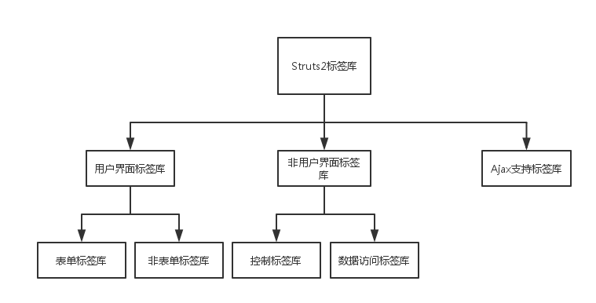

#   标签分类


#   自定义标签
[_自定义标签_](https://www.jellythink.com/archives/218)


#   OGNL标签详解
[_参考:OGNL标签详解_](https://www.cnblogs.com/langtianya/archive/2013/03/05/2944443.html)

#   非用户界面标签库
##  控制标签`if...elseif...`标签
由于if...elseif...标签后都可以指定一个boolean表达式，所以if...elseif...标签可接受一个test属性，该属性确定执行判断的boolean表达式。具体用法如下：
```html
<s:if test="100 in {100,200,300}">
   包含
</s:if>
<s:else>
   不包含
</s:else>
```

##	迭代`iterator`标签
iterator标签主要用于对集合（List、Set、数组和Map）进行迭代。使用iterator标签对集合进行迭代输出时，可以指定以下三个属性：

|属性名 | 描述 | 是否可选
|----|----|----|
|value	|用于指定被迭代的集合；如果没有指定value属性，则使用ValueStack栈顶的集合	|可选|
|id		|用于指定集合里元素的ID	|可选|
|status	|用于指定迭代时的IteratorStatus实例，通过该实例即可判断当前迭代元素的属性，例如是否为最后一个，以及当前迭代元素的索引等	|可选|

```html
<!--List-->
<s:set name="varList" value="{'www.jellythink.com', 'www.google.com', 'www.facebook.com'}"/>
<s:iterator value="#varList" id="website" status="st">
   当前已经输出了<s:property value="#st.getCount()"/>个<br/>
   <s:property value="website"/><br/>
</s:iterator>

<!--Map-->
<s:set name="varMap" value="#{'谷歌':'www.jellythink.com', '脸书':'www.facebook.com'" />
<s:iterator value="#varMap" id="website" status="st">
   第<s:property value="#st.getCount()"/>组
 <s:property value="key"/>=<s:property value="value"/><br/>
</s:iterator>
```
为`<s:iterator.../>`标签指定`status`属性，即每次迭代时都会有一个`IteratorStatus`实例，该实例包含以下几个方法：
+   int getCount()：返回当前迭代了几个元素
+   int getIndex()：返回当前迭代元素的索引
+   boolean isEven()：返回当前迭代元素的索引是否是偶数
+   boolean isOdd()：返回当前迭代元素的索引是否是奇数
+   boolean isFirst()：返回当前迭代元素是否是第一个元素
+   boolean isLast()：返回当前迭代元素是否是最后一个元素

## 合并集合对象`append`标签
append标签用于将多个集合对象拼接起来，组成一个新的集合。通过这种拼接，从而允许通过一个<s:iterator.../>标签就可以完成对多个集合的迭代。
使用append标签时需要指定一个var属性，该属性确定拼接生成的新集合的名字，该新集合被放入Stack Context中。
```html
<s:set name="varList" value="{'www.google.com', 'www.facebook.com'}"/>
<s:set name="varList2" value="{'www.xiaomi.com', 'www.qq.com'}"/>
<s:append var="newCollection">
    <s:param value="#varList" />
    <s:param value="#varList2"/>
</s:append>
```
##  合并集合对象`merge`标签
merge标签和append标签看起来非常类似，也是用于将多个集合拼接成一个集合，但它采用的拼接方式与append的拼接方式有所不同，比如现在有三个集合，每个集合有三个元素，分别使用append和merge方式进行拼接，产生的新集合将有所区别。
使用append方式拼接，则新集合的元素顺序为：
第一个集合中的第一个元素
第一个集合中的第二个元素
第一个集合中的第三个元素
第二个集合中的第一个元素
第二个集合中的第二个元素
第二个集合中的第三个元素
第三个集合中的第一个元素
第三个集合中的第二个元素
第三个集合中的第三个元素
使用merge方式拼接，则新集合的元素顺序为：

第一个集合中的第一个元素
第二个集合中的第一个元素
第三个集合中的第一个元素
第一个集合中的第二个元素
第二个集合中的第二个元素
第三个集合中的第二个元素
第一个集合中的第三个元素
第二个集合中的第三个元素
第三个集合中的第三个元素
从上面可以看出来，采用append和merge方式合并集合时，新集合中集合元素完全相同，只是新集合中集合元素的顺序有所不同。

##  分割字符串`generator`标签
generator标签可以将指定字符串按指定分隔符分隔成多个子串，临时生成的多个子串可以使用iterator标签来迭代输出。在该标签的标签体内，整个临时生成的集合将位于ValueStack的顶端，但一旦该标签结束，该集合将被移出ValueStack。
使用generator标签时可以指定如下几个属性：

|属性名	|描述|	是否可选|
|----|----|----|
|count	|指定生成集合中元素的总数|	可选|
|separator|	指定用于解析字符串的分隔符|	必填|
|val	|指定被解析的字符串	|必填|
|converter|	该属性指定一个转换器，该转换器负责将集合中的每个字符串转换成对象，通过该转换器可以将一个字符串解析成对象的集合。该属性值必须是一个org.apache.Struts2.util.IteratorGenerator.Converter对象	|可选|
|var	|如果指定了该属性，则将生成的Iterator对象放入Stack Context中	|可选|

```html
<s:generator val="'www.google.com,www.baidu.com'" separator=",">
    <s:iterator id="website">
        <s:property value="website" /><br/>
    </s:iterator>
</s:generator>
```

##  取得集合子集`subset`标签
用于取得集合的子集，具体使用请参见相关文档。

##  对集合进行排序`sort`标签
sort标签用于对指定的集合元素进行排序，进行排序时，必须提供自定义的排序规则，即实现自己的Comparator，自定义的Comparator需要实现java.util.Comparator接口
使用sort标签时可指定如下几个属性：

|属性名	|描述	|是否可选|
|----|----|----|
|comparator	|指定进行排序的Comparator	|必填|
|source	|指定被排序的集合；如果不指定该属性，则对ValueStack栈顶的集合进行排序	|可选|
|var	|如果指定了该属性，则将生成的Iterator对象设置成page范围的属性，不放入Stack Context中|	可选|

#   数据标签
数据标签主要结合OGNL表达式进行数据访问，比如显示一个Action里的属性值，或者生成国际化输出等。数据标签主要包含如下几个：

##  在页面中调用`action`标签
使用action标签可以允许在JSP页面中直接调用Action。在使用action标签时，可以指定如下几个属性：
|属性名	|描述	|是否可选|
|----|----|----|
|var	|一旦定义了该属性，该Action将被放入ValueStack中	|可选|
|name	|该属性指定该标签调用哪个Action|	必填|
|namespace	|该属性指定标签调用的Action所在的namespace	|可选|
|executeResult	|该属性指定是否要将Action的处理结果页面包含到本页面，默认为false	|可选|
|ignoreContextParams	|指定该页面中的请求参数是否需要传入调用的Action，默认为false，即将本页面的请求参数传入被调用的Action|	可选|

##  创建一个JavaBean实例`bean`标签
bean标签用于创建一个JavaBean实例。创建JavaBean实例时，可以在该标签体内使用param标签为该JavaBean实例传入属性。使用bean标签时可以指定以下属性：

|属性名	|描述|	是否可选|
|----|----|----|
|name	|指定要实例化的JavaBean的实现类|	必填|
|var	|如果指定了该属性，则该JavaBean实例会被放入Stack Context中，并放入requestScope中	|可选|

具体的代码示例请参见push标签中的代码。

##  时间`date`标签
date标签用于格式化输出一个日期，除此之外，date标签还可以计算指定日期和当前时刻之间的时差。使用date标签时，可以指定以下几个属性：

|属性名	描述	是否可选|
|----|----|----|
|format	|根据该属性指定的格式来格式化日期	|可选|
|nice	|用于指定是否输出指定日期和当前时刻之间的时差，默认为false，即不输出时差|	可选|
|name	|指定要格式化的日期值|	必填|
|var	|格式化后的字符串将被放入Stack Context中|	可选|

##  用于调试`debug`标签
debug标签主要用于调试，它在页面上生成一个超链接，通过该链接可以查看到ValueStack和Stack Context中所有的值信息

##  包含其他页面`include`标签
include标签用于将一个JSP页面，或者一个Servlet包含到本页面中，使用时需要指定以下属性：

|属性名|	描述	|是否可选|
|----|----|----|
|value	|该属性指定需要被包含的JSP页面，或者Servlet	|必填|

例如下面这段代码包含regist.jsp:
```html
<s:include value="regist.jsp">
    <s:param name="name" value="'jelly'" />
    <s:param name="password" value="1234567" />
</s:include> 
```
regist.jsp的代码如下：
```html
<%=request.getParameter("name") %>
<%=request.getParameter("password") %>
```

##  为其它标签提供参数`param`标签
param标签主要用于为其它标签提供参数，具体请参见下面的push标签的示例代码。

##  将某个值放到ValueStack的栈顶`push`标签
push标签用于将某个值放到ValueStack的栈顶。就一个属性值：

|属性名|	描述|	是否可选|
|----|----|----|
|value|	该属性指定需要放到ValueStack栈顶的值|	必填|

```html
<s:bean name="com.jellythink.practise.LoginAction" var="p">
    <s:param name="userName" value="jelly" />
    <s:param name="password" value="123456" />
</s:bean>
```

```html
<s:push value="#p">
    ValueStack栈顶对象的username属性：<s:property value="name" />
    ValueStack栈顶对象的password属性：<s:property value="password" />
</s:push>
```
只有在push标签内时，被push标签放入ValueStack中的对象才存在；一旦离开了push标签，则刚刚放入的对象将立刻被移出ValueStack。

##  将某个值放入指定范围内`set`标签
set标签用于将某个值放入指定范围内

##  生成一个URL地址`url`标签
url标签用于生成一个URL地址，可以通过url标签指定param子元素，从而向指定URL发送请求参数。

##  输出value属性指定的值`property`标签
property标签输出value属性指定的值，如果没有指定value属性，则默认输出ValueStack栈顶的值。该标签有以下几个属性：

|属性名|	描述	|是否可选|
|----|----|----|
|default|	如果需要输出的属性值为null，则显示default属性指定的值|	可选|
|escape	|指定是否escape HTML代码，默认为true	|可选|
value	|指定需要输出的属性值，如果没有指定该属性，则默认输出ValueStack栈顶的值|	可选|
