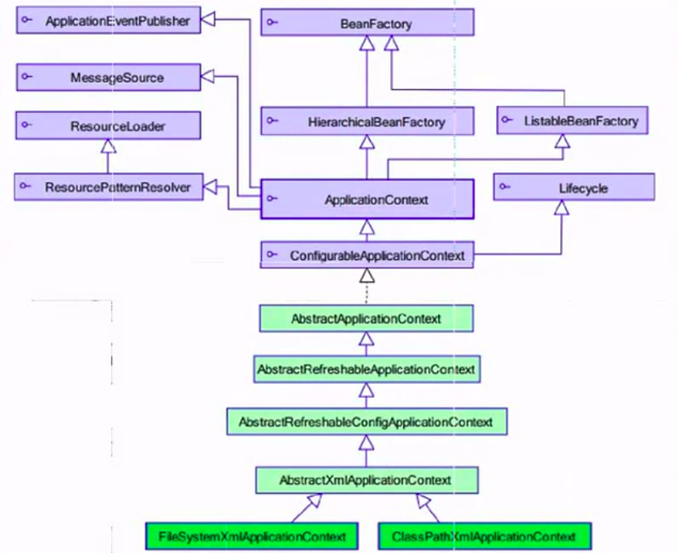

#   Spring的工厂类
+ date: 2019-07-14 16:32:47
+ description: Spring的工厂类
+ categories:
  - Java
+ tags:
  - Spring
---
#   工厂类

##  新旧工厂类
###  BeanFactory:老版本的工厂类
BeanFactory:调用getBean的时候,才会生成类的实例

###  ApplicationContext:新版本的工厂类
1.  ApplicationContext:加载配合字文件的时候,就会将Spring管理的类都实例化
2.  ApplicationContext有实现两个类
>   +   ClassPathXmlApplicationContext:加载类路径下的配置文件
>   +   FileSystemXmlApplicationContext:加载文件系统下的配置文件

##  Bean标签的id和name的配置
+   id:使用了约束中的唯一约束,里面不能出现特殊字符的
+   name:没有使用约束中的唯一约束(理论上可以出现重复,但是实际开发不能出现的),里面可以出现特殊字符

##  Bean的声明周期的配置(了解)
+   init-method:Bean被初始化的时候执行的方法
+   destroy-method:Bean被销毁的时候执行的方法(Bean是单例创建,工厂关闭)

##  Bean的作用范围(重点)
+   scope:Bean的作用范围

|参数| 作用|
|----|----|
|singleton|默认的,Spring会采用单例模式创建这个对象|
|prototype|多例模式|
|request|应用在web项目中,Spring创建这个类以后,将这个类存入到request范围中|
|session|应用在web项目中,Spring创建这个类以后,将这个类存入到session范围中|
|globalsession|应用在web项目中,必须在porlet环境下使用(在一个地方存入后,在子系统中就不用登录),如果没有这种环境,相当于session|

##   Spring的Bean的实例化方式(了解)
+   根源上的目的是解决我们如何获得其他类,而不会引入耦合
+   由于Bean已经都交给Spring管理,为了不引入耦合,Spring创建Bean的实例时,有如下几种方式

###  无参构造方式(默认)
```java
public class Bean1 {
    public void Bean1() {
        super();
        system.out.println("Bean1的无参数的构造方法执行了...");
    }
}
```
编写配置
```xml
<bean id="bean1" class="com.zjinc36.spring.demo1.Bean1></bean>
```

###  静态工厂实例化的方式
[_参考:Spring 静态工厂方法及实例工厂方法配置bean_](https://blog.csdn.net/u010512429/article/details/80487585)
静态工厂顾名思义，就是通过调用静态工厂的方法来获取自己需要的对象，为了让spring管理所有对象，我们不能直接通过"工程类.静态方法()"来获取对象，而是依然通过spring注入的形式获取

调用静态工厂方法创建Bean是将对象创建的过程封装到静态方法中。当客户端需要对象时，只需要简单地调用静态方法，而不关心创建对象的细节。

要声明通过静态方法创建的Bean，需要在Bean的class属性里指定拥有该工厂的方法的类，同时在factory-method属性里指定工厂方法的名称。最后，使用`<constructor-arg>`元素为该方法传递方法参数。

下面代码给出一个例子，调用DateFormat中的getDateInstance静态方法来创建Bean。
```xml
<bean id="dataformat" class="java.text.DateFormat" factory-method="getDateInstance">
    	<constructor-arg value="2"></constructor-arg>
</bean>
```

###	通过调用实例工厂方法创建Bean
[_参考:Spring 静态工厂方法及实例工厂方法配置bean_](https://blog.csdn.net/u010512429/article/details/80487585)

实例工厂方法：将对象的创建过程封装到另外一个对象实例的方法里。当客户端需要请求对象时，只需要简单的调用该实例方法而不需要关心对象的创建细节。要声明通过实例工厂方法创建的Bean

+   在Bean的factory-bean属性里指定拥有该工厂方法的Bean
+   在factory-method属性指定该工厂方法的名称
+   使用constructor-arg元素为工厂方法传递方法参数

下面代码给出一个例子，首先声明拥有工厂方法的bean-simpledataformat，接着创建新的对象factory-bean指定为上面的simpledateformat，并设置factory-method为parse方法，并在constructor-arg中传递参数，
```xml
<bean id="simpledataformat" class="java.text.SimpleDateFormat">
    	<constructor-arg value="yyyy-MM-dd hh-mm-ss"></constructor-arg>
</bean>
<bean id="date" factory-bean="simpledataformat" factory-method="parse">
    	<constructor-arg value="2018-05-28 20-47-00"></constructor-arg>
</bean>
```
