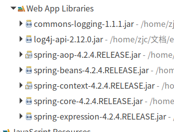
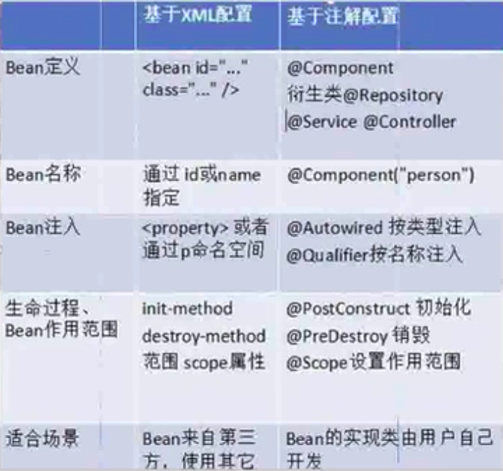

#   Spring的IOC注解开发
+ date: 2019-07-15 09:29:33
+ description: Spring的IOC注解开发
+ categories:
  - Java
+ tags:
  - Spring
---
[_参考Spring IOC注解开发_](https://blog.csdn.net/q547550831/article/details/54911516#spring%E7%9A%84ioc%E6%B3%A8%E8%A7%A3%E7%9A%84%E8%AF%A6%E8%A7%A3)
#   入门案例
##	引入jar包




##	引入配置文件
+	log4j.properties
+	applicationContext.xml
引入一个context的约束
```xml
<beans xmlns="http://www.springframework.org/schema/beans"
    xmlns:xsi="http://www.w3.org/2001/XMLSchema-instance"
    xmlns:context="http://www.springframework.org/schema/context" xsi:schemaLocation="
        http://www.springframework.org/schema/beans http://www.springframework.org/schema/beans/spring-beans.xsd
        http://www.springframework.org/schema/context http://www.springframework.org/schema/context/spring-context.xsd">

</beans>
```

##	创建相关包和类
1.	创建接口
```java
package com.pc.service;
/**
 * 用户服务类接口
 */
public interface UserService {
    /**
     * 保存用户
     */
    public void save();
}
```

2.	创建实现类
```java
package com.pc.service.impl;
/**
 * 用户服务实现类
 */
public class UserServiceImpl implements UserService {
    @Override
    public void save() {
        System.out.println("保存用户");
    }
}
```

##	将类的控制权交给Spring容器
在Spring中开启IOC的注解
<!-- 配置组件扫描 -->
```xml
<context:component-scan base-package="com.pc.service"/>
```
在类上添加注解
```java
ackage com.pc.service.impl;

import org.springframework.stereotype.Service;

import com.pc.service.UserService;

/**
 * 用户服务实现类
 */
@Service("userService")
public class UserServiceImpl implements UserService {
    @Override
    public void save() {
        System.out.println("保存用户");
    }
}
```

##	编写测试
```java
package com.pc.test;

import org.junit.Test;
import org.junit.runner.RunWith;
import org.springframework.test.context.ContextConfiguration;
import org.springframework.test.context.junit4.SpringJUnit4ClassRunner;

/**
 * SpringIOC注解测试
 */
@RunWith(SpringJUnit4ClassRunner.class)
@ContextConfiguration("classpath:applicationContext.xml")
public class SpringIOCAnnotationTest {
    @Test
    public void test1() {
    }
}
```

##	依赖注入
```java
package com.pc.test;

import javax.annotation.Resource;

import org.junit.Test;
import org.junit.runner.RunWith;
import org.springframework.test.context.ContextConfiguration;
import org.springframework.test.context.junit4.SpringJUnit4ClassRunner;

import com.pc.service.UserService;

/**
 * SpringIOC注解测试
 */
@RunWith(SpringJUnit4ClassRunner.class)
@ContextConfiguration("classpath:applicationContext.xml")
public class SpringIOCAnnotationTest {
    @Resource(name = "userService")
    private UserService userService;

    @Test
    public void test1() {
        userService.save();
    }
}
```
**如果属性有set方法，注解需要加到set方法上，如果没有set方法直接在属性上添加注解**

#   Spring的IOC注解的详解
原来需要使用XML配置的方式将id和类绑定，现在不需要这样做了只需要在类上添加注解即可。

@Component ：组件
+	@Controller ：修饰web层类
+	@Service ：修饰业务层类
+	@Repository ：修饰持久层类

@Component是Spring提供的通用的组件注解，可以通过在类上使用该注解，将对应的类标记为Spring Bean，使用此功能需要在Spring配置文件中，开启组件扫描，`<context:component-scan base-package="包名"/>`

@Component和@Component("name")的区别在于，前者只能通过Spring的按类型注入依赖，后者还能使用按名注入依赖。

**@Controller、@Service和@Repository这三个注解和@Component的功能在目前的4.x.x版本都是一样的，只是表明它是一个组件**。

不过通过在不同层使用相对应的注解，可以使注解更具有意义。在以后的版本中，Spring可能提供对这三个注解不同的增强。

#	Bean依赖(属性)注入注解
##	普通类型的属性
如果属性有set方法，注解需要加到set方法上，如果没有set方法直接在属性上添加注解。
```java
@RunWith(SpringJUnit4ClassRunner.class)
@ContextConfiguration("classpath:applicationContext.xml")
public class SpringIOCAnnotationTest {
    // @Value("Switch")
    private String name;
    @Value("Switch")
    public void setName(String name) {
        this.name = name;
    }
    @Test
    public void test2() {
        System.out.println(name);
    }
}
```
PS：如果同时在属性和set方法上添加了注解，那么set方法上的注解将会覆盖属性上的。

普通类型的属性
+	@Value ：注入普通类型属性

```java
@RunWith(SpringJUnit4ClassRunner.class)
@ContextConfiguration("classpath:applicationContext.xml")
public class SpringIOCAnnotationTest {
    @Value("Switch")
    private String name;

    @Test
    public void test2() {
        System.out.println(name);
    }
}
```

##	对象类型的属性
+	@Resource ：按名称注入对象
+	@Autowired ：按类型注入对象
+	@Qualifier:我们习惯是按照名称完成属性注入,必须让@Autowired注解和@Qualifier注解一起使用完成按名称属性注入
```java
@RunWith(SpringJUnit4ClassRunner.class)
@ContextConfiguration("classpath:applicationContext.xml")
public class SpringIOCAnnotationTest {
    // 按bean类型注入
    // @Resource
    // 按名注入，需要组件设置名称
    // @Resource(name = "userService")
    // 和上面功能一样，按名注入
    @Qualifier("userService")
    @Autowired
    private UserService userService;

    @Test
    public void test1() {
        userService.save();
    }
}
```

#	Bean的生命周期注解
+	@PostConstruct ：相当于init-method
+	@PreDestroy ：相当于destroy-method
```java
@Service("userService")
public class UserServiceImpl implements UserService {
    @Override
    public void save() {
        System.out.println("保存用户");
    }

    @PostConstruct
    public void init() {
        System.out.println("用户初始化");
    }

    @PreDestroy
    public void destory() {
        System.out.println("注销用户");
    }
}
```

#	Bean的作用范围的注解
Bean的范围的注解：默认是单例的
@Scope ：在类上添加的，控制类生成的时候采用单例还是多例
取值:
+	singleton ：单例
+	prototype ：多例
+	request ：request域，需要在web环境
+	session ：session域，需要在web环境
+	application： context域，需要在web环境
+	globalsession 集群环境的session域，需要在web环境
PS：可以到WebApplicationContext接口和ConfigurableBeanFactory类中找到@Scope的取值。

#	Spring的IOC的XML方式和注解方式比较



适用场景
+	XML:可以适用任何场景,结构清晰,维护方便
+	注解:有些地方用不了,比如类不是自己提供的,但是开发方便

#   XML和注解整合开发
XML管理Bean,注解完成属性注入

#	context:componet-scan和context:annotation-config的区别
通过`<context:annotation-config>`的注释可以看出它的作用是激活
@Required、@Autowired、@PostConstruct、@PreDestroy、@Resource等注解。

通过`<context:component-scan base-package="xx"/>`的注释可以看出它除了激活了`<context:annotation-config>`中所有的注解，同时还激活了
@Component、@Repository、@Service、@Controller、@RestController、@ControllerAdvice、@Configuration 这些注解
