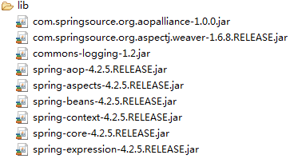

#   Spring使用注解方式实现AOP
+ date: 2019-07-21 15:56:28
+ description: 基于Spring注解的方式声明切面
+ categories:
  - Java
+ tags:
  - Spring
---
[_参考:使用Spring的注解方式实现AOP入门_](https://blog.csdn.net/yerenyuan_pku/article/details/52865330)
[_参考:使用Spring的注解方式实现AOP的细节_](https://blog.csdn.net/yerenyuan_pku/article/details/52879669)
#   需要引入的包
首先在Eclipse中新建一个普通的Java Project，名称为springAOP。为了使用Spring的注解方式进行面向切面编程，需要在springAOP项目中加入与AOP相关的jar包，spring aop需要额外的jar包有：
+   com.springsource.org.aopalliance-1.0.0.jar
+   com.springsource.org.aspectj.weaver-1.6.8.RELEASE.jar
+   spring-aop-4.2.5.RELEASE.jar
+   spring-aspects-4.2.5.RELEASE.jar

这样，springAOP项目共须jar包如下：

要进行AOP编程，我们接着要在Spring的配置文件——beans.xml中引入aop命名空间：
```xml
<?xml version="1.0" encoding="UTF-8"?>
<beans xmlns="http://www.springframework.org/schema/beans"
    xmlns:xsi="http://www.w3.org/2001/XMLSchema-instance"
    xmlns:context="http://www.springframework.org/schema/context"
    xmlns:aop="http://www.springframework.org/schema/aop"
    xsi:schemaLocation="http://www.springframework.org/schema/beans
        http://www.springframework.org/schema/beans/spring-beans.xsd
        http://www.springframework.org/schema/context
        http://www.springframework.org/schema/context/spring-context-4.2.xsd
        http://www.springframework.org/schema/aop
        http://www.springframework.org/schema/aop/spring-aop-4.2.xsd">

</beans>
```
Spring提供了两种切面声明方式，实际工作中我们可以选用其中一种：

+   基于XML配置方式声明切面。
+   基于注解方式声明切面。
本文选用第二种方式进行面向切面编程，即基于Spring注解的方式声明切面

#   使用注解的方式实现AOP案例
1.  我们在src目录下新建一个it.cast.service包，并在该包下创建PersonService接口，其代码为：
```java
public interface PersonService {
    public void save(String name);
    public void update(String name, Integer id);
    public String getPersonName(Integer id);
}
```
2.  紧接着在src目录下新建一个it.cast.service.impl包，并在该包下创建PersonService接口的实现类——PersonServiceBean.java，其代码为：
```java
public class PersonServiceImpl implements PersonService {

    @Override
    public void save(String name) {
        System.out.println("我是save()方法");
    }

    @Override
    public void update(String name, Integer id) {
        System.out.println("我是update()方法");
    }

    @Override
    public String getPersonName(Integer id) {
        System.out.println("我是getPersonName()方法");
        return "xxx";
    }

}
```
3.  然后，我们就要在cn.itcast.service包下创建一个切面类——MyInterceptor.java，下面我们来按照以下步骤将其写出来。
**首先用@Aspect注解声明整个类是一个切面**
```java
@Aspect
public class MyInterceptor {
    ...
}
```
**其次用@Pointcut注解声明一个切入点**
```
@Aspect
public class MyInterceptor {
    @Pointcut("execution (* cn.itcast.service.impl.PersonServiceImpl.*(..))")
    private void anyMethod() {} // 声明一个切入点，anyMethod为切入点名称
    ...
}
```
**然后,我们可利用方法签名来编写切入点表达式**
最典型的切入点表达式是根据方法的签名来匹配各种方法

>   `execution (* cn.itcast.service.impl.PersonServiceImpl.*(..))`：匹配PersonServiceImpl类中声明的所有方法。第一个\*代表任意修饰符及任意返回值类型，第二个\*代表任意方法，..匹配任意数量任意类型的参数，若目标类与该切面在同一个包中，可以省略包名。
>   `execution public * cn.itcast.service.impl.PersonServiceImpl.*(..)`：匹配PersonServiceImpl类中的所有公有方法。
>   `execution public double cn.itcast.service.impl.PersonServiceImpl.*(..)`：匹配PersonServiceImpl类中返回值类型为double类型的所有公有方法。
>   `execution public double cn.itcast.service.impl.PersonServiceImpl.*(double, ..)`：匹配PersonServiceImpl类中第一个参数为double类型，后面不管有无参数的所有公有方法，并且该方法的返回值类型为double类型。
>   `execution public double cn.itcast.service.impl.PersonServiceImpl.*(double, double)`：匹配PersonServiceImpl类中参数类型为double，double类型的，并且返回值类型也为double类型的所有公有方法。

**接着声明前置通知方法**
前置通知方法在目标方法开始之前执行
```java
@Aspect
public class MyInterceptor {
    @Pointcut("execution (* cn.itcast.service.impl.PersonServiceImpl.*(..))")
    private void anyMethod() {} // 声明一个切入点，anyMethod为切入点名称

    // 声明该方法是一个前置通知：在目标方法开始之前执行
    @Before("anyMethod()")
    public void doAccessCheck() {
        System.out.println("前置通知");
    }
}
```
注意：若是将一个类声明为一个切面，那么需要把该类放到IOC容器管理。

4.  接下来，我们理应要修改Spring的配置文件——beans.xml了，将其改为：
```xml
<?xml version="1.0" encoding="UTF-8"?>
<beans xmlns="http://www.springframework.org/schema/beans"
    xmlns:xsi="http://www.w3.org/2001/XMLSchema-instance"
    xmlns:context="http://www.springframework.org/schema/context"
    xmlns:aop="http://www.springframework.org/schema/aop"
    xsi:schemaLocation="http://www.springframework.org/schema/beans
        http://www.springframework.org/schema/beans/spring-beans.xsd
        http://www.springframework.org/schema/context
        http://www.springframework.org/schema/context/spring-context-4.2.xsd
        http://www.springframework.org/schema/aop
        http://www.springframework.org/schema/aop/spring-aop-4.2.xsd">

    <aop:aspectj-autoproxy />
    <bean id="myInterceptor" class="cn.itcast.service.MyInterceptor" />
    <bean id="personService" class=" cn.itcast.service.impl.PersonServiceImpl"></bean>
</beans>
```
5.  最后，在src目录下新建一个junit.test包，并在该包中新建一个单元测试类——SpringAOPTest.java，其代码为：
```java
public class SpringAOPTest {

    @Test
    public void interceptorTest() {
        ApplicationContext cxt = new ClassPathXmlApplicationContext("beans.xml");
        PersonService personService = (PersonService) cxt.getBean("personService");
        personService.save("xxx");
    }

}
```

#	如何使用各种通知
前面我们已经入门使用Spring的注解方式实现AOP了，现在我们再来学习使用Spring的注解方式实现AOP的一些细节。
本文是来讲解使用Spring的注解方式实现AOP的一些细节，其实说白了就是学习如何使用各种通知而已，例如前置通知、后置通知、异常通知、最终通知、环绕通知等，之前我们已经学习了前置通知，现在就来学习剩余的通知。
##  后置通知
我们先来看后置通知，此时须将MyInterceptor类的代码修改为：
```java
/**
 * 切面
 * @author li ayun
 *
 */
@Aspect
public class MyInterceptor {
    @Pointcut("execution (* cn.itcast.service.impl.PersonServiceImpl.*(..))")
    private void anyMethod() {} // 声明一个切入点，anyMethod为切入点名称

    // 声明该方法是一个前置通知：在目标方法开始之前执行
    @Before("anyMethod()")
    public void doAccessCheck() {
        System.out.println("前置通知");
    }

    @AfterReturning("anyMethod()")
    public void doAfterReturning() {
        System.out.println("后置通知");
    }

}
```

##  最终通知
我们再来看最终通知，此时须将MyInterceptor类的代码修改为：
```java
/**
 * 切面
 * @author li ayun
 *
 */
@Aspect
public class MyInterceptor {
    @Pointcut("execution (* cn.itcast.service.impl.PersonServiceImpl.*(..))")
    private void anyMethod() {} // 声明一个切入点，anyMethod为切入点名称

    // 声明该方法是一个前置通知：在目标方法开始之前执行
    @Before("anyMethod()")
    public void doAccessCheck() {
        System.out.println("前置通知");
    }

    @AfterReturning("anyMethod()")
    public void doAfterReturning() {
        System.out.println("后置通知");
    }

    @After("anyMethod()")
    public void doAfter() {
        System.out.println("最终通知");
    }
}
```

##  异常通知
再接者，我们来看一下异常通知，异常通知是在目标方法抛异常时执行的，故我们应将PersonServiceImpl类的代码改为：
```java
public class PersonServiceImpl implements PersonService {

    @Override
    public void save(String name) {
        throw new RuntimeException("我是异常");
        // System.out.println("我是save()方法");
    }

    @Override
    public void update(String name, Integer id) {
        System.out.println("我是update()方法");
    }

    @Override
    public String getPersonName(Integer id) {
        System.out.println("我是getPersonName()方法");
        return "xxx";
    }

}
```
然后在MyInterceptor类中声明异常通知方法：
```java
/**
 * 切面
 * @author li ayun
 *
 */
@Aspect
public class MyInterceptor {
    @Pointcut("execution (* cn.itcast.service.impl.PersonServiceImpl.*(..))")
    private void anyMethod() {} // 声明一个切入点，anyMethod为切入点名称

    // 声明该方法是一个前置通知：在目标方法开始之前执行
    @Before("anyMethod()")
    public void doAccessCheck() {
        System.out.println("前置通知");
    }

    @AfterReturning("anyMethod()")
    public void doAfterReturning() {
        System.out.println("后置通知");
    }

    @After("anyMethod()")
    public void doAfter() {
        System.out.println("最终通知");
    }

    @AfterThrowing("anyMethod()")
    public void doAfterThrowing() {
        System.out.println("异常通知");
    }
}
```

##  环绕通知
最后，我们来看一下环绕通知，Struts2提供的拦截器就属于环绕通知，环绕通知在我们做权限系统时将大量使用。这时，我们还是将PersonServiceImpl类的代码恢复为：
```java
public class PersonServiceImpl implements PersonService {

    @Override
    public void save(String name) {
        // throw new RuntimeException("我是异常");
        System.out.println("我是save()方法");
    }

    @Override
    public void update(String name, Integer id) {
        System.out.println("我是update()方法");
    }

    @Override
    public String getPersonName(Integer id) {
        System.out.println("我是getPersonName()方法");
        return "xxx";
    }
```
然后在MyInterceptor类中声明环绕通知方法，环绕通知方法的写法是固定的，形如：
```java
public Object doBasicProfiling(ProceedingJoinPoint pjp) throws Throwable {
    ...
}
```
这样，MyInterceptor类的代码应该是：
```java
/**
 * 切面
 * @author li ayun
 *
 */
@Aspect
public class MyInterceptor {
    @Pointcut("execution (* cn.itcast.service.impl.PersonServiceImpl.*(..))")
    private void anyMethod() {} // 声明一个切入点，anyMethod为切入点名称

    // 声明该方法是一个前置通知：在目标方法开始之前执行
    @Before("anyMethod()")
    public void doAccessCheck() {
        System.out.println("前置通知");
    }

    @AfterReturning("anyMethod()")
    public void doAfterReturning() {
        System.out.println("后置通知");
    }

    @After("anyMethod()")
    public void doAfter() {
        System.out.println("最终通知");
    }

    @AfterThrowing("anyMethod()")
    public void doAfterThrowing() {
        System.out.println("异常通知");
    }

    @Around("anyMethod()")
    public Object doBasicProfiling(ProceedingJoinPoint pjp) throws Throwable {
        /**
         * 环绕通知内部一定要确保执行该方法，如果不执行该方法，业务bean中被拦截的方法就不会被执行。
         * 当执行该方法，如果后面还有切面的话，它的执行顺序应该是这样的：先执行后面的切面，如果后面没有切面了，
         * 再执行最终的目标对象的业务方法。若不执行该方法，则后面的切面，业务bean的方法都不会被执行。
         */
        // if () { // 判断用户是否有权限，
        System.out.println("进入方法");
        Object result = pjp.proceed();
        System.out.println("退出方法");
        // }
        return result;
    }
}
```
注意：环绕通知内部一定要确保执行proceed()该方法，如果不执行该方法，业务bean中被拦截的方法就不会被执行。当执行该方法，如果后面还有切面的话，它的执行顺序应该是这样的：先执行后面的切面，如果后面没有切面了，再执行最终的目标对象的业务方法。若不执行该方法，则后面的切面，业务bean的方法都不会被执行。
其实我们仅使用环绕通知就可以实现前置通知、后置通知、异常通知、最终通知等的效果。

#   细节
前面部分我们已经学会了如何使用各种通知，例如前置通知、后置通知、异常通知、最终通知、环绕通知等，现在我们再来看使用Spring的注解方式实现AOP的另一些细节。
##  细节一：需要得到输入参数
如在前置通知里面，得到用户输入的数据。此时，须将前置通知方法修改为：
```java
@Before("anyMethod() && args(name)")
public void doAccessCheck(String name) {
    System.out.println("前置通知：" + name);
}
```
@Before("anyMethod() && args(name)")匹配的是PersonServiceImpl类中参数为String类型的方法，即save()方法。
测试SpringAOPTest类的interceptorTest()方法，可以发现Eclipse控制台打印：

##  细节二：如我要获得PersonServiceImpl类中的getPersonName()方法的返回参数
此时，须将后置通知方法修改为：
```java
@AfterReturning(pointcut="anyMethod()", returning="result")
public void doAfterReturning(String result) {
    System.out.println("后置通知：" + result);
}
```
@AfterReturning(pointcut="anyMethod()", returning="result")匹配的是PersonServiceImpl类中返回值类型为String的方法，并且returning属性能将返回值传入进后置通知方法里面。
我们还要修改SpringAOPTest类的代码为：
```java
public class SpringAOPTest {

    @Test
    public void interceptorTest() {
        ApplicationContext cxt = new ClassPathXmlApplicationContext("beans.xml");
        PersonService personService = (PersonService) cxt.getBean("personService");
        personService.getPersonName(2);
    }

}
```

##  细节三：在目标方法出现异常时，得到抛出的异常
为了便于试验，我们须将PersonServiceImpl类的代码修改为：
```java
public class PersonServiceImpl implements PersonService {

    @Override
    public void save(String name) {
        throw new RuntimeException("我是异常");
        // System.out.println("我是save()方法");
    }

    @Override
    public void update(String name, Integer id) {
        System.out.println("我是update()方法");
    }

    @Override
    public String getPersonName(Integer id) {
        System.out.println("我是getPersonName()方法");
        return "xxx";
    }

}
```
然后将异常通知方法修改为：
```java
@AfterThrowing(pointcut="anyMethod()", throwing="e")
public void doAfterThrowing(Exception e) {
    System.out.println("异常通知：" + e);
}
```
最后，我们还要将SpringAOPTest类的代码改为：
```java
public class SpringAOPTest {

    @Test
    public void interceptorTest() {
        ApplicationContext cxt = new ClassPathXmlApplicationContext("beans.xml");
        PersonService personService = (PersonService) cxt.getBean("personService");
        personService.save("xxx");
    }

}
```
