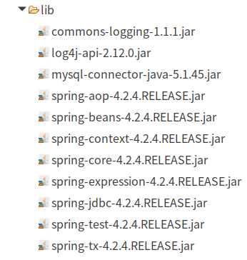

#   Spring的JDBC的模板的使用
+ date: 2019-07-21 16:30:02
+ description: Spring的JDBC的模板的使用
+ categories:
  - Java
+ tags:
  - Spring
---
#   创建项目
引入jar包
+   引入基本开发包
+   数据库驱动
+   Spring的JDBC模板的jar包




#   入门程序
此时连接池直接出现在代码中
```java
package com.zjinc36.jdbc.demo1;

import org.junit.Test;
import org.springframework.jdbc.core.JdbcTemplate;
import org.springframework.jdbc.datasource.DriverManagerDataSource;

/**
 * JDBC模板的使用
 * @author zjc
 */
public class JdbcDemo1 {
	@Test
	/**
	 * jdbc模板的使用类似与DButils
	 */
	public void demo1() {
		// 创建连接池
		DriverManagerDataSource dataSource = new DriverManagerDataSource();
		dataSource.setDriverClassName("com.mysql.jdbc.Driver");
		dataSource.setUrl("jdbc:mysql:///spring_jdbc");
		dataSource.setUsername("root");
		dataSource.setPassword("root");
		// 创建jdbc模板
		JdbcTemplate jdbcTemplate = new JdbcTemplate(dataSource);
		jdbcTemplate.update("insert into account values(null, ?, ?)", "zhangsan", 10000d);
	}
}
```

#   将连接池和模板交给Spring管理
本质上就是将配置信息提取到xml文件中
```xml
<?xml version="1.0" encoding="UTF-8" ?>
<beans xmlns="http://www.springframework.org/schema/beans"
	xmlns:xsi="http://www.w3.org/2001/XMLSchema-instance"
	xmlns:p="http://www.springframework.org/schema/p"
	xmlns:context="http://www.springframework.org/schema/context"
	xsi:schemaLocation="http://www.springframework.org/schema/beans
       http://www.springframework.org/schema/beans/spring-beans.xsd
       http://www.springframework.org/schema/context
       http://www.springframework.org/schema/context/spring-context.xsd">

	<!-- 配置Spring的内置连接池 -->
	<bean
		id="dataSourcePool" class="org.springframework.jdbc.datasource.DriverManagerDataSource">
		<!-- 属性注入 -->
		<property name="driverClassName" value="com.mysql.jdbc.Driver" />
		<property name="url" value="jdbc:mysql:///spring_jdbc" />
		<property name="username" value="root" />
		<property name="password" value="root" />
	</bean>
	<bean id="jdbcTemplate" class="org.springframework.jdbc.core.JdbcTemplate">
		<property name="dataSource" ref="dataSourcePool"/>
	</bean>
</beans>
```

```java
package com.zjinc36.jdbc.demo1;

import javax.annotation.Resource;

import org.junit.Test;
import org.junit.runner.RunWith;
import org.springframework.jdbc.core.JdbcTemplate;
import org.springframework.test.context.ContextConfiguration;
import org.springframework.test.context.junit4.SpringJUnit4ClassRunner;

@RunWith(SpringJUnit4ClassRunner.class)
@ContextConfiguration("classpath:applicationContext.xml")
public class JdbcDemo2 {
	@Resource(name="jdbcTemplate")
	private JdbcTemplate jdbcTemplate;

	@Test
	public void demo2() {
		jdbcTemplate.update("insert into account value(null, ?, ?)", "lisi", 1000d);
	}
}
```

#   配置不同的连接池
##  Spring内置的连接池
上面的代码就是用这种方式
1.	applicationContext.xml
org.springframework.jdbc.datasource.DriverManagerDataSource
```xml
	<bean
		id="dataSourcePool" class="org.springframework.jdbc.datasource.DriverManagerDataSource">
		<!-- 属性注入 -->
		<property name="driverClassName" value="com.mysql.jdbc.Driver" />
		<property name="url" value="jdbc:mysql:///spring_jdbc" />
		<property name="username" value="root" />
		<property name="password" value="root" />
	</bean>
```

##  DHCP连接池
1.  jar包


2.  applicationContext.xml
org.apache.commons.dbcp.BasicDataSource
```xml
	<bean
		id="dataSourcePool" class="org.apache.commons.dbcp.BasicDataSource">
		<!-- 属性注入 -->
		<property name="driverClassName" value="com.mysql.jdbc.Driver" />
		<property name="url" value="jdbc:mysql:///spring_jdbc" />
		<property name="username" value="root" />
		<property name="password" value="root" />
	</bean>
```

##   c3p0连接池
1.	jar包


2.	applicationContext.xml
```xml
	<bean
		id="dataSourcePool" class="com.mchange.v2.c3p0.ComboPooledDataSource">
		<!-- 属性注入 -->
		<property name="driverClassName" value="com.mysql.jdbc.Driver" />
		<property name="url" value="jdbc:mysql:///spring_jdbc" />
		<property name="username" value="root" />
		<property name="password" value="root" />
	</bean>
```

#   将详细配置从xml中提取到外部配置文件中
[_Spring引入外部properties文件_](https://blog.csdn.net/totally123/article/details/79671304)
##  定义一个属性文件
jdbc.properties
```java
jdbc.driverClass=com.mysql.jdbc.Driver
jdbc.url=jdbc:mysql:///spring_jdbc
jdbc.username=root
jdbc.password=root
```

##	applicationContext.xml文件中引入属性文件
1.	第一种方式,通过bean标签引入
```xml
<bean class="org.springframework.beans.factory.config.PropertyPlaceholderConfigurer">
    <property name="locations" value="classpath:jdbc.properties"/>
</bean>
```

2.	第二种方式,使用context标签
```xml
<context:property-placeholder location="classpath:jdbc.properties" />
```

##  此时applicationContext.xml应该怎么写
```xml
<?xml version="1.0" encoding="UTF-8" ?>
<beans xmlns="http://www.springframework.org/schema/beans"
	xmlns:xsi="http://www.w3.org/2001/XMLSchema-instance"
	xmlns:p="http://www.springframework.org/schema/p"
	xmlns:context="http://www.springframework.org/schema/context"
	xsi:schemaLocation="http://www.springframework.org/schema/beans 
       http://www.springframework.org/schema/beans/spring-beans.xsd
       http://www.springframework.org/schema/context 
       http://www.springframework.org/schema/context/spring-context.xsd">

	<!-- 引入属性文件 -->
	<!-- 第一种方式通过一个Bean标签引入的(很少使用) -->
	<bean
		class="org.springframework.beans.factory.config.PropertyPlaceholderConfigurer">
		<property name="locations" value="classpath:jdbc.properties" />
	</bean>
	<!-- 配置Spring的内置连接池 -->
	<bean id="dataSourcePool"
		class="org.springframework.jdbc.datasource.DriverManagerDataSource">
		<!-- 属性注入 -->
		<property name="driverClassName"
			value="${jdbc.driverClass}" />
		<property name="url" value="${jdbc.url}" />
		<property name="username" value="${jdbc.username}" />
		<property name="password" value="${jdbc.password}" />
	</bean>
	<bean id="jdbcTemplate"
		class="org.springframework.jdbc.core.JdbcTemplate">
		<property name="dataSource" ref="dataSourcePool" />
	</bean>
</beans>
```

#   模板的CURD操作
[_spring的JdbcTemplate模板类的常用操作_](https://blog.csdn.net/alan_liuyue/article/details/88247828)
##  增删改操作
[_Spring入门之JdbcTemplate【一】增加、删除、修改数据库表数据_](https://blog.csdn.net/chensanwa/article/details/79168244)
```java
package com.zjinc36.jdbc.demo1;

import javax.annotation.Resource;
import org.junit.Test;
import org.junit.runner.RunWith;
import org.springframework.jdbc.core.JdbcTemplate;
import org.springframework.test.context.ContextConfiguration;
import org.springframework.test.context.junit4.SpringJUnit4ClassRunner;

@RunWith(SpringJUnit4ClassRunner.class)
@ContextConfiguration("classpath:applicationContext.xml")
public class JdbcDemo2 {
	@Resource(name = "jdbcTemplate")
	private JdbcTemplate jdbcTemplate;

	@Test
	// 保存操作
	public void demo2() {
		jdbcTemplate.update("insert into account value(null, ?, ?)", "lisi",
				1000d);
	}

	// 删除操作
	@Test
	public void delete() {
		// 调用jdbcTemplate对象的方法实现删除操作
		String sql = "DELETE FROM account WHERE name=?";
		int rows = jdbcTemplate.update(sql, "Lucy");
		System.out.println(rows);
	}

	// 修改操作
	@Test
	public void update() {
		// 调用jdbcTemplate对象的方法实现修改操作
		String sql = "update account set name=? where id=?";
		int rows = jdbcTemplate.update(sql, "Lucy", 1);
		System.out.println(rows);
	}
}
```

##  查操作
[_Spring入门之JdbcTemplate【二】查询数据库表数据_](https://blog.csdn.net/chensanwa/article/details/79168245)
### 将查询数据封装进对象
1.  创建对象(将数据封装进对象)
```java
ckage com.zjinc36.jdbc.demo1;

public class Account {
	private Integer id;
	private String name;
	private Double money;
	public Integer getId() {
		return id;
	}
	public void setId(Integer id) {
		this.id = id;
	}
	public String getName() {
		return name;
	}
	public void setName(String name) {
		this.name = name;
	}
	public Double getMoney() {
		return money;
	}
	public void setMoney(Double money) {
		this.money = money;
	}
	@Override
	public String toString() {
		return "Account [id=" + id + ", name=" + name + ", money=" + money
				+ "]";
	}
}
```

2.  自己写类实现接口,自己做数据封装
```java
package com.zjinc36.jdbc.demo1;

import java.sql.ResultSet;
import java.sql.SQLException;

import org.springframework.jdbc.core.RowMapper;

class MyRowMapper implements RowMapper<Account> {
	@Override
	public Account mapRow(ResultSet rs, int rowNum) throws SQLException {
		Account account = new Account();
		account.setId(rs.getInt("id"));
		account.setName(rs.getString("name"));
		account.setMoney(rs.getDouble("money"));
		return account;
	}
}
```

3.	取出数据
```java
package com.zjinc36.jdbc.demo1;

import javax.annotation.Resource;
import org.junit.Test;
import org.junit.runner.RunWith;
import org.springframework.jdbc.core.JdbcTemplate;
import org.springframework.test.context.ContextConfiguration;
import org.springframework.test.context.junit4.SpringJUnit4ClassRunner;

@RunWith(SpringJUnit4ClassRunner.class)
@ContextConfiguration("classpath:applicationContext.xml")
public class JdbcDemo2 {
	@Resource(name = "jdbcTemplate")
	private JdbcTemplate jdbcTemplate;

	// 查询返回对象
	@Test
	public void testObject() {
		Account account = jdbcTemplate.queryForObject(
				"select * from account where id=?", new MyRowMapper(), 2);
		System.out.println(account);
	}
}
```

##  查询表中有多少条记录
```java
package com.zjinc36.jdbc.demo1;

import javax.annotation.Resource;
import org.junit.Test;
import org.junit.runner.RunWith;
import org.springframework.jdbc.core.JdbcTemplate;
import org.springframework.test.context.ContextConfiguration;
import org.springframework.test.context.junit4.SpringJUnit4ClassRunner;

@RunWith(SpringJUnit4ClassRunner.class)
@ContextConfiguration("classpath:applicationContext.xml")
public class JdbcDemo2 {
	@Resource(name = "jdbcTemplate")
	private JdbcTemplate jdbcTemplate;

	// 查询表中有多少条记录
	@Test
	public void testCount() {
		// 调用方法得到记录数
		String sql = "select count(*) from account";

		// 调用jdbcTemplate方法得到记录
		/*
		 * queryForObject(String sql,Class<T> requiredType) 第一个参数：sql语句
		 * 第二个参数：返回类型的class
		 */
		int count = jdbcTemplate.queryForObject(sql, Integer.class);
		System.out.println(count);
	}
}

```

##	查询所有对象list集合
```java
package com.zjinc36.jdbc.demo1;

import java.util.List;

import javax.annotation.Resource;
import org.junit.Test;
import org.junit.runner.RunWith;
import org.springframework.jdbc.core.JdbcTemplate;
import org.springframework.test.context.ContextConfiguration;
import org.springframework.test.context.junit4.SpringJUnit4ClassRunner;


@RunWith(SpringJUnit4ClassRunner.class)
@ContextConfiguration("classpath:applicationContext.xml")
public class JdbcDemo2 {
	@Resource(name = "jdbcTemplate")
	private JdbcTemplate jdbcTemplate;

	// 查询所有对象list集合
	@Test
	public void testList() {
		// 写SQL语句，根据username查询
		String sql = "select * from account";
		/*
		 * query(String sql,RowMapper<T> rowMapper,Object ... args) 第一个参数：SQL语句
		 * 第二个参数：RowMapper接口，自己写类实现数据封装 第三个参数：可变参数
		 */
		// 调用jdbcTemplate的query()方法
		List<Account> list = jdbcTemplate.query(sql, new MyRowMapper());
		System.out.println(list);
	}
}
```
