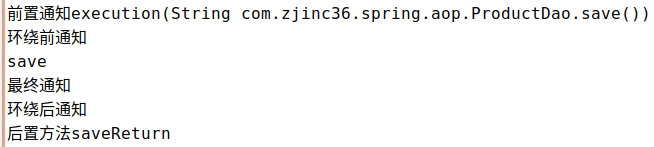

#   Spring的通知类型
+ date: 2019-07-21 12:00:53
+ description: Spring的通知类型
+ categories:
  - Java
+ tags:
  - Spring
---
#   前提
[_项目基本代码_](/2019/07/21/Spring的AOP的入门开发/)

#   前置通知
在目标方法执行之前进行操作
+   修改切面类,获得切入点信息
```java
package com.zjinc36.spring.aop;

import org.aspectj.lang.JoinPoint;

/**
 * 切面类
 * @author zjc
 *
 */
public class MyAspectXML {
	//前置通知
	public void beforeMethod(JoinPoint joinPoint) {
		System.out.println("前置通知" + joinPoint);
	}
}

```

#   后置通知
在目标方法执行之后进行操作
1.  ProductDaoImpl.java增加返回值
```java
package com.zjinc36.spring.aop;

public class ProductDaoImpl implements ProductDao {

	@Override
	public String save() {
		System.out.println("save");
		return "saveReturn";
	}
}

```

2.	切面类增加后置通知和打印上述返回值
```java
package com.zjinc36.spring.aop;

import org.aspectj.lang.JoinPoint;

/**
 * 切面类
 * @author zjc
 *
 */
public class MyAspectXML {
    //后置通知
    //这里参数一定是Object对象
    //参数命名要和applicationContext.xml中的命名一致
    public void afterMethod(Object productDaoImplResult) {
        System.out.println("后置方法" + productDaoImplResult);
    }
}

```

2.	在applicationContext.xml文件中增加后置通知和获得返回值设置
```xml
<?xml version="1.0" encoding="UTF-8"?>
<beans xmlns="http://www.springframework.org/schema/beans"
	xmlns:xsi="http://www.w3.org/2001/XMLSchema-instance"
	xmlns:context="http://www.springframework.org/schema/context"
	xmlns:aop="http://www.springframework.org/schema/aop"
	xsi:schemaLocation="
		http://www.springframework.org/schema/beans
		http://www.springframework.org/schema/beans/spring-beans.xsd
		http://www.springframework.org/schema/aop
		http://www.springframework.org/schema/aop/spring-aop.xsd
	">

	<bean id="productDao" class="com.zjinc36.spring.aop.ProductDaoImpl"></bean>

	<!-- 将切面类交给Spring管理 -->
	<bean id="myAspect" class="com.zjinc36.spring.aop.MyAspectXML" />

	<!-- 通过AOP的配置完成对目标类产生代理 -->
	<aop:config>
		<!--
			表达式配置哪些类的哪些方法需要进行增强
			对哪些点进行拦截
			*	表示任意返回值
			..	表示任意参数
		 -->
		<aop:pointcut expression="execution(* com.zjinc36.spring.aop.ProductDaoImpl.save(..) )" id="product1" />

		<!-- 配置切面 -->
		<!--
			ref:切面id
			returning:切点product1的返回值会赋值给productDaoImplResult,并传递给切面中的afterMethod方法
		 -->
		<aop:aspect ref="myAspect">
			<!-- 后置通知 -->
			<aop:after-returning method="afterMethod" pointcut-ref="product1" returning="productDaoImplResult" />
		</aop:aspect>
	</aop:config>
</beans>
```

#   环绕通知
在目标方法执行之前和之后进行操作
1.  修改切面类
```java
package com.zjinc36.spring.aop;

import org.aspectj.lang.JoinPoint;
import org.aspectj.lang.ProceedingJoinPoint;

/**
 * 切面类
 * @author zjc
 *
 */
public class MyAspectXML {
	public Object aroundMethod(ProceedingJoinPoint joinPoint) throws Throwable {
		System.out.println("环绕前通知");
		Object obj = joinPoint.proceed();
		System.out.println("环绕后通知");
		return obj;
	}
}
```

2.	applicationContext.xml增加环绕通知
```xml
<?xml version="1.0" encoding="UTF-8"?>
<beans xmlns="http://www.springframework.org/schema/beans"
	xmlns:xsi="http://www.w3.org/2001/XMLSchema-instance"
	xmlns:context="http://www.springframework.org/schema/context"
	xmlns:aop="http://www.springframework.org/schema/aop"
	xsi:schemaLocation="
		http://www.springframework.org/schema/beans
		http://www.springframework.org/schema/beans/spring-beans.xsd
		http://www.springframework.org/schema/aop
		http://www.springframework.org/schema/aop/spring-aop.xsd
	">

	<bean id="productDao"
		class="com.zjinc36.spring.aop.ProductDaoImpl"></bean>

	<!-- 将切面类交给Spring管理 -->
	<bean id="myAspect" class="com.zjinc36.spring.aop.MyAspectXML" />

	<!-- 通过AOP的配置完成对目标类产生代理 -->
	<aop:config>
		<!-- 表达式配置哪些类的哪些方法需要进行增强 对哪些点进行拦截 * 表示任意返回值 .. 表示任意参数 -->
		<aop:pointcut
			expression="execution(* com.zjinc36.spring.aop.ProductDaoImpl.save(..) )"
			id="product1" />

		<!-- 配置切面 -->
		<!-- ref:切面id -->
		<aop:aspect ref="myAspect">
			<!-- 环绕通知 -->
			<aop:around method="aroundMethod" pointcut-ref="product1" />
		</aop:aspect>
	</aop:config>
</beans>
```


#   异常抛出通知
在程序出现异常的时候,进行操作
1.  修改切面类
```java
package com.zjinc36.spring.aop;

import org.aspectj.lang.JoinPoint;
import org.aspectj.lang.ProceedingJoinPoint;

/**
 * 切面类
 * @author zjc
 *
 */
public class MyAspectXML {
	//异常抛出通知
	//xml文件规定了用ex变量将错误信息传进来,即这边使用的变量要和xml文件中规定的变量相同
	public void throwing(Throwable ex) {
		System.out.println("异常抛出通知");
		System.out.println("异常内容" + ex.getMessage());
	}
}
```

2.	applicationContext.xml中增加异常抛出通知
```xml
<?xml version="1.0" encoding="UTF-8"?>
<beans xmlns="http://www.springframework.org/schema/beans"
	xmlns:xsi="http://www.w3.org/2001/XMLSchema-instance"
	xmlns:context="http://www.springframework.org/schema/context"
	xmlns:aop="http://www.springframework.org/schema/aop"
	xsi:schemaLocation="
		http://www.springframework.org/schema/beans
		http://www.springframework.org/schema/beans/spring-beans.xsd
		http://www.springframework.org/schema/aop
		http://www.springframework.org/schema/aop/spring-aop.xsd
	">

	<bean id="productDao"
		class="com.zjinc36.spring.aop.ProductDaoImpl"></bean>

	<!-- 将切面类交给Spring管理 -->
	<bean id="myAspect" class="com.zjinc36.spring.aop.MyAspectXML" />

	<!-- 通过AOP的配置完成对目标类产生代理 -->
	<aop:config>
		<!-- 表达式配置哪些类的哪些方法需要进行增强 对哪些点进行拦截 * 表示任意返回值 .. 表示任意参数 -->
		<aop:pointcut
			expression="execution(* com.zjinc36.spring.aop.ProductDaoImpl.save(..) )"
			id="product1" />

		<!-- 配置切面 -->
		<!-- ref:切面id -->
		<!-- throwing:切点product1抛出的异常会被赋值到throwing规定变量ex中,并传递给切面所对应的方法throwing中 -->
		<aop:aspect ref="myAspect">
			<aop:after-throwing method="throwing" pointcut-ref="product1" throwing="ex" />
		</aop:aspect>
	</aop:config>
</beans>
```
**注意:测试的时候什么都不会,是因为程序中没有任何异常,只有有异常的时候才会处理到切面类**

#   最终通知
无论代码是否有异常,总是会执行
1.	修改切面类
```java
package com.zjinc36.spring.aop;

import org.aspectj.lang.JoinPoint;
import org.aspectj.lang.ProceedingJoinPoint;

/**
 * 切面类
 * @author zjc
 *
 */
public class MyAspectXML {
	//最终通知
	public void afterFinalMethod() {
		System.out.println("最终通知");
	}
}

```

2.	applicationContext.xml增加最终通知
```xml
<?xml version="1.0" encoding="UTF-8"?>
<beans xmlns="http://www.springframework.org/schema/beans"
	xmlns:xsi="http://www.w3.org/2001/XMLSchema-instance"
	xmlns:context="http://www.springframework.org/schema/context"
	xmlns:aop="http://www.springframework.org/schema/aop"
	xsi:schemaLocation="
		http://www.springframework.org/schema/beans
		http://www.springframework.org/schema/beans/spring-beans.xsd
		http://www.springframework.org/schema/aop
		http://www.springframework.org/schema/aop/spring-aop.xsd
	">

	<bean id="productDao"
		class="com.zjinc36.spring.aop.ProductDaoImpl"></bean>

	<!-- 将切面类交给Spring管理 -->
	<bean id="myAspect" class="com.zjinc36.spring.aop.MyAspectXML" />

	<!-- 通过AOP的配置完成对目标类产生代理 -->
	<aop:config>
		<!-- 表达式配置哪些类的哪些方法需要进行增强 对哪些点进行拦截 * 表示任意返回值 .. 表示任意参数 -->
		<aop:pointcut
			expression="execution(* com.zjinc36.spring.aop.ProductDaoImpl.save(..) )"
			id="product1" />

		<!-- 配置切面 -->
		<!-- ref:切面id -->
		<aop:aspect ref="myAspect">
			<aop:after method="afterFinalMethod" pointcut-ref="product1" />
		</aop:aspect>
	</aop:config>
</beans>
```

#   通知同时出现时,通知的顺序如下




#   引介通知(不用知道)
