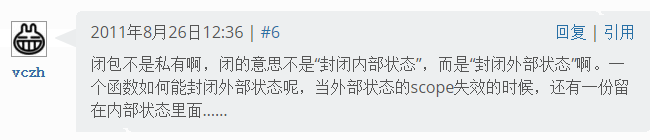

#   Java中的闭包
date: 2019-07-28 11:13:49
description: Java中的闭包
copyright: false
categories:
- Java
tags:
- Java细节
---
#   参考
>	本文作者为: SylvanasSun.转载请务必将下面这段话置于文章开头处(保留超链接).
>	本文转发自SylvanasSun Blog,原文链接: https://sylvanassun.github.io/2017/07/30/2017-07-30-JavaClosure/

>   [C++11 中值得关注的几大变化（详解）评论区6#](https://coolshell.cn/articles/5265.html)

#	闭包
定义一个闭包的要点如下:

+	一个依赖于外部环境的自由变量的函数.
+	这个函数能够访问外部环境的自由变量.

也就是说,外部环境持有内部函数所依赖的自由变量,由此对内部函数形成了闭包.

#   自由变量
那么什么是自由变量呢?自由变量就是在函数自身作用域之外的变量,**一个函数`f(x)=x+yf(x)=x+y`,其中y就是自由变量**,它并不是这个函数自身的自变量,而是通过外部环境提供的.

下面以JavaScript的一个闭包为例:
```javascript
function Add(y) {
	return function(x) {
		return x + y;
	}
}
```
对于内部函数`function(x)`来说,`y`就是自由变量.而`y`是函数`Add(y)`内的参数,所以`Add(y)`对内部函数`function(x)`形成了一个闭包.

这个闭包将自由变量y与内部函数绑定在了一起,也就是说,当Add(y)函数执行完毕后,它不会随着函数调用结束后被回收(不能在栈上分配空间).
```javascript
var add_function = Add(5); // 这时y=5,并且与返回的内部函数绑定在了一起
var result = add_function(10); // x=10,返回最终的结果 10 + 5 = 15
```

#   Java中的闭包
Java与JavaScript又或者其他支持闭包的语言不同,它是一个基于类的面向对象语言,也就是说一个方法所用到的自由变量永远都来自于其所在类的实例的.
```java
class AddUtils {
    private int y = 5;
    public int add(int x) {
    	retrun x + y;
    }
}
```
这样一个方法add(x)拥有一个参数x与一个自由变量y,它的返回值也依赖于这个自由变量y.add(x)想要正常工作的话,就必须依赖于AddUtils类的一个实例,不然它无法知道自由变量y的值是多少,也就是自由变量未与add(x)进行绑定.

严格上来说,add(x)中的自由变量应该为this,这是因为y也是通过this关键字来访问的.

所以说,在Java中闭包其实无处不在,只不过我们难以发现而已.但面向对象的语言一般都不把类叫成闭包,这是一种习惯.

Java中的内部类就是一种典型的闭包结构.

```java
public class Outer {
	private int y = 5;
	private class Inner {
		private int x = 10;
		public int add() {
			return x + y;
		}
	}
}
```
内部类通过一个指向外部类的引用来访问外部环境中的自由变量,由此形成了一个闭包.

#   匿名内部类
```java
public interface AnonInner() {
	int add();
}
public class Outer {

	public AnonInner getAnonInner(final int x) {
		final int y = 5;
		return new AnonInner() {
			public int add() {
				return x + y;
			}
		}
	}
}
```
getAnonInner(x)方法返回了一个匿名内部类AnonInner,匿名内部类不能显式地声明构造函数,也不能对构造函数传参,且返回的是一个AnonInner接口,但它的add()方法实现中用到了两个自由变量(x与y),也就是说外部方法getAnonInner(x)对这个匿名内部类构成了闭包.

但我们发现自由变量都被加上了final修饰符,这是因为Java对闭包支持的不完整导致的.

对于自由变量的捕获策略有以下两种:

+   capture-by-value: 只需要在创建闭包的地方把捕获的值拷贝一份到对象里即可.Java的匿名内部类和Java 8新的lambda表达式都是这样实现的.
+   capture-by-reference: 把被捕获的局部变量“提升”（hoist）到对象里.C#的匿名函数(匿名委托/lambda表达式)就是这样实现的.

Java只实现了capture-by-value,但又没有对外说明这一点,为了以后能进一步扩展成支持capture-by-reference留后路,所以干脆就不允许向被捕获的变量赋值,所以这些自由变量需要强制加上final修饰符(在Jdk8中似乎已经没有这种强制限制了).

#   那么究竟什么是闭包
闭包不是私有,闭的意思不是"封闭内部状态",而是"封闭外部状态"
一个函数如何能封闭状态呢?当外部状态的scope失效的时候,还有一份留在内部状态里面

[C++11 中值得关注的几大变化（详解）评论区6#](https://coolshell.cn/articles/5265.html)



