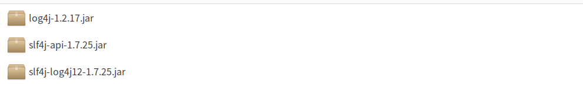
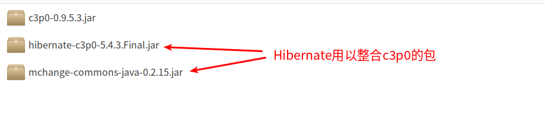
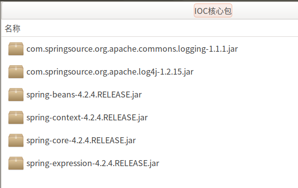
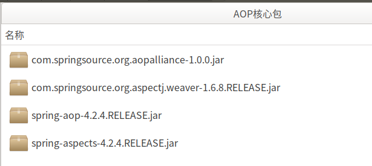
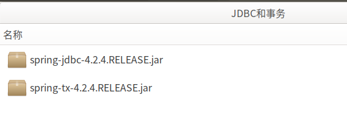
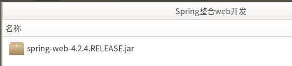
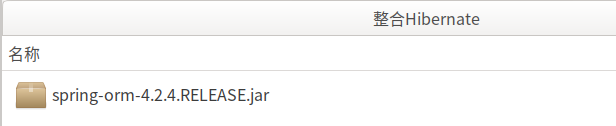
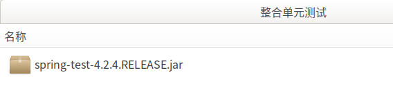
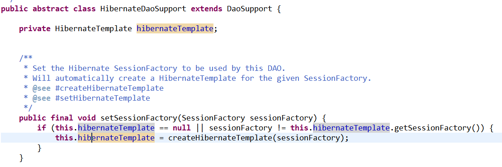

#   SSH整合方式
+ date: 2019-07-28 15:02:03
+ description: SSH整合方式
+ categories:
  -   Java
+ tags:
  -   SSH
-   Spring
-   Struts2
-   Hibernate
---
Spring整合web项目,有可能是Servlet作为web层.如果是servlet作为web层,必须使用工厂获得业务层类,但是如果使用Struts2,Struts2里面有一个插件,可以简化web层代码
#   引入jar包
##  Struts2的jar包
* `struts-2.3.37\apps\struts2-blank\WEB-INF\lib\*.jar`        -- Struts2需要的所有jar包
其他需要了解的包
* `struts2-spring-plugin-2.3.37.jar`                          -- Struts2整合Spring的插件包
* `struts2-convention-plugin-2.3.37.jar`                      -- Struts2注解开发包
* `struts2-json-plugin-2.3.37.jar`                            -- Struts2整合AJAX的开发包


##  Hibernate的jar包
Hibernate的开发必须的包
* `hibernate-release-5.0.7.Final\lib\required\*.jar`          -- Hibernate框架需要的jar包
日志记录
* `log4j-1.2.16.jar``
* `slf4j-api-1.6.1.jar`                                       -- 日志接口
* `slf4j-log4j12-1.7.2.jar`                                   -- 日志实现





Mysql驱动
* `mysql-connector-java-5.1.7-bin.jar`                        -- MySQL的驱动包

使用c3p0
* `c3p0-0.9.5.3.jar`




**注意:Struts2和Hibernate都引入了`javassist`这个jar包,需要删除一个**

##  Spring的jar包
* IOC核心包



* AOP核心包



* JDBC模板和事务核心包



* Spring整合web开发



* Spring整合Hibernate核心包



* Spring整合JUnit测试包



* Spring整合Struts2核心包

#   引入映射文件
##  Struts2的配置文件
1.  在web.xml中配置spring与struts的相关代码
**配置struts2核心过滤器**
这里定义为拦截所有
```xml
 <!-- 配置核心过滤器 -->
    <filter>
        <filter-name>struts2</filter-name>
        <filter-class>org.apache.struts2.dispatcher.ng.filter.StrutsPrepareAndExecuteFilter</filter-class>
    </filter>
    <filter-mapping>
        <filter-name>struts2</filter-name>
        <url-pattern>/*</url-pattern>
</filter-mapping>
```
**配置spring的监听器**
当服务启动时，就会先加载spring的配置文件
```xml
<!-- 配置Spring框架整合WEB的监听器 -->
 <listener>
	   <listener-class>org.springframework.web.context.ContextLoaderListener</listener-class>
</listener>
```
**配置默认加载路径**
```xml
 <!-- 监听器默认加载Web-INF文件下，需要配置参数来加载指定文件 -->
<context-param>
	 <param-name>contextConfigLocation</param-name>
	 <param-value>classpath:applicationContext.xml</param-value>
</context-param>
```

**总结：web.xml全部代码为**
```xml
<?xml version="1.0" encoding="UTF-8"?>
<web-app xmlns:xsi="http://www.w3.org/2001/XMLSchema-instance"
	xmlns="http://java.sun.com/xml/ns/javaee"
	xsi:schemaLocation="http://java.sun.com/xml/ns/javaee http://java.sun.com/xml/ns/javaee/web-app_2_5.xsd"
	id="WebApp_ID" version="2.5">
	<display-name>SSHDemo</display-name>
	<welcome-file-list>
		<welcome-file>index.html</welcome-file>
		<welcome-file>index.htm</welcome-file>
		<welcome-file>index.jsp</welcome-file>
		<welcome-file>default.html</welcome-file>
		<welcome-file>default.htm</welcome-file>
		<welcome-file>default.jsp</welcome-file>
	</welcome-file-list>
	<!-- 配置Struts2的核心过滤器 -->
	<filter>
		<filter-name>struts2</filter-name>
		<filter-class>org.apache.struts2.dispatcher.ng.filter.StrutsPrepareAndExecuteFilter</filter-class>
	</filter>
	<filter-mapping>
		<filter-name>struts2</filter-name>
		<url-pattern>/*</url-pattern>
	</filter-mapping>

	<!-- 配置Spring框架整合WEB的监听器 -->
	<listener>
		<listener-class>org.springframework.web.context.ContextLoaderListener</listener-class>
	</listener>
	<!-- 监听器默认加载Web-INF文件下，需要配置参数来加载指定文件 -->
	<context-param>
		<param-name>contextConfigLocation</param-name>
		<param-value>classpath:applicationContext.xml</param-value>
	</context-param>
</web-app>
```
2.  struts2.xml
用以配置哪个url访问到哪个action
```xml
CTYPE struts PUBLIC
    "-//Apache Software Foundation//DTD Struts Configuration 2.1//EN"
    "http://struts.apache.org/dtds/struts-2.3.dtd">
<struts>
</struts>
```
##  Hibernate的配置文件
1.  hibernate.cfg.xml
**注意:要记得删除那个与线程绑定的session**
```xml
<?xml version="1.0" encoding="UTF-8"?>
<!DOCTYPE hibernate-configuration PUBLIC
    "-//Hibernate/Hibernate Configuration DTD 3.0//EN"
    "http://www.hibernate.org/dtd/hibernate-configuration-3.0.dtd">
<hibernate-configuration>
    <session-factory>
        <!-- 必须配置 -->
        <property name="hibernate.connection.driver_class">com.mysql.jdbc.Driver</property>
        <property name="hibernate.connection.url">jdbc:mysql://192.168.174.130:3306/SSH</property>
        <property name="hibernate.connection.username">root</property>
        <property name="hibernate.connection.password">root</property>
        <property name="hibernate.dialect">org.hibernate.dialect.MySQLDialect</property>

        <!-- 可选配置 -->
        <property name="hibernate.show_sql">true</property>
        <property name="hibernate.format_sql">true</property>
        <property name="hibernate.hbm2ddl.auto">update</property>

        <!-- 配置C3P0的连接池 -->
        <property name="connection.provider_class">org.hibernate.connection.C3P0ConnectionProvider</property>

        <!-- 不能配置绑定当前的线程的操作 -->
        <!-- 映射配置文件 -->
        <mapping resource="com/zjinc36/domain/Customer.hbm.xml"/>
    </session-factory>
</hibernate-configuration>
```

2.  映射文件

##  Spring的配置文件
1.	web.xml
在上面的web.xml中已经配置了
2.	applicationContext.xml
```xml
<?xml version="1.0" encoding="UTF-8"?>
<beans xmlns="http://www.springframework.org/schema/beans"
    xmlns:xsi="http://www.w3.org/2001/XMLSchema-instance"
    xmlns:context="http://www.springframework.org/schema/context"
    xmlns:aop="http://www.springframework.org/schema/aop"
    xmlns:tx="http://www.springframework.org/schema/tx"
    xsi:schemaLocation="http://www.springframework.org/schema/beans 
    http://www.springframework.org/schema/beans/spring-beans.xsd
    http://www.springframework.org/schema/context
    http://www.springframework.org/schema/context/spring-context.xsd
    http://www.springframework.org/schema/aop
    http://www.springframework.org/schema/aop/spring-aop.xsd
    http://www.springframework.org/schema/tx 
    http://www.springframework.org/schema/tx/spring-tx.xsd">
</beans>
```
3.  日志文件
```xml
### direct log messages to stdout ###
log4j.appender.stdout=org.apache.log4j.ConsoleAppender
log4j.appender.stdout.Target=System.err
log4j.appender.stdout.layout=org.apache.log4j.PatternLayout
log4j.appender.stdout.layout.ConversionPattern=%d{ABSOLUTE} %5p %c{1}:%L - %m%n

### direct messages to file mylog.log ###
log4j.appender.file=org.apache.log4j.FileAppender
log4j.appender.file.File=c\:mylog.log
log4j.appender.file.layout=org.apache.log4j.PatternLayout
log4j.appender.file.layout.ConversionPattern=%d{ABSOLUTE} %5p %c{1}:%L - %m%n

### set log levels - for more verbose logging change 'info' to 'debug' ###

log4j.rootLogger=info, stdout
```

#   相关说明用代码
1.  表语句
```SQL
create table `cst_customer` (
	`cust_id` BIGINT(32) NOT NULL AUTO_INCREMENT COMMENT '客户编号(主键)',
	`cust_name` VARCHAR(32) NOT NULL COMMENT '客户名称(公司名称)',
	`cust_source` VARCHAR(32) DEFAULT NULL COMMENT '客户信息来源',
	`cust_industry` VARCHAR(32) DEFAULT NULL COMMENT '客户所属行业',
	`cust_level` VARCHAR(32) DEFAULT NULL COMMENT '客户级别',
	`cust_phone` VARCHAR(64) DEFAULT NULL COMMENT '固定电话',
	`cust_mobile` VARCHAR(16) DEFAULT NULL COMMENT '移动电话',
	PRIMARY KEY(`cust_id`)
) ENGINE=INNODB AUTO_INCREMENT=1 DEFAULT CHARSET=utf8
```
2.  配置dao层
**定义接口**
```java
public interface CustomerDao {
    public void save(Customer customer);
}
```

**定义实现类**
```java
public class CustomerDaoImpl  implements CustomerDao {
    public void save(Customer customer) {

    }
}
```

3.  定义业务层接口和实现类
**定义接口**
```java
package com.zjinc36.ssh.service;

import com.zjinc36.ssh.domain.Customer;

/**
 * 客户管理的业务接口
 * @author zjc
 *
 */
public interface CustomerService {
	public void save(Customer customer);
}
```

**定义实现类**
```java
package com.zjinc36.ssh.service.impl;

import com.zjinc36.ssh.domain.Customer;
import com.zjinc36.ssh.service.CustomerService;

/**
 * 客户管理的业务实现类
 * @author zjc
 *
 */
public class CustomerServiceImpl implements CustomerService {
	@Override
	public void save(Customer customer) {

	}
}
```

3.  定义Customer对象
**定义对象**
```java
package com.zjinc36.ssh.domain;

public class Customer {

	private Long cust_id;
	private String cust_name;
	private Long cust_user_id;
	private Long cust_create_id;
	private String cust_source;
	private String cust_industry;
	private String cust_level;
	private String cust_linkman;
	private String cust_phone;
	private String cust_mobile;

	public Long getCust_id() {
		return cust_id;
	}

	public void setCust_id(Long cust_id) {
		this.cust_id = cust_id;
	}

	public String getCust_name() {
		return cust_name;
	}

	public void setCust_name(String cust_name) {
		this.cust_name = cust_name;
	}

	public Long getCust_user_id() {
		return cust_user_id;
	}

	public void setCust_user_id(Long cust_user_id) {
		this.cust_user_id = cust_user_id;
	}

	public Long getCust_create_id() {
		return cust_create_id;
	}

	public void setCust_create_id(Long cust_create_id) {
		this.cust_create_id = cust_create_id;
	}

	public String getCust_source() {
		return cust_source;
	}

	public void setCust_source(String cust_source) {
		this.cust_source = cust_source;
	}

	public String getCust_industry() {
		return cust_industry;
	}

	public void setCust_industry(String cust_industry) {
		this.cust_industry = cust_industry;
	}

	public String getCust_level() {
		return cust_level;
	}

	public void setCust_level(String cust_level) {
		this.cust_level = cust_level;
	}

	public String getCust_linkman() {
		return cust_linkman;
	}

	public void setCust_linkman(String cust_linkman) {
		this.cust_linkman = cust_linkman;
	}

	public String getCust_phone() {
		return cust_phone;
	}

	public void setCust_phone(String cust_phone) {
		this.cust_phone = cust_phone;
	}

	public String getCust_mobile() {
		return cust_mobile;
	}

	public void setCust_mobile(String cust_mobile) {
		this.cust_mobile = cust_mobile;
	}

	@Override
	public String toString() {
		return "Customer [cust_id=" + cust_id + ", cust_name=" + cust_name
				+ ", cust_user_id=" + cust_user_id + ", cust_create_id="
				+ cust_create_id + ", cust_source=" + cust_source
				+ ", cust_industry=" + cust_industry + ", cust_level="
				+ cust_level + ", cust_linkman=" + cust_linkman
				+ ", cust_phone=" + cust_phone + ", cust_mobile=" + cust_mobile
				+ "]";
	}

}
```

**定义映射文件Customer.hbm.xml**
```xml
<?xml version="1.0" encoding="UTF-8"?>
<!DOCTYPE hibernate-mapping PUBLIC
    "-//Hibernate/Hibernate Mapping DTD 3.0//EN"
    "http://www.hibernate.org/dtd/hibernate-mapping-3.0.dtd">
<hibernate-mapping>
    <class name="com.zjinc36.ssh.domain.Customer" table="cst_customer">
        <id name="cust_id" column="cust_id">
            <generator class="native"/>
        </id>

        <property name="cust_name" column="cust_name"/>
        <property name="cust_user_id" column="cust_user_id"/>
        <property name="cust_create_id" column="cust_create_id"/>
        <property name="cust_source" column="cust_source"/>
        <property name="cust_industry" column="cust_industry"/>
        <property name="cust_level" column="cust_level"/>
        <property name="cust_linkman" column="cust_linkman"/>
        <property name="cust_phone" column="cust_phone"/>
        <property name="cust_mobile" column="cust_mobile"/>
    </class>
</hibernate-mapping>
```

#   spring整合struts2
##  方式一:Action由Struts2框架创建
这里先初略的定义持久层交给heibernate，业务层交个struts2，创建实例交给spring
###  基本思路
1.	[_客户端访问url进行数据提交,所以需要一个html页面_](/2019/07/29/SSH整合方式/#定义web界面)
2.	[_配置web.xml,对url进行拦截_](/2019/07/29/SSH整合方式/#在web-xml中配置spring与struts的相关代码)
3.	[_在struts2.xml配置映射关系,对拦截下来的url进行解析,映射到对应的action_](/2019/07/29/SSH整合方式/#配置struts-xml)
4.	[_5,6,8三层为了解偶,并不会在代码中显示调用依赖,这时候就需要配置applicationContext.xml,进行依赖注入_](/2019/07/29/SSH整合方式/#配置applicationContext-xml)
5.	[_编写action的相关代码,将请求所带的数据交给Service层(业务层)_](/2019/07/29/SSH整合方式/#编写action)
6.	[_编写Service层(业务层)的相关代码,使得数据符合业务,然后将数据交给Dao层(持久层)_](/2019/07/29/SSH整合方式/#编写持久层)
7.	[_在写持久层之前,需要配置Hibernate.xml,告诉持久层与数据库建立关系_](/2019/07/29/SSH整合方式/#hibernate-cfg-xml)
8.	[_编写Dao层(持久层)的相关代码,将数据保存到数据库_](/2019/07/29/SSH整合方式/#编写业务层)

###  具体操作
1.  定义web界面
定义一个保存客户的界面,利用form表单进行数据的提交,根据域名可知，这里利用的是struts2的通配符方式进行访问
```html
<FORM id=form1 name=form1
        action="${pageContext.request.contextPath }/customer_add.action"
        method=post>
           <!--table部分省略-->
</FORM>
```

2.  配置struts.xml
在struts.xml中配置接受请求，根据action名和方法跳转指定的action，执行指定的方法
>   * 因为导入的struts2-spring-plugin-2.3.24.jar 包自带一个配置文件 struts-plugin.xml ，该配置文件中有如下代码
>   * `<constant name="struts.objectFactory" value="spring" />`开启一个常量，如果该常量开启，那么下面的常量就可以使用
>   * struts.objectFactory.spring.autoWire = name，该常量是可以让Action的类来自动装配Bean对象
```xml
<?xml version="1.0" encoding="UTF-8" ?>
<!DOCTYPE struts PUBLIC
	"-//Apache Software Foundation//DTD Struts Configuration 2.3//EN"
	"http://struts.apache.org/dtds/struts-2.3.dtd">

<struts>
	<!-- 该属性指定需要Struts 2处理的请求后缀，该属性的默认值是action，即所有匹配*.action的请求都由Struts 2处理。
		如果用户需要指定多个请求后缀，则多个后缀之间以英文逗号（，）隔开。 -->
	<constant name="struts.action.extension" value="action" />

	<!-- Struts2为了管理Action的配置,通过包进行管理 -->
	<!-- 配置Struts2的包 -->
	<!-- name:包名,可以随便写,但是要唯一 -->
	<package name="customer" extends="struts-default" namespace="/">
		<!-- 配置Action -->
		<!-- name和访问的路径要一致 -->
		<!-- class是包名 -->
		<action name="customer_*"
			class="com.zjinc36.ssh.web.action.CustomerAction" method="{1}">
		</action>
	</package>
</struts>
```

3.  配置applicationContext.xml
在spring的applicationContext.xml中配置相对应的bean以及事务,这里利用spring中IOC(控制反转)的特性，将创建实例的任务交给spring框架管理
```java
<?xml version="1.0" encoding="UTF-8"?>
<beans xmlns="http://www.springframework.org/schema/beans"
	xmlns:xsi="http://www.w3.org/2001/XMLSchema-instance"
	xmlns:context="http://www.springframework.org/schema/context"
	xmlns:aop="http://www.springframework.org/schema/aop"
	xmlns:tx="http://www.springframework.org/schema/tx"
	xsi:schemaLocation="http://www.springframework.org/schema/beans 
    http://www.springframework.org/schema/beans/spring-beans.xsd
    http://www.springframework.org/schema/context
    http://www.springframework.org/schema/context/spring-context.xsd
    http://www.springframework.org/schema/aop
    http://www.springframework.org/schema/aop/spring-aop.xsd
    http://www.springframework.org/schema/tx 
    http://www.springframework.org/schema/tx/spring-tx.xsd">

	<bean id="customerService"
		class="com.zjinc36.ssh.service.impl.CustomerServiceImpl">
		<property name="customerDao" ref="customerDao"></property>
	</bean>
	<bean id="customerDao" class="com.zjinc36.ssh.dao.Impl.CustomerDaoImpl">
		<property name="hibernateTemplate" ref="hibernateTemplate" />
	</bean>
	<bean id="hibernateTemplate"
		class="org.springframework.orm.hibernate5.HibernateTemplate">
		<!-- 注入sessionFactory -->
		<property name="sessionFactory" />
	</bean>
</beans>
```

4.  编写action
编写action相关代码,这里通过struts2的模板类
```java
package com.zjinc36.ssh.web.action;

import org.apache.struts2.ServletActionContext;
import org.springframework.web.context.WebApplicationContext;
import org.springframework.web.context.support.WebApplicationContextUtils;

import com.opensymphony.xwork2.ActionSupport;
import com.opensymphony.xwork2.ModelDriven;
import com.zjinc36.ssh.domain.Customer;
import com.zjinc36.ssh.service.CustomerService;

public class CustomerAction extends ActionSupport implements ModelDriven<Customer>{

    //不要忘记手动new
    private Customer customer=new Customer();
    public Customer getModel() {
        return customer;
    }
    //提供service成员属性，提供set方法
    private CustomerService customerService;
    
    public void setCustomerService(CustomerService customerService) {
        this.customerService = customerService;
    }

    /**
     * 保存客户
     * @return
     */
    public String add(){
        System.out.println("WEB层，保存客户");
        //方式一：创建web的工厂（action由struts2创建）
        WebApplicationContext context=WebApplicationContextUtils.getWebApplicationContext(ServletActionContext.getServletContext());
        CustomerService cs=(CustomerService) context.getBean("customerService");
        //调用方法
        cs.save(customer);
        return NONE;
    }
}

```

5.  编写持久层
编写持久层实现类相关代码,这里利用hibernate提供的模板类，内部封转了session，从而可以调用session中的方法
```java
package com.zjinc36.ssh.dao.Impl;

import org.springframework.orm.hibernate3.HibernateTemplate;

import com.zjinc36.ssh.dao.CustomerDao;
import com.zjinc36.ssh.domain.Customer;

public class CustomerDaoImpl implements CustomerDao {

    //将数据保存到数据库中(调用模板类(hibernate提供，内部封装了session))
    private HibernateTemplate hibernateTemplate;
    
    public void setHibernateTemplate(HibernateTemplate hibernateTemplate) {
        this.hibernateTemplate = hibernateTemplate;
    }

    @Override
    /**
     * 保存客户
     */
    public void save(Customer customer) {
        System.out.println("持久层：保存客户");
        hibernateTemplate.save(customer);
    }
}
```

6.  编写业务层
编写业务层实现类相关代码
```java
package com.zjinc36.ssh.service.impl;

import com.zjinc36.ssh.dao.CustomerDao;
import com.zjinc36.ssh.domain.Customer;
import com.zjinc36.ssh.service.CustomerService;

/**
 * 客户管理的业务实现类
 * @author zjc
 *
 */
public class CustomerServiceImpl implements CustomerService {
    private CustomerDao customerDao;

    public void setCustomerDao(CustomerDao customerDao) {
        this.customerDao = customerDao;
    }

    @Override
    //用来保存客户
    public void save(Customer customer) {
        System.out.println("业务层，保存客户");
        customerDao.save(customer);
    }
}
```

##	(推荐)方式二：action由spring框架管理
需要引入插件包`struts2-spring-plugin-2.3.37.jar` – Struts2整合Spring的插件包
### 基本思路
1.	[_客户端访问url进行数据提交,所以需要一个html页面_](/2019/07/29/SSH整合方式/#定义web界面)
2.	[_配置web.xml,对url进行拦截_](/2019/07/29/SSH整合方式/#在web-xml中配置spring与struts的相关代码)
3.	[_**(有变化)解析url -> applicationContext.xml中的bean -> Action**_](/2019/07/29/SSH整合方式/#配置struts2-xml和applicationContext-xml)
4.	[_5,6,8三层为了解偶,并不会在代码中显示调用依赖,这时候就需要配置applicationContext.xml,进行依赖注入_](/2019/07/29/SSH整合方式/#配置applicationContext-xml)
5.	[_编写action的相关代码,将请求所带的数据交给Service层(业务层)_](/2019/07/29/SSH整合方式/#编写action)
6.	[_编写Service层(业务层)的相关代码,使得数据符合业务,然后将数据交给Dao层(持久层)_](/2019/07/29/SSH整合方式/#编写持久层)
7.	[_在写持久层之前,需要配置Hibernate.xml,告诉持久层与数据库建立关系_](/2019/07/29/SSH整合方式/#hibernate-cfg-xml)
8.	[_编写Dao层(持久层)的相关代码,将数据保存到数据库_](/2019/07/29/SSH整合方式/#编写业务层)

### 具体操作
1.  配置struts2.xml和applicationContext.xml
配置struts2.xml和applicationContext.xml,对拦截下来的url进行解析,映射到对应的Action
原本在Struts2.xml写映射的时候,是直接映射到Action,但是现在不是
>   +	原本:解析url --> Action
>   +	现在:解析url --> applicationContext.xml中的bean --> Action

**注意**
>   +	Spring框架默认生成CustomerAction是单例的，而Struts2框架是多例的。所以需要配置 scope="prototype",如果使用单例,所有保存的值会在同一个值栈,会出现问题的
>   +	此时没有struts2的自动装配，在action需要手动配置customerService属性，并在action类中生成set方法

**applicationContext.xml中的bean -> Action**
```xml
<!-- 配置客户模块 -->
    <!-- 强调：配置的Aciton,必须是多列的 -->
    <bean id="customerAction" class="com.zjinc36.ssh.web.action.CustomerAction" scope="prototype">
        <!--注意：struts管理action时，基于其中有个struts-plugin的jar包，其中更改了一个
        常量struts.objectFactory.spring.autoWire = name将其打开了，可以自动装配，只需要提供set方法
        但是此时action由spring管理，自动装配失效，所以需要手动进行配置注入
        -->
		<!-- 也就是需要手动注入业务层(service) -->
        <property name="customerService" ref="customerService"></property>
</bean>	
```
**url->applicationContext.xml**
struts.xml需要做修改
```xml
<struts>
    <!-- 配置包结构 -->
    <package name="crm" extends="struts-default" namespace="/">
        <!-- 配置客户的Action -->
        <!--  方式一：aciton由struts2框架管理,将url直接映射到Action -->
        <!-- <action name="customer_*" class="com.zjinc36.ssh.web.action.CustomerAction" method="{1}"/> -->

        <!-- 方式二：action由spring管理，class标签上只需要编写srping配置bean的ID值既可以-->
		<!-- 将url映射到applicationContext.xml中的bean -->
         <action name="customer_*" class="customerAction" method="{1}"></action>
    </package>
</struts>
```

#   Spring整合Hibernate(配置事务)
##  方式一:带有hibernate.cfg.xml的配置文件
在原生的hibernate中，hibernate.cfg.xml都是由hibernate框架管理，其配置文件能生成sessionFactory,持久层加载此配置文件获取sessionFactory，从而创建工厂生成session，进行数据的增删改成，此时其配置文件应该交给spring管理，充分利用spring的IOC特性
Spring框架提供了一个HibernateDaoSupport的工具类，以后DAO都可以继承该类!
在引入hibernate核心配置文件之前，得让dao层继承一个父类HibernateDaoSupport，此父类内部封装了事务模板




### 基本思路

在Dao层整合持久化操作,Hibernate的`持久化类=Java类+映射文件`([_详见:什么是持久化类_](/2019/07/07/Hibernate持久化类的编写规则/#什么是持久化类)),核心为`数据库的连接配置`和[SessionFactory对象](/2019/07/04/Hibernate的API/#SessionFactory)
1.  spring管理hibernate.cfg.xml文件
2.  spring将sessionFactory注入到Dao
3.  修改持久层实现类,让其继承工具类`Hibernatedaosupport`,可以简化非常多的操作

使用注解配置事务,需要两步
4.  配置平台事务管理器([_详见:常见事务管理器_](/2019/07/28/Spring的事务管理/#常见的事务管理器)),这里使用Hibernate的事务管理器
5.  开启事务注解([_详见:开启事务注解_](/2019/07/28/Spring的事务管理/#开启注解事务支持))
6.  修改业务层,开启事务注解@Transactional([_详见:注解事务_](/2019/07/28/Spring的事务管理/#使用注解配置事务)),当然也可以使用xml配置([_详见:xml配置事务_](/2019/07/28/Spring的事务管理/#XML配置事务))

### 具体实现
1.  Spring管理Hibernate.cfg.xml文件
```xml
	<!-- 编写bean,名称都是固定的，由spring提供，用来加载hibernate.cfg.xml的配置文件 -->
	<bean id="sessionFactory"
		class="org.springframework.orm.hibernate5.LocalSessionFactoryBean">
		<!-- 配置路径：当启动服务器时 ，该对象就会被创建，从而加载hibernate.cfg.xml文件，从而生成sessionFactory对象 -->
		<property name="configLocation"
			value="classpath:hibernate.cfg.xml" />
	</bean>
```

2.  Spring将sessionFactory注入到Dao
```xml
	<!-- 以后，Dao都需要继承HibernateDaoSupport，注入sessionFactory -->
	<bean id="customerDao"
		class="com.zjinc36.ssh.dao.Impl.CustomerDaoImpl">
		<!-- <property name="hibernateTemplate" ref="hibernateTemplate" /> -->
		<property name="sessionFactory" ref="sessionFactory"></property>
	</bean>
```

3.	修改持久层实现类,让其继承工具类`HibernateDaoSupport`
```java
package com.zjinc36.ssh.dao.Impl;

//import org.springframework.orm.hibernate3.HibernateTemplate;
import org.springframework.orm.hibernate3.support.HibernateDaoSupport;

import com.zjinc36.ssh.dao.CustomerDao;
import com.zjinc36.ssh.domain.Customer;

public class CustomerDaoImpl extends HibernateDaoSupport implements CustomerDao {

//    //将数据保存到数据库中(调用模板类(hibernate提供，内部封装了session))
//    private HibernateTemplate hibernateTemplate;

//    public void setHibernateTemplate(HibernateTemplate hibernateTemplate) {
//        this.hibernateTemplate = hibernateTemplate;
//    }

    @Override
    /**
     * 保存客户
     */
    public void save(Customer customer) {
        System.out.println("持久层：保存客户");
//        hibernateTemplate.save(customer);
//		本来应该是sessionFactory.save()操作的,但是sessionFactory被spring管理注入后,这样就可以了
        this.getHibernateTemplate().save(customer);
    }
}
```

4.  配置平台事务管理器
```xml
	<!-- 先配置平台事务管理器 -->
	<bean id="transactionManager"
		class="org.springframework.orm.hibernate5.HibernateTransactionManager">
		<!-- 注入事务，session能够管理事务，工厂能够创建session -->
		<property name="sessionFactory" ref="sessionFactory" />
	</bean>
```

5.	开启事务注解
```xml
	<!-- 开启事务的注解 -->
	<tx:annotation-driven transaction-manager="transactionManager" />
```

6.	修改业务层,开启事务注解@Transactional
```java
package com.zjinc36.ssh.service.impl;

import javax.transaction.Transactional;

import com.zjinc36.ssh.dao.CustomerDao;
import com.zjinc36.ssh.domain.Customer;
import com.zjinc36.ssh.service.CustomerService;

/**
 * 客户管理的业务实现类
 * @author zjc
 *
 */
@Transactional
public class CustomerServiceImpl implements CustomerService {
    private CustomerDao customerDao;
    
    public void setCustomerDao(CustomerDao customerDao) {
        this.customerDao = customerDao;
    }

	@Override
    //用来保存客户
    public void save(Customer customer) {
        System.out.println("业务层，保存客户");
        customerDao.save(customer);
    }
}

```

**applicationcontext.xml全部代码如下**
```xml
<?xml version="1.0" encoding="UTF-8"?>
<beans xmlns="http://www.springframework.org/schema/beans"
	xmlns:xsi="http://www.w3.org/2001/XMLSchema-instance"
	xmlns:context="http://www.springframework.org/schema/context"
	xmlns:aop="http://www.springframework.org/schema/aop"
	xmlns:tx="http://www.springframework.org/schema/tx"
	xsi:schemaLocation="http://www.springframework.org/schema/beans 
    http://www.springframework.org/schema/beans/spring-beans.xsd
    http://www.springframework.org/schema/context
    http://www.springframework.org/schema/context/spring-context.xsd
    http://www.springframework.org/schema/aop
    http://www.springframework.org/schema/aop/spring-aop.xsd
    http://www.springframework.org/schema/tx 
    http://www.springframework.org/schema/tx/spring-tx.xsd">

	<bean id="customerService"
		class="com.zjinc36.ssh.service.impl.CustomerServiceImpl">
		<property name="customerDao" ref="customerDao"></property>
	</bean>

	<!-- 以后，Dao都需要继承HibernateDaoSupport，注入sessionFactory -->
	<bean id="customerDao"
		class="com.zjinc36.ssh.dao.Impl.CustomerDaoImpl">
		<!-- <property name="hibernateTemplate" ref="hibernateTemplate" /> -->
		<property name="sessionFactory" ref="sessionFactory"></property>
	</bean>

<!-- 
	<bean id="hibernateTemplate"
		class="org.springframework.orm.hibernate5.HibernateTemplate">
		注入sessionFactory
		<property name="sessionFactory" />
	</bean>

 -->

	<!-- 编写bean,名称都是固定的，由spring提供，用来加载hibernate.cfg.xml的配置文件 -->
	<bean id="sessionFactory"
		class="org.springframework.orm.hibernate5.LocalSessionFactoryBean">
		<!-- 配置路径：当启动服务器时 ，该对象就会被创建，从而加载hibernate.cfg.xml文件，从而生成sessionFactory对象 -->
		<property name="configLocation"
			value="classpath:hibernate.cfg.xml" />
	</bean>
	<!-- 先配置平台事务管理器 -->
	<bean id="transactionManager"
		class="org.springframework.orm.hibernate5.HibernateTransactionManager">
		<!-- 注入事务，session能够管理事务，工厂能够创建session -->
		<property name="sessionFactory" ref="sessionFactory" />
	</bean>
	<!-- 开启事务的注解 -->
	<tx:annotation-driven
		transaction-manager="transactionManager" />
</beans>
```

##  方式二:不带有hibernate.cfg.xml的配置文件
不带有hibernate.cfg.xml文件,不代表配置可以省,所以这些配置都是需要的,只是从hibernate.cfg.xml文件转移到了appllicatiionContext.xml文件中了
### 基本思路
基本思路和方式一差不多
在Dao层整合持久化操作,Hibernate的持久化类=Java类+映射文件(详见:什么是持久化类),核心为数据库的连接配置和SessionFactory对象

1.	~~spring管理hibernate.cfg.xml文件~~ spring中配置hibernate.cfg.xml文件中配置的内容
>   这里准备删除hibernate的核心配置文件，在删除之前，需要将其配置文件中的相关内容配置到spring的applicatioinContext.xml文件中
>   hibernate.cfg.xml文件的内容如下
>   * 数据库连接基本参数（4大参数）
>   * Hibernate相关的属性
>   * 连接池
>   * 映射文件
2.	spring将sessionFactory注入到Dao
3.	修改持久层实现类,让其继承工具类Hibernatedaosupport,可以简化非常多的操作

使用注解配置事务,需要两步

1.	配置平台事务管理器(详见:常见事务管理器),这里使用Hibernate的事务管理器
2.	开启事务注解(详见:开启事务注解)
3.	修改业务层,开启事务注解@Transactional(详见:注解事务),当然也可以使用xml配置(详见:xml配置事务)

### 具体实现
修改spring中配置hibernate.cfg.xml文件中配置的内容
**引入连接池**
```xml
<!-- 先配置C3p0的连接池 -->
    <bean id="dataSource" class="com.mchange.v2.c3p0.ComboPooledDataSource">
        <property name="driverClass" value="com.mysql.jdbc.Driver"/>
        <property name="jdbcUrl" value="jdbc:mysql://192.168.174.130:3306/SSH"/>
        <property name="user" value="root"/>
        <property name="password" value="root"/>
    </bean>
```

**在sessionFactory引入位置增加其他参数**

修改对应的sessionFactory,因为已经没有了hibernate.cfg.xml的配置文件，所以需要修改该配置，注入连接池
引入对象映射文件：因为已经没有了hibernate.cfg.xml的配置文件，不会扫描到该配置文件，需要注入
```xml
	<!-- 编写bean,名称都是固定的，由spring提供，用来加载hibernate.cfg.xml的配置文件 -->
	<bean id="sessionFactory"
		class="org.springframework.orm.hibernate5.LocalSessionFactoryBean">
		<!-- 配置路径：当启动服务器时 ，该对象就会被创建，从而加载hibernate.cfg.xml文件，从而生成sessionFactory对象 -->
		<!-- 这里原本需要引入hibernate.cfg.xml,但此时不引入就需要配置 -->
		<!-- <property name="configLocation" value="classpath:hibernate.cfg.xml"
			/> -->
		<!--先加载连接池 -->
		<property name="dataSource" ref="dataSource" />
		<!-- 加载方言，加载可选项 -->
		<property name="hibernateProperties">
			<props>
				<prop key="hibernate.dialect">org.hibernate.dialect.MySQLDialect</prop>
				<prop key="hibernate.show_sql">true</prop>
				<prop key="hibernate.format_sql">true</prop>
				<prop key="hibernate.hbm2ddl.auto">update</prop>
			</props>
		</property>
		<!-- 引入映射的配置文件 -->
		<property name="mappingResources">
			<list>
				<value>/com/zjinc36/ssh/domain/Customer.hbm.xml</value>
			</list>
		</property>
	</bean>
```

**现在applicationContxxt.xml文件全部内容如下**
```xml
<?xml version="1.0" encoding="UTF-8"?>
<beans xmlns="http://www.springframework.org/schema/beans"
	xmlns:xsi="http://www.w3.org/2001/XMLSchema-instance"
	xmlns:context="http://www.springframework.org/schema/context"
	xmlns:aop="http://www.springframework.org/schema/aop"
	xmlns:tx="http://www.springframework.org/schema/tx"
	xsi:schemaLocation="http://www.springframework.org/schema/beans 
    http://www.springframework.org/schema/beans/spring-beans.xsd
    http://www.springframework.org/schema/context
    http://www.springframework.org/schema/context/spring-context.xsd
    http://www.springframework.org/schema/aop
    http://www.springframework.org/schema/aop/spring-aop.xsd
    http://www.springframework.org/schema/tx 
    http://www.springframework.org/schema/tx/spring-tx.xsd">

	<!-- 先配置C3p0的连接池 -->
	<bean id="dataSource"
		class="com.mchange.v2.c3p0.ComboPooledDataSource">
		<property name="driverClass" value="com.mysql.jdbc.Driver" />
		<property name="jdbcUrl"
			value="jdbc:mysql://localhost:3306/hibernate" />
		<property name="user" value="root" />
		<property name="password" value="root" />
	</bean>

	<bean id="customerService"
		class="com.zjinc36.ssh.service.impl.CustomerServiceImpl">
		<property name="customerDao" ref="customerDao"></property>
	</bean>

	<!-- 以后，Dao都需要继承HibernateDaoSupport，注入sessionFactory -->
	<bean id="customerDao"
		class="com.zjinc36.ssh.dao.Impl.CustomerDaoImpl">
		<!-- <property name="hibernateTemplate" ref="hibernateTemplate" /> -->
		<property name="sessionFactory" ref="sessionFactory"></property>
	</bean>

	<!-- <bean id="hibernateTemplate" class="org.springframework.orm.hibernate5.HibernateTemplate"> 
		注入sessionFactory <property name="sessionFactory" /> </bean> -->

	<!-- 编写bean,名称都是固定的，由spring提供，用来加载hibernate.cfg.xml的配置文件 -->
	<bean id="sessionFactory"
		class="org.springframework.orm.hibernate5.LocalSessionFactoryBean">
		<!-- 配置路径：当启动服务器时 ，该对象就会被创建，从而加载hibernate.cfg.xml文件，从而生成sessionFactory对象 -->
		<!-- 这里原本需要引入hibernate.cfg.xml,但此时不引入就需要配置 -->
		<!-- <property name="configLocation" value="classpath:hibernate.cfg.xml" 
			/> -->
		<!--先加载连接池 -->
		<property name="dataSource" ref="dataSource" />
		<!-- 加载方言，加载可选项 -->
		<property name="hibernateProperties">
			<props>
				<prop key="hibernate.dialect">org.hibernate.dialect.MySQLDialect</prop>
				<prop key="hibernate.show_sql">true</prop>
				<prop key="hibernate.format_sql">true</prop>
				<prop key="hibernate.hbm2ddl.auto">update</prop>
			</props>
		</property>
		<!-- 引入映射的配置文件 -->
		<property name="mappingResources">
			<list>
				<value>/com/zjinc36/ssh/domain/Customer.hbm.xml</value>
			</list>
		</property>
	</bean>

	<!-- 先配置平台事务管理器 -->
	<bean id="transactionManager"
		class="org.springframework.orm.hibernate5.HibernateTransactionManager">
		<!-- 注入事务，session能够管理事务，工厂能够创建session -->
		<property name="sessionFactory" ref="sessionFactory" />
	</bean>
	<!-- 开启事务的注解 -->
	<tx:annotation-driven
		transaction-manager="transactionManager" />
</beans>
```
此时可以安心的删除hibernate.cfg.xml文件了
这样SSH整合完毕

#	Hibernate模板常用方法
##  插入
1.  持久层
```java
package com.zjinc36.dao.impl;

import java.util.List;

import org.hibernate.criterion.DetachedCriteria;
import org.springframework.orm.hibernate5.HibernateTemplate;
import org.springframework.orm.hibernate5.support.HibernateDaoSupport;

import com.zjinc36.domain.Customer;
/**
 * 持久层
 * 继承HibernateDaoSupport，内部封装了HibernateTemplat
 * @author Administrator
 *
 */
public class CustomerDaoImpl extends HibernateDaoSupport implements CustomerDao {
    @Override
    public void update(Customer customer) {
        // TODO Auto-generated method stub
        this.getHibernateTemplate().update(customer);
    }
}
```
2.  业务层
```java
package com.zinc36.service.impl;

import java.util.List;

import org.springframework.transaction.annotation.Transactional;

import com.zjinc36.dao.CustomerDao;
import com.zjinc36.domain.Customer;
/**
 * 客户的业务层
 * @author Administrator
 *
 */
@Transactional
public class CustomerServiceImpl implements CustomerService{
    private CustomerDao customerDao;

    public void setCustomerDao(CustomerDao customerDao) {
        this.customerDao = customerDao;
    }
    @Override
    public void update(Customer customer) {
        // TODO Auto-generated method stub
        customerDao.update(customer);
    }
}
```
3.  测试类
```java
package com.zjinc36.test;

import java.util.List;

import javax.annotation.Resource;

import org.junit.Test;
import org.junit.runner.RunWith;
import org.springframework.test.context.ContextConfiguration;
import org.springframework.test.context.junit4.SpringJUnit4ClassRunner;

import com.zjinc36.domain.Customer;
import com.zjinc36.service.CustomerService;

/**
 * 测试Hiberante模板类的简单方法
 * @author Administrator
 *
 */
@RunWith(SpringJUnit4ClassRunner.class)
@ContextConfiguration("classpath:applicationContext.xml")
public class Demo1 {
    @Resource(name="customerService")
    private CustomerService customerService;
    /**
     * 测试插入
     */
    @Test
    public void run1(){
        Customer customer=new Customer();
        customer.setCust_id(1L);
        customer.setCust_name("测试");
        customerService.update(customer);
    }
}
```
##  指定查询、查询所有、离线查询代码
1.	持久层
```java
package com.zjinc36.dao;

import java.util.List;

import org.hibernate.criterion.DetachedCriteria;
import org.springframework.orm.hibernate5.HibernateTemplate;
import org.springframework.orm.hibernate5.support.HibernateDaoSupport;

import com.zjinc36.domain.Customer;
/**
 * 持久层
 * 继承HibernateDaoSupport，内部封装了HibernateTemplate
 * @author Administrator
 *
 */
public class CustomerDaoImpl extends HibernateDaoSupport implements CustomerDao {
    //将数据保存到数据库中(调用模板类(hibernate提供，内部封装了session))
    /*private HibernateTemplate hibernateTemplate;
    
    public void setHibernateTemplate(HibernateTemplate hibernateTemplate) {
        this.hibernateTemplate = hibernateTemplate;
    }*/

    /**
     * 保存客户
     */
    public void save(Customer customer) {
        System.out.println("持久层：保存客户");
        this.getHibernateTemplate().save(customer);
    }

    @Override
    public void update(Customer customer) {
        // TODO Auto-generated method stub
        this.getHibernateTemplate().update(customer);
    }

    /**
     * 通过主键查询
     */
    public Customer getById(Long id) {
        return this.getHibernateTemplate().get(Customer.class, id);
    }
    /**
     * 查询所有
     */
    @Override
    public List<Customer> findAll() {
        String sql="from Customer";
        List<Customer> list=(List<Customer>) this.getHibernateTemplate().find(sql);
        return list;
    }
    /**
     * QBC离线查询
     */
    @Override
    public List<Customer> findAllByQBC() {
        DetachedCriteria criteria=DetachedCriteria.forClass(Customer.class);
        List<Customer> list=(List<Customer>) this.getHibernateTemplate().findByCriteria(criteria);
        return list;
    }
}
```
2.	业务层

```java
package com.zjinc36.service;

import java.util.List;

import org.springframework.transaction.annotation.Transactional;

import com.zjinc36.dao.CustomerDao;
import com.zjinc36.domain.Customer;
/**
 * 客户的业务层
 * @author Administrator
 *
 */
@Transactional
public class CustomerServiceImpl implements CustomerService{
    private CustomerDao customerDao;
    
    public void setCustomerDao(CustomerDao customerDao) {
        this.customerDao = customerDao;
    }

    //用来保存客户
    public void save(Customer customer) {
        System.out.println("业务层，保存客户");
        customerDao.save(customer);
    }

    @Override
    public void update(Customer customer) {
        // TODO Auto-generated method stub
        customerDao.update(customer);
    }

    @Override
    public Customer getById(Long id) {
        // TODO Auto-generated method stub
        return customerDao.getById(id);
    }

    @Override
    public List<Customer> findAll() {
        return customerDao.findAll();
    }

    @Override
    public List<Customer> findAllByQBC() {
        // TODO Auto-generated method stub
        return customerDao.findAllByQBC();
    }
}
```

3.	测试类
```java
package com.zjinc36.test;

import java.util.List;

import javax.annotation.Resource;

import org.junit.Test;
import org.junit.runner.RunWith;
import org.springframework.test.context.ContextConfiguration;
import org.springframework.test.context.junit4.SpringJUnit4ClassRunner;

import com.zjinc36.domain.Customer;
import com.zjinc36.service.CustomerService;

/**
 * 测试Hiberante模板类的简单方法
 * @author Administrator
 *
 */
@RunWith(SpringJUnit4ClassRunner.class)
@ContextConfiguration("classpath:applicationContext.xml")
public class Demo1 {
    @Resource(name="customerService")
    private CustomerService customerService;
    /**
     * 测试插入
     */
    @Test
    public void run1(){
        Customer customer=new Customer();
        customer.setCust_id(1L);
        customer.setCust_name("测试");
        customerService.update(customer);
    }
    /**
     * 测试查询指定的客户
     */
    @Test
    public void run2(){
        Customer customer=customerService.getById(2L);
        System.out.println(customer);
    }
    /**
     * 查询所有的客户
     */
    @Test
    public void run3(){
        List<Customer> list=customerService.findAll();
        System.out.println(list);
    }
    /**
     * QBC(离线查询)
     */
    @Test
    public void run4(){
        List<Customer> list=customerService.findAllByQBC();
        System.out.println(list);
    }
}
```

#   关于SSH延迟加载问题
##  问题
使用延迟加载的时候，再WEB层查询对象的时候程序会抛出异常！
* 原因是延迟加载还没有发生SQL语句，在业务层session对象就已经销毁了，所以查询到的JavaBean对象已经变成了托管态对象！
* 注意：一定要先删除javassist-3.11.0.GA.jar包（jar包冲突了）

##  解决办法
Spring框架提供了一个过滤器，让session对象在WEB层就创建，在WEB层销毁。只需要配置该过滤器即可
* 但是：要注意需要在struts2的核心过滤器之前进行，spring监听器之后配置

```xml
<!-- 解决延迟加载的问题 -->
         <filter>
            <filter-name>OpenSessionInViewFilter</filter-name>
            <filter-class>org.springframework.orm.hibernate5.support.OpenSessionInViewFilter</filter-class>
        </filter>
        <filter-mapping>
            <filter-name>OpenSessionInViewFilter</filter-name>
            <url-pattern>/*</url-pattern>
        </filter-mapping>
```
##  演示延迟加载
1.  持久层：调用load方法，此方法时延迟加载的
```java
/**
     * 延迟加载
     */
    @Override
    public Customer loadById(long id) {
        // TODO Auto-generated method stub
        return this.getHibernateTemplate().load(Customer.class, id);
    }
```
2.  业务层
```java
@Override
    public Customer loadById(long id) {
        // TODO Auto-generated method stub
        return customerDao.loadById(id);
    }
```
3.  测试类
```java
@Test
    public void run5(){
        Customer customer=customerService.loadById(2L);
        System.out.println(customer);
    }
```

#   参考
[_Spring+Hibernate+Struts(SSH)框架整合_](https://www.cnblogs.com/cailijia52o/p/8724710.html)
