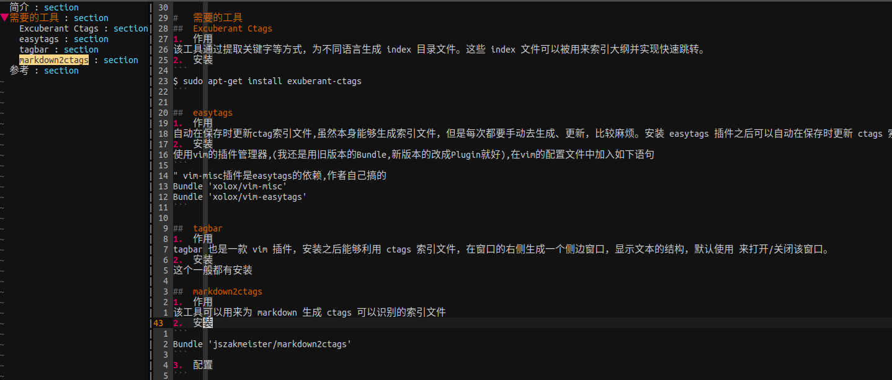

#   vim中显示markdown结构大纲

---

#	简介
可能许多人都知道利用 ctags 工具和 tagbar 插件可以在 vim 中显示侧边栏，列出代码文件的结构、类和函数等。实际上在写 markdown 文本时，如果也能在 tagbar 中显示文本大纲，那么显然可以帮助我们理清写作思路，也能快速定位到相关的段落进行修改。
实际上，因为 markdown 文件是高度结构化的，所以很容易就能让 ctags 识别 markdown 的文本结构，从而为我们提取出大纲。在 github 上已经有人分享了这一工具：markdown2ctags

#	需要的工具
##	Excuberant Ctags
1.	作用
该工具通过提取关键字等方式，为不同语言生成 index 目录文件。这些 index 文件可以被用来索引大纲并实现快速跳转。
2.	安装
```
$ sudo apt-get install exuberant-ctags
```

##	easytags
1.	作用
自动在保存时更新ctag索引文件,虽然本身能够生成索引文件，但是每次都要手动去生成、更新，比较麻烦。安装 easytags 插件之后可以自动在保存时更新 ctags 索引文件，非常方便。
2.	安装
使用vim的插件管理器,(我还是用旧版本的Bundle,新版本的改成Plugin就好),在vim的配置文件中加入如下语句
```
" vim-misc插件是easytags的依赖,作者自己搞的
Bundle 'xolox/vim-misc'
Bundle 'xolox/vim-easytags'
```

##	tagbar
1.	作用
tagbar 也是一款 vim 插件，安装之后能够利用 ctags 索引文件，在窗口的右侧生成一个侧边窗口，显示文本的结构，默认使用 来打开/关闭该窗口。
2.	安装
这个一般都有安装

##	markdown2ctags
1.	作用
该工具可以用来为 markdown 生成 ctags 可以识别的索引文件
2.	安装
```
Bundle 'jszakmeister/markdown2ctags'
```
3.  配置
```
" Add support for markdown files in tagbar.
let g:tagbar_type_markdown = {
    \ 'ctagstype': 'markdown',
    \ 'ctagsbin' : '/path/to/markdown2ctags.py',
    \ 'ctagsargs' : '-f - --sort=yes --sro=»',
    \ 'kinds' : [
        \ 's:sections',
        \ 'i:images'
    \ ],
    \ 'sro' : '»',
    \ 'kind2scope' : {
        \ 's' : 'section',
    \ },
    \ 'sort': 0,
\ }
```
需要在 .vimrc 中加入上述所展示的一段代码
需要特别注意的是
+	 'ctagstype': 'markdown',
+	 'ctagsbin' : '/path/to/markdown2ctags.py',
这两个地方需要和你的 vim 所识别的 markdown 格式匹配,检测自己的 vim 所识别的 markdown 文本的格式的方式是在 vim 中输入 :set filetype? ，所显示的 filetype= 后面的内容如果不是markdown

#   效果图




#   参考
+   [_https://github.com/jszakmeister/markdown2ctags_](https://github.com/jszakmeister/markdown2ctags)
+   [_https://github.com/xolox/vim-misc_](https://github.com/xolox/vim-misc)
+   [_https://github.com/xolox/vim-easytags_](https://github.com/xolox/vim-easytags)
+   [_在 vim 中显示 markdown 结构大纲_](https://blog.yongli1992.com/2015/08/14/vim-markdown-outline/)
