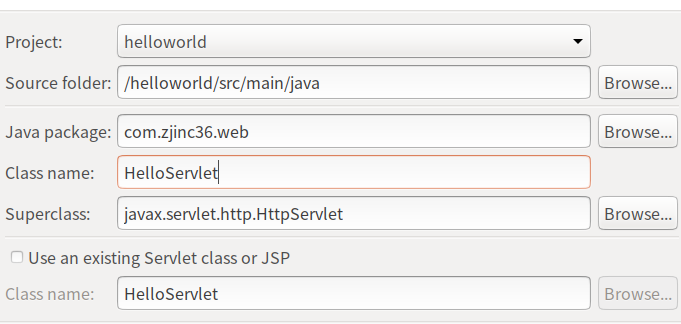

#   创建一个maven工程


#   刚生成的工程就报错
##  问题
因为是web工程,webapp下缺少必要的目录和文件


缺少的文件如下

##  解决
1.  方式一,使用eclipse的直接生成


2.  方式二,手动创建缺少的目录和文件

#   调整jdk版本
主要有两种方式
1.  调整pom.xml文件
2.  调整setting.xml文件

##  调整pom.xml文件
调整pom.xml文件有两种方式
1.  使用eclipse界面操作修改pom.xml文件
2.  直接修改pom.xml文件

### 方式一
使用eclipse界面操作修改pom.xml文件
1.  `右键项目 -> Maven -> Add Plugin`
2.  出现如下窗口后,进行图中所示配置

3.  此时打开pom.xml文件会发现如下内容

4.  在pom.xml文件中增加如下内容
```xml
<configuration>
    <source>1.7</source>
    <target>1.7</target>
    <encoding>utf-8</encoding>
</configuration>
```
5.  此时,pom.xml如下所示

6.  `右键项目 -> Maven -> Update Project`

###  方式二
直接修改pom.xml文件
在maven的pom.xml中添加以下代码指定jdk版本
```xml
<build>
    <pluginManagement>
        <plugins>
         <plugin>
            <groupId>org.apache.maven.plugins</groupId>
            <artifactId>maven-compiler-plugin</artifactId>
            <configuration>
                <source>1.7</source>
                <target>1.7</target>
            </configuration>
        </plugin>
       </plugins>
    </pluginManagement>
</build>
```
不要忘记,`右键项目 -> Maven -> Update Project`


##  调整setting.xml文件
在maven的安装目录找到settings.xml文件，在里面添加如下代码
```xml
<profile>
	<id>jdk-1.7</id>
	<activation>
		<activeByDefault>true</activeByDefault>
		<jdk>1.7</jdk>
	</activation>
	<properties>
		<maven.compiler.source>1.7</maven.compiler.source>
		<maven.compiler.target>1.7</maven.compiler.target>
		<maven.compiler.compilerVersion>1.8</maven.compiler.compilerVersion>
	</properties>
</profile>
```
设置完成后，`右键项目->maven->update project`,这样每次新建maven项目都默认为jdk1.7版本了

#  创建Servlet项目
主要用以说明如何引入依赖

## 新增Servlet
1.  `src/main/java` -> 右键 -> new -> servlet
2.  键入如下内容,进行创建


##  增加示例代码
1.	/helloworld/src/main/java/com/zjinc36/web/HelloServlet.java
```java
package com.zjinc36.web;

import java.io.IOException;
import javax.servlet.ServletException;
import javax.servlet.http.HttpServlet;
import javax.servlet.http.HttpServletRequest;
import javax.servlet.http.HttpServletResponse;

/**
 * Servlet implementation class HelloServlet
 */
public class HelloServlet extends HttpServlet {
	private static final long serialVersionUID = 1L;

    /**
     * Default constructor.
     */
    public HelloServlet() {
        // TODO Auto-generated constructor stub
    }

	/**
	 * @see HttpServlet#doGet(HttpServletRequest request, HttpServletResponse response)
	 */
	protected void doGet(HttpServletRequest request, HttpServletResponse response) throws ServletException, IOException {
		System.out.println("进入HelloServlet");
		request.getRequestDispatcher("/index.jsp").forward(request, response);
	}

	/**
	 * @see HttpServlet#doPost(HttpServletRequest request, HttpServletResponse response)
	 */
	protected void doPost(HttpServletRequest request, HttpServletResponse response) throws ServletException, IOException {
		doGet(request, response);
	}

}
```

2.	/helloworld/src/main/webapp/index.jsp
```html
<%@ page language="java" contentType="text/html; charset=UTF-8"
    pageEncoding="UTF-8"%>
<!DOCTYPE html>
<html>
<head>
<meta charset="UTF-8">
<title>Insert title here</title>
</head>
<body>
	<h1>Hello,world</h1>
</body>
</html>
```

#  增加依赖
上述示例用代码,现在没有引入jar包,肯定是一堆报错,接下去说明,如何修改maven的pom.xml文件来解决依赖问题
servlet项目需要增加两种依赖
+   Servlet依赖
+   jsp依赖

## 增加Servlet依赖
有两种方式
+   直接在pom.xml中增加dependencies
+   与eclipse紧密结合放方式

### 方式一
直接在pom.xml中增加dependencies
```xml
<project xmlns="http://maven.apache.org/POM/4.0.0"
	xmlns:xsi="http://www.w3.org/2001/XMLSchema-instance"
	xsi:schemaLocation="http://maven.apache.org/POM/4.0.0 http://maven.apache.org/xsd/maven-4.0.0.xsd">
	<modelVersion>4.0.0</modelVersion>
	<groupId>com.zjinc36</groupId>
	<artifactId>helloworld</artifactId>
	<version>0.0.1-SNAPSHOT</version>
	<packaging>war</packaging>
	<name>mavenFirst</name>
	<description>第一次建maven工程</description>
	<build>
		<plugins>
			<plugin>
				<groupId>org.apache.maven.plugins</groupId>
				<artifactId>maven-compiler-plugin</artifactId>
				<version>3.1</version>
				<configuration>
					<source>1.7</source>
					<target>1.7</target>
					<encoding>utf-8</encoding>
				</configuration>
			</plugin>
		</plugins>
	</build>
	<dependencies>
		<dependency>
			<groupId>javax.servlet</groupId>
			<artifactId>javax.servlet-api</artifactId>
			<version>3.0.1</version>
			<scope>provided</scope>
		</dependency>
	</dependencies>
</project>
```
### 方式二
与eclipse紧密结合放方式


##  增加jsp依赖
```xml
		<dependency>
			<groupId>javax.servlet.jsp</groupId>
			<artifactId>jsp-api</artifactId>
			<version>2.1</version>
			<scope>provided</scope>
		</dependency>
```

#  依赖的作用范围
上述增加依赖时,需要指定scop来控制依赖的范围

|依赖范围参数 | 参数说明 |
|----|----|
|test |范围指的是测试范围有效，在编译和打包时都不会使用这个依赖|
|compile |**默认值**,范围指的是编译范围有效，在编译和打包时都会将依赖存储进去|
|provided |依赖：在编译和测试的过程有效，最后生成war包时不会加入|
|runtime |在运行的时候依赖，在编译的时候不依赖 |

**为什么需要依赖作用范围**
例如上面配置的依赖,指定作用范围为provided,是因为servlet-api，tomcat等web服务器已经存在了，如果此时还是compile,那么就会出现重复打包,会引起冲突

#  配置tomcat
## 方式一
原先配置方式
[_Eclipse配置Tomcat_](/2019/06/25/Eclipse配置Tomcat/)

## 方式二
使用maven插件
[_Maven - 两种Tomcat插件的配置_](https://blog.csdn.net/j080624/article/details/67639259)

Maven Tomcat插件现在主要有两个版本，tomcat-maven-plugin和tomcat7-maven-plugin，使用方式基本相同。

+	tomcat-maven-plugin 插件官网：[_http://mojo.codehaus.org/tomcat-maven-plugin/plugin-info.html_](http://mojo.codehaus.org/tomcat-maven-plugin/plugin-info.html)
+	tomcat7-maven-plugin 插件官网：[_http://tomcat.apache.org/maven-plugin.html_](http://tomcat.apache.org/maven-plugin.html)

**tomcat-maven-plugin 插件使用**
在pom.xml中加入下面代码：
```xml
<plugin>
	<groupId>org.codehaus.mojo</groupId>
	<artifactId>tomcat-maven-plugin</artifactId>
	<version>1.1</version>
	<configuration>
		<path>/wp</path>
		<port>8080</port>
		<uriEncoding>UTF-8</uriEncoding>
		<url>http://localhost:8080/manager/html</url>
		<server>tomcat6</server>
	</configuration>
</plugin>
```
简要说明一下：
+	path  是访问应用的路径
+	port 是tomcat 的端口号
+	uriEncoding  URL按UTF-8进行编码，这样就解决了中文参数乱码。
+	Server 指定tomcat名称。

如果Eclipse 安装了Maven插件，选择pom.xml文件 -> 击右键 -> 选择 Run As -> Maven build

如果是第一次运行，会弹出对话框,`在Goals框加加入以下命令: tomcat:run`
这样Tomcat 插件就可以运行。

**下面介绍几个常用的Goal**
+   tomcat:deploy   --部署一个web war包
+   tomcat:reload   --重新加载web war包
+   tomcat:start    --启动tomcat
+   tomcat:stop    --停止tomcat
+   tomcat:undeploy--停止一个war包
+   tomcat:run  启动嵌入式tomcat ，并运行当前项目

**tomcat7-maven-plugin 插件使用**

在pom.xml中加入下面代码：
```xml
<plugin>
	<groupId>org.apache.tomcat.maven</groupId>
	<artifactId>tomcat7-maven-plugin</artifactId>
	<version>2.2</version>
	   <configuration>
		  <path>/</path>
		  <port>8080</port>
		  <server>tomcat7</server>
	   </configuration>
		<executions>
			<execution>
				<phase>package</phase>
				<goals>
					<goal>run</goal>
				</goals>
			</execution>
		</executions>
</plugin>
```
在这里要注意一下，该插件命名方式有些不同，比如启动tomcat ，对应的目标命令是: tomcat7:run ,同样，其它命令也是这样，需要更改为：tomcat7：<插件执行点>

+	tomcat7:deploy  --部署一个web war包
+	tomcat7:reload  --重新加载web war包
+	tomcat7:start    --启动tomcat
+	tomcat7:stop    --停止tomcat
+	tomcat7:undeploy--停止一个war包
+	tomcat7:run 启动嵌入式tomcat ，并运行当前项目

如果需要debug，就使用debug as 方式启动项目！

