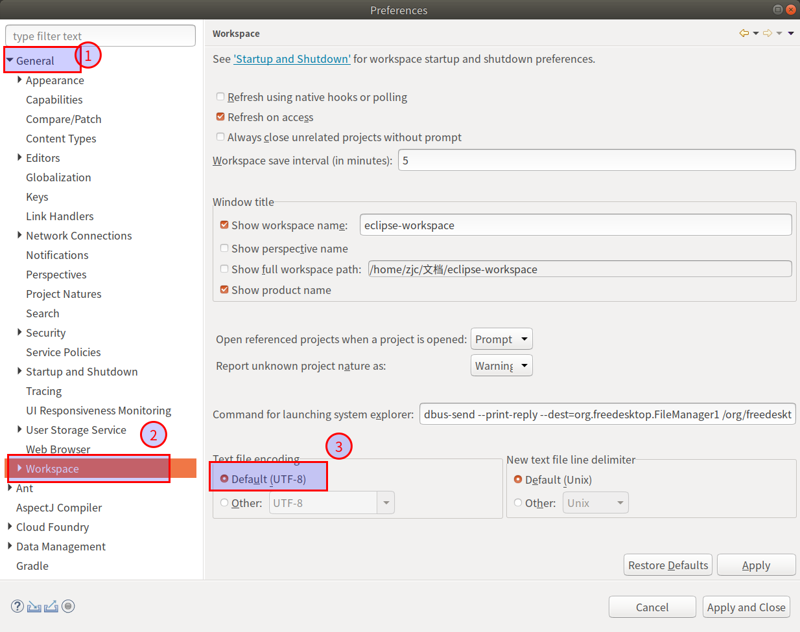
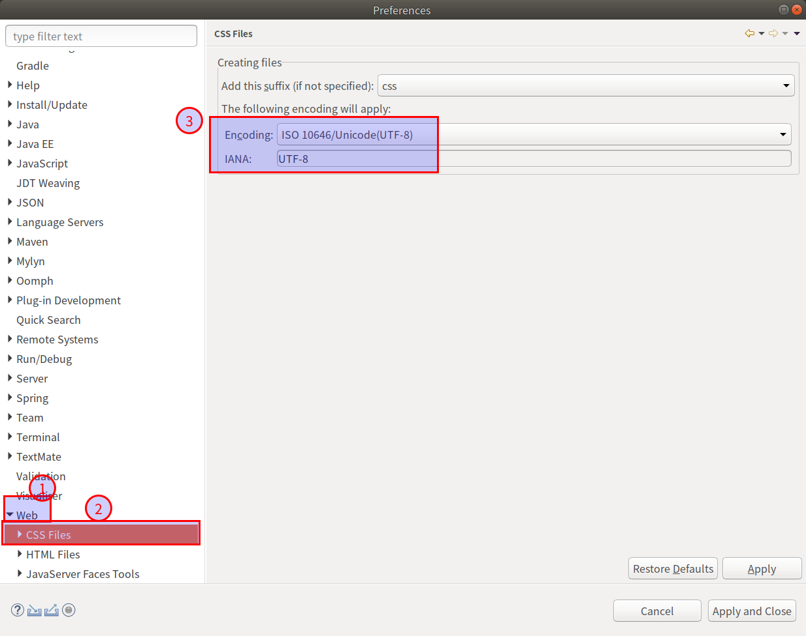
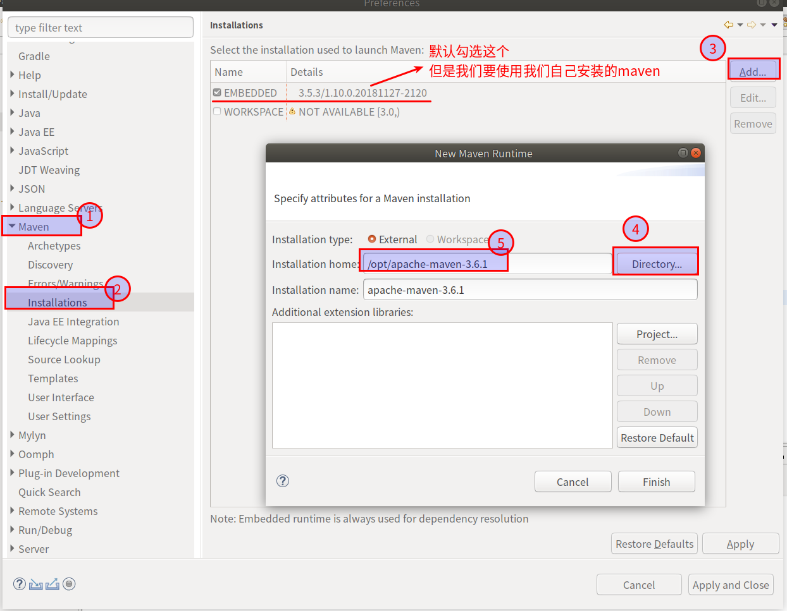
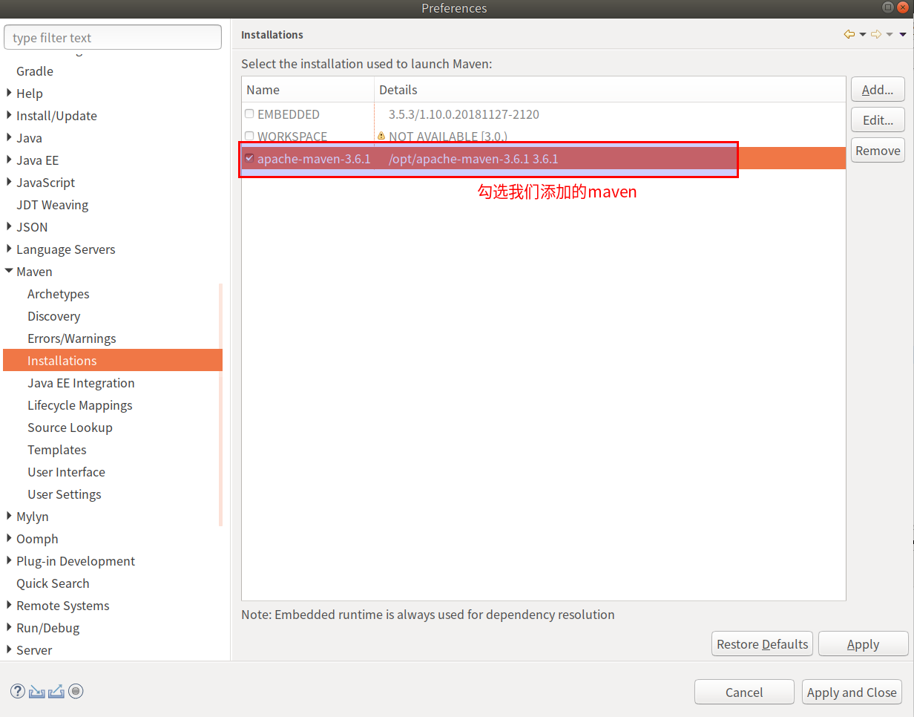
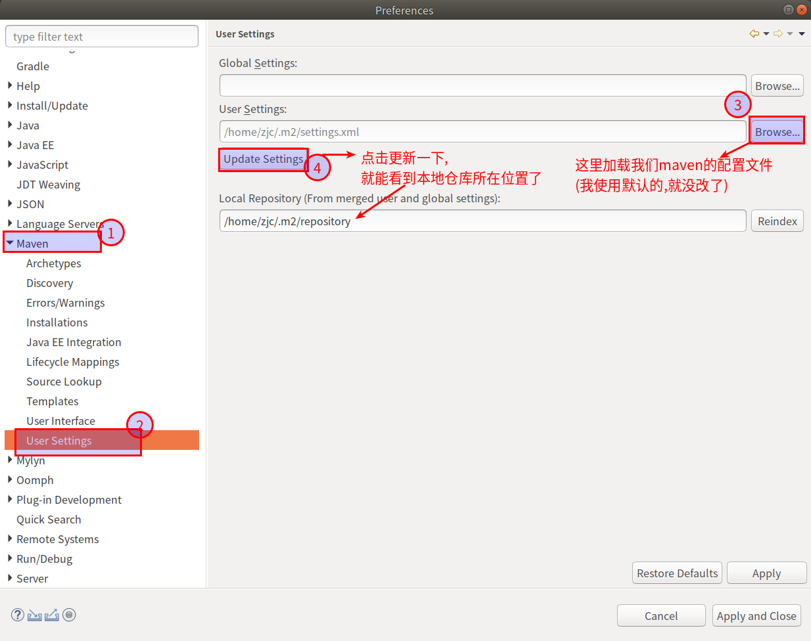
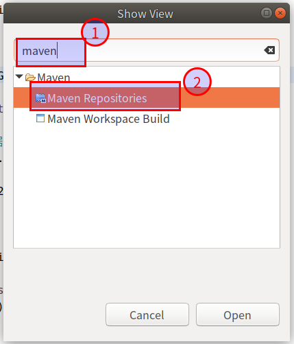
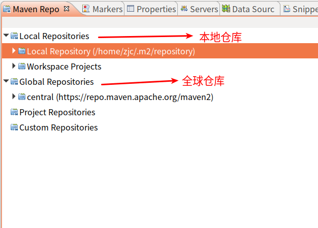

##  设定编码
在`Windows -> Preferences`

##  更改maven版本
将eclipse中的maven版本变为自己使用的版本

在`Windows -> Preferences`
1.  将我们自己的maven版本添加进eclipse

2.  添加完之后勾选我们自己的maven版本

##  添加maven的配置文件
在`Windows -> Preferences`

##  maven的视图面板
1.  打开`windows -> Show View -> other`

2.  点击确定后可以看到

3.  **如果想在本地同步一份,可以在`Local Respository -> 右键 -> Rebuild Index`**

