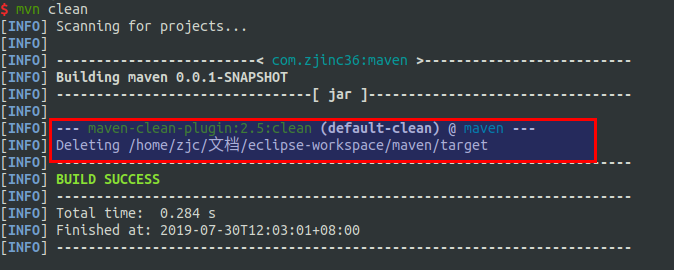
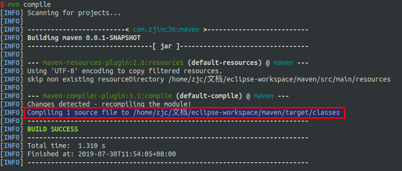
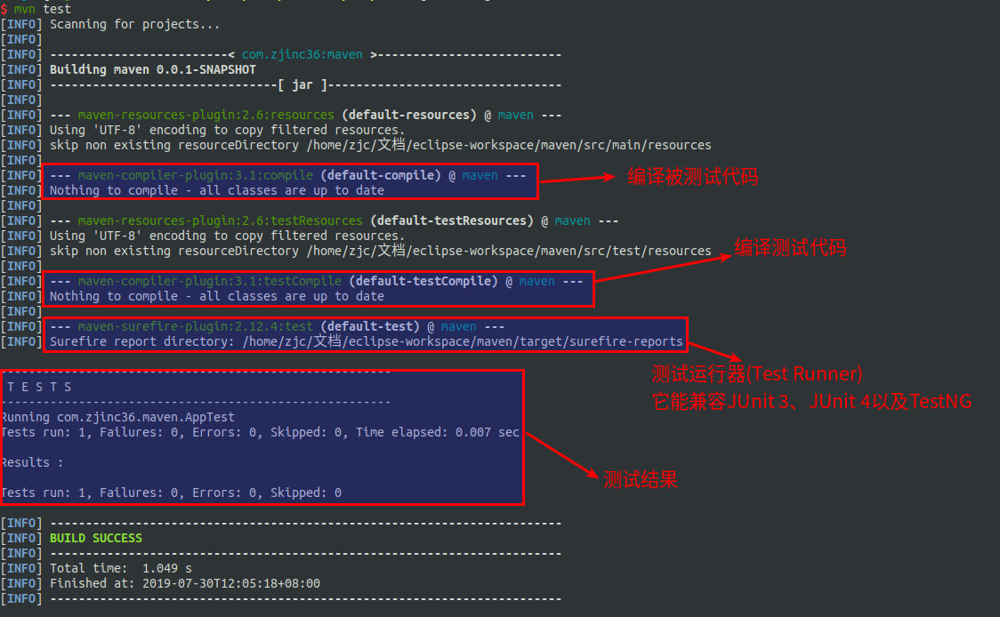
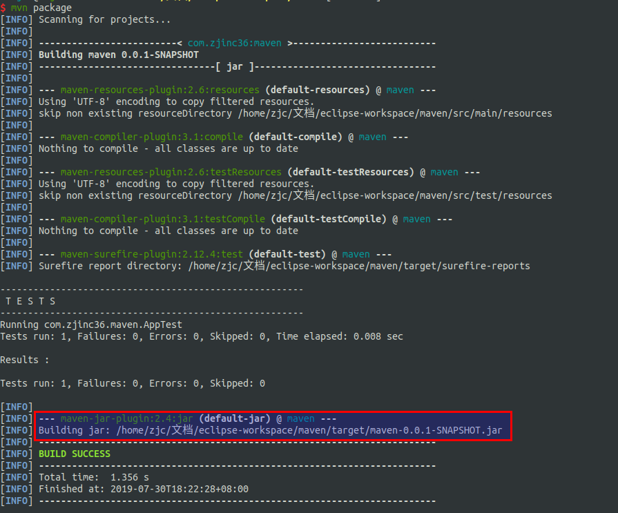
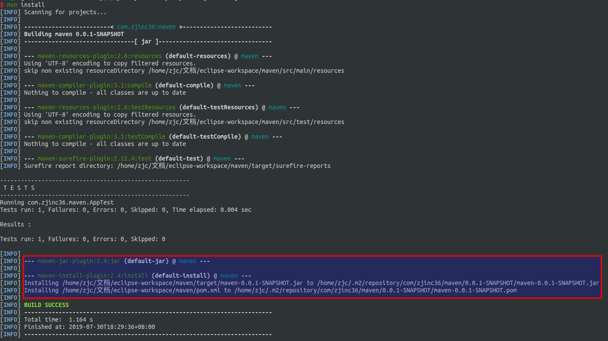
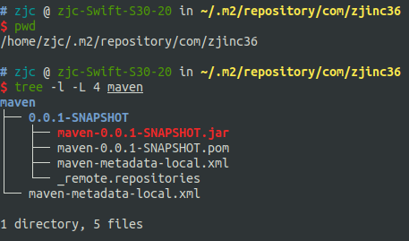

#   maven的常用命令
##  clean
clean是maven工程的清理命令,执行clean会删除target目录及其目录下所有内容

##  compile
compile是maven工程的编译命令,作用是将src/main/java下的java源文件编译为class文件并输出到target下的classes目录下

##  test
test是maven工程的测试命令,mvn test会执行src/test/java下的单元测试类

##  package
package是maven工程的打包命令,对于java工程执行package打包成jar包,对于web工程打包成war包

##  install
install是maven工程的安装命令,执行install将maven打成jar包或war包发布到本地仓库

查看打包情况

#   maven的声明周期
maven对项目的构建过程分为三套独立的生命周期,请注意,这里说的是"三套",而且是"相互独立",这三套声明周期分别是:
1.  Clean Lifecycle:在进行真正的构建之前,进行一些清理工作
2.  Default Lifecycle:构建的核心部分,编译,测试,打包,部署等
3.  Site Lifecycle:生成项目报告,站点,发布站点

每一个阶段都有一个对应的命令,且有响应的插件来支持命令的运行

从上面命令结果可以看出,当运行后面的命令时,前面的操作过程也都会执行,也就是说**属于同一个指令周期里的指令,当后面的命令执行时,前面的命令也会执行**
